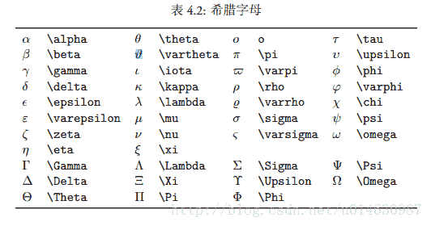

## 公式排版

*   行内公式
    ∑ i = 0 n i 2 \sum_{i=0}^{n}i^2 ∑i=0n​i2

```
$\sum_{i=0}^{n}i^2$ 
```

*   独立公式
    E = m c 2 E=mc^2 E=mc2

```
$$E=mc^2$$ 
```

注：# $ % ^ & ~ \ { } 这些字符有特殊意义，在表示时，需要转义

## 希腊字母



## 上下标和开根号

*   ^ 表示上标
*   _ 表示下标
*   \sqrt 表示开根号

注：上下标如果多于一个字符或符号，需要用{ }括起来
∑ i = 1 n a i \sum_{i=1}^n a_i ∑i=1n​ai​

```
$\sum_{i=1}^n a_i$ 
```

x i j 2 x_{ij}^2 xij2​

```
$x_{ij}^2$ 
```

x \sqrt x x ​

```
$\sqrt x$ 
```

x 3 \sqrt[3] x 3x ​

```
$\sqrt[3] x$ 
```

x i j 2 x x 3 x_{ij}^2\quad\sqrt x\quad\sqrt[3]x xij2​x ​3x ​

```
$x_{ij}^2\quad\sqrt x\quad\sqrt[3]x$

加空格 \quad 
```

## 分数

*   \frac
    *   \tfrac 字号设置成行间公式大小
    *   \dfrac 字号设置成独立公式大小

1 2 \frac{1}{2} 21​

```
$\frac{1}{2}$ 
```

1 2 \dfrac{1}{2} 21​

```
$\dfrac{1}{2}$ 
```

## 运算符

*   + - * / = 直接输入
*   特殊运算符
    ± × ÷ ⋅ ∩ ∪ ≥ ≤ ≠ ≈ ≡ \pm \times \div \cdot \cap \cup \geq \leq \neq \approx \equiv ±×÷⋅∩∪≥≰​=≈≡

```
$$\pm \times \div \cdot \cap \cup \geq \leq \neq \approx \equiv$$ 
```

*   和，积，极限，积分
    ∑ ∏ lim ⁡ ∫ \sum \prod \lim \int ∑∏lim∫

```
$$\sum \prod \lim \int$$ 
```

x → 0 x\to0 x→0

```
$$x\to0$$ 
```

注：这些公式在行内被压缩，以适应行高，可以通过、\limits和\nolimits命令显示是否压缩
∑ i = 1 n i ∏ i = 1 n lim ⁡ i → 0 x 2 ∫ a b x 2 d x \sum_{i=1}^{n}i\quad\prod_{i=1}^n\quad\lim_{i\to0}x^2\quad\int_a^bx^2dx ∑i=1n​i∏i=1n​limi→0​x2∫ab​x2dx

```
$\sum_{i=1}^{n}i\quad\prod_{i=1}^n\quad\lim_{i\to0}x^2\quad\int_a^bx^2dx$ 
```

∑ i = 1 n i ∏ i = 1 n lim ⁡ i → 0 x 2 ∫ a b x 2 d x \sum\limits_{i=1}^{n}i\quad\prod\limits_{i=1}^n\quad\lim\limits_{i\to0}x^2\quad\int\limits_a^bx^2dx i=1∑n​ii=1∏n​i→0lim​x2a∫b​x2dx

```
$\sum\limits_{i=1}^{n}i\quad\prod\limits_{i=1}^n\quad\lim\limits_{i\to0}x^2\quad\int\limits_a^bx^2dx$ 
```

*   多重积分

∬ \iint ∬

```
$$\iint$$ 
```

∭ \iiint ∭

```
$$\iiint$$ 
```

*   箭头

← → ↔ \leftarrow\quad\rightarrow\quad\leftrightarrow ←→↔

```
$\leftarrow\quad\rightarrow\quad\leftrightarrow$ 
```

⇐ ⇒ ⇔ \Leftarrow\quad\Rightarrow\quad\Leftrightarrow ⇐⇒⇔

```
$\Leftarrow\quad\Rightarrow\quad\Leftrightarrow$ 
```

⟵ ⟶ ⟷ \longleftarrow\quad\longrightarrow\quad\longleftrightarrow ⟵⟶⟷

```
$\longleftarrow\quad\longrightarrow\quad\longleftrightarrow$ 
```

⟸ ⟹ ⟺ \Longleftarrow\quad\Longrightarrow\quad\Longleftrightarrow ⟸⟹⟺

```
$\Longleftarrow\quad\Longrightarrow\quad\Longleftrightarrow$ 
```

注：\xleftarrow 和 \xrightarrow可根据内容自动调整
→ x + y + z \xrightarrow{x+y+z} x+y+z ​

```
$$\xrightarrow{x+y+z}$$ 
```

→ x &lt; y x + y + z \xrightarrow[x&lt;y]{x+y+z} x+y+z  x<y​

```
$$\xrightarrow[x<y]{x+y+z}$$ 
```

## 分隔符

( ) () () `$()$`
[ ] [] [] `$[]$`
{ } \{\} {} `$\{\}$`
⟨ ⟩ \langle\rangle ⟨⟩ `$\langle\rangle$`

x x x ‾ x x x ↔ \overline{xxx}\quad\overleftrightarrow{xxx} xxxxxx

```
$\overline{xxx}\quad\overleftrightarrow{xxx}$ 
```

x x x ‾ x x x ↔ \underline{xxx}\quad\underleftrightarrow{xxx} xxx​ xxx​

```
$\underline{xxx}\quad\underleftrightarrow{xxx}$ 
```

## 省略号

x 1 , x 2 , … , x n x_1,x_2,\dots,x_n x1​,x2​,…,xn​

```
$x_1,x_2,\dots,x_n$ 
```

1 , 2 , ⋯ &ThinSpace; , n 1,2,\cdots,n 1,2,⋯,n

```
$1,2,\cdots,n$ 
```

注：\dots和\cdots的纵向位置不同，前者一般用于有下标的序列

⋮ \vdots ⋮

```
$\vdots$ 
```

⋱ \ddots ⋱

```
$\ddots$ 
```

## 矩阵

( a b c d ) \begin{pmatrix}a&amp;b\\c&amp;d\end{pmatrix} (ac​bd​)

```
$\begin{pmatrix}a&b\\c&d\end{pmatrix}$ 
```

[ a b c d ] \begin{bmatrix}a&amp;b\\c&amp;d\end{bmatrix} [ac​bd​]

```
$\begin{bmatrix}a&b\\c&d\end{bmatrix}$ 
```

∣ a b c d ∣ \begin{vmatrix}a&amp;b\\c&amp;d\end{vmatrix} ∣∣∣∣​ac​bd​∣∣∣∣​

```
$\begin{bmatrix}a&b\\c&d\end{bmatrix}$ 
```