> 原文：[A Comprehensive Survey of Graph Embedding: Problems, Techniques and Applications (arxiv 1709.07604)](https://arxiv.org/abs/1709.07604)
> 
> 译者：[飞龙](https://github.com/wizardforcel)
> 
> 协议：[CC BY-NC-SA 4.0](http://creativecommons.org/licenses/by-nc-sa/4.0/)
> 
> 自豪地采用[谷歌翻译](https://translate.google.cn/)

## 基于边重构的优化问题

总体见解： 基于节点嵌入建立的边应尽可能与输入图中的边相似。

第三类图嵌入技术通过最大化边重建概率，或最小化边重建损失，来直接优化基于边重建的目标函数。 后者进一步分为基于距离的损失和基于边距的排名损失。 接下来，我们逐一介绍这三种类型。

### 最大化边重建概率

见解： 良好的节点嵌入最大化了在图中观察到的边的生成概率。

良好的节点嵌入应该能够重新建立原始输入图中的边。 这可以通过使用节点嵌入最大化所有观察到的边（即，节点成对接近）的生成概率来实现。

节点对 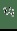 和  之间的直接边，表示它们的一阶邻近度 ，可以使用嵌入来计算  和  的联合概率：

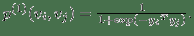 (13)

上述一阶邻近度存在于图中的任何一对连接节点之间。 为了学习嵌入，我们最大化了在图中观察这些邻域的对数似然。 然后将目标函数定义为：

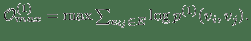 (14)

同样， 和  的二阶邻近度是条件概率  由  使用 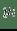 和 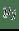 生成：

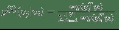 (15)

它可以被解释为在图中随机游走的概率，它开始于  结束于 。 因此图嵌入目标函数是：

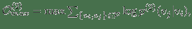 (16)

其中  是从图中采样的路径中，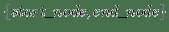 的集合。即来自每个采样路径的两个端节点。 这模拟了二阶邻近度，作为从 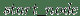 到 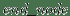 的随机游走的概率。

### 最小化基于距离的损失

见解： 基于节点嵌入计算的节点邻近度，应尽可能接近基于观察到的边计算的节点邻近度。

具体来说，可以基于节点嵌入来计算节点邻近度，或者可以基于观察到的边凭经验计算节点邻近度。 最小化两种类型的邻近度之间的差异，保持了相应的邻近度。

对于一阶邻近度，可以使用公式 13 中定义的节点嵌入来计算它。 经验概率是 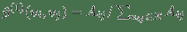 ，其中 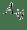 是边 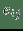 的权重。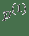 和 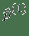 两者之间的距离越小，就能保持更好的一阶邻近度。 使用KL-散度作为距离函数来计算  和  间的差异，并且省略了一些常量，在图嵌入中保留一阶邻近度的目标函数是：

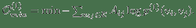 (17)

同样， 和  的二阶邻近度是由节点  生成的条件概率 （公式 15）。 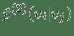 的经验概率计算为 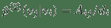，其中 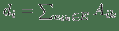 是节点的出度（无向图的情况中是度） 。与公式 10 相似，计算公式 15 非常昂贵。 再次将负采样用于近似计算来提高效率。 通过最小化 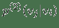 和 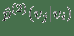 之间的 KL 差异，保持二阶邻近度的目标函数是：

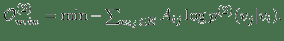 (18)

**表8：**基于边重建的图嵌入。 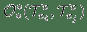 是指公式 14，16~19 之一。例如 ， （word-label）是指 公式 18，带有单词节点和标签节点。 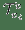 表示节点  的类型。

| GE算法 | 目标 | 邻近度阶数 |
| --- | --- | --- |
| PALE [18] |  （节点，节点） | 1 |
| NRCL [4] | 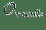 （节点，邻居节点）+  （属性损失） |  |
| PTE [124] |  （单词，单词）+  （单词，文档）+  （单词，标签） |  |
| APP [3] |  （节点，节点）） |  |
| GraphEmbed [83] |  （单词，单词）+  （单词，时间）+  （单词，位置）+  （时间，地点）+  （位置，位置）+  （时间，时间） | 2 |
| [41,42] |  （车站，公司），  （车站，角色），  （目的地，出发地） |  |
| PLE [84] |  （提示，类型）+  （提示，特性）+  （类型，类型） |  |
| IONE [26] |  （节点，节点）+  （锚对齐） |  |
| HEBE [45] |  （节点，超边中的其他节点） |  |
| GAKE [38] |  （节点，邻居上下文）+  （节点，路径上下文）+  （节点，边上下文） |  |
| CSIF [64] |  （用户对，扩散内容） |  |
| ESR [69] |  （实体，作者）+  （实体，实体）+  （实体，单词）+  （实体，场地） |  |
| LINE [27] |  （节点，节点）+  （节点，节点）） |  |
| EBPR [71] |  （AUC 排名）+  （节点，节点）+  （节点，节点上下文） | 1 和 2 |
| [94] |  （问题，答案） | 1，2 和 更高 |

### 最小化基于边距的排名损失

在基于边距的排名损失优化中，输入图的边指代节点对之间的相关性。 图中的一些节点通常与一组相关节点相关联。 例如，在cQA网站中，一组答案被标记为与给定问题相关。 对损失的见解是直截了当的。

见解： 节点的嵌入更类似于相关节点的嵌入，而不是任何其他不相关节点的嵌入。

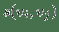 表示节点  和  的相似性得分， 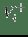 表示与  相关的节点集， 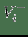 表示不相关的节点集。 基于边距的排名损失定义为：

 (19)

其中  是边距。 减少损失排名，可以促进 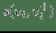 和 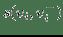 之间的巨大边距，从而保证  的嵌入更接近其相关节点而不是任何其他不相关节点。

在表 8 中 ，我们基于其目标函数和保留的节点邻近度，总结了基于边重建的现有图嵌入方法。 通常，大多数方法使用上述目标函数之一（公式 14，16~19）。 [71]优化 AUC 排名损失，这是基于边距的排名损失的替代损失（公式 19 ）。 请注意，当在图嵌入期间同时优化另一个任务时，该任务特定的目标将被纳入总体目标中。 例如，[26]旨在对齐两个图。 因此，网络对齐的目标函数与 （公式 18）一起优化。

值得注意的是，大多数现有知识图嵌入方法选择优化基于边距的排名损失。 回想一下知识图 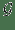 由三元组  组成，表示头部实体 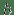 通过关系  链接到尾部实体 。 嵌入  可以解释为，保留真正三元组的排名  ，优于  中不存在的假的三元组 。 特别是在知识图嵌入中，类似于公式 19 的 ，能量函数 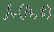 为三元组  而设计。 这两个函数之间略有不同。 表示节点嵌入  和 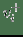 之间的相似性得分，而  是嵌入  和  在关系  方面的距离得分。 的一个例子是 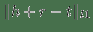，其中关系表示为嵌入空间中的变换 [91]。 的其他选项总结在表 9 中。 因此，对于知识图嵌入，公式 19 变为：

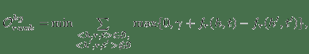 (20)

其中 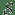 是输入知识图中的三元组。 现有的知识图嵌入方法主要是在他们的工作中优化公式 20。它们之间的区别在于  的定义，如表 9 所示。 知识图嵌入相关工作的更多细节，已在 [13] 中进行了详细的回顾。

**表9：**使用基于边距的排名损失的知识图嵌入。

| GE算法 | 能量函数 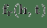 |
| --- | --- |
| TransE [91] |  |
| TKRL [53] | 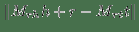 |
| TransR [15] | 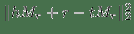 |
| CTransR [15] | 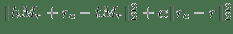 |
| TransH [14] | 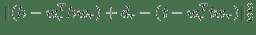 |
| SePLi [39] | 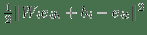 |
| TransD [125] | 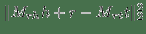 |
| TranSparse [126] | 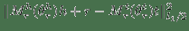 |
| m-TransH [127] | 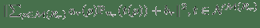 |
| DKRL [128] | 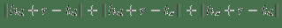 |
| ManifoldE [129] | 球面： 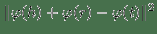 |
|  | 超平面： 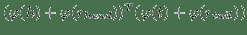 |
|  |  是希尔伯特空间的映射函数 |
| TransA [130] |  |
| puTransE [43] |  |
| KGE-LDA [60] |  |
| SE [90] | 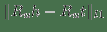 |
| SME [92]线性 |  |
| SME [92]双线性 |  |
| SSP [59] | ， |
| NTN [131] |  |
| HOLE [132] |  ，其中  是环形相关度 |
| MTransE [133] |  |

请注意，一些研究联合优化排名损失（公式式20 ）和其他目标来保留更多信息。 例如，SSP [59]使用公式 20 联合优化了主题模型的丢失，将文本节点描述用于嵌入。 [133]对单语关系进行分类，并使用线性变换来学习实体和关系的跨语言对齐。 还存在一些工作，为三元组  定义匹配度分数而不是能量函数。 例如，[134]定义了双线性分数函数  它增加了常态约束和交换约束，在嵌入之间加入类比结构。 ComplEx [135]将嵌入扩展到复数域并将  的实部定义为得分。

总结：基于边重建的优化适用于大多数图嵌入设定。 据我们所知，只有非关系数据（第 3.1.4 节）和整图嵌入（第 3.2.4 节）尚未尝试过。 原因是重建手动构造的边不像其他图那样直观。 此外，由于该技术侧重于直接观察到的局部边，因此不适合于整图嵌入。

## 图核

见解： 整个图结构可以表示为一个向量，包含从中分解的基本子结构的数量。

图核是 R-convolution 核的一个实例[136]，它是定义离散复合对象上的核的通用方法，通过递归地将结构化对象分解为“原子”子结构，并比较它们的所有对[93]。 图核将每个图示为向量，并且使用两个向量的内积来比较两个图。 图核中通常定义了三种类型的“原子”子结构。

Graphlet。graphlet 是一个大小为 K 的感应的和非同构子图 [93]。 假设图  被分解为一组 graphlet 。然后  嵌入为标准化计数的`d`维向量（表示为 ）。 该  的维度  是  中 Graphlet  的出现频率。

子树模式。 在此核中，图被分解为其子树模式。 一个例子是 Weisfeiler-Lehman 子树[49]。 特别是，在标记图（即，具有离散节点标签的图）上进行重新标记的迭代过程。 在每次迭代中，基于节点及其邻居的标签生成多集标签。 新生成的多集标签是一个压缩标签，表示子树模式，然后用于下一次迭代。 基于图同构的 Weisfeiler-Lehman 检验，计算图中标签的出现等同于计算相应的子树结构。 假设  在图上执行重新标记的迭代  。 它的嵌入  包含  块。 该  中的维度  第一块  是频率  -th标签被分配给一个节点  第二次迭代。

随机游走 。 在第三种类型的图核中，图被分解为随机游走或路径，并表示为随机游走的出现次数[137]或其中的路径[138]。 以路径为例，假设图  被分解成  个最短路径。将第`i`个路径表示为三元组 ，其中  和  是起始节点和结束节点的标签，  是路径的长度。 然后  表示为`d`维向量 ，其中第`i`个维度是  中第`i`个三元组的频率。

简介：图核专为整图嵌入（Sec.3.2.4）而设计，因为它捕获整个图的全局属性。 输入图的类型通常是同构图（第 3.1.1 节）[93]或带有辅助信息的图（第 3.1.3 节）[49]。

## 生成模型

生成模型可以通过规定输入特征和类标签的联合分布来定义，以一组参数为条件[139]。 一个例子是 Latent Dirichlet Allocation（LDA），其中文档被解释为主题上的分布，主题是单词上的分布[140]。 采用生成模型进行图嵌入有以下两种方法。

### 潜在语义空间中的图嵌入

见解： 节点嵌入到潜在的语义空间中，节点之间的距离解释了观察到的图结构。

第一种基于生成模型的图嵌入方法，直接在潜在空间中嵌入图。 每个节点表示为潜在变量的向量。 换句话说，它将观察到的图视为由模型生成的。 例如，在LDA中，文档嵌入在“主题”空间中，其中具有相似单词的文档具有类似的主题向量表示。 [70]设计了类似LDA的模型来嵌入基于位置的社交网络（LBSN）图。 具体来说，输入是位置（文档），每个位置包含访问该位置的一组用户（单词）。 由于某些活动（主题），用户访问相同的位置（单词出现在同一文档中）。 然后，模型被设计为将位置表示为活动的分布，其中每个活动具有对用户的吸引力分布。 因此，用户和位置都表示为“活动”空间中的向量。

### 包含潜在语义的图嵌入

见解： 图中接近且具有相似语义的节点的嵌入应该更紧密。 可以通过生成模型，从节点描述中检测节点语义。

在这一系列方法中，潜在语义用于利用辅助节点信息进行图嵌入。 嵌入不仅由图结构信息决定，而且由从其他节点信息源发现的潜在语义决定。 例如，[58]提出了一个统一的框架，它共同集成了主题建模和图嵌入。 其原理是如果嵌入空间中两个节点接近，它们也具有相似的主题分布。 设计从嵌入空间到主题语义空间的映射函数，以便关联两个空间。 [141]提出了一种生成模型（贝叶斯非参数无限混合嵌入模型），以解决知识图嵌入中的多关系语义问题。 它发现了关系的潜在语义，并利用混合关系组件进行嵌入。 [59]从知识图三元组和实体和关系的文本描述中嵌入知识图。 它使用主题建模来学习文本的语义表示，并将三元组嵌入限制在语义子空间中。

上述两种方法的区别在于嵌入空间是第一种方式的潜在空间。相反，在第二种方式中，潜在空间用于整合来自不同来源的信息，并有助于将图嵌入到另一个空间。

简介：生成模型可用于节点嵌入（Sec.3.2.1）[70]和边嵌入（Sec.3.2.2）[141]。 在考虑节点语义时，输入图通常是异构图（第 3.1.2 节）[70]或带有辅助信息的图（第 3.1.3 节）[59]。

## 混合技术和其它

有时在一项研究中结合了多种技术。 例如，[4]通过最小化基于边的排序损失来学习基于边的嵌入（第 4.3 节），并通过矩阵分解来学习基于属性的嵌入（第 4.1 节）。 [51]优化基于边距的排名损失（第 4.3 节），基于矩阵分解的损失（第 4.1 节）作为正则化项。 [32]使用LSTM（第 4.2节）来学习cQAs的句子的嵌入，以及基于边际的排名损失（第[4.3](#sec:ml)节）来结合好友关系。 [142]采用CBOW / SkipGram（第 4.2 节）进行知识图实体嵌入，然后通过最小化基于边际的排名损失来微调嵌入（第 4.3 节）。 [61]使用word2vec（第 4.2 节）嵌入文本上下文和TransH（第 4.3 节）嵌入实体/关系，以便在知识图嵌入中利用丰富的上下文信息。 [143]利用知识库中的异构信息来提高推荐效果。 它使用TransR（第 4.3 节）进行网络嵌入，并使用自编码器进行文本和视觉嵌入（第 4.2 节）。 最后，提出了一个生成框架（第 4.5 节），结合协同过滤与项目的语义表示。

除了引入的五类技术之外，还存在其他方法。 [95]提出了根据原型图距离的图的嵌入。 [16]首先使用成对最短路径距离嵌入一些标志性节点。 然后嵌入其他节点，使得它们到标志性子集的距离尽可能接近真实的最短路径。 [4]联合优化基于链接的损失（最大化节点的邻居而不是非邻居的观测似然）和基于属性的损失（基于基于链接的表示学习线性投影）。 KR-EAR [144]将知识图中的关系区分为基于属性和基于关系的关系。 它构造了一个关系三元编码器（TransE，TransR）来嵌入实体和关系之间的相关性，以及一个属性三元编码器来嵌入实体和属性之间的相关性。 Struct2vec [145]根据用于节点嵌入的分层指标，来考虑节点的结构性标识。 [146]通过近似高阶邻近矩阵提供快速嵌入方法。

## 总结

我们现在总结并比较表10中所有五类图嵌入技术的优缺点。

**表10：**图嵌入技术的比较。

| 类别 | 子类别 | 优点 | 缺点 |
| --- | --- | --- | --- |
| 矩阵分解 | 图拉普拉斯算子 | 考虑全局节点邻近度 | 大量的时间和空间开销 |
|  | 节点邻近矩阵分解 |  |  |
| 深度学习 | 带有随机游走 | 有效而强大， | a）仅考虑路径中的局部上下文 |
|  |  | b）难以发现最优采样策略 |  |
|  | 没有随机游走 |  | 高计算开销 |
| 边重构 | 最大化边重建概率 |  | 仅使用观察到的局部信息来优化 |
|  | 最小化基于距离的损失 | 相对有效的的训练 | 例如边（一跳的邻居） |
|  | 最小化基于边距的排名损失 |  | 或者排序节点对 |
| 图核 | 基于graphlet | 有效，只计算所需的原子子结构 | a）子结构不是独立的 |
|  | 基于子树模式 |  | b）嵌入维度指数性增长 |
|  | 基于随机游走 |  |  |
| 生成模型 | 在潜在的空间中嵌入图 | 可解释的嵌入 | a）难以证明分布的选择 |
|  | 将潜在语义合并到图嵌入中 | 自然地利用多个信息源 | b）需要大量训练数据 |

基于矩阵分解的图嵌入，基于全局成对相似性的统计量学习表示。 因此，它可以胜过某些任务中基于深度学习的图嵌入（涉及随机游走），因为后者依赖于单独的局部上下文窗口 [147,148]。 然而，邻近度矩阵构造或矩阵的特征分解时间和空间开销大[149]，使得矩阵分解效率低且对于大图不可扩展。

深度学习（DL）已经在不同的图嵌入方法中显示出有希望的结果。 我们认为DL适合于图嵌入，因为它能够自动识别复杂图结构中的有用表示。 例如，具有随机游走的DL（例如，DeepWalk [17]，node2vec [28]，metapath2vec [46]）可以通过图上的采样路径自动利用邻域结构。 没有随机游走的DL可以模拟同构图中可变大小的子图结构（例如，GCN [72]，struc2vec [145]，GraphSAGE [150]），或者异构图中类型灵活的节点之间的丰富交互（例如，HNE [33]，TransE [91]，ProxEmbed [44]），变为有用的表示。 另一方面，DL也有其局限性。 对于具有随机游走的DL，它通常观测同一路径中的节点的局部邻居，从而忽略全局结构信息。 此外，很难找到“最优采样策略”，因为嵌入和路径采样不是在统一框架中联合优化的。 对于没有随机游走的DL，计算成本通常很高。 传统的深度学习架构假设输入数据在1D或2D网格上，来利用GPU [117]。 然而，图没有这样的网格结构，因此需要不同的解决方案来提高效率[117]。

基于边重建的图嵌入，基于观察到的边或排序三元组来优化目标函数。 与前两类图嵌入相比，它更有效。 然而，使用直接观察到的局部信息来训练这一系列方法，因此所获得的嵌入缺乏对全局图结构的认识。

基于图核的图嵌入将图转换为单个向量，以便于图级别的分析任务，例如图分类。 它比其他类别的技术更有效，因为它只需要在图中枚举所需的原子子结构。 然而，这种“基于结构袋”的方法有两个局限[93]。 首先，子结构不是独立的。 例如，大小为`k+1`的 graphlet 可以从大小为`k` graphlet 的派生，通过添加新节点和一些边。 这意味着图表示中存在冗余信息。 其次，当子结构的大小增加时，嵌入维度通常呈指数增长，导致嵌入中的稀疏问题。

基于生成模型的图嵌入可以自然地在统一模型中利用来自不同源（例如，图结构，节点属性）的信息。 直接将图嵌入到潜在语义空间中，会生成可以使用语义解释的嵌入。 但是使用某些分布对观察进行建模的假设很难证明是正确的。 此外，生成方法需要大量的训练数据来估计适合数据的适当模型。 因此，它可能不适用于小图或少量图。