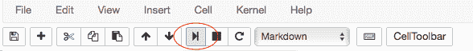

> 原文：[SciPy 2018 Scikit-learn Tutorial](https://nbviewer.jupyter.org/github/amueller/scipy-2018-sklearn/tree/master/notebooks/)
> 
> 译者：[飞龙](https://github.com/wizardforcel)
> 
> 协议：[CC BY-NC-SA 4.0](http://creativecommons.org/licenses/by-nc-sa/4.0/)
> 
> 自豪地采用[谷歌翻译](https://translate.google.cn/)

# 一、Python 机器学习简介

## 什么是机器学习？

机器学习是自动从数据中提取知识的过程，通常是为了预测新的，看不见的数据。一个典型的例子是垃圾邮件过滤器，用户将传入的邮件标记为垃圾邮件或非垃圾邮件。然后，机器学习算法从数据“学习”预测模型，数据区分垃圾邮件和普通电子邮件。该模型可以预测新电子邮件是否是垃圾邮件。

机器学习的核心是根据数据来自动化决策的概念，无需用户指定如何做出此决策的明确规则。

对于电子邮件，用户不提供垃圾邮件的单词或特征列表。相反，用户提供标记为垃圾邮件和非垃圾邮件的示例。

第二个核心概念是泛化。机器学习模型的目标是预测新的，以前没见过的数据。在实际应用中，将已标记的电子邮件标记为垃圾邮件，我们不感兴趣。相反，我们希望通过自动分类新的传入邮件来使用户更轻松。


数据通常作为数字的二维数组（或矩阵）展示给算法。 我们想要学习或做出决策的每个数据点（也称为样本或训练实例）表示为数字列表，即所谓的特征向量，其包含的特征表示这个点的属性。

稍后，我们将使用一个名为鸢尾花（Iris）的流行数据集 - 在许多其他数据集中。鸢尾花是机器学习领域的经典基准数据集，包含来自 3 种不同物种的 150 种鸢尾花的测量值：Iris-Setosa（山鸢尾），Iris-Versicolor（杂色鸢尾）和 Iris-Virginica（弗吉尼亚鸢尾）。

| 物种 | 图像 |
| --- | --- |
| 山鸢尾 |  |
| 杂色鸢尾 |  |
| 弗吉尼亚鸢尾 |  |

我们将每个花样本表示为数据阵列中的一行，列（特征）表示以厘米为单位的花测量值。 例如，我们可以用以下格式表示这个鸢尾花数据集，包括 150 个样本和 4 个特征，一个`150×4`的二维数组或矩阵：


（上标表示第`i`行，下标分别表示第`j`个特征。

我们今天将讨论两种机器学习：监督学习和无监督学习。

## 监督学习：分类和回归

在监督学习中，我们有一个数据集，由输入特征和所需输出组成的，例如垃圾邮件/非垃圾邮件示例。 任务是构建一个模型（或程序），它能够在给定特征集的情况下预测未见过的对象的所需输出。

一些更复杂的例子是：

*   通过望远镜给定物体的多色图像，确定该物体是星星，类星体还是星系。
*   给定一个人的照片，识别照片中的人物。
*   给定一个人观看的电影列表和他们对电影的个人评价，推荐他们想要的电影列表。
*   给定一个人的年龄，教育程度和职位，推断他们的薪水

这些任务的共同之处在于，存在与该对象相关联的一个或多个未知量，其需要从其他观察量确定。

监督学习进一步细分为两类，分类和回归：

在分类中，标签是离散的，例如“垃圾邮件”或“无垃圾邮件”。换句话说，它提供了类别之间的明确区分。此外，重要的是注意类标签是标称的，而不是序数变量。标称和序数变量都是类别变量的子类别。序数变量意味着顺序，例如，T 恤尺寸`XL> L> M> S`。相反，标称变量并不意味着顺序，例如，我们（通常）不能假设“橙色>蓝色>绿色”。
在回归中，标签是连续的，即浮点输出。例如，在天文学中，确定物体是星星，星系还是类星体的任务是分类问题：标签来自三个不同的类别。另一方面，我们可能希望根据这些观察来估计物体的年龄：这将是一个回归问题，因为标签（年龄）是一个连续的数量。

在监督学习中，在提供期望结果的训练集与需要根据它推断期望结果的测试集之间，总是存在区别。模型的学习使预测模型拟合训练集，我们使用测试集来评估其泛化表现。

### 无监督学习

在无监督学习中，没有与数据相关的期望输出。相反，我们有兴趣从给定的数据中提取某种形式的知识或模型。从某种意义上说，你可以将无监督学习视为从数据本身发现标签的一种手段。无监督学习通常难以理解和评估。

无监督学习包括降维，聚类和密度估计之类的任务。例如，在上面讨论的鸢尾花数据中，我们可以使用无监督方法来确定显示数据结构的最佳测量值组合。我们将在下面看到，这种数据投影可用于在二维中可视化四维数据集。更多涉及无监督学习的问题是：

*   给定对遥远星系的详细观察，确定哪些特征或特征组合总结了最佳信息。
*   给定两个声源的混合（例如，一个人的谈话和一些音乐），将两者分开（这称为[盲源分离问题](http://en.wikipedia.org/wiki/Blind_signal_separation)）。
*   给定视频，隔离移动物体并相对于已看到的其他移动物体进行分类。
*   给定大量新闻文章，在这些文章中找到重复出现的主题。
*   给定一组图像，将相似的图像聚集在一起（例如，在可视化集合时对它们进行分组）

有时两者甚至可以合并：例如无监督学习可用于在异构数据中找到有用的特征，然后可以在监督框架内使用这些特征。

## （简化的）机器学习分类法


# 二、Python 中的科学计算工具

## Jupyter Notebooks

你可以按`[shift] + [Enter]`或按菜单中的“播放”按钮来运行单元格。



在`function(`后面按`[shift] + [tab]`，可以获得函数或对象的帮助。


你还可以通过执行`function?`获得帮助。


## NumPy 数组

操作`numpy`数组是 Python 机器学习（或者，实际上是任何类型的科学计算）的重要部分。 对大多数人来说，这可能是一个简短的回顾。 无论如何，让我们快速浏览一些最重要的功能。

```
import numpy as np

# 设置随机种子来获得可重复性
rnd = np.random.RandomState(seed=123)

# 生成随机数组
X = rnd.uniform(low=0.0, high=1.0, size=(3, 5))  # a 3 x 5 array

print(X) 
```

（请注意，NumPy 数组使用从 0 开始的索引，就像 Python 中的其他数据结构一样。）

```
# 元素访问

# 获取单个元素
# （这里是第一行第一列的元素）
print(X[0, 0])

# 获取一行
# （这里是第二行）
print(X[1])

# 获取一列
# （这里是第二列）
print(X[:, 1])

# 数组转置
print(X.T) 
```


```
# 在指定的时间间隔内创建均匀间隔的数字的行向量。
y = np.linspace(0, 12, 5)
print(y)

# 将行向量转换为列向量
print(y[:, np.newaxis])

# 获得形状或改变数组形状

# 生成随机数组
rnd = np.random.RandomState(seed=123)
X = rnd.uniform(low=0.0, high=1.0, size=(3, 5))  # a 3 x 5 array

print(X.shape)

# 将 X 大小变为 (3, 5)
X_reshaped = X.reshape(5, 3)
print(X_reshaped)

# 使用整数数组的索引（花式索引）
indices = np.array([3, 1, 0])
print(indices)
X[:, indices] 
```

还有很多东西要知道，但是这些操作对于我们在本教程中将要做的事情至关重要。

## SciPy 稀疏数组

我们不会在本教程中大量使用它们，但稀疏矩阵在某些情况下非常好用。 在一些机器学习任务中，尤其是与文本分析相关的任务，数据可能大多为零。 存储所有这些零是非常低效的，并且以仅包含“非零”值的方式表示可以更有效。 我们可以创建和操作稀疏矩阵，如下所示：

```
# 创建一个包含大量零的随机数组
rnd = np.random.RandomState(seed=123)

X = rnd.uniform(low=0.0, high=1.0, size=(10, 5))
print(X)

# 将大多数元素设置为零
X[X < 0.7] = 0
print(X)
from scipy import sparse

# 将 X 转换为 CSR（压缩稀疏行）矩阵
X_csr = sparse.csr_matrix(X)
print(X_csr)

# 将稀疏矩阵转换为密集数组
print(X_csr.toarray()) 
```

（你可能偶然发现了一种将稀疏表示转换为密集表示的替代方法：`numpy.todense`；`toarray`返回一个 NumPy 数组，而`todense`返回一个 NumPy 矩阵。在本教程中，我们将使用 NumPy 数组，而不是矩阵；scikit-learn 不支持后者。）

CSR 表示对于计算非常有效，但它不适合添加元素。 为此，LIL（List-In-List）表示更好：

```
# 创建一个空的 LIL 矩阵并添加一些项目
X_lil = sparse.lil_matrix((5, 5))

for i, j in np.random.randint(0, 5, (15, 2)):
    X_lil[i, j] = i + j

print(X_lil)
print(type(X_lil))

X_dense = X_lil.toarray()
print(X_dense)
print(type(X_dense)) 
```

通常，一旦创建了 LIL 矩阵，将其转换为 CSR 格式很有用（许多 scikit-learn 算法需要 CSR 或 CSC 格式）

```
X_csr = X_lil.tocsr()
print(X_csr)
print(type(X_csr)) 
```

可用于各种问题的可用稀疏格式包括：

*   `CSR`（压缩稀疏行）
*   `CSC`（压缩稀疏列）
*   `BSR`（块稀疏行）
*   `COO`（坐标）
*   `DIA`（对角线）
*   `DOK`（键的字典）
*   `LIL`（列表中的列表）

[`scipy.sparse`](http://docs.scipy.org/doc/scipy/reference/sparse.html)子模块还有很多稀疏矩阵的函数，包括线性代数，稀疏求解器，图算法等等。

## Matplotlib

机器学习的另一个重要部分是数据可视化。 Python 中最常用的工具是[`matplotlib`](http://matplotlib.org/)。 这是一个非常灵活的包，我们将在这里介绍一些基础知识。

由于我们使用的是 Jupyter 笔记本，让我们使用 IPython 方便的内置“[魔术函数](https://ipython.org/ipython-doc/3/interactive/magics.html)”，即“`matoplotlib`内联”模式，它将直接在笔记本内部绘制图形。

```
%matplotlib inline

import matplotlib.pyplot as plt

# 绘制直线
x = np.linspace(0, 10, 100)
plt.plot(x, np.sin(x));

# 散点图
x = np.random.normal(size=500)
y = np.random.normal(size=500)
plt.scatter(x, y);

# 使用 imshow 展示绘图
# - note that origin is at the top-left by default!

x = np.linspace(1, 12, 100)
y = x[:, np.newaxis]

im = y * np.sin(x) * np.cos(y)
print(im.shape)

plt.imshow(im);

# 轮廓图
# - 请注意，此处的原点默认位于左下角！
plt.contour(im);

# 3D 绘图
from mpl_toolkits.mplot3d import Axes3D
ax = plt.axes(projection='3d')
xgrid, ygrid = np.meshgrid(x, y.ravel())
ax.plot_surface(xgrid, ygrid, im, cmap=plt.cm.viridis, cstride=2, rstride=2, linewidth=0); 
```

有许多可用的绘图类型。 探索它们的一个实用方法是查看matplotlib库。

你可以在笔记本中轻松测试这些示例：只需复制每页上的源代码链接，然后使用`%load magic`将其放入笔记本中。 例如：

```
# %load http://matplotlib.org/mpl_examples/pylab_examples/ellipse_collection.py 
```

# 三、数据表示和可视化

机器学习关于将模型拟合到数据；出于这个原因，我们首先讨论如何表示数据以便计算机理解。 除此之外，我们将基于上一节中的`matplotlib`示例构建，并展示如何可视化数据的一些示例。

## sklearn 中的数据

scikit-learn 中的数据（极少数例外）被假定存储为形状为`[n_samples, n_features]`的二维数组。许多算法也接受形状相同的`scipy.sparse`矩阵。

*   `n_samples`：样本数量：每个样本是要处理（例如分类）的项目。样本可以是文档，图片，声音，视频，天文对象，数据库中的行或 CSV 文件，或者你可以使用的一组固定数量的特征描述的任何内容。
*   `n_features`：特征或不同形状的数量，可用于以定量方式描述每个项目。特征通常是实值，但在某些情况下可以是布尔值或离散值。

必须事先固定特征的数量。然而，它可以是非常高的维度（例如数百万个特征），对于给定的样本，它们中的大多数是“零”。这是`scipy.sparse`矩阵可能有用的情况，因为它们比 NumPy 数组更具内存效率。

我们从上一节（或 Jupyter 笔记本）中回顾，我们将样本（数据点或实例）表示为数据数组中的行，并将相应的特征（“维度”）存储为列。

## 简单示例：鸢尾花数据集

作为简单数据集的一个例子，我们将看一下 scikit-learn 存储的鸢尾花数据。 数据包括三种不同鸢尾花的测量值。 在这个特定的数据集中有三种不同的鸢尾花，如下图所示：

| 物种 | 图像 |
| --- | --- |
| 山鸢尾 |  |
| 杂色鸢尾 |  |
| 弗吉尼亚鸢尾 |  |

简单问题：

让我们假设我们有兴趣对新观测值进行分类; 我们想分别预测未知的花是 Iris-Setosa，Iris-Versicolor 还是 Iris-Virginica。 根据我们在上一节中讨论的内容，我们将如何构建这样的数据集？

记住：我们需要一个大小为`[n_samples x n_features]`的二维数组。

*   `n_samples`指代什么？
*   `n_features`可能指代什么？

请记住，每个样本必须有固定数量的特征，并且对于每个样本，特征编号`j`必须是同一种数量。

### 在 sklearn 中加载鸢尾花数据集

对于将来使用机器学习算法实验，我们建议你收藏 UCI 机器学习仓库，该仓库托管许多常用的数据集，这些数据集对于机器学习算法的基准测试非常有用 - 这是机器学习实践者和研究人员非常流行的资源。 方便的是，其中一些数据集已经包含在 scikit-learn 中，因此我们可以跳过下载，读取，解析和清理这些文本/ CSV 文件的繁琐部分。你可以在[这里](http://scikit-learn.org/stable/datasets/#toy-datasets)找到 scikit-learn 中可用数据集的列表。

如，scikit-learn 拥有这些鸢尾花物种的非常简单的数据集。 数据包括以下内容：

鸢尾花数据集中的特征：

*   萼片长度，厘米
*   萼片宽度，厘米
*   花瓣长度，厘米
*   花瓣宽度，厘米

要预测的目标类别：

*   山鸢尾
*   杂色鸢尾
*   弗吉尼亚鸢尾


（图片来源：[“Petal-sepal”](https://commons.wikimedia.org/wiki/File:Petal-sepal.jpg#/media/File:Petal-sepal.jpg)。通过 Wikimedia Commons 在 CC BY-SA 3.0 下获得许可）

scikit-learn 自带了鸢尾花 CSV 文件的副本以及辅助函数，用于将其加载到`numpy`数组中：

```
from sklearn.datasets import load_iris
iris = load_iris() 
```

生成的数据集是一个`Bunch`对象：你可以使用方法`keys()`查看可用的内容：

```
iris.keys() 
```

每个花样本的特征都存储在数据集的`data`属性中：

```
n_samples, n_features = iris.data.shape
print('Number of samples:', n_samples)
print('Number of features:', n_features)
# 第一个样本（第一朵花）的萼片长度，萼片宽度，花瓣长度和花瓣宽度
print(iris.data[0]) 
```

每个样本的类别信息存储在数据集的`target`属性中：

```
print(iris.data.shape)
print(iris.target.shape)

print(iris.target)

import numpy as np

np.bincount(iris.target) 
```

使用 NumPy 的`bincount`函数（上图），我们可以看到类别在这个数据集中均匀分布 - 每个物种有 50 朵花，其中：

*   类 0：山鸢尾
*   类 1：杂色鸢尾
*   类 2：弗吉尼亚鸢尾

这些类名存储在最后一个属性中，即`target_names`：

```
print(iris.target_names) 
```

这个数据是四维的，但我们可以使用简单的直方图或散点图一次可视化一个或两个维度。 再次，我们将从启用`matplotlib`内联模式开始：

```
%matplotlib inline

import matplotlib.pyplot as plt
x_index = 3

for label in range(len(iris.target_names)):
    plt.hist(iris.data[iris.target==label, x_index], 
             label=iris.target_names[label],
             alpha=0.5)

plt.xlabel(iris.feature_names[x_index])
plt.legend(loc='upper right')
plt.show()

x_index = 3
y_index = 0

for label in range(len(iris.target_names)):
    plt.scatter(iris.data[iris.target==label, x_index], 
                iris.data[iris.target==label, y_index],
                label=iris.target_names[label])

plt.xlabel(iris.feature_names[x_index])
plt.ylabel(iris.feature_names[y_index])
plt.legend(loc='upper left')
plt.show() 
```

> 练习
> 
> *   在上面的脚本中，更改`x_index`和`y_index`，找到两个参数的组合，最大限度地将这三个类分开。
> *   本练习是降维的预习，我们稍后会看到。

## 旁注：散点图矩阵

分析人员使用的常用工具称为散点图矩阵，而不是一次查看一个绘图。

散点图矩阵显示数据集中所有特征之间的散点图，以及显示每个特征分布的直方图。

```
import pandas as pd

iris_df = pd.DataFrame(iris.data, columns=iris.feature_names)
pd.plotting.scatter_matrix(iris_df, c=iris.target, figsize=(8, 8)); 
```

## 其它可用的数据

[Scikit-learn 提供了大量用于测试学习算法的数据集。](http://scikit-learn.org/stable/datasets/#dataset-loading-utilities) 它们有三种形式：

*   打包数据：这些小数据集与 scikit-learn 安装打包在一起，可以使用`sklearn.datasets.load_ *`中的工具下载
*   可下载数据：这些较大的数据集可供下载，scikit-learn 包含简化此过程的工具。 这些工具可以在`sklearn.datasets.fetch_ *`中找到
*   生成的数据：有几个数据集是基于随机种子从模型生成的。 这些可以在`sklearn.datasets.make_ *`中找到

你可以使用 IPython 的制表符补全功能探索可用的数据集加载器，提取器和生成器。 从`sklearn`导入`datasets`子模块后，键入：

```
datasets.load_<TAB> 
```

或者：

```
datasets.fetch_<TAB> 
```

或者：

```
datasets.make_<TAB> 
```

来查看可用函数列表。

```
from sklearn import datasets 
```

请注意：许多这些数据集非常庞大，可能需要很长时间才能下载！

如果你在 IPython 笔记本中开始下载并且想要将其删除，则可以使用 ipython 的“内核中断”功能，该功能可在菜单中使用或使用快捷键`Ctrl-m i`。

你可以按`Ctrl-m h`获取所有 ipython 键盘快捷键的列表。

## 加载数字数据

现在我们来看看另一个数据集，我们必须更多考虑如何表示数据。 我们可以采用与上述类似的方式探索数据：

```
from sklearn.datasets import load_digits
digits = load_digits()

digits.keys()

n_samples, n_features = digits.data.shape
print((n_samples, n_features))

print(digits.data[0])
print(digits.target) 
```

这里的目标只是数据所代表的数字。 数据是长度为 64 的数组…但这些数据意味着什么？

实际上有个线索，我们有两个版本的数据数组：数据和图像。 我们来看看它们：

```
print(digits.data.shape)
print(digits.images.shape) 
```

通过简单的形状改变，我们可以看到它们是相关的：

```
import numpy as np
print(np.all(digits.images.reshape((1797, 64)) == digits.data)) 
```

让我们可视化数据。 它比我们上面使用的简单散点图更复杂，但我们可以很快地完成它。

```
# 建立图形
fig = plt.figure(figsize=(6, 6))  # figure size in inches
fig.subplots_adjust(left=0, right=1, bottom=0, top=1, hspace=0.05, wspace=0.05)

# 绘制数字：每个图像是 8x8 像素
for i in range(64):
    ax = fig.add_subplot(8, 8, i + 1, xticks=[], yticks=[])
    ax.imshow(digits.images[i], cmap=plt.cm.binary, interpolation='nearest')

    # 用目标值标记图像
    ax.text(0, 7, str(digits.target[i])) 
```

我们现在看到这些特征的含义。 每个特征是实数值，表示手写数字的 8×8 图像中的像素的暗度。

即使每个样本具有固有的二维数据，数据矩阵也将该 2D 数据展平为单个向量，该向量可以包含在数据矩阵的一行中。

> 练习：处理人脸数据集
> 
> 这里，我们将花点时间亲自探索数据集。 稍后我们将使用 Olivetti faces 数据集。 花点时间获取数据（大约 1.4MB），并可视化人脸。 你可以复制用于可视化上述数字的代码，并为此数据进行修改。

```
from sklearn.datasets import fetch_olivetti_faces
# 获取人脸数据
# 使用上面的脚本绘制人脸图像数据。
# 提示：plt.cm.bone 是用于这个数据的很好的颜色表 
```

答案：

```
# %load solutions/03A_faces_plot.py 
```

# 四、训练和测试数据

为了评估我们的监督模型的泛化能力，我们可以将数据分成训练和测试集：


```
from sklearn.datasets import load_iris

iris = load_iris()
X, y = iris.data, iris.target 
```

考虑如何正常执行机器学习，训练/测试分割的想法是有道理的。真实世界系统根据他们拥有的数据进行训练，当其他数据进入时（来自客户，传感器或其他来源），经过训练的分类器必须预测全新的数据。我们可以在训练期间使用训练/测试分割来模拟 - 测试数据是“未来数据”的模拟，它将在生产期间进入系统。

特别是对于鸢尾花，其中的 150 个标签是有序的，这意味着如果我们使用比例分割来分割数据，这将导致类分布基本上改变。例如，如果我们执行常见的 2/3 训练数据和 1/3 测试数据的分割，我们的训练数据集将仅包含类别 0 和 1（Setosa 和 Versicolor），我们的测试集将仅包含类别标签为 2 的样本（Virginica）。

假设所有样本彼此独立（而不是时间序列数据），我们希望在分割数据集之前随机打乱数据集。

现在我们需要将数据分成训练和测试集。 幸运的是，这是机器学习中常见的模式，scikit-learn 具有预先构建的函数，可以将数据分成训练和测试集。 在这里，我们使用 50% 的数据来训练，50% 来测试。 80% 和 20% 是另一种常见的分割，但没有严格的规则。 最重要的是，要在训练期间未见过的数据上，公平地评估您的系统！

```
from sklearn.model_selection import train_test_split

train_X, test_X, train_y, test_y = train_test_split(X, y, 
                                                    train_size=0.5,
                                                    test_size=0.5,
                                                    random_state=123)
print("Labels for training data:")
print(train_y)

print("Labels for test data:")
print(test_y) 
```

提示：分层分割

特别是对于相对较小的数据集，最好分层分割。 分层意味着我们在测试和训练集中保持数据集的原始类比例。 例如，在我们随机拆分前面的代码示例中所示的数据集之后，我们的类比例（百分比）如下：

```
print('All:', np.bincount(y) / float(len(y)) * 100.0)
print('Training:', np.bincount(train_y) / float(len(train_y)) * 100.0)
print('Test:', np.bincount(test_y) / float(len(test_y)) * 100.0) 
```

因此，为了分层分割，我们可以将`label`数组作为附加选项传递给`train_test_split`函数：

```
train_X, test_X, train_y, test_y = train_test_split(X, y, 
                                                    train_size=0.5,
                                                    test_size=0.5,
                                                    random_state=123,
                                                    stratify=y)

print('All:', np.bincount(y) / float(len(y)) * 100.0)
print('Training:', np.bincount(train_y) / float(len(train_y)) * 100.0)
print('Test:', np.bincount(test_y) / float(len(test_y)) * 100.0) 
```

通过在训练过程中看到的数据上评估我们的分类器性能，我们可能对模型的预测能力产生错误的信心。 在最坏的情况下，它可能只是记住训练样本，但完全没有分类新的类似样本 - 我们真的不想将这样的系统投入生产！

不使用相同的数据集进行训练和测试（这称为“重取代评估”），为了估计训练模型对新数据的效果，使用训练/测试分割要好得多。

```
from sklearn.neighbors import KNeighborsClassifier

classifier = KNeighborsClassifier().fit(train_X, train_y)
pred_y = classifier.predict(test_X)

print("Fraction Correct [Accuracy]:")
print(np.sum(pred_y == test_y) / float(len(test_y))) 
```

我们还可以可视化正确的预测…

```
print('Samples correctly classified:')
correct_idx = np.where(pred_y == test_y)[0]
print(correct_idx) 
```

…以及错误的预测。

```
print('Samples incorrectly classified:')
incorrect_idx = np.where(pred_y != test_y)[0]
print(incorrect_idx)

# 绘制两个维度

for n in np.unique(test_y):
    idx = np.where(test_y == n)[0]
    plt.scatter(test_X[idx, 1], test_X[idx, 2], label="Class %s" % str(iris.target_names[n]))

plt.scatter(test_X[incorrect_idx, 1], test_X[incorrect_idx, 2], color="darkred")

plt.xlabel('sepal width [cm]')
plt.ylabel('petal length [cm]')
plt.legend(loc=3)
plt.title("Iris Classification results")
plt.show() 
```

我们可以看到错误发生在绿色（类 1）和灰色（类 2）重叠的区域。 这使我们能够深入了解需要添加的特征 - 任何有助于分离类 1 和类 2 的特征都应该提高分类器的表现。

> 练习
> 
> 打印3个错误预测的真实标签，并修改我们上面使用的散点图代码，来在 2D 散点图中用不同的标记可视化和区分这三个样本。 你能解释为什么我们的分类器做出了这些错误的预测吗？

```
# %load solutions/04_wrong-predictions.py 
```

# 五、监督学习第一部分：分类

为了可视化机器学习算法的工作原理，研究二维或一维数据（即只有一个或两个特征的数据）通常很有帮助。 实际上，数据集通常具有更多特征，很难在二维屏幕上绘制高维数据。

在我们转向更多“真实世界”的数据集之前，我们将展示一些非常简单的示例。

首先，我们将从二维来看二分类问题。 我们使用`make_blobs`函数生成人造数据。

```
from sklearn.datasets import make_blobs

X, y = make_blobs(centers=2, random_state=0, cluster_std=1.5)

print('X ~ n_samples x n_features:', X.shape)
print('y ~ n_samples:', y.shape)

print('First 5 samples:\n', X[:5, :])

print('First 5 labels:', y[:5]) 
```

由于数据是二维的，我们可以将每个样本绘制为二维坐标系中的一个点，第一个特征是`x`轴，第二个特征是`y`轴。

```
plt.figure(figsize=(8, 8))
plt.scatter(X[y == 0, 0], X[y == 0, 1], s=40, label='0')
plt.scatter(X[y == 1, 0], X[y == 1, 1], s=40, label='1',
            marker='s')

plt.xlabel('first feature')
plt.ylabel('second feature')
plt.legend(loc='upper right'); 
```

分类是一项监督任务，由于我们对其在未见过的数据上的表现感兴趣，因此我们将数据分为两部分：

*   训练集，学习算法用它来拟合模型
*   测试集，用于评估模型的泛化性能

来自`model_selection`模块的`train_test_split`函数为我们做了这个 - 我们将使用它，将数据集拆分为 75% 的训练数据和 25% 的测试数据。


```
from sklearn.model_selection import train_test_split

X_train, X_test, y_train, y_test = train_test_split(X, y,
                                                    test_size=0.25,
                                                    random_state=1234,
                                                    stratify=y) 
```

## scikit-learn 估计器 API


scikit-learn 中的每个算法都通过“估计器”对象提供。 （scikit-learn 中的所有模型都具有非常一致的接口）。 例如，我们首先导入逻辑回归类。

```
from sklearn.linear_model import LogisticRegression 
```

下面，我们实例化估计器对象。

```
classifier = LogisticRegression()
X_train.shape
y_train.shape 
```

为了从我们的数据构建模型，即学习如何分类新的点，我们使用训练数据，以及相应的训练标签（训练数据点的所需输出）调用`fit`函数：

```
classifier.fit(X_train, y_train) 
```

（默认情况下，一些估计方法如`fit`返回`self`。因此，在执行上面的代码片段之后，你将看到`LogisticRegression`的特定实例的默认参数。另一种获取估计器的初始化参数的方法是执行`classifier.get_params()`，返回参数字典。）

然后，我们可以将模型应用于未见过的数据，并使用模型使用`predict`方法预测估计的结果：

```
prediction = classifier.predict(X_test) 
```

我们可以将它们与真实标签比较：

```
print(prediction)
print(y_test) 
```

通过测量预测的正确比例，我们可以定量评估我们的分类器。这称为准确度：

```
np.mean(prediction == y_test) 
```

还有一个便利函数，`score`，所有 scikit-learn 分类器必须直接从测试数据计算：

```
classifier.score(X_test, y_test) 
```

将（测试集上的）泛化表现与训练集上的表现进行比较通常很有帮助：

```
classifier.score(X_train, y_train) 
```

`LogisticRegression`是一种所谓的线性模型，这意味着它将在输入空间中创建线性决策。 在 2d 中，这只是意味着它找到一条线来将蓝色与红色分开：

```
from figures import plot_2d_separator

plt.scatter(X[y == 0, 0], X[y == 0, 1], s=40, label='0')
plt.scatter(X[y == 1, 0], X[y == 1, 1], s=40, label='1', marker='s')

plt.xlabel("first feature")
plt.ylabel("second feature")
plot_2d_separator(classifier, X)
plt.legend(loc='upper right'); 
```

估计参数：所有估计模型的参数都是以下划线结尾的，估计器对象的属性。 这里是直线的系数和偏移量：

```
print(classifier.coef_)
print(classifier.intercept_) 
```

## 另一个分类器：K 最近邻

另一种流行且易于理解的分类器是 K 最近邻（kNN）。 它有一个最简单的学习策略：给出一个新的，未知的观侧值，在你的参考数据库中查找，哪些具有最接近的特征并分配优势类别。

接口与上面的`LogisticRegression`完全相同。

```
from sklearn.neighbors import KNeighborsClassifier 
```

这次我们设置`KNeighborsClassifier`的参数，告诉它我们只想查看 30 个最近的邻居：

```
knn = KNeighborsClassifier(n_neighbors=30) 
```

我们使用训练数据拟合模型：

```
knn.fit(X_train, y_train)

plt.scatter(X_train[y_train == 0, 0], X_train[y_train == 0, 1],
            s=40, label='0')
plt.scatter(X_train[y_train == 1, 0], X_train[y_train == 1, 1],
            s=40, label='1', marker='s')

plt.xlabel("first feature")
plt.ylabel("second feature")
plot_2d_separator(knn, X)
plt.legend(loc='upper right');

knn.score(X_train, y_train)

plt.scatter(X_test[y_test == 0, 0], X_test[y_test == 0, 1],
            s=40, label='0')
plt.scatter(X_test[y_test == 1, 0], X_test[y_test == 1, 1],
            s=40, label='1', marker='s')

plt.xlabel("first feature")
plt.ylabel("second feature")
plot_2d_separator(knn, X)
plt.legend(loc='upper right');

knn.score(X_test, y_test) 
```

> 练习
> 
> 将`KNeighborsClassifier`应用于鸢尾花数据集。 玩转`n_neighbors`的不同值，观察训练和测试得分的变化情况。

# 六、监督学习第二部分：回归分析

在回归中，我们试图预测连续输出变量 - 而不是我们在之前的分类示例中预测的标称变量。

让我们从一个简单的玩具示例开始，其中包含一个特征维度（解释性变量）和一个目标变量。 我们将使用一些噪声从正弦曲线创建数据集：

```
x = np.linspace(-3, 3, 100)
print(x)

rng = np.random.RandomState(42)
y = np.sin(4 * x) + x + rng.uniform(size=len(x))

plt.plot(x, y, 'o'); 
```

## 线性回归

我们将介绍的第一个模型是所谓的简单线性回归。 在这里，我们想要为数据拟合一条直线。

最简单的模型之一是线性模型，它只是试图预测数据位于一条线上。 找到这样一条直线的一种方法是`LinearRegression`（也称为普通最小二乘（OLS）回归）。 `LinearRegression`的接口与之前的分类器完全相同，只是`y`现在包含浮点值而不是类别。

我们记得，scikit-learn API 要求我们将目标变量（`y`）提供为一维数组; scikit-learn 的 API 期望样本（`X`）是个二维数组 - 即使它可能只包含一个特征。 因此，让我们将 1 维 NumPy 数组`x`转换为具有 2 个轴的数组`X`：

```
print('Before: ', x.shape)
X = x[:, np.newaxis]
print('After: ', X.shape) 
```

同样，我们首先将数据集拆分为训练（75%）和测试集（25%）：

```
from sklearn.model_selection import train_test_split

X_train, X_test, y_train, y_test = train_test_split(X, y, test_size=0.25, random_state=42) 
```

接下来，我们使用`LinearRegression`中实现的学习算法使回归模型拟合训练数据：

```
from sklearn.linear_model import LinearRegression

regressor = LinearRegression()
regressor.fit(X_train, y_train) 
```

在拟合训练数据后，我们使用以下值来参数化线性回归模型。

```
print('Weight coefficients: ', regressor.coef_)
print('y-axis intercept: ', regressor.intercept_) 
```

由于我们的回归模型是线性模型，因此目标变量（`y`）和特征变量（`x`）之间的关系定义为：

```
y = weight × x + intercept 
```

将最小值和最大值插入这个公式，我们可以绘制拟合我们的训练数据的回归：

```
min_pt = X.min() * regressor.coef_[0] + regressor.intercept_
max_pt = X.max() * regressor.coef_[0] + regressor.intercept_

plt.plot([X.min(), X.max()], [min_pt, max_pt])
plt.plot(X_train, y_train, 'o'); 
```

与之前笔记本中的分类估计器类似，我们使用`predict`方法来预测目标变量。 我们希望这些预测值落在我们之前绘制的直线上：

```
y_pred_train = regressor.predict(X_train)

plt.plot(X_train, y_train, 'o', label="data")
plt.plot(X_train, y_pred_train, 'o', label="prediction")
plt.plot([X.min(), X.max()], [min_pt, max_pt], label='fit')
plt.legend(loc='best') 
```

我们在上图中看到，直线能够捕获数据的一般斜率，但没有太多细节。

接下来，让我们试试测试集：

```
y_pred_test = regressor.predict(X_test)

plt.plot(X_test, y_test, 'o', label="data")
plt.plot(X_test, y_pred_test, 'o', label="prediction")
plt.plot([X.min(), X.max()], [min_pt, max_pt], label='fit')
plt.legend(loc='best'); 
```

同样，scikit-learn 提供了一种简便方法，使用`score`方法定量评估预测。 对于回归任务，这是 R2 得分。 另一种流行的方式是均方差（MSE）。 顾名思义，MSE 只是预测和实际目标值的均方差。


```
regressor.score(X_test, y_test) 
```

> 练习
> 
> 将（非线性）特征`sin(4x)`添加到`X`并将重新拟合`X_train`（和`X_test`）。 使用这个新的更丰富的还是线性的模型可视化预测。
> 提示：你可以使用`np.concatenate(A, B, axis=1)`将两个矩阵`A`和`B`水平连接（来组合列）。

```
# %load solutions/06B_lin_with_sine.py 
```

## `KNeighborsRegression`

就像分类一样，我们也可以使用基于邻居的方法来回归。 我们可以简单地获取最近点的输出，或者我们可以平均几个最近点。 这种方法不像分类那样流行于回归，但仍然是一个很好的基线。

```
from sklearn.neighbors import KNeighborsRegressor
kneighbor_regression = KNeighborsRegressor(n_neighbors=1)
kneighbor_regression.fit(X_train, y_train) 
```

再次，让我们看一下训练和测试集的行为：

```
y_pred_train = kneighbor_regression.predict(X_train)

plt.plot(X_train, y_train, 'o', label="data", markersize=10)
plt.plot(X_train, y_pred_train, 's', label="prediction", markersize=4)
plt.legend(loc='best'); 
```

在训练集上，我们做得很好：每个点都是它自己最近的邻居！

```
y_pred_test = kneighbor_regression.predict(X_test)

plt.plot(X_test, y_test, 'o', label="data", markersize=8)
plt.plot(X_test, y_pred_test, 's', label="prediction", markersize=4)
plt.legend(loc='best'); 
```

在测试集上，我们也更好地捕捉变化，但我们的估计看起来比以前更加混乱。 我们来看看 R2 得分：

```
kneighbor_regression.score(X_test, y_test) 
```

比以前好多了！ 在这里，线性模型不适合我们的问题；它缺乏复杂性，因此不适合我们的数据。

> 练习
> 
> 在波士顿住房数据集中，比较`KNeighborsRegressor`和`LinearRegression`。 你可以使用`sklearn.datasets.load_boston`加载数据集。 你可以通过阅读`DESCR`属性来了解数据集。

```
# %load solutions/06A_knn_vs_linreg.py 
```

# 七、无监督学习第一部分：变换

许多无监督学习的实例，例如降维，流形学习和特征提取，在没有任何额外输入的情况下找到输入数据的新表示。 （与监督学习相反，如之前的分类和回归示例，无监督算法不需要或考虑目标变量）。


一个非常基本的例子是我们的数据重缩放，这是许多机器学习算法的要求，因为它们不是规模不变的 - 重缩放属于数据预处理类别，几乎不能称为学习。 存在许多不同的重缩放技术，在下面的示例中，我们将看一个通常称为“标准化”的特定方法。 在这里，我们将重缩放数据，使每个特征以零（均值为 0）为中心，具有单位方差（标准差为 1）。

例如，如果我们的一维数据集的值为`[1,2,3,4,5]`，则标准化值为：

*   1 -> -1.41
*   2 -> -0.71
*   3 -> 0.0
*   4 -> 0.71
*   5 -> 1.41

通过等式`z = (x - μ) / σ`计算，其中`μ`是样本均值，`σ`是标准差。

```
ary = np.array([1, 2, 3, 4, 5])
ary_standardized = (ary - ary.mean()) / ary.std()
ary_standardized 
```

尽管标准化是最基本的预处理过程 - 正如我们在上面的代码中看到的那样 - scikit-learn 为此计算实现了`StandardScaler`类。 在后面的部分中，我们将了解为什么以及何时 scikit-learn 接口在我们上面执行的代码片段中派上用场。

这样的预处理具有与我们迄今为止看到的监督学习算法非常相似的接口。 要使用 scikit-learn 的`Transformer`接口做更多练习，让我们首先加载鸢尾花数据集并重缩放它：

```
from sklearn.datasets import load_iris
from sklearn.model_selection import train_test_split

iris = load_iris()
X_train, X_test, y_train, y_test = train_test_split(iris.data, iris.target, random_state=0)
print(X_train.shape) 
```

鸢尾花数据集不是“居中”的，即它具有非零均值，并且每个分量的标准差不同：

```
print("mean : %s " % X_train.mean(axis=0))
print("standard deviation : %s " % X_train.std(axis=0)) 
```

要使用预处理方法，我们首先导入估计器，这里是`StandardScaler`，并实例化它：

```
from sklearn.preprocessing import StandardScaler
scaler = StandardScaler() 
```

与分类和回归算法一样，我们调用`fit`来从数据中学习模型。 由于这是无监督的模型，我们只传递`X`而不是`y`。 这仅仅估计平均值和标准差。

```
scaler.fit(X_train) 
```

现在我们可以通过应用`transform`（不是`predict`）方法来重缩放数据：

```
X_train_scaled = scaler.transform(X_train) 
```

`X_train_scaled`具有相同数量的样本和特征，但减去了平均值，并且所有特征都被缩放，来具有单位标准差：

```
print(X_train_scaled.shape)

print("mean : %s " % X_train_scaled.mean(axis=0))
print("standard deviation : %s " % X_train_scaled.std(axis=0)) 
```

总结一下：通过`fit`方法，估计器拟合我们提供的数据。 在该步骤中，估计器根据数据估计参数（这里是平均值和标准差）。 然后，如果我们转换数据，这些参数将用于转换数据集。 （请注意，`transform`方法不会更新这些参数）。

重要的是要注意，相同的转换应用于训练和测试集。 这导致通常在缩放后测试数据的平均值不为零：

```
X_test_scaled = scaler.transform(X_test)
print("mean test data: %s" % X_test_scaled.mean(axis=0)) 
```

以完全相同的方式转换训练和测试数据非常重要，对于理解数据的以下处理步骤，如下图所示：

```
from figures import plot_relative_scaling
plot_relative_scaling() 
```

有几种常见的方法用于缩放数据。 最常见的是我们刚刚介绍的`StandardScaler`，但是使用`MinMaxScaler`重缩放数据，来固定最小值和最大值（通常在 0 和 1 之间），或使用更鲁棒的统计量（如中位数和分位数），而不是平均值和标准差（使用`RobustScaler`），也很有用。

```
from figures import plot_scaling
plot_scaling() 
```

## 主成分分析

主成分分析（PCA）是一种更有趣的无监督转换。这是一种技术，通过创建线性投影来降低数据维数。也就是说，我们寻找新的特征来表示数据，它是旧数据的线性组合（即我们旋转它）。因此，我们可以将 PCA 视为将数据投影到新的特征空间。

PCA 找到这些新方向的方式，是寻找最大方差的方向。通常只保留解释数据中大部分变化的少数成分。这里，前提是减少数据集的大小（维度），同时捕获其大部分信息。降维有用的原因很多：它可以在运行学习算法时降低计算成本，减少存储空间，并可能有助于所谓的“维度灾难”，我们将在后面详细讨论。

为了说明旋转的样子，我们首先在二维数据上显示它并保留两个主成分。这是一个例子：

```
from figures import plot_pca_illustration
plot_pca_illustration() 
```

现在让我们更详细地介绍所有步骤：我们创建一个旋转的高斯 blob：

```
rnd = np.random.RandomState(5)
X_ = rnd.normal(size=(300, 2))
X_blob = np.dot(X_, rnd.normal(size=(2, 2))) + rnd.normal(size=2)
y = X_[:, 0] > 0
plt.scatter(X_blob[:, 0], X_blob[:, 1], c=y, linewidths=0, s=30)
plt.xlabel("feature 1")
plt.ylabel("feature 2"); 
```

与往常一样，我们实例化我们的 PCA 模型。 默认情况下，保留所有方向。

```
from sklearn.decomposition import PCA
pca = PCA() 
```

然后我们使用我们的数据拟合 PCA 模型。 由于 PCA 是无监督算法，因此没有输出`y`。

```
pca.fit(X_blob) 
```

然后我们可以转换数据，投影在主成分上：

```
X_pca = pca.transform(X_blob)

plt.scatter(X_pca[:, 0], X_pca[:, 1], c=y, linewidths=0, s=30)
plt.xlabel("first principal component")
plt.ylabel("second principal component");

pca = PCA(n_components=1).fit(X_blob)

X_blob.shape

pca.transform(X_blob).shape 
```

在图的左侧，你可以看到之前右上角的四个点。 PCA 发现第一个成分是沿对角线，第二个组件垂直于它。 当 PCA 发现旋转时，主成分始终彼此成直角（“正交”）。

# 将 PCA 降维用于可视化

考虑数字数据集。 它无法在单个 2D 绘图中可视化，因为它具有 64 个特征。 我们将使用`sklearn`示例中的[示例](http://scikit-learn.org/stable/auto_examples/manifold/plot_lle_digits.html)提取 2 个维度用于可视化。

```
from figures import digits_plot

digits_plot() 
```

请注意，此投影是在没有任何标签的信息（由颜色表示）的情况下确定的：这是无监督学习的意义。 然而，我们看到投影让我们深入了解参数空间中不同数字的分布。

> 练习
> 
> 使用前两个主成分可视化鸢尾花数据集，并将此可视化与使用两个原始特征进行比较。

```
# %load solutions/07A_iris-pca.py 
```

# 八、无监督学习第二部分：聚类

聚类是根据一些预定义的相似性或距离（相异性）度量（例如欧氏距离），将样本收集到相似样本分组中的任务。


在本节中，我们将在一些人造和真实数据集上，探讨一些基本聚类任务。

以下是聚类算法的一些常见应用：

*   用于数据减少的压缩
*   将数据汇总为推荐系统的再处理步骤
*   相似性：
    *   分组相关的网络新闻（例如 Google 新闻）和网络搜索结果
    *   为投资组合管理分组相关股票报价
    *   为市场分析建立客户档案
*   为无监督特征提取构建原型样本的代码簿

让我们从创建一个简单的二维人造数据集开始：

```
from sklearn.datasets import make_blobs

X, y = make_blobs(random_state=42)
X.shape

plt.figure(figsize=(8, 8))
plt.scatter(X[:, 0], X[:, 1]) 
```

在上面的散点图中，我们可以看到三组不同的数据点，我们希望使用聚类来恢复它们 - 想一想“检测”类标签，我们在分类任务中认为它们是理所当然的。

即使这些分组在数据中是显而易见的，当数据存在于高维空间中时很难发现它们，我们无法在单个直方图或散点图中可视化。

现在我们将使用最简单的聚类算法之一，K-means。 这是一种迭代算法，其搜索三个簇中心，使得从每个点到其簇中心的距离最小。 K-means 的标准实现使用欧几里德距离，这就是为什么，如果我们使用真实世界的数据集，我们要确保所有变量都以相同的比例进行测量。 在之前的笔记本中，我们讨论了实现这一目标的一种技术，即标准化。

> 问题
> 
> 你期望输出看起来像什么？

```
from sklearn.cluster import KMeans

kmeans = KMeans(n_clusters=3, random_state=42) 
```

我们可以通过调用`fit`然后访问`KMeans`估计器的`labels_`属性，或者通过调用`fit_predict`来获取簇标签。 无论哪种方式，结果都包含分配给每个点的簇的 ID。

```
labels = kmeans.fit_predict(X)

labels

np.all(y == labels) 
```

让我们可视化已发现的分配：

```
plt.figure(figsize=(8, 8))
plt.scatter(X[:, 0], X[:, 1], c=labels) 
```

与真实标签相比：

```
plt.figure(figsize=(8, 8))
plt.scatter(X[:, 0], X[:, 1], c=y) 
```

在这里，我们可能对聚类结果感到满意。 但总的来说，我们可能希望具有更加量化的评估。 如何将我们的簇标签与生成 blob 时得到的真实情况进行比较？

```
from sklearn.metrics import confusion_matrix, accuracy_score

print('Accuracy score:', accuracy_score(y, labels))
print(confusion_matrix(y, labels))

np.mean(y == labels) 
```

> 练习
> 在查看“真实”标签数组`y`，以及上面的散点图和`labels`之后，你能理解为什么我们的计算精度为 0.0 而不是 1.0 吗，你能解决它吗？

即使我们完全恢复了数据的簇划分，我们分配的簇 ID 也是任意的，我们不能希望恢复它们。 因此，我们必须使用不同的评分指标，例如`adjusted_rand_score`，它对标签的排列不变：

```
from sklearn.metrics import adjusted_rand_score

adjusted_rand_score(y, labels) 
```

K-means 的“缺点”之一是我们必须指定簇的数量，这是我们通常事先不知道的。 例如，让我们看一下如果我们在人造 3-blob 数据集中，将簇数设置为 2 会发生什么：

```
kmeans = KMeans(n_clusters=2, random_state=42)
labels = kmeans.fit_predict(X)
plt.figure(figsize=(8, 8))
plt.scatter(X[:, 0], X[:, 1], c=labels)

kmeans.cluster_centers_ 
```

## Elbow 方法

Elbow方法是一种“经验法则”，用于查找最佳簇数。 在这里，我们看一下不同 k 值的聚类散度：

```
distortions = []
for i in range(1, 11):
    km = KMeans(n_clusters=i, 
                random_state=0)
    km.fit(X)
    distortions.append(km.inertia_)

plt.plot(range(1, 11), distortions, marker='o')
plt.xlabel('Number of clusters')
plt.ylabel('Distortion')
plt.show() 
```

然后，我们选择类似“elbow 的凹陷”的值。 我们可以看到，在这种情况下，这是`k = 3`，给定我们先前对数据集的视觉预期，这是有意义的。

聚类具有以下假设：聚类算法通过假设样本应该分组到一起，来找到簇。 每种算法都会做出不同的假设，结果的质量和可解释性将取决于你的目标是否满足假设。 对于 K 均值聚类，模型是所有簇具有相等的球形方差。

通常，无法保证聚类算法找到的结构，与你感兴趣的内容有任何关系。

我们可以轻松地创建一个数据集，具有非各向同性的簇的，其中 kmeans 将失败：

```
plt.figure(figsize=(12, 12))

n_samples = 1500
random_state = 170
X, y = make_blobs(n_samples=n_samples, random_state=random_state)

# 簇的数量不正确
y_pred = KMeans(n_clusters=2, random_state=random_state).fit_predict(X)

plt.subplot(221)
plt.scatter(X[:, 0], X[:, 1], c=y_pred)
plt.title("Incorrect Number of Blobs")

# 各向异性分布的数据
transformation = [[0.60834549, -0.63667341], [-0.40887718, 0.85253229]]
X_aniso = np.dot(X, transformation)
y_pred = KMeans(n_clusters=3, random_state=random_state).fit_predict(X_aniso)

plt.subplot(222)
plt.scatter(X_aniso[:, 0], X_aniso[:, 1], c=y_pred)
plt.title("Anisotropicly Distributed Blobs")

# 不同的方差
X_varied, y_varied = make_blobs(n_samples=n_samples,
                                cluster_std=[1.0, 2.5, 0.5],
                                random_state=random_state)
y_pred = KMeans(n_clusters=3, random_state=random_state).fit_predict(X_varied)

plt.subplot(223)
plt.scatter(X_varied[:, 0], X_varied[:, 1], c=y_pred)
plt.title("Unequal Variance")

# 大小不均匀的 blobs
X_filtered = np.vstack((X[y == 0][:500], X[y == 1][:100], X[y == 2][:10]))
y_pred = KMeans(n_clusters=3,
                random_state=random_state).fit_predict(X_filtered)

plt.subplot(224)
plt.scatter(X_filtered[:, 0], X_filtered[:, 1], c=y_pred)
plt.title("Unevenly Sized Blobs") 
```

## 一些值得注意的聚类例程

以下是两种众所周知的聚类算法。

*   `sklearn.cluster.KMeans`：
    最简单但有效的聚类算法。需要事先提供簇数，并假设数据为输入而标准化（但使用 PCA 模型作为预处理器）。
*   `sklearn.cluster.MeanShift`：
    可以找到比 KMeans 更好看的簇，但不能扩展到大量样本。
*   `sklearn.cluster.DBSCAN`：
    可以基于密度检测不规则形状的簇，即输入空间中的稀疏区域可能变成簇间边界。还可以检测异常值（不属于簇的样本）。
*   `sklearn.cluster.AffinityPropagation`：
    基于数据点间消息传递的聚类算法。
*   `sklearn.cluster.SpectralClustering`：
    应用于归一化图拉普拉斯算子的投影的 KMeans：如果亲和度矩阵被解释为图的邻接矩阵，则找到归一化的图切割。
*   `sklearn.cluster.Ward`：
    `Ward`基于`Ward`算法实现层次聚类，`Ward`算法是一种方差最小化方法。在每个步骤中，它最小化所有簇内的平方差异的总和（惯性标准）。

其中，`Ward`，`SpectralClustering`，`DBSCAN`和`AffinityPropagation`也可以与预先计算的相似性矩阵一起使用。


> 练习：数字聚类
> 
> 对数字数据执行 K-means 聚类，搜索十个簇。 将簇中心可视化为图像（即，将每个聚类中心形状变为 8x8 并使用`plt.imshow`。）簇是否与特定数字相关？ 什么是`adjusted_rand_score`？
> 可视化上个笔记本中的投影数字，但这次使用簇标签作为颜色。你注意到了什么？

```
from sklearn.datasets import load_digits
digits = load_digits()
# ...

# %load solutions/08B_digits_clustering.py 
```

# 九、sklearn 估计器接口回顾

Scikit-learn 努力在为所有方法建立统一的接口。给定名为`model`的 scikit-learn 估计器对象，可以使用以下方法（并非每个模型都有）：

适用于所有估计器
`model.fit()`：拟合训练数据。对于监督学习应用，它接受两个参数：数据`X`和标签`y`（例如`model.fit(X, y)`）。对于无监督学习应用，`fit`仅接受单个参数，即数据`X`（例如`model.fit(X)`）。
可在监督估计器中使用
`model.predict()`：给定训练好的模型，预测一组新数据的标签。此方法接受一个参数，即新数据`X_new`（例如`model.predict(X_new)`），并返回数组中每个对象的习得标签。
`model.predict_proba()`：对于分类问题，一些估计器也提供此方法，该方法返回新观测值具有每个分类标签的概率。在这种情况下，`model.predict()`返回概率最高的标签。
`model.decision_function()`：对于分类问题，一些估计器提供不是概率的不确定性估计。对于二分类，`decision_function >= 0`表示将预测为正类，而`<0`表示负类。
`model.score()`：对于分类或回归问题，大多数（所有？）估计器实现了`score`方法。分数在 0 到 1 之间，分数越大表示拟合越好。对于分类器，分数方法计算预测的准确度。对于回归器，得分计算预测的确定系数（R^2）。
`model.transform()`：对于特征选择算法，这会将数据集缩减为所选特征。对于某些分类和回归模型（如某些线性模型和随机森林），此方法可将数据集缩减为信息量最大的特征。因此，这些分类和回归模型也可以用作特征选择方法。
可在无监督的估算器中使用
`model.transform()`：给定一个无监督的模型，将新数据转换为新的基。这也接受一个参数`X_new`，并根据无监督模型返回数据的新表示。
`model.fit_transform()`：一些估计器实现了这个方法，它可以更有效地对相同的输入数据执行拟合和变换。
`model.predict()`：对于聚类算法，`predict`方法将为新数据点生成簇标签。并非所有聚类方法都具有此函数。
`model.predict_proba()`：高斯混合模型（GMM）提供给定混合成分生成每个点的概率。
`model.score()`：像 KDE 和 GMM这 样的密度模型，提供了数据在模型下的似然。

除了`fit`之外，两个最重要的函数是`produce`，它产生目标变量（`y`），以及`transform`，它产生数据的新表示（`X`）。 下表展示了哪个函数适用于哪种的模型：

| `model.predict` | `model.transform` |
| --- | --- |
| 分类 | 预处理 |
| 回归 | 降维 |
| 聚类 | 特征提取 |
|  | 特征选择 |

# 十、案例学习：泰坦尼克幸存者

## 特征提取

在这里，我们将讨论一个重要的机器学习：从数据中提取定量特征。 到本节结束时，你将

*   了解如何从现实世界数据中提取特征。
*   请参阅从文本数据中提取数值特征的示例

此外，我们将介绍 scikit-learn 中的几个基本工具，可用于完成上述任务。

## 特征是什么？

## 数值特征

回想一下 scikit-learn 中的数据应该是二维数组，大小为`n_samples×n_features`。

以前，我们查看了鸢尾花数据集，它有 150 个样本和 4 个特征。

```
from sklearn.datasets import load_iris

iris = load_iris()
print(iris.data.shape) 
```

这些特征是：

*   萼片长度，厘米
*   萼片宽度，厘米
*   花瓣长度，厘米
*   花瓣宽度，厘米

诸如此类的数值特征非常简单：每个样本都包含对应特征的浮点数列表。

## 类别特征

如果你有类别特征怎么办？ 例如，假设每个鸢尾花的颜色数据为：

```
color in [red, blue, purple] 
```

> 译者注：这是个不恰当的例子，因为在计算机看来，颜色是离散的数值特征，拥有 RGB 三个分量。

你可能想为这些特征分配数字，即红色为 1，蓝色为 2，紫色为 3，但总的来说这是一个坏主意。 估计器倾向于假设，数值特征具有某些连续尺度，因此，例如，1 和 2 比 1 和 3 更相似，并且这通常不是类别特征的情况。

实际上，上面的例子是“类别”特征的子类别，即“标称”特征。 标称特征并不意味着有序，而“序数”特征是确实暗示顺序的分类特征。 序数特征的一个例子是 T 恤尺寸，例如`XL> L> M> S`。

将标称特征解析为防止分类算法断言顺序的格式的一种解决方法，是所谓的单热编码表示。 在这里，我们为每个类别提供自己的维度。

因此，在这种情况下，丰富的鸢尾花特征集是：

*   萼片长度，厘米
*   萼片宽度，厘米
*   花瓣长度，厘米
*   花瓣宽度，厘米
*   颜色为紫色（1.0 或 0.0）
*   颜色为红色（1.0 或 0.0）
*   颜色为蓝色（1.0 或 0.0）

请注意，使用许多这些类别特征可能会产生更好表示为稀疏矩阵的数据，我们将在下面的文本分类示例中看到。

## 使用`DictVectorizer`编码分类特征

当要编码的源数据有一个`dicts`列表，其中值是类别或数值的字符串名称时，你可以使用`DictVectorizer`类计算类别特征的布尔扩展，同时保持数值特征不受影响：

```
measurements = [
    {'city': 'Dubai', 'temperature': 33.},
    {'city': 'London', 'temperature': 12.},
    {'city': 'San Francisco', 'temperature': 18.},
]

from sklearn.feature_extraction import DictVectorizer

vec = DictVectorizer()
vec

vec.fit_transform(measurements).toarray()

vec.get_feature_names() 
```

## 衍生特征

另一个常见的特征类型是衍生特征，其中一些预处理步骤应用于数据来生成以某种方式提供更多信息的特征。 派生特征可以基于特征提取和降维（例如 PCA 或流形学习），可以是特征的线性或非线性组合（例如在多项式回归中），或者可以是特征的一些更复杂的变换。

## 组合数值和类别特征

作为如何使用分类和数字数据的一个例子，我们将为 HMS 泰坦尼克号的乘客进行生存预测。

我们将使用泰坦尼克号（`titanic3.xls`）[这里](http://biostat.mc.vanderbilt.edu/wiki/pub/Main/DataSets/titanic3.xls)的版本。 我们将`.xls`转换为`.csv`以便操作，但是数据保持不变。

我们需要读取（`titanic3.csv`）文件中的所有行，空出第一行的键，找到我们的标签（幸存或死亡）和数据（人的属性）。 让我们看看键和一些相应的示例行。

```
import os
import pandas as pd

titanic = pd.read_csv(os.path.join('datasets', 'titanic3.csv'))
print(titanic.columns) 
```

以下是键及其含义的广泛描述：

```
pclass          乘客等级
                (1 = 1st; 2 = 2nd; 3 = 3rd)
survival        是否幸存
                (0 = No; 1 = Yes)
name            名称
sex             性别
age             年龄
sibsp           船上的兄弟姐妹/配偶的数量
parch           父母/孩子数量
ticket          票号
fare            乘客票价
cabin           舱位
embarked        登船港口
                (C = Cherbourg; Q = Queenstown; S = Southampton)
boat            救生艇
body            身份证号
home.dest       家/目的地 
```

一般来说，`name`, `sex`, `cabin`, `embarked`, `boat`, `body`, `homedest`可能是类别特征的候选，而其余似乎是数组特征。 我们还可以查看数据集中的前几行以便更好地理解：

```
titanic.head() 
```

我们显然希望丢弃`boat`和`body`列，以便将任何人分类为幸存者和非幸存者，因为它们已经包含此信息。 `name`对每个人（可能）是唯一的，也是非信息性的。 首次尝试中，我们将使用`pclass`，`sibsp`，`parch`，`fare`和`embarked`作为我们的特征：

```
labels = titanic.survived.values
features = titanic[['pclass', 'sex', 'age', 'sibsp', 'parch', 'fare', 'embarked']]

features.head() 
```

数据现在仅包含有用的特征，但它们不是机器学习算法可以理解的格式。 我们需要将字符串`male`和`female`转换为表示性别的二元变量，类似于`embarked`。 我们可以使用`pandas get_dummies`函数来实现：

```
pd.get_dummies(features).head() 
```

这个转换成功编码了字符串列。 但是，有人可能会认为`pclass`也是一个类别变量。 我们可以使用`columns`参数显式列出要编码的列，并包含`pclass`：

```
features_dummies = pd.get_dummies(features, columns=['pclass', 'sex', 'embarked'])
features_dummies.head(n=16)

data = features_dummies.values

import numpy as np
np.isnan(data).any() 
```

完成了所有困难的数据加载工作，对这些数据应用分类器变得简单明了。 建立最简单的模型，我们希望使用`DummyClassifier`看到最简单的得分。

```
from sklearn.model_selection import train_test_split
from sklearn.preprocessing import Imputer

train_data, test_data, train_labels, test_labels = train_test_split(
    data, labels, random_state=0)

imp = Imputer()
imp.fit(train_data)
train_data_finite = imp.transform(train_data)
test_data_finite = imp.transform(test_data)

np.isnan(train_data_finite).any()

from sklearn.dummy import DummyClassifier

clf = DummyClassifier('most_frequent')
clf.fit(train_data_finite, train_labels)
print("Prediction accuracy: %f"
      % clf.score(test_data_finite, test_labels)) 
```

> 练习
> 
> 尝试使用`LogisticRegression`和`RandomForestClassifier`而不是`DummyClassifier`执行上述分类
> 选择不同的特征子集会有帮助吗？

```
# %load solutions/10_titanic.py 
```

# 十一、文本特征提取

在许多任务中，例如在经典的垃圾邮件检测中，你的输入数据是文本。 长度变化的自由文本与我们需要使用 scikit-learn 来做机器学习所需的，长度固定的数值表示相差甚远。 但是，有一种简单有效的方法，使用所谓的词袋模型将文本数据转换为数字表示，该模型提供了与 scikit-learn 中的机器学习算法兼容的数据结构。


假设数据集中的每个样本都表示为一个字符串，可以只是句子，电子邮件或整篇新闻文章或书籍。 为了表示样本，我们首先将字符串拆分为一个标记列表，这些标记对应于（有些标准化的）单词。 一种简单的方法，只需按空白字符分割，然后将单词变为小写。

然后，我们构建了一个所有标记（小写单词）的词汇表，标记出现在我们整个数据集中。 这通常是一个非常大的词汇表。 最后，看一下我们的单个样本，我们可以展示词汇表中每个单词出现的频率。 我们用向量表示我们的字符串，其中每个条目是词汇表中给定单词出现在字符串中的频率。

由于每个样本仅包含非常少的单词，因此大多数条目将为零，从而产生非常高维但稀疏的表示。

该方法被称为“词袋”，因为单词的顺序完全丢失。

```
X = ["Some say the world will end in fire,",
     "Some say in ice."]

len(X)

from sklearn.feature_extraction.text import CountVectorizer

vectorizer = CountVectorizer()
vectorizer.fit(X)

vectorizer.vocabulary_

X_bag_of_words = vectorizer.transform(X)

X_bag_of_words.shape

X_bag_of_words

X_bag_of_words.toarray()

vectorizer.get_feature_names()

vectorizer.inverse_transform(X_bag_of_words) 
```

## TF-IDF 编码

通常应用于词袋编码的有用变换，是所谓的“词频-逆文档频率”（tf-idf）缩放，其是单词计数的非线性变换。

tf-idf 编码重缩放通常具有较少权重的单词：

```
from sklearn.feature_extraction.text import TfidfVectorizer

tfidf_vectorizer = TfidfVectorizer()
tfidf_vectorizer.fit(X)

import numpy as np
np.set_printoptions(precision=2)

print(tfidf_vectorizer.transform(X).toarray()) 
```

tf-idf 是一种将文档表示为特征向量的方法。 tf-idf 可以理解为原始词频（tf）的修改；tf 是给定文档中特定单词的出现频率。 tf-idf 背后的概念是。按照它们出现的文档数量，成比例减少词频的权重。 这里的想法是，对于文档分类等自然语言处理任务，许多不同文档中出现的单词可能不重要，或不包含任何有用的信息。 如果你对数学细节和方程感兴趣，请参阅[此外部 IPython Notebook](http://nbviewer.jupyter.org/github/rasbt/pattern_classification/blob/master/machine_learning/scikit-learn/tfidf_scikit-learn.ipynb)，它将引导你完成计算。

## Bigram 和 N-Gram

在本笔记本开头的图中所示的示例中，我们使用了所谓的 1-gram（unigram）分词：每个标记表示关于分割标准的单个元素。

完全抛弃单词顺序并不总是一个好主意，因为复合短语通常具有特定含义，而像“not”这样的修饰语可以颠倒单词的含义。

包含一些单词顺序的简单方法是 n-gram，它不仅查看单个标记，而且查看所有相邻标记对。例如，在 2-gram（bigram）分词中，我们使用一个单词的重叠将单词组合在一起；在 3-gram（trigram）分割中，我们将创建两个单词的重叠，依此类推：

*   原文：“this is how you get ants”
*   1-gram：“this”, “is”, “how”, “you”, “get”, “ants”
*   1-gram：“this”, “is”, “how”, “you”, “get”, “ants”
*   2-gram：“this is”, “is how”, “how you”, “you get”, “get ants”
*   3-gram：“this is how”, “is how you”, “how you get”, “you get ants”

为了在我们的预测模型中获得最佳效果，我们选择哪个“n”用于“n-gram”分词取决于学习算法，数据集和任务。或者换句话说，我们将“n-gram”中的“n”视为需要调整的参数，在后面的笔记本中，我们将看到我们如何处理它们。

现在，让我们使用 scikit-learn 的`CountVectorizer`创建一个 bigram 的词袋模型：

```
# look at sequences of tokens of minimum length 2 and maximum length 2
bigram_vectorizer = CountVectorizer(ngram_range=(2, 2))
bigram_vectorizer.fit(X)

bigram_vectorizer.get_feature_names()

bigram_vectorizer.transform(X).toarray() 
```

通常我们想要包括 unigram（单个标记）和 bigram，我们可以将以下元组作为参数传递给`CountVectorizer`函数的`ngram_range`参数：

```
gram_vectorizer = CountVectorizer(ngram_range=(1, 2))
gram_vectorizer.fit(X)

gram_vectorizer.get_feature_names()

gram_vectorizer.transform(X).toarray() 
```

## 字符 n-gram

有时不仅是查看单词，考虑单个字符也有帮助。

如果我们有非常嘈杂的数据并想要识别语言，或者我们想要预测一个单词的某些内容，那么这一点尤其有用。 我们可以通过设置`analyzer ="char"`来简单地查看字符而不是单词。 查看单个字符通常不是很有用，但是查看更长的`n`个字符可能是：

```
X

char_vectorizer = CountVectorizer(ngram_range=(2, 2), analyzer="char")
char_vectorizer.fit(X)

print(char_vectorizer.get_feature_names()) 
```

> 练习
> 
> 从下面给出（或者通过`import this`）的“zen of python”中计算 bigrams，并找到最常见的 trigram。 我们希望将每一行视为单独的文档。 你可以通过按照换行符（`\ n`）分割字符串来实现。 计算数据的 Tf-idf 编码。 哪个词的 tf-idf 得分最高？ 为什么？ 如果使用`TfidfVectorizer(norm="none")`会有什么变化？

```
zen = """Beautiful is better than ugly.
Explicit is better than implicit.
Simple is better than complex.
Complex is better than complicated.
Flat is better than nested.
Sparse is better than dense.
Readability counts.
Special cases aren't special enough to break the rules.
Although practicality beats purity.
Errors should never pass silently.
Unless explicitly silenced.
In the face of ambiguity, refuse the temptation to guess.
There should be one-- and preferably only one --obvious way to do it.
Although that way may not be obvious at first unless you're Dutch.
Now is better than never.
Although never is often better than *right* now.
If the implementation is hard to explain, it's a bad idea.
If the implementation is easy to explain, it may be a good idea.
Namespaces are one honking great idea -- let's do more of those!"""

# %load solutions/11_ngrams.py 
```

# 十二、案例学习：用于 SMS 垃圾检测的文本分类

我们首先从`dataset`目录中加载文本数据，该目录应该位于`notebooks`目录中，是我们通过从GitHub存储库的顶层运行`fetch_data.py`脚本创建的。

此外，我们执行一些简单的预处理并将数据数组拆分为两部分：

`text`：列表的列表，其中每个子列表包含电子邮件的内容
`y`：我们的 SPAM 与 HAM 标签，以二元形式存储；1 代表垃圾邮件，0 代表非垃圾邮件消息。

```
import os

with open(os.path.join("datasets", "smsspam", "SMSSpamCollection")) as f:
    lines = [line.strip().split("\t") for line in f.readlines()]

text = [x[1] for x in lines]
y = [int(x[0] == "spam") for x in lines]

text[:10]

y[:10]

print('Number of ham and spam messages:', np.bincount(y))

type(text)

type(y) 
```

接下来，我们将数据集分为两部分，即测试和训练数据集：

```
from sklearn.model_selection import train_test_split

text_train, text_test, y_train, y_test = train_test_split(text, y, 
                                                          random_state=42,
                                                          test_size=0.25,
                                                          stratify=y) 
```

现在，我们使用`CountVectorizer`将文本数据解析为词袋模型。

```
from sklearn.feature_extraction.text import CountVectorizer

print('CountVectorizer defaults')
CountVectorizer()

vectorizer = CountVectorizer()
vectorizer.fit(text_train)

X_train = vectorizer.transform(text_train)
X_test = vectorizer.transform(text_test)

print(len(vectorizer.vocabulary_))

X_train.shape

print(vectorizer.get_feature_names()[:20])

print(vectorizer.get_feature_names()[2000:2020])

print(X_train.shape)
print(X_test.shape) 
```

## 为文本特征训练分类器

我们现在可以训练分类器，例如逻辑回归分类器，它是文本分类任务的快速基线：

```
from sklearn.linear_model import LogisticRegression

clf = LogisticRegression()
clf

clf.fit(X_train, y_train) 
```

我们现在可以在测试集上评估分类器。 让我们首先使用内置得分函数，这是测试集中正确分类的比例：

```
clf.score(X_test, y_test) 
```

我们还可以计算训练集上的扥分，看看我们做得如何：

```
clf.score(X_train, y_train) 
```

## 可视化重要特征

```
def visualize_coefficients(classifier, feature_names, n_top_features=25):
    # get coefficients with large absolute values 
    coef = classifier.coef_.ravel()
    positive_coefficients = np.argsort(coef)[-n_top_features:]
    negative_coefficients = np.argsort(coef)[:n_top_features]
    interesting_coefficients = np.hstack([negative_coefficients, positive_coefficients])
    # plot them
    plt.figure(figsize=(15, 5))
    colors = ["tab:orange" if c < 0 else "tab:blue" for c in coef[interesting_coefficients]]
    plt.bar(np.arange(2 * n_top_features), coef[interesting_coefficients], color=colors)
    feature_names = np.array(feature_names)
    plt.xticks(np.arange(1, 2 * n_top_features + 1), feature_names[interesting_coefficients], rotation=60, ha="right");

visualize_coefficients(clf, vectorizer.get_feature_names())

vectorizer = CountVectorizer(min_df=2)
vectorizer.fit(text_train)

X_train = vectorizer.transform(text_train)
X_test = vectorizer.transform(text_test)

clf = LogisticRegression()
clf.fit(X_train, y_train)

print(clf.score(X_train, y_train))
print(clf.score(X_test, y_test))

len(vectorizer.get_feature_names())

print(vectorizer.get_feature_names()[:20])

visualize_coefficients(clf, vectorizer.get_feature_names()) 
```


> 练习
> 
> 使用`TfidfVectorizer`而不是`CountVectorizer`。 结果更好吗？系数如何不同？
> 更改`TfidfVectorizer`和`CountVectorizer`的参数`min_df`和`ngram_range`。这如何改变重要特征？

```
# %load solutions/12A_tfidf.py

# %load solutions/12B_vectorizer_params.py 
```