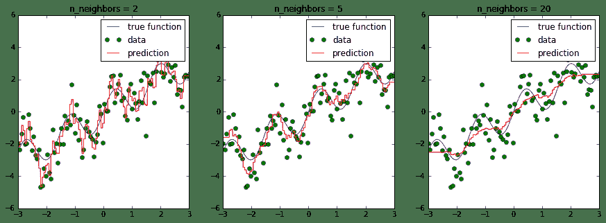
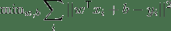
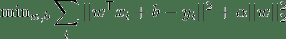
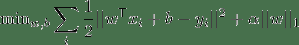
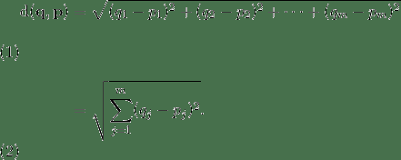
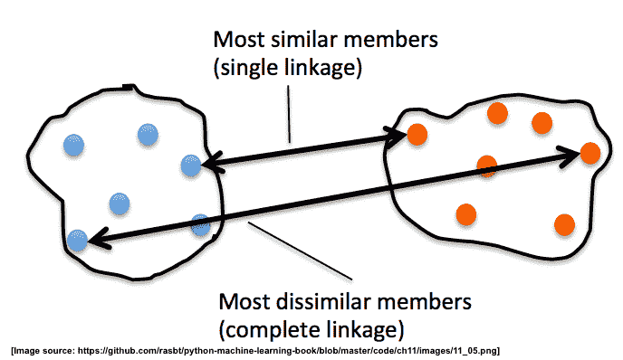
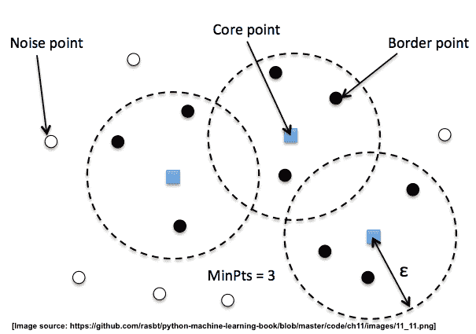

> 原文：[SciPy 2018 Scikit-learn Tutorial](https://nbviewer.jupyter.org/github/amueller/scipy-2018-sklearn/tree/master/notebooks/)
> 
> 译者：[飞龙](https://github.com/wizardforcel)
> 
> 协议：[CC BY-NC-SA 4.0](http://creativecommons.org/licenses/by-nc-sa/4.0/)
> 
> 自豪地采用[谷歌翻译](https://translate.google.cn/)

# 十三、交叉验证和得分方法

在前面的章节和笔记本中，我们将数据集分为两部分：训练集和测试集。 我们使用训练集来拟合我们的模型，并且我们使用测试集来评估其泛化能力 - 它对新的，没见过的数据的表现情况。


然而，（标记的）数据通常是宝贵的，这种方法让我们只将约 3/4 的数据用于行训练。 另一方面，我们只会尝试将我们的 1/4 数据应用于测试。 使用更多数据来构建模型，并且获得更加鲁棒的泛化能力估计，常用方法是交叉验证。 在交叉验证中，数据被重复拆分为非重叠的训练和测试集，并为每对建立单独的模型。 然后聚合测试集的得分来获得更鲁棒的估计。

进行交叉验证的最常用方法是`k`折交叉验证，其中数据首先被分成`k`（通常是 5 或 10）个相等大小的折叠，然后对于每次迭代，使用`k`折中的一个作为测试数据，其余作为训练数据：


这样，每个数据点只在测试集中一次，我们可以使用第`k`个数据之外的所有数据进行训练。 让我们应用这种技术，在鸢尾花数据集上评估`KNeighborsClassifier`算法：

```
from sklearn.datasets import load_iris
from sklearn.neighbors import KNeighborsClassifier

iris = load_iris()
X, y = iris.data, iris.target

classifier = KNeighborsClassifier() 
```

鸢尾花中的标签是有序的，这意味着如果我们像上面那样拆分数据，第一个折叠只有标签 0，而最后一个只有标签 2：

```
y 
```

为了在评估中避免这个问题，我们首先将我们的数据打乱：

```
import numpy as np
rng = np.random.RandomState(0)

permutation = rng.permutation(len(X))
X, y = X[permutation], y[permutation]
print(y) 
```

现在实现交叉验证很简单：

```
k = 5
n_samples = len(X)
fold_size = n_samples // k
scores = []
masks = []
for fold in range(k):
    # 为此折叠中的测试集生成一个布尔掩码
    test_mask = np.zeros(n_samples, dtype=bool)
    test_mask[fold * fold_size : (fold + 1) * fold_size] = True
    # 为可视化存储掩码
    masks.append(test_mask)
    # 使用此掩码创建训练和测试集
    X_test, y_test = X[test_mask], y[test_mask]
    X_train, y_train = X[~test_mask], y[~test_mask]
    # 拟合分类器
    classifier.fit(X_train, y_train)
    # 计算得分并记录
    scores.append(classifier.score(X_test, y_test)) 
```

让我们检查一下我们的测试掩码是否正确：

```
import matplotlib.pyplot as plt
%matplotlib inline
plt.matshow(masks, cmap='gray_r') 
```

现在让我们看一下我们计算出的得分：

```
print(scores)
print(np.mean(scores)) 
```

正如你所看到的，得分广泛分布于 90% 正确到 100％ 正确。 如果我们只进行一次分割，我们可能会得到任何答案。

由于交叉验证是机器学习中常见的模式，有个函数执行上面的操作，带有更多灵活性和更少代码。`sklearn.model_selection`模块具有交叉验证相关的所有函数。 最简单的函数是`cross_val_score`，它接受估计器和数据集，并将为你完成所有拆分：

```
from sklearn.model_selection import cross_val_score
scores = cross_val_score(classifier, X, y)
print('Scores on each CV fold: %s' % scores)
print('Mean score: %0.3f' % np.mean(scores)) 
```

如你所见，该函数默认使用三个折叠。 你可以使用`cv`参数更改折叠数：

```
cross_val_score(classifier, X, y, cv=5) 
```

交叉验证模块中还有辅助对象，它们将为你生成各种不同交叉验证方法的索引，包括 k-fold：

```
from sklearn.model_selection import KFold, StratifiedKFold, ShuffleSplit 
```

默认情况下，`cross_val_score`将`StratifiedKFold`用于分类，这可确保数据集中的类比例反映在每个折叠中。 如果你有一个二分类数据集，其中 90% 的数据点属于类 0，那么这意味着在每个折叠中，90% 的数据点将属于类 0。如果你只是使用`KFold`交叉验证，你可能会生成一个只包含类 0 的分割。每当你进行分类时，通常最好使用`StratifiedKFold`。

`StratifiedKFold`也消除了我们打乱鸢尾花的需要。 让我们看看在未打乱的鸢尾花数据集上，它生成什么类型的折叠。 每个交叉验证类都是训练和测试索引的集合的生成器：

```
cv = StratifiedKFold(n_splits=5)
for train, test in cv.split(iris.data, iris.target):
    print(test) 
```

正如你所看到的，在每个折叠中，在开始，中间，和结束位置，都有一些样本。 这样，保留了类别比例。 让我们观察一下`split`：

```
def plot_cv(cv, features, labels):
    masks = []
    for train, test in cv.split(features, labels):
        mask = np.zeros(len(labels), dtype=bool)
        mask[test] = 1
        masks.append(mask)

    plt.matshow(masks, cmap='gray_r')

plot_cv(StratifiedKFold(n_splits=5), iris.data, iris.target) 
```

为了比较，仍旧是标准`KFold`，忽略标签：

```
plot_cv(KFold(n_splits=5), iris.data, iris.target) 
```

请记住，增加折叠数量会为你提供更大的训练数据集，但会导致更多重复，因此评估速度会变慢：

```
plot_cv(KFold(n_splits=10), iris.data, iris.target) 
```

另一个有用的交叉验证生成器是`ShuffleSplit`。 该生成器简单地重复分割数据的随机部分。 这允许用户独立指定重复次数和训练集大小：

```
plot_cv(ShuffleSplit(n_splits=5, test_size=.2), iris.data, iris.target) 
```

如果你想要更鲁棒的估计，你可以增加分割数量：

```
plot_cv(ShuffleSplit(n_splits=20, test_size=.2), iris.data, iris.target) 
```

你可以使用`cross_val_score`方法来使用所有这些交叉验证生成器：

```
cv = ShuffleSplit(n_splits=5, test_size=.2)
cross_val_score(classifier, X, y, cv=cv) 
```

> 练习
> 
> 在鸢尾花数据集上，使用`KFold`类进行三折交叉验证，而不打乱数据。你能解释一下结果吗？

```
# %load solutions/13_cross_validation.py 
```

# 十四、参数选择、验证和测试

大多数模型的参数会影响他们可以学习的模型的复杂程度。回忆使用`KNeighborsRegressor`的时候。 如果我们改变我们考虑的邻居数量，我们会得到更平滑的预测：



在上图中，我们看到`n_neighbors`的三个不同值。对于`n_neighbors = 2`，数据过拟合，模型过于灵活，可以适应训练数据中的噪声。对于`n_neighbors = 20`，模型不够灵活，无法合理建模数据中的变化。

在中间，对于`n_neighbors = 5`，我们找到了一个很好的中点。它非常适合数据，并且不会受到任何一个图中所见的，过拟合或欠拟合问题的影响。我们想要的是一种定量识别过拟合和欠拟合的方法，并优化超参数（这种情况是多项式次数`d`）来确定最佳算法。

我们要权衡过多记录训练数据的特殊性和噪声，或者没有建模足够的可变性。这是一个需要在基本上每个机器学习应用中做出的权衡，并且是一个核心概念，称为偏差 - 方差 - 权衡或“过拟合与欠拟合”。


## 超参数、过拟合和欠拟合

遗憾的是，没有找到最佳位置的一般规则，因此机器学习实践者必须通过尝试几个超参数设置，来找到模型复杂性和泛化的最佳权衡。 超参数是机器学习算法的内部旋钮或可调参数（与算法从训练数据中学习的模型参数相反 - 例如，线性回归模型的权重系数）；K 近邻中的`k`的数量是这样的超参数。

最常见的是，这种“超参数调整”是使用暴力搜索完成的，例如在多个`n_neighbors`值上：

```
from sklearn.model_selection import cross_val_score, KFold
from sklearn.neighbors import KNeighborsRegressor
# 生成玩具数据集
x = np.linspace(-3, 3, 100)
rng = np.random.RandomState(42)
y = np.sin(4 * x) + x + rng.normal(size=len(x))
X = x[:, np.newaxis]

cv = KFold(shuffle=True)

# 对每个参数设置执行交叉验证
for n_neighbors in [1, 3, 5, 10, 20]:
    scores = cross_val_score(KNeighborsRegressor(n_neighbors=n_neighbors), X, y, cv=cv)
    print("n_neighbors: %d, average score: %f" % (n_neighbors, np.mean(scores))) 
```

scikit-learn 中有一个函数，称为`validation_plot`，用于重现上面的卡通图。 它根据训练和验证误差（使用交叉验证）绘制一个参数，例如邻居的数量：

```
from sklearn.model_selection import validation_curve
n_neighbors = [1, 3, 5, 10, 20, 50]
train_scores, test_scores = validation_curve(KNeighborsRegressor(), X, y, param_name="n_neighbors",
                                             param_range=n_neighbors, cv=cv)
plt.plot(n_neighbors, train_scores.mean(axis=1), label="train accuracy")
plt.plot(n_neighbors, test_scores.mean(axis=1), label="test accuracy")

plt.ylabel('Accuracy')
plt.xlabel('Number of neighbors')
plt.xlim([50, 0])
plt.legend(loc="best"); 
```

请注意，许多邻居意味着“平滑”或“简单”的模型，因此绘图使用还原的`x`轴。

如果多个参数很重要，例如 SVM 中的参数`C`和`gamma`（稍后会详细介绍），则尝试所有可能的组合：

```
from sklearn.model_selection import cross_val_score, KFold
from sklearn.svm import SVR

# 对每个参数设置执行交叉验证
for C in [0.001, 0.01, 0.1, 1, 10]:
    for gamma in [0.001, 0.01, 0.1, 1]:
        scores = cross_val_score(SVR(C=C, gamma=gamma), X, y, cv=cv)
        print("C: %f, gamma: %f, average score: %f" % (C, gamma, np.mean(scores))) 
```

由于这是一种非常常见的模式，因此在 scikit-learn 中有一个内置类`GridSearchCV`。 `GridSearchCV`接受描述应该尝试的参数的字典，和一个要训练的模型。

参数网格被定义为字典，其中键是参数，值是要测试的设置。

要检查不同折叠的训练得分，请将参数`return_train_score`设置为`True`。

```
from sklearn.model_selection import GridSearchCV
param_grid = {'C': [0.001, 0.01, 0.1, 1, 10], 'gamma': [0.001, 0.01, 0.1, 1]}

grid = GridSearchCV(SVR(), param_grid=param_grid, cv=cv, verbose=3, return_train_score=True) 
```

`GridSearchCV`的一大优点是它是一个元估计器。 它需要像上面的 SVR 这样的估计器，并创建一个新的估计器，其行为完全相同 - 在这种情况下，就像一个回归器。 所以我们可以调用它的`fit`来训练：

```
grid.fit(X, y) 
```

`fit`所做的比我们上面做的复杂得多。 首先，它使用交叉验证运行相同的循环，来找到最佳参数组合。 一旦它具有最佳组合，它在所有传给`fit`的数据上再次执行`fit`（无交叉验证），来使用最佳参数设置构建单个新模型。

然后，与所有模型一样，我们可以使用`predict`或`score`：

```
grid.predict(X) 
```

你可以在`best_params_`属性中检查`GridSearchCV`找到的最佳参数，以及`best_score_`属性中的最佳得分：

```
print(grid.best_score_)

print(grid.best_params_) 
```

但是，你可以通过访问`cv_results_`属性来调查每组参数值的表现和更多信息。 `cv_results_`属性是一个字典，其中每个键都是字符串，每个值都是数组。 因此，它可以用于制作`pandas DataFrame`。

```
type(grid.cv_results_)

print(grid.cv_results_.keys())

import pandas as pd

cv_results = pd.DataFrame(grid.cv_results_)
cv_results.head()

cv_results_tiny = cv_results[['param_C', 'param_gamma', 'mean_test_score']]
cv_results_tiny.sort_values(by='mean_test_score', ascending=False).head() 
```

但是，将这个得分用于评估存在问题。 你可能会犯所谓的多假设检验错误。 如果你尝试了很多参数设置，其中一些参数设置只是偶然表现很好，而你获得的得分可能无法反映你的模型对新的没见过的数据的表现。 因此，在执行网格搜索之前拆分单独的测试集是很好的。 这种模式可以看作是训练-验证-测试分割，在机器学习中很常见：


我们可以非常容易地实现，通过使用`train_test_split`分割一些测试数据，在训练集上训练`GridSearchCV`，并将`score`方法应用于测试集：

```
from sklearn.model_selection import train_test_split
X_train, X_test, y_train, y_test = train_test_split(X, y, random_state=1)

param_grid = {'C': [0.001, 0.01, 0.1, 1, 10], 'gamma': [0.001, 0.01, 0.1, 1]}
cv = KFold(n_splits=10, shuffle=True)

grid = GridSearchCV(SVR(), param_grid=param_grid, cv=cv)

grid.fit(X_train, y_train)
grid.score(X_test, y_test) 
```

我们还可以查看所选的参数：

```
grid.best_params_ 
```

一些实践者采用更简单的方案，将数据简单地分为三个部分，即训练，验证和测试。 如果你的训练集非常大，或者使用交叉验证训练许多模型是不可行的，因为训练模型需要很长时间，这是一种可能的替代方案。 你可以使用 scikit-learn 执行此操作，例如通过拆分测试集，然后将`GridSearchCV`与`ShuffleSplit`交叉验证应用于单次迭代：


```
from sklearn.model_selection import train_test_split, ShuffleSplit

X_train, X_test, y_train, y_test = train_test_split(X, y, random_state=1)

param_grid = {'C': [0.001, 0.01, 0.1, 1, 10], 'gamma': [0.001, 0.01, 0.1, 1]}
single_split_cv = ShuffleSplit(n_splits=1)

grid = GridSearchCV(SVR(), param_grid=param_grid, cv=single_split_cv, verbose=3)

grid.fit(X_train, y_train)
grid.score(X_test, y_test) 
```

这要快得多，但可能会产生更糟糕的超参数，从而产生更糟糕的结果。

```
clf = GridSearchCV(SVR(), param_grid=param_grid)
clf.fit(X_train, y_train)
clf.score(X_test, y_test) 
```

> 练习
> 
> 应用网格搜索来查找`KNeighborsClassifier`中邻居数量的最佳设置，并将其应用于数字数据集。

# 十五、估计器流水线

在本节中，我们将研究如何链接不同的估计器。

## 简单示例：估计器之前的特征提取和选择

## 特征提取：向量化器

对于某些类型的数据，例如文本数据，必须应用特征提取步骤将其转换为数值特征。 为了说明，我们加载我们之前使用的 SMS 垃圾邮件数据集。

```
import os

with open(os.path.join("datasets", "smsspam", "SMSSpamCollection")) as f:
    lines = [line.strip().split("\t") for line in f.readlines()]
text = [x[1] for x in lines]
y = [x[0] == "ham" for x in lines]

from sklearn.model_selection import train_test_split

text_train, text_test, y_train, y_test = train_test_split(text, y) 
```

以前，我们手动应用了特征提取，如下所示：

```
from sklearn.feature_extraction.text import TfidfVectorizer
from sklearn.linear_model import LogisticRegression

vectorizer = TfidfVectorizer()
vectorizer.fit(text_train)

X_train = vectorizer.transform(text_train)
X_test = vectorizer.transform(text_test)

clf = LogisticRegression()
clf.fit(X_train, y_train)

clf.score(X_test, y_test) 
```

我们学习转换然后将其应用于测试数据的情况，在机器学习中非常常见。 因此 scikit-learn 有一个快捷方式，称为流水线：

```
from sklearn.pipeline import make_pipeline

pipeline = make_pipeline(TfidfVectorizer(), LogisticRegression())
pipeline.fit(text_train, y_train)
pipeline.score(text_test, y_test) 
```

如你所见，这使代码更短，更容易处理。 在背后，与上面完全相同。 当在水流上调用`fit`时，它将依次调用每个步骤的`fit`。

在第一步的`fit`之后，它将使用第一步的`transform`方法来创建新的表示。 然后将其用于下一步的`fit`，依此类推。 最后，在最后一步，只调用`fit`。


如果我们调用`score`，那么每一步都只会调用`transform` - 毕竟这可能是测试集！ 然后，在最后一步，使用新的表示调用`score`。 `predict`也是如此。

流水线的构建不仅简化了代码，而且对于模型选择也很重要。 假设我们想要网格搜索`C`来调整上面的 Logistic 回归。

让我们假设我们这样做：

```
# This illustrates a common mistake. Don't use this code!
from sklearn.model_selection import GridSearchCV

vectorizer = TfidfVectorizer()
vectorizer.fit(text_train)

X_train = vectorizer.transform(text_train)
X_test = vectorizer.transform(text_test)

clf = LogisticRegression()
grid = GridSearchCV(clf, param_grid={'C': [.1, 1, 10, 100]}, cv=5)
grid.fit(X_train, y_train) 
```

## 我们哪里做错了？

在这里，我们使用`X_train`上的交叉验证进行了网格搜索。 然而，当应用`TfidfVectorizer`时，它看到了所有的`X_train`，而不仅仅是训练折叠！ 因此，它可以使用测试折叠中单词频率的知识。 这被称为测试集的“污染”，并且使泛化性能或错误选择的参数的估计过于乐观。 我们可以通过流水线解决这个问题：

```
from sklearn.model_selection import GridSearchCV

pipeline = make_pipeline(TfidfVectorizer(), 
                         LogisticRegression())

grid = GridSearchCV(pipeline,
                    param_grid={'logisticregression__C': [.1, 1, 10, 100]}, cv=5)

grid.fit(text_train, y_train)
grid.score(text_test, y_test) 
```

请注意，我们需要告诉流水线我们要在哪一步设置参数`C`。我们可以使用特殊的`__`语法来完成此操作。 `__`之前的名称只是类的名称，`__`之后的部分是我们想要使用网格搜索设置的参数。


使用流水线的另一个好处是，我们现在还可以使用`GridSearchCV`搜索特征提取的参数：

```
from sklearn.model_selection import GridSearchCV

pipeline = make_pipeline(TfidfVectorizer(), LogisticRegression())

params = {'logisticregression__C': [.1, 1, 10, 100],
          "tfidfvectorizer__ngram_range": [(1, 1), (1, 2), (2, 2)]}
grid = GridSearchCV(pipeline, param_grid=params, cv=5)
grid.fit(text_train, y_train)
print(grid.best_params_)
grid.score(text_test, y_test) 
```

> 练习
> 
> 使用`StandardScaler`和`RidgeRegression`创建流水线，并将其应用于波士顿住房数据集（使用`sklearn.datasets.load_boston`加载）。 尝试添加`sklearn.preprocessing.PolynomialFeatures`变换器作为第二个预处理步骤，并网格搜索多项式的次数（尝试 1,2 和 3）。

```
# %load solutions/15A_ridge_grid.py 
```

# 十六、模型评估、得分指标和处理不平衡类别

在之前的笔记本中，我们已经详细介绍了如何评估模型，以及如何选择最佳模型。 到目前为止，我们假设我们得到了表现的度量，它度量模型的质量。 但是，应该使用什么度量标准并不总是显而易见的。 scikit-learn 中的默认分数，对于分类是准确率，即正确分类的样本的比例，对于回归是 r2 得分，是确定系数。

在许多情况下，这些是合理的默认选择；但是，根据我们的任务，这些并不总是最终或推荐的选择。

让我们更详细地看一下分类，回到手写数字分类的应用。 那么，如何训练分类器并使用不同的方式进行评估呢？ Scikit-learn 在 sklearn.metrics 模块中有许多有用的方法，可以帮助我们完成这项任务：

```
%matplotlib inline
import matplotlib.pyplot as plt
import numpy as np
np.set_printoptions(precision=2)

from sklearn.datasets import load_digits
from sklearn.model_selection import train_test_split
from sklearn.svm import LinearSVC

digits = load_digits()
X, y = digits.data, digits.target
X_train, X_test, y_train, y_test = train_test_split(X, y, 
                                                    random_state=1,
                                                    stratify=y,
                                                    test_size=0.25)

classifier = LinearSVC(random_state=1).fit(X_train, y_train)
y_test_pred = classifier.predict(X_test)

print("Accuracy: {}".format(classifier.score(X_test, y_test))) 
```

在这里，我们正确预测了 95.3% 的样本。 对于多类问题，通常很有趣的是，知道哪些类很难预测，哪些类很容易，或哪些类混淆了。 获取错误分类的更多信息的一种方法，是`confusion_matrix`，它为每个真正的类显示给定预测结果的频率。

```
from sklearn.metrics import confusion_matrix
confusion_matrix(y_test, y_test_pred) 
```

绘图有时更可读：

```
plt.matshow(confusion_matrix(y_test, y_test_pred), cmap="Blues")
plt.colorbar(shrink=0.8)
plt.xticks(range(10))
plt.yticks(range(10))
plt.xlabel("Predicted label")
plt.ylabel("True label"); 
```

我们可以看到大多数条目都在对角线上，这意味着我们正确地预测了几乎所有样本。 非对角线的条目向我们显示许多 8 被归类为 1，并且 9 很可能与许多其他类混淆。

另一个有用的函数是`classification_report`，它为所有类提供精确率，召回率，f 得分和支持度。 精确率是一个类有多少预测实际上是那个类。 TP，FP，TN，FN 分别代表“真正例”，“假正例”，“真负例”和“假负例”：

```
Precision = TP / (TP + FP) 
```

召回率是有多少真正例被复原：

```
Recall = TP / (TP + FN) 
```

F1 得分是二者的调和均值：

```
F1 = 2 x (precision x recall) / (precision + recall) 
```

上述所有这些值的值都在闭区间`[0,1]`中，其中 1 表示完美得分。

```
from sklearn.metrics import classification_report
print(classification_report(y_test, y_test_pred)) 
```

这些指标有助于实践中经常出现的两种特殊情况：

*   不平衡类别，即一个类可能比另一个类更频繁。
*   非对称成本，即一种错误比另一种更“昂贵”。

首先我们来看看第一个。 假设我们有 1:9 的不平衡类别，这是相当温和的（想想广告点击预测，只有 0.001% 的广告可能会被点击）：

```
np.bincount(y) / y.shape[0] 
```

作为一个玩具示例，假设我们想要划分数字三和所有其他数字：

```
X, y = digits.data, digits.target == 3 
```

现在我们在分类器上运行交叉验证，看看它有多好：

我们的分类器准确率为 90%。 这样好吗？ 还是不好？ 请记住，90% 的数据“不是三”。 因此，让我们看看虚拟分类器的表现如何，它始终预测最频繁的类：

```
from sklearn.dummy import DummyClassifier
cross_val_score(DummyClassifier("most_frequent"), X, y) 
```

也是 90%（正如预期的那样）！ 所以有一种可能，我们的分类器不是很好，它并不比一个甚至不看数据的简单策略更好。 不过，这个判断太快了。 准确性根本不是评估不平衡数据集的分类器的好方法！

```
np.bincount(y) / y.shape[0] 
```

## ROC 曲线

更好的衡量标准是使用所谓的 ROC（受试者工作特性）曲线。 ROC 曲线处理分类器的不确定性输出，比如我们上面训练的 SVC 的“决策函数”。 它不是在 0 处截断并查看分类结果，而是查看每个可能的截断值并记录有多少真正例预测，以及有多少假正例预测。

下图比较了在“三和其它”任务上，我们的分类器的三个参数设置的 roc 曲线。

```
from sklearn.metrics import roc_curve, roc_auc_score

X_train, X_test, y_train, y_test = train_test_split(X, y, random_state=42)

for gamma in [.05, 0.1, 0.5]:
    plt.xlabel("False Positive Rate")
    plt.ylabel("True Positive Rate (recall)")
    svm = SVC(gamma=gamma).fit(X_train, y_train)
    decision_function = svm.decision_function(X_test)
    fpr, tpr, _ = roc_curve(y_test, decision_function)
    acc = svm.score(X_test, y_test)
    auc = roc_auc_score(y_test, svm.decision_function(X_test))
    label = "gamma: %0.3f, acc:%.2f auc:%.2f" % (gamma, acc, auc)
    plt.plot(fpr, tpr, label=label, linewidth=3)
plt.legend(loc="best"); 
```

由于决策阈值非常小，假正例很低，但假负例也很少，但是阈值非常高的话，真正例率和假负例率都很高。所以一般来说，曲线将从左下角到右上角。对角线反映了机会表现，而目标是尽可能在左上角。这意味着与任何负样本相比，为所有正样本提供更高的`decision_function`值。

在这个意义上，该曲线仅考虑正样本和负样本的排名，而不是实际值。从图例中的曲线和准确率值可以看出，即使所有分类器具有相同的准确率，89%，甚至低于虚拟分类器，其中一个具有完美的 roc 曲线，而其中一个表现出机会水平。

对于网格搜索和交叉验证，我们通常希望将模型评估压缩为单个数字。使用 roc 曲线的一个好方法是使用曲线下面积（AUC）。我们可以通过指定`scoring ="roc_auc"`在`cross_val_score`中使用它：

```
from sklearn.model_selection import cross_val_score
cross_val_score(SVC(gamma='auto'), X, y, scoring="roc_auc", cv=5) 
```

## 内建和自定义的得分函数

还有更多可用的评分方法，可用于不同类型的任务。 你可以在`SCORERS`字典中找到它们。 唯一的文档解释了所有这些。

```
from sklearn.metrics.scorer import SCORERS
print(SCORERS.keys()) 
```

你也可以定义自己的得分指标。 你可以提供一个可调用对象作为`scoring`参数，而不是字符串，即具有`__call__`方法对象或函数。 它需要接受模型，测试集特征`X_test`和测试集标签`y_test`，并返回一个浮点数。 更高的浮点意味着更好的模型。

让我们重新实现标准准确率得分：

```
def my_accuracy_scoring(est, X, y):
    return np.mean(est.predict(X) == y)

cross_val_score(SVC(), X, y, scoring=my_accuracy_scoring) 
```

> 练习
> 
> 在前面的章节中，我们通常使用准确率度量来评估分类器的表现。 我们还没有谈到的相关措施是平均每类准确率（APCA）。 我们记得，准确性定义为：
> 
> ```
> ACC = (TP + TN) / n 
> ```
> 
> 其中`n`是样本总数。 这可以推广为：
> 
> ```
> ACC = T / N 
> ```
> 
> 其中`T`是多类设置中所有正确预测的数量。
> 
> 给定以下“真实”类标签和预测类标签数组，你是否可以实现一个函数，使用准确率度量来计算平均每类准确率，如下所示？
> 
> 

```
y_true = np.array([0, 0, 0, 1, 1, 1, 1, 1, 2, 2])
y_pred = np.array([0, 1, 1, 0, 1, 1, 2, 2, 2, 2])

confusion_matrix(y_true, y_pred)

# %load solutions/16A_avg_per_class_acc.py 
```

# 十七、深入：线性模型

线性模型在可用的数据很少时非常有用，或者对于文本分类中的非常大的特征空间很有用。 此外，它们是正则化的良好研究案例。

## 用于回归的线性模型

用于回归的所有线性模型学习系数参数`coef_`和偏移`intercept_`，来使用线性特征组合做出预测：

```
y_pred = x_test[0] * coef_[0] + ... + x_test[n_features-1] * coef_[n_features-1] + intercept_ 
```

回归的线性模型之间的差异在于，除了很好地拟合训练数据之外，对系数施加什么样的限制或惩罚，作为正则化。 最标准的线性模型是“普通最小二乘回归”，通常简称为“线性回归”。 它没有对`coef_`施加任何额外限制，因此当特征数量很大时，它会变得行为异常，并且模型会过拟合。

让我们生成一个简单的模拟，以查看这些模型的行为。

```
from sklearn.datasets import make_regression
from sklearn.model_selection import train_test_split

X, y, true_coefficient = make_regression(n_samples=200, n_features=30, n_informative=10, noise=100, coef=True, random_state=5)
X_train, X_test, y_train, y_test = train_test_split(X, y, random_state=5, train_size=60, test_size=140)
print(X_train.shape)
print(y_train.shape) 
```

## 线性回归



```
from sklearn.linear_model import LinearRegression
linear_regression = LinearRegression().fit(X_train, y_train)
print("R^2 on training set: %f" % linear_regression.score(X_train, y_train))
print("R^2 on test set: %f" % linear_regression.score(X_test, y_test))

from sklearn.metrics import r2_score
print(r2_score(np.dot(X, true_coefficient), y))

plt.figure(figsize=(10, 5))
coefficient_sorting = np.argsort(true_coefficient)[::-1]
plt.plot(true_coefficient[coefficient_sorting], "o", label="true")
plt.plot(linear_regression.coef_[coefficient_sorting], "o", label="linear regression")

plt.legend()

from sklearn.model_selection import learning_curve

def plot_learning_curve(est, X, y):
    training_set_size, train_scores, test_scores = learning_curve(est, X, y, train_sizes=np.linspace(.1, 1, 20))
    estimator_name = est.__class__.__name__
    line = plt.plot(training_set_size, train_scores.mean(axis=1), '--', label="training scores " + estimator_name)
    plt.plot(training_set_size, test_scores.mean(axis=1), '-', label="test scores " + estimator_name, c=line[0].get_color())
    plt.xlabel('Training set size')
    plt.legend(loc='best')
    plt.ylim(-0.1, 1.1)

plt.figure()    
plot_learning_curve(LinearRegression(), X, y) 
```

## 岭回归（L2 惩罚）

岭估计器是普通`LinearRegression`的简单正则化（称为 l2 惩罚）。 特别是，它具有的优点是，在计算上不比普通的最小二乘估计更昂贵。



正则化的总数通过`Ridge`的`alpha`参数设置。

```
from sklearn.linear_model import Ridge
ridge_models = {}
training_scores = []
test_scores = []

for alpha in [100, 10, 1, .01]:
    ridge = Ridge(alpha=alpha).fit(X_train, y_train)
    training_scores.append(ridge.score(X_train, y_train))
    test_scores.append(ridge.score(X_test, y_test))
    ridge_models[alpha] = ridge

plt.figure()
plt.plot(training_scores, label="training scores")
plt.plot(test_scores, label="test scores")
plt.xticks(range(4), [100, 10, 1, .01])
plt.xlabel('alpha')
plt.legend(loc="best")

plt.figure(figsize=(10, 5))
plt.plot(true_coefficient[coefficient_sorting], "o", label="true", c='b')

for i, alpha in enumerate([100, 10, 1, .01]):
    plt.plot(ridge_models[alpha].coef_[coefficient_sorting], "o", label="alpha = %.2f" % alpha, c=plt.cm.viridis(i / 3.))

plt.legend(loc="best") 
```

调整`alpha`对表现至关重要。

```
plt.figure()
plot_learning_curve(LinearRegression(), X, y)
plot_learning_curve(Ridge(alpha=10), X, y) 
```

## Lasso（L1 惩罚）

`Lasso`估计器可用于对系数施加稀疏性。 换句话说，如果我们认为许多特征不相关，那么我们会更喜欢它。 这是通过所谓的 l1 惩罚来完成的。



```
from sklearn.linear_model import Lasso

lasso_models = {}
training_scores = []
test_scores = []

for alpha in [30, 10, 1, .01]:
    lasso = Lasso(alpha=alpha).fit(X_train, y_train)
    training_scores.append(lasso.score(X_train, y_train))
    test_scores.append(lasso.score(X_test, y_test))
    lasso_models[alpha] = lasso
plt.figure()
plt.plot(training_scores, label="training scores")
plt.plot(test_scores, label="test scores")
plt.xticks(range(4), [30, 10, 1, .01])
plt.legend(loc="best")

plt.figure(figsize=(10, 5))
plt.plot(true_coefficient[coefficient_sorting], "o", label="true", c='b')

for i, alpha in enumerate([30, 10, 1, .01]):
    plt.plot(lasso_models[alpha].coef_[coefficient_sorting], "o", label="alpha = %.2f" % alpha, c=plt.cm.viridis(i / 3.))

plt.legend(loc="best")

plt.figure(figsize=(10, 5))
plot_learning_curve(LinearRegression(), X, y)
plot_learning_curve(Ridge(alpha=10), X, y)
plot_learning_curve(Lasso(alpha=10), X, y) 
```

你也可以使用[`ElasticNet`](http://scikit-learn.org/stable/modules/generated/sklearn.linear_model.ElasticNet.html)，而不是选择`Ridge`或`Lasso`，它使用两种形式的正则化，并提供一个参数来指定它们之间的权重。`ElasticNet`通常在这些模型中表现最佳。

## 用于分类的线性模型

用于分类的所有线性模型学习系数参数`coef_`和偏移`intercept_`，来使用线性特征组合做出预测：

```
y_pred = x_test[0] * coef_[0] + ... + x_test[n_features-1] * coef_[n_features-1] + intercept_ > 0 
```

如你所见，这与回归非常相似，只是应用了零处的阈值。

同样，用于分类的线性模型之间的区别是，对`coef_`和`intercept_`施加什么类型的正则化，但是在如何测量训练集的拟合（所谓的损失函数）方面也存在微小差异。

线性分类的两种最常见的模型是`LinearSVC`实现的线性 SVM，和`LogisticRegression`。

线性分类器的正则化的良好直觉是，使用高正则化，如果大多数点被正确分类就足够了。 但使用较少的正则化，每个数据点的重要性也越来越高。这里使用具有不同`C`值的线性 SVM 来说明。

## `LinearSVC`中`C`的影响

在`LinearSVC`中，`C`参数控制模型中的正则化。

较低的`C`产生更多的正则化和更简单的模型，而较高的`C`产生较少的正则化和来自各个数据点的更多影响。

```
from figures import plot_linear_svc_regularization
plot_linear_svc_regularization() 
```

与`Ridge`/`Lasso`划分类似，你可以将`penalty`参数设置为`'l1'`来强制系数的稀疏性（类似于`Lasso`）或`'l2'`来鼓励更小的系数（类似于`Ridge`）。

## 多类线性分类

```
from sklearn.datasets import make_blobs
plt.figure()
X, y = make_blobs(random_state=42)
plt.figure(figsize=(8, 8))
plt.scatter(X[:, 0], X[:, 1], c=plt.cm.tab10(y))

from sklearn.svm import LinearSVC
linear_svm = LinearSVC().fit(X, y)
print(linear_svm.coef_.shape)
print(linear_svm.intercept_.shape)

plt.figure(figsize=(8, 8))
plt.scatter(X[:, 0], X[:, 1], c=plt.cm.tab10(y))
line = np.linspace(-15, 15)
for coef, intercept in zip(linear_svm.coef_, linear_svm.intercept_):
    plt.plot(line, -(line * coef[0] + intercept) / coef[1])
plt.ylim(-10, 15)
plt.xlim(-10, 8); 
```

点以一对多（OVR）的方式分类（又名 OVA），我们将测试点分配给模型对测试点具有最高置信度的类（在 SVM 情况下，与分隔超平面的距离最大）。

> 练习
> 
> 使用`LogisticRegression`来分类数字数据集，并网格搜索`C`参数。
> 当你增加或减少`alpha`时，你认为上面的学习曲线如何变化？ 尝试更改岭和`Lasso`中的`alpha`参数，看看你的直觉是否正确。

```
from sklearn.datasets import load_digits
from sklearn.linear_model import LogisticRegression

digits = load_digits()
X_digits, y_digits = digits.data, digits.target

# split the dataset, apply grid-search

# %load solutions/17A_logreg_grid.py

# %load solutions/17B_learning_curve_alpha.py 
```

# 十八、深入：决策树与森林

在这里，我们将探索一类基于决策树的算法。 最基本决策树非常直观。 它们编码一系列`if`和`else`选项，类似于一个人如何做出决定。 但是，从数据中完全可以了解要问的问题以及如何处理每个答案。

例如，如果你想创建一个识别自然界中发现的动物的指南，你可能会问以下一系列问题：

*   动物是大于还是小于一米？
    *   较大：动物有角吗？
        *   是的：角长是否超过十厘米？
        *   不是：动物有项圈吗？
*   较小：动物有两条腿还是四条腿？
    *   二：动物有翅膀吗？
    *   四：动物有浓密的尾巴吗？

等等。 这种问题的二元分裂是决策树的本质。

基于树的模型的主要好处之一是它们几乎不需要数据预处理。 它们可以处理不同类型的变量（连续和离散），并且对特征的缩放不变。

另一个好处是基于树的模型被称为“非参数”，这意味着他们没有一套固定的参数需要学习。 相反，如果给出更多数据，树模型可以变得越来越灵活。 换句话说，自由参数的数量随着样本量而增长并且不是固定的，例如在线性模型中。

## 决策树回归

决策树是一种简单的二元分类树，类似于最近邻分类。 它可以这样使用：

```
from figures import make_dataset
x, y = make_dataset()
X = x.reshape(-1, 1)

plt.figure()
plt.xlabel('Feature X')
plt.ylabel('Target y')
plt.scatter(X, y);

from sklearn.tree import DecisionTreeRegressor

reg = DecisionTreeRegressor(max_depth=5)
reg.fit(X, y)

X_fit = np.linspace(-3, 3, 1000).reshape((-1, 1))
y_fit_1 = reg.predict(X_fit)

plt.figure()
plt.plot(X_fit.ravel(), y_fit_1, color='tab:blue', label="prediction")
plt.plot(X.ravel(), y, 'C7.', label="training data")
plt.legend(loc="best"); 
```

单个决策树允许我们以非参数方式估计标签，但显然存在一些问题。 在某些地区，该模型表现出高偏差并且对数据欠拟合。 （请见不遵循数据轮廓的长扁形线条），而在其他区域，模型表现高方差并且过拟合数据（反映为受单点噪声影响的窄峰形）。

## 决策树分类

决策树分类原理非常相似，通过将叶子中的多数类分配给叶子中的所有点：

```
from sklearn.datasets import make_blobs
from sklearn.model_selection import train_test_split
from sklearn.tree import DecisionTreeClassifier
from figures import plot_2d_separator
from figures import cm2

X, y = make_blobs(centers=[[0, 0], [1, 1]], random_state=61526, n_samples=100)
X_train, X_test, y_train, y_test = train_test_split(X, y, random_state=42)

clf = DecisionTreeClassifier(max_depth=5)
clf.fit(X_train, y_train)

plt.figure()
plot_2d_separator(clf, X, fill=True)
plt.scatter(X_train[:, 0], X_train[:, 1], c=y_train, cmap=cm2, s=60, alpha=.7, edgecolor='k')
plt.scatter(X_test[:, 0], X_test[:, 1], c=y_test, cmap=cm2, s=60, edgecolor='k'); 
```

有许多参数可以控制树的复杂性，但最容易理解的是最大深度。这限制了树可以对输入空间进行划分的精确度，或者在决定样本所在的类之前,可以询问多少`if-else`问题。

此参数对于调整树和基于树的模型非常重要。下面的交互式图表显示了该模型的欠拟合和过拟合。 `max_depth`为 1 显然是一个欠拟合的模型，而 7 或 8 的深度明显过拟合。对于该数据集，树可以生长的最大深度是 8，此时每个叶仅包含来自单个类的样本。这被称为所有叶子都是“纯的”。

在下面的交互式图中，区域被指定为蓝色和红色，来表明该区域的预测类。颜色的阴影表示该类的预测概率（较暗为较高概率），而黄色区域表示任一类的预测概率相等。

```
from figures import plot_tree
max_depth = 3
plot_tree(max_depth=max_depth) 
```

决策树训练快，易于理解，并且经常产生可解释的模型。 但是，单个树通常倾向于过拟合训练数据。 使用上面的滑块，你可能会注意到，即使在类之间有良好的分隔之前，模型也会开始过拟合。

因此，在实践中，更常见的是组合多个树来产生更好泛化的模型。 组合树的最常用方法是随机森林和梯度提升树。

## 随机森林

随机森林只是许多树，建立在数据的不同随机子集（带放回抽样）上，并对于每个分裂，使用特征的不同随机子集（无放回抽样）。 这使得树彼此不同，并使它们过拟合不同的方面。 然后，他们的预测被平均，产生更平稳的估计，更少过拟合。

```
from figures import plot_forest
max_depth = 3
plot_forest(max_depth=max_depth) 
```

## 通过交叉验证选择最优估计

```
from sklearn.model_selection import GridSearchCV
from sklearn.datasets import load_digits
from sklearn.ensemble import RandomForestClassifier

digits = load_digits()
X, y = digits.data, digits.target

X_train, X_test, y_train, y_test = train_test_split(X, y, random_state=42)

rf = RandomForestClassifier(n_estimators=200)
parameters = {'max_features':['sqrt', 'log2', 10],
              'max_depth':[5, 7, 9]}

clf_grid = GridSearchCV(rf, parameters, n_jobs=-1)
clf_grid.fit(X_train, y_train)

clf_grid.score(X_train, y_train)

clf_grid.score(X_test, y_test) 
```

## 另一个选项：梯度提升

可能有用的另一种集合方法是提升：在这里，我们构建了一个由 200 个估计器组成的链，它迭代地改进了先前估计器的结果，而不是查看（比方说）200 个并行估计器。 我们的想法是，通过顺序应用非常快速，简单的模型，我们可以获得比任何单个部分更好的总模型误差。

```
from sklearn.ensemble import GradientBoostingRegressor
clf = GradientBoostingRegressor(n_estimators=100, max_depth=5, learning_rate=.2)
clf.fit(X_train, y_train)

print(clf.score(X_train, y_train))
print(clf.score(X_test, y_test)) 
```

> 练习：梯度提升的交叉验证
> 
> 使用网格搜索在数字数据集上优化梯度提升树`learning_rate`和`max_depth`。

```
from sklearn.datasets import load_digits
from sklearn.ensemble import GradientBoostingClassifier

digits = load_digits()
X_digits, y_digits = digits.data, digits.target

# split the dataset, apply grid-search

# %load solutions/18_gbc_grid.py 
```

## 特征的重要性

`RandomForest`和`GradientBoosting`对象在拟合之后都会提供`feature_importances_`属性。 此属性是这些模型最强大的功能之一。 它们基本上量化了在不同树的节点中，每个特征对表现的贡献程度。

```
X, y = X_digits[y_digits < 2], y_digits[y_digits < 2]

rf = RandomForestClassifier(n_estimators=300, n_jobs=1)
rf.fit(X, y)
print(rf.feature_importances_)  # one value per feature

plt.figure()
plt.imshow(rf.feature_importances_.reshape(8, 8), cmap=plt.cm.viridis, interpolation='nearest') 
```

# 十九、自动特征选择

我们经常收集许多可能与监督预测任务相关的特征，但我们不知道它们中的哪一个实际上是预测性的。 为了提高可解释性，有时还提高泛化表现，我们可以使用自动特征选择来选择原始特征的子集。 有几种可用的特征选择方法，我们将按照复杂性的升序来解释。

对于给定的监督模型，最佳特征选择策略是尝试每个可能的特征子集，并使用该子集评估泛化表现。 但是，特征子集是指数级，因此这种详尽的搜索通常是不可行的。 下面讨论的策略可以被认为是这种不可行计算的替代。

## 单变量统计

选择要素的最简单方法是使用单变量统计，即通过单独查看每个特征并运行统计检验，来查看它是否与目标相关。 这种检验也称为方差分析（ANOVA）。

我们创建了一个人造数据集，其中包含乳腺癌数据和另外 50 个完全随机的特征。

```
from sklearn.datasets import load_breast_cancer, load_digits
from sklearn.model_selection import train_test_split

cancer = load_breast_cancer()

# get deterministic random numbers
rng = np.random.RandomState(42)
noise = rng.normal(size=(len(cancer.data), 50))
# add noise features to the data
# the first 30 features are from the dataset, the next 50 are noise
X_w_noise = np.hstack([cancer.data, noise])

X_train, X_test, y_train, y_test = train_test_split(X_w_noise, cancer.target,
                                                    random_state=0, test_size=.5) 
```

我们必须在统计检验的 p 值上定义一个阈值，来决定要保留多少特征。 在 scikit-learn 中实现了几种策略，一种直接的策略是`SelectPercentile`，它选择原始特征的百分位数（下面我们选择 50%）：

```
from sklearn.feature_selection import SelectPercentile

# use f_classif (the default) and SelectPercentile to select 50% of features:
select = SelectPercentile(percentile=50)
select.fit(X_train, y_train)
# transform training set:
X_train_selected = select.transform(X_train)

print(X_train.shape)
print(X_train_selected.shape) 
```

我们还可以直接使用检验统计量，来查看每个特征的相关性。 由于乳腺癌数据集是一项分类任务，我们使用`f_classif`，F 检验用于分类。 下面我们绘制 p 值，与 80 个特征中的每一个相关（30 个原始特征和 50 个噪声特征）。 低 p 值表示信息性特征。

```
from sklearn.feature_selection import f_classif, f_regression, chi2

F, p = f_classif(X_train, y_train)

plt.figure()
plt.plot(p, 'o') 
```

显然，前 30 个特征中的大多数具有非常小的 p 值。

回到`SelectPercentile`转换器，我们可以使用`get_support`方法获得所选特征：

```
mask = select.get_support()
print(mask)
# 展示掩码。黑色是真，白色是假
plt.matshow(mask.reshape(1, -1), cmap='gray_r') 
```

几乎所有最初的 30 个特征都被还原了。 我们还可以通过在数据上训练监督模型，来分析特征选择的效果。 仅在训练集上学习特征选择非常重要！

```
from sklearn.linear_model import LogisticRegression

# 转换测试数据
X_test_selected = select.transform(X_test)

lr = LogisticRegression()
lr.fit(X_train, y_train)
print("Score with all features: %f" % lr.score(X_test, y_test))
lr.fit(X_train_selected, y_train)
print("Score with only selected features: %f" % lr.score(X_test_selected, y_test)) 
```

## 基于模型的特征选择

用于特征选择的稍微复杂的方法，是使用监督机器学习模型，并基于模型认为它们的重要性来选择特征。 这要求模型提供某种方法，按重要性对特征进行排名。 这适用于所有基于树的模型（实现`get_feature_importances`）和所有线性模型，系数可用于确定特征对结果的影响程度。

任何这些模型都可以制作成变换器，通过使用`SelectFromModel`类包装它，用于特征选择：

```
from sklearn.feature_selection import SelectFromModel
from sklearn.ensemble import RandomForestClassifier
select = SelectFromModel(RandomForestClassifier(n_estimators=100, random_state=42), threshold="median")

select.fit(X_train, y_train)
X_train_rf = select.transform(X_train)
print(X_train.shape)
print(X_train_rf.shape)

mask = select.get_support()
# 展示掩码。黑色是真，白色是假
plt.matshow(mask.reshape(1, -1), cmap='gray_r')

X_test_rf = select.transform(X_test)
LogisticRegression().fit(X_train_rf, y_train).score(X_test_rf, y_test) 
```

此方法构建单个模型（在本例中为随机森林）并使用此模型中的特征重要性。 我们可以通过在数据子集上训练多个模型，来进行更精细的搜索。 一种特殊的策略是递归特征消除：

## 递归特征消除

递归特征消除在整个特征集上构建模型，类似于上述方法，选择模型认为最重要的特征子集。 但是，通常只会从数据集中删除单个要素，并使用其余要素构建新模型。 重复删除特征和模型构建的过程，直到只剩下预定数量的特征：

```
from sklearn.feature_selection import RFE
select = RFE(RandomForestClassifier(n_estimators=100, random_state=42), n_features_to_select=40)

select.fit(X_train, y_train)
# 可视化所选特征
mask = select.get_support()
plt.matshow(mask.reshape(1, -1), cmap='gray_r')

X_train_rfe = select.transform(X_train)
X_test_rfe = select.transform(X_test)

LogisticRegression().fit(X_train_rfe, y_train).score(X_test_rfe, y_test)

select.score(X_test, y_test) 
```

> 练习
> 
> 创建“XOR”数据集，如下面的第一个单元格：
> 添加随机特征，并使用随机森林，在还原原始特征时，比较单变量选择与基于模型的选择。

```
import numpy as np

rng = np.random.RandomState(1)

# 在 [0,1] 范围内生成 400 个随机整数
X = rng.randint(0, 2, (200, 2))
y = np.logical_xor(X[:, 0] > 0, X[:, 1] > 0)  # XOR creation

plt.scatter(X[:, 0], X[:, 1], c=plt.cm.tab10(y))

# %load solutions/19_univariate_vs_mb_selection.py 
```

# 二十、无监督学习：层次和基于密度的聚类算法

在第八章中，我们介绍了一种必不可少且广泛使用的聚类算法 K-means。 K-means 的一个优点是它非常容易实现，并且与其他聚类算法相比，它在计算上也非常有效。 然而，我们已经看到 K-Means 的一个缺点是它只有在数据可以分组为球形时才能正常工作。 此外，我们必须事先指定簇的数量`k` - 如果我们没有我们期望找到多少个簇的先验知识，这可能是一个问题。

在本笔记本中，我们将介绍两种可选的聚类方法，层次聚类和基于密度的聚类。

## 层次聚类

层次聚类的一个很好的特性是，我们可以将结果可视化为树状图，即层次树。 使用可视化，我们可以通过设置“深度”阈值来决定我们希望数据集的簇有多“深”。 或者换句话说，我们不需要预先决定簇的数量。

## 聚合和分裂的层次聚类

此外，我们可以区分两种主要的层次聚类方法：分裂聚类和聚合聚类。 在聚合聚类中，我们从数据集中的单个样本开始，并迭代地将其与其他样本合并以形成簇 - 我们可以将其视为构建簇的树状图的自底向上的方法。
然而，在分裂聚类中，我们从作为一个簇的整个数据集开始，并且我们迭代地将其拆分成更小的子簇 - 自顶向下的方法。

在这个笔记本中，我们将使用聚合聚类。

## 单个和完整链接

现在，下一个问题是我们如何测量样本之间的相似性。 一种方法是我们已经在 K-Means 算法中使用的，熟悉的欧几里德距离度量。 作为回顾，两个`m`维向量`p`和`q`之间的距离可以计算为：



然而，这是两个个样本之间的距离。 现在，我们如何计算样本子集之间的相似性，以便在构建树状图时决定合并哪些簇？ 即，我们的目标是迭代地合并最相似的一对簇，直到只剩下一个大簇。 有许多不同的方法，例如单个和完整链接。

在单个链接中，我们在每两个簇中选取一对最相似的样本（例如，基于欧几里德距离），并将具有最相似的两个成员的两个簇合并为一个新的更大的簇。

在完整链接中，我们比较每两个簇的两个最不相似的成员，并且我们合并两个簇，其中两个最不相似的成员之间的距离最小。

> 译者注：还有比较两个簇形心的方法，算是一种折中。



为了看到实际的聚合层次聚类方法，让我们加载熟悉的鸢尾花数据集 - 我们假装不知道真正的类标签，并想要找出它包含多少不同的物种：

```
from sklearn.datasets import load_iris
from figures import cm3

iris = load_iris()
X = iris.data[:, [2, 3]]
y = iris.target
n_samples, n_features = X.shape

plt.scatter(X[:, 0], X[:, 1], c=y, cmap=cm3) 
```

首先，我们从一些探索性聚类开始，使用 SciPy 的`linkage`和`dendrogram`函数来可视化簇的树状图：

```
from scipy.cluster.hierarchy import linkage
from scipy.cluster.hierarchy import dendrogram

clusters = linkage(X, 
                   metric='euclidean',
                   method='complete')

dendr = dendrogram(clusters)

plt.ylabel('Euclidean Distance') 
```

接下来，让我们使用来自 scikit-learn 的`AgglomerativeClustering`估计器，并将数据集划分为 3 个簇。你能猜出它会重现的树状图中有哪 3 个簇吗？

```
from sklearn.cluster import AgglomerativeClustering

ac = AgglomerativeClustering(n_clusters=3,
                             affinity='euclidean',
                             linkage='complete')

prediction = ac.fit_predict(X)
print('Cluster labels: %s\n' % prediction)

plt.scatter(X[:, 0], X[:, 1], c=prediction, cmap=cm3) 
```

## 基于密度的聚类 - DBSCAN

另一种有用的聚类方法是“具有噪声的基于密度的聚类方法”（DBSCAN）。 本质上，我们可以将 DBSCAN 视为一种算法，该算法根据密集的点区域将数据集划分为子分组。

在 DBSCAN 中，我们区分了 3 种不同的“点”：

*   核心点：核心点是一个点，在其半径`epsilon`内，至少具有最小数量（`MinPts`）的其他点。
*   边界点：边界点是一个点，它不是核心点，因为它的邻域中没有足够的`MinPts`，但位于核心点的半径`epsilon`内。
*   噪点：所有其他的点，既不是核心点也不是边界点。



DBSCAN 的一个很好的特性是我们不必预先指定多少个簇。 但是，它需要设置其他超参数，例如`MinPts`的值和半径`epsilon`。

```
from sklearn.datasets import make_moons
X, y = make_moons(n_samples=400,
                  noise=0.1,
                  random_state=1)
plt.scatter(X[:,0], X[:,1])
plt.show()
from sklearn.cluster import DBSCAN

db = DBSCAN(eps=0.2,
            min_samples=10,
            metric='euclidean')
prediction = db.fit_predict(X)

print("Predicted labels:\n", prediction)

plt.scatter(X[:, 0], X[:, 1], c=prediction, cmap=cm3) 
```

> 练习
> 
> 使用以下玩具数据集，两个同心圆，尝试我们到目前为止使用的三种不同的聚类算法：`KMeans`，`AgglomerativeClustering`和`DBSCAN`。 哪种聚类算法能够最好地再现或发现隐藏的结构（假装我们不知道`y`）？ 你能解释为什么这个特殊的算法是一个不错的选择，而另外两个“失败”了？

```
from sklearn.datasets import make_circles

X, y = make_circles(n_samples=1500, 
                    factor=.4, 
                    noise=.05)

plt.scatter(X[:, 0], X[:, 1], c=y);

# %load solutions/20_clustering_comparison.py 
```

# 二十一、无监督学习：非线性降维

## 流形学习

PCA 的一个弱点是它无法检测到非线性特征。 已经开发了一组称为流形学习的算法，来解决这个缺陷。流形学习中使用的规范数据集是 S 曲线：

```
from sklearn.datasets import make_s_curve
X, y = make_s_curve(n_samples=1000)

from mpl_toolkits.mplot3d import Axes3D
ax = plt.axes(projection='3d')

ax.scatter3D(X[:, 0], X[:, 1], X[:, 2], c=y)
ax.view_init(10, -60); 
```

这是一个嵌入三维的二维数据集，但它以某种方式嵌入，PCA 无法发现底层数据方向：

```
from sklearn.decomposition import PCA
X_pca = PCA(n_components=2).fit_transform(X)
plt.scatter(X_pca[:, 0], X_pca[:, 1], c=y); 
```

然而，`sklearn.manifold`子模块中可用的流形学习算法能够还原底层的二维流形：

```
from sklearn.manifold import Isomap

iso = Isomap(n_neighbors=15, n_components=2)
X_iso = iso.fit_transform(X)
plt.scatter(X_iso[:, 0], X_iso[:, 1], c=y); 
```

## 数字数据上的流形学习

我们可以将流形学习技术应用于更高维度的数据集，例如我们之前看到的数字数据：

```
from sklearn.datasets import load_digits
digits = load_digits()

fig, axes = plt.subplots(2, 5, figsize=(10, 5),
                         subplot_kw={'xticks':(), 'yticks': ()})
for ax, img in zip(axes.ravel(), digits.images):
    ax.imshow(img, interpolation="none", cmap="gray") 
```

我们可以使用线性技术（例如 PCA）可视化数据集。 我们看到这已经提供了一些数据的直觉：

```
# 构建 PCA 模型
pca = PCA(n_components=2)
pca.fit(digits.data)
# 将数字数据转换为前两个主成分
digits_pca = pca.transform(digits.data)
colors = ["#476A2A", "#7851B8", "#BD3430", "#4A2D4E", "#875525",
          "#A83683", "#4E655E", "#853541", "#3A3120","#535D8E"]
plt.figure(figsize=(10, 10))
plt.xlim(digits_pca[:, 0].min(), digits_pca[:, 0].max() + 1)
plt.ylim(digits_pca[:, 1].min(), digits_pca[:, 1].max() + 1)
for i in range(len(digits.data)):
    # 实际上将数字绘制为文本而不是使用散点图
    plt.text(digits_pca[i, 0], digits_pca[i, 1], str(digits.target[i]),
             color = colors[digits.target[i]],
             fontdict={'weight': 'bold', 'size': 9})
plt.xlabel("first principal component")
plt.ylabel("second principal component"); 
```

但是，使用更强大的非线性技术可以提供更好的可视化效果。 在这里，我们使用 t-SNE 流形学习方法：

```
from sklearn.manifold import TSNE
tsne = TSNE(random_state=42)
# 使用 fit_transform 而不是 fit，因为 TSNE 没有 fit 方法
digits_tsne = tsne.fit_transform(digits.data)

plt.figure(figsize=(10, 10))
plt.xlim(digits_tsne[:, 0].min(), digits_tsne[:, 0].max() + 1)
plt.ylim(digits_tsne[:, 1].min(), digits_tsne[:, 1].max() + 1)
for i in range(len(digits.data)):
    # 实际上将数字绘制为文本而不是使用散点图
    plt.text(digits_tsne[i, 0], digits_tsne[i, 1], str(digits.target[i]),
             color = colors[digits.target[i]],
             fontdict={'weight': 'bold', 'size': 9}) 
```

t-SNE 比其他流形学习算法运行时间更长，但结果非常惊人。 请记住，此算法纯粹是无监督的，并且不知道类标签。 它仍然能够很好地分离类别（尽管类 4 和 类 9 已被分成多个分组）。

> 练习
> 
> 将 isomap 应用于数字数据集的结果与 PCA 和 t-SNE 的结果进行比较。 你认为哪个结果看起来最好？
> 鉴于 t-SNE 很好地将类别分开，人们可能会试图将这个处理过程用于分类。 尝试在使用 t-SNE 转换的数字数据上，训练 K 最近邻分类器，并与没有任何转换的数据集上的准确性比较。

```
# %load solutions/21A_isomap_digits.py

# %load solutions/21B_tsne_classification.py 
```

# 二十二、无监督学习：异常检测

常检测是一种机器学习任务，包括发现所谓的异常值。

“异常值是一种数据集中的观测值，似乎与该组数据的其余部分不一致。”-- Johnson 1992

“异常值是一种观测值，与其他观测值有很大差异，引起人们怀疑它是由不同的机制产生的。”-- Outlier/Anomaly Hawkins 1980

## 异常检测设定的类型

*   监督 AD
    *   标签可用于正常和异常数据
    *   类似于稀有类挖掘/不平衡分类
*   半监督 AD（新奇检测）
    *   只有正常的数据可供训练
    *   该算法仅学习正常数据
*   无监督 AD（异常值检测）
    *   没有标签，训练集 = 正常 + 异常数据
    *   假设：异常非常罕见

```
%matplotlib inline

import warnings
warnings.filterwarnings("ignore")

import numpy as np
import matplotlib
import matplotlib.pyplot as plt 
```

让我们首先熟悉不同的无监督异常检测方法和算法。 为了可视化不同算法的输出，我们考虑包含二维高斯混合的玩具数据集。

## 生成数据集

```
from sklearn.datasets import make_blobs

X, y = make_blobs(n_features=2, centers=3, n_samples=500,
                  random_state=42)

X.shape

plt.figure()
plt.scatter(X[:, 0], X[:, 1])
plt.show() 
```

## 使用密度估计的异常检测

```
from sklearn.neighbors.kde import KernelDensity

# 用高斯核密度估计器估算密度
kde = KernelDensity(kernel='gaussian')
kde = kde.fit(X)
kde

kde_X = kde.score_samples(X)
print(kde_X.shape)  # 包含数据的对数似然。 越小样本越罕见

from scipy.stats.mstats import mquantiles
alpha_set = 0.95
tau_kde = mquantiles(kde_X, 1. - alpha_set)

n_samples, n_features = X.shape
X_range = np.zeros((n_features, 2))
X_range[:, 0] = np.min(X, axis=0) - 1.
X_range[:, 1] = np.max(X, axis=0) + 1.

h = 0.1  # step size of the mesh
x_min, x_max = X_range[0]
y_min, y_max = X_range[1]
xx, yy = np.meshgrid(np.arange(x_min, x_max, h),
                     np.arange(y_min, y_max, h))

grid = np.c_[xx.ravel(), yy.ravel()]

Z_kde = kde.score_samples(grid)
Z_kde = Z_kde.reshape(xx.shape)

plt.figure()
c_0 = plt.contour(xx, yy, Z_kde, levels=tau_kde, colors='red', linewidths=3)
plt.clabel(c_0, inline=1, fontsize=15, fmt={tau_kde[0]: str(alpha_set)})
plt.scatter(X[:, 0], X[:, 1])
plt.show() 
```

## 单类 SVM

基于密度的估计的问题在于，当数据的维数增加时，它们往往变得低效。 这就是所谓的维度灾难，尤其会影响密度估算算法。 在这种情况下可以使用单类 SVM 算法。

```
from sklearn.svm import OneClassSVM

nu = 0.05  # theory says it should be an upper bound of the fraction of outliers
ocsvm = OneClassSVM(kernel='rbf', gamma=0.05, nu=nu)
ocsvm.fit(X)

X_outliers = X[ocsvm.predict(X) == -1]

Z_ocsvm = ocsvm.decision_function(grid)
Z_ocsvm = Z_ocsvm.reshape(xx.shape)

plt.figure()
c_0 = plt.contour(xx, yy, Z_ocsvm, levels=[0], colors='red', linewidths=3)
plt.clabel(c_0, inline=1, fontsize=15, fmt={0: str(alpha_set)})
plt.scatter(X[:, 0], X[:, 1])
plt.scatter(X_outliers[:, 0], X_outliers[:, 1], color='red')
plt.show() 
```

## 支持向量 - 离群点

所谓的单类 SVM 的支持向量形成离群点。

```
X_SV = X[ocsvm.support_]
n_SV = len(X_SV)
n_outliers = len(X_outliers)

print('{0:.2f} <= {1:.2f} <= {2:.2f}?'.format(1./n_samples*n_outliers, nu, 1./n_samples*n_SV)) 
```

只有支持向量涉及单类 SVM 的决策函数。

*   绘制单类 SVM 决策函数的级别集，就像我们对真实密度所做的那样。
*   突出支持向量。

```
plt.figure()
plt.contourf(xx, yy, Z_ocsvm, 10, cmap=plt.cm.Blues_r)
plt.scatter(X[:, 0], X[:, 1], s=1.)
plt.scatter(X_SV[:, 0], X_SV[:, 1], color='orange')
plt.show() 
```

> 练习
> 
> 更改`gamma``参数并查看它对决策函数平滑度的影响。

```
# %load solutions/22_A-anomaly_ocsvm_gamma.py 
```

## 隔离森林

隔离森林是一种基于树的异常检测算法。 该算法构建了许多随机树，其基本原理是，如果样本被隔离，在非常少量的随机分割之后，它应该单独存在于叶子中。 隔离森林根据样本最终所在的树的深度建立异常得分。

```
from sklearn.ensemble import IsolationForest

iforest = IsolationForest(n_estimators=300, contamination=0.10)
iforest = iforest.fit(X)

Z_iforest = iforest.decision_function(grid)
Z_iforest = Z_iforest.reshape(xx.shape)

plt.figure()
c_0 = plt.contour(xx, yy, Z_iforest,
                  levels=[iforest.threshold_],
                  colors='red', linewidths=3)
plt.clabel(c_0, inline=1, fontsize=15,
           fmt={iforest.threshold_: str(alpha_set)})
plt.scatter(X[:, 0], X[:, 1], s=1.)
plt.show() 
```

> 练习
> 
> 以图形方式说明树的数量对决策函数平滑度的影响。

```
# %load solutions/22_B-anomaly_iforest_n_trees.py 
```

## 数字数据集上的图解

我们现在将应用`IsolationForest`算法来查找以非常规方式编写的数字。

```
from sklearn.datasets import load_digits
digits = load_digits() 
```

数字数据集包括`8×8`的数字图像。

```
images = digits.images
labels = digits.target
images.shape

i = 102

plt.figure(figsize=(2, 2))
plt.title('{0}'.format(labels[i]))
plt.axis('off')
plt.imshow(images[i], cmap=plt.cm.gray_r, interpolation='nearest')
plt.show() 
```

要将图像用作训练集，我们需要将图像展开。

```
n_samples = len(digits.images)
data = digits.images.reshape((n_samples, -1))

data.shape

X = data
y = digits.target

X.shape 
```

让我们关注数字 5。

```
X_5 = X[y == 5]

X_5.shape

fig, axes = plt.subplots(1, 5, figsize=(10, 4))
for ax, x in zip(axes, X_5[:5]):
    img = x.reshape(8, 8)
    ax.imshow(img, cmap=plt.cm.gray_r, interpolation='nearest')
    ax.axis('off') 
```

*   让我们使用`IsolationForest`来查找前 5% 最异常的图像。
*   让我们绘制他们吧！

```
from sklearn.ensemble import IsolationForest
iforest = IsolationForest(contamination=0.05)
iforest = iforest.fit(X_5) 
```

使用`iforest.decision_function`计算“异常”的级别。越低就越异常。

```
iforest_X = iforest.decision_function(X_5)
plt.hist(iforest_X); 
```

让我们绘制最强的正常值。

```
X_strong_inliers = X_5[np.argsort(iforest_X)[-10:]]

fig, axes = plt.subplots(2, 5, figsize=(10, 5))

for i, ax in zip(range(len(X_strong_inliers)), axes.ravel()):
    ax.imshow(X_strong_inliers[i].reshape((8, 8)),
               cmap=plt.cm.gray_r, interpolation='nearest')
    ax.axis('off') 
```

让我们绘制最强的异常值。

```
fig, axes = plt.subplots(2, 5, figsize=(10, 5))

X_outliers = X_5[iforest.predict(X_5) == -1]

for i, ax in zip(range(len(X_outliers)), axes.ravel()):
    ax.imshow(X_outliers[i].reshape((8, 8)),
               cmap=plt.cm.gray_r, interpolation='nearest')
    ax.axis('off') 
```

> 练习
> 
> 用所有其他数字重新运行相同的分析。

```
# %load solutions/22_C-anomaly_digits.py 
```

# 二十三、核外学习 - 用于语义分析的大规模文本分类

## 可扩展性问题

`sklearn.feature_extraction.text.CountVectorizer`和`sklearn.feature_extraction.text.TfidfVectorizer`类受到许多可伸缩性问题的困扰，这些问题都源于`vocabulary_`属性（Python 字典）的内部使用，它用于将 unicode 字符串特征名称映射为整数特征索引。

主要的可扩展性问题是：

*   文本向量化程序的内存使用情况：所有特征的字符串表示形式都加载到内存中
*   文本特征提取的并行化问题：`vocabulary_`是一个共享状态：复杂的同步和开销
*   不可能进行在线或核外/流式学习：`vocabulary_`需要从数据中学习：在遍历一次整个数据集之前无法知道其大小

为了更好地理解这个问题，让我们看一下`vocabulary_`属性的工作原理。 在`fit`的时候，语料库的标记由整数索引唯一标识，并且该映射存储在词汇表中：

```
from sklearn.feature_extraction.text import CountVectorizer

vectorizer = CountVectorizer(min_df=1)

vectorizer.fit([
    "The cat sat on the mat.",
])
vectorizer.vocabulary_ 
```

在`transform`的时候，使用词汇表来构建出现矩阵：

```
X = vectorizer.transform([
    "The cat sat on the mat.",
    "This cat is a nice cat.",
]).toarray()

print(len(vectorizer.vocabulary_))
print(vectorizer.get_feature_names())
print(X) 
```

让我们用稍大的语料库重新拟合：

```
vectorizer = CountVectorizer(min_df=1)

vectorizer.fit([
    "The cat sat on the mat.",
    "The quick brown fox jumps over the lazy dog.",
])
vectorizer.vocabulary_ 
```

`vocabulary_`随着训练语料库的大小而（以对数方式）增长。 请注意，我们无法在 2 个文本文档上并行构建词汇表，因为它们共享一些单词，因此需要某种共享数据结构或同步障碍，这对于设定来说很复杂，特别是如果我们想要将处理过程分发给集群的时候。

有了这个新的词汇表，输出空间的维度现在变大了：

```
X = vectorizer.transform([
    "The cat sat on the mat.",
    "This cat is a nice cat.",
]).toarray()

print(len(vectorizer.vocabulary_))
print(vectorizer.get_feature_names())
print(X) 
```

## IMDB 电影数据集

为了说明基于词汇的向量化器的可扩展性问题，让我们为经典文本分类任务加载更真实的数据集：文本文档的情感分析。目标是从[互联网电影数据库](http://www.imdb.com/)（IMDb）中区分出积极的电影评论。

在接下来的章节中，使用了 Maas 等人收集的来自 IMDb 的电影评论的[大型子集](http://ai.stanford.edu/~amaas/data/sentiment/)。

> A. L. Maas, R. E. Daly, P. T. Pham, D. Huang, A. Y. Ng, and C. Potts. Learning Word Vectors for Sentiment Analysis. In the proceedings of the 49th Annual Meeting of the Association for Computational Linguistics: Human Language Technologies, pages 142–150, Portland, Oregon, USA, June 2011\. Association for Computational Linguistics.

该数据集包含 50,000 个电影评论，分为 25,000 个培训样本和 25,000 个测试样本。评论标记为负面（neg）或正面（pos）。此外，正面意味着电影在 IMDb 上收到`> 6`星；负面意味着电影收到`<5`星。

假设`../fetch_data.py`脚本成功运行，以下文件应该可用：

```
import os

train_path = os.path.join('datasets', 'IMDb', 'aclImdb', 'train')
test_path = os.path.join('datasets', 'IMDb', 'aclImdb', 'test') 
```

现在，让我们通过 scikit-learn 的`load_files`函数，将它们加载到我们的活动会话中：

```
from sklearn.datasets import load_files

train = load_files(container_path=(train_path),
                   categories=['pos', 'neg'])

test = load_files(container_path=(test_path),
                  categories=['pos', 'neg']) 
```

> 注
> 
> 由于电影数据集由 50,000 个单独的文本文件组成，因此执行上面的代码片段可能需要约 20 秒或更长时间。

`load_files`函数将数据集加载到`sklearn.datasets.base.Bunch`对象中，这些对象是 Python 字典：

```
train.keys() 
```

特别是，我们只对`data`和`target`数组感兴趣。

```
import numpy as np

for label, data in zip(('TRAINING', 'TEST'), (train, test)):
    print('\n\n%s' % label)
    print('Number of documents:', len(data['data']))
    print('\n1st document:\n', data['data'][0])
    print('\n1st label:', data['target'][0])
    print('\nClass names:', data['target_names'])
    print('Class count:', 
          np.unique(data['target']), ' -> ',
          np.bincount(data['target'])) 
```

正如我们在上面所看到的，`target`数组由整数 0 和 1 组成，其中 0 代表负面，1 代表正面。

## 哈希技巧

回忆一下，使用基于词汇表的向量化器的词袋表示：


要解决基于词汇表的向量化器的局限性，可以使用散列技巧。 我们可以使用散列函数和模运算，而不是在 Python 字典中构建和存储特征名称到特征索引的显式映射：

对于哈希技巧的原始论文的更多信息和参考，请见[以下网站](http://www.hunch.net/~jl/projects/hash_reps/index.html)，以及特定于语言的描述请见[这里](http://blog.someben.com/2013/01/hashing-lang/)。

```
from sklearn.utils.murmurhash import murmurhash3_bytes_u32

# encode for python 3 compatibility
for word in "the cat sat on the mat".encode("utf-8").split():
    print("{0} => {1}".format(
        word, murmurhash3_bytes_u32(word, 0) % 2 ** 20)) 
```

这种映射完全是无状态的，并且输出空间的维度预先明确固定（这里我们使用`2 ** 20`的模，这意味着大约 1M 的维度）。 这使得有可能解决基于词汇表的向量化器的局限性，既可用于并行化，也可用于在线/核外学习。

`HashingVectorizer`类是`CountVectorizer`（或`use_idf=False`的`TfidfVectorizer`类）的替代品，它在内部使用 murmurhash 哈希函数：

```
from sklearn.feature_extraction.text import HashingVectorizer

h_vectorizer = HashingVectorizer(encoding='latin-1')
h_vectorizer 
```

它共享相同的“预处理器”，“分词器”和“分析器”基础结构：

```
analyzer = h_vectorizer.build_analyzer()
analyzer('This is a test sentence.') 
```

我们可以将数据集向量化为`scipy`稀疏矩阵，就像我们使用`CountVectorizer`或`TfidfVectorizer`一样，除了我们可以直接调用`transform`方法：没有必要拟合，因为`HashingVectorizer`是无状态变换器：

```
docs_train, y_train = train['data'], train['target']
docs_valid, y_valid = test['data'][:12500], test['target'][:12500]
docs_test, y_test = test['data'][12500:], test['target'][12500:] 
```

默认情况下，输出的维度事先固定为`n_features = 2 ** 20`（接近 1M 个特征），来最大限度地减少大多数分类问题的碰撞率，同时具有合理大小的线性模型（`coef_`属性中的 1M 权重）：

```
h_vectorizer.transform(docs_train) 
```

现在，让我们将`HashingVectorizer`的计算效率与`CountVectorizer`进行比较：

```
h_vec = HashingVectorizer(encoding='latin-1')
%timeit -n 1 -r 3 h_vec.fit(docs_train, y_train)

count_vec =  CountVectorizer(encoding='latin-1')
%timeit -n 1 -r 3 count_vec.fit(docs_train, y_train) 
```

我们可以看到，在这种情况下，`HashingVectorizer`比`Countvectorizer`快得多。

最后，让我们在 IMDb 训练子集上训练一个`LogisticRegression`分类器：

```
from sklearn.linear_model import LogisticRegression
from sklearn.pipeline import Pipeline

h_pipeline = Pipeline([
    ('vec', HashingVectorizer(encoding='latin-1')),
    ('clf', LogisticRegression(random_state=1)),
])

h_pipeline.fit(docs_train, y_train)

print('Train accuracy', h_pipeline.score(docs_train, y_train))
print('Validation accuracy', h_pipeline.score(docs_valid, y_valid))

import gc

del count_vec
del h_pipeline

gc.collect() 
```

## 核外学习

核外学习是在不放不进内存或 RAM 的数据集上训练机器学习模型的任务。 这需要以下条件：

具有固定输出维度的特征提取层
提前知道所有类别的列表（在这种情况下，我们只有正面和负面的评论）
支持增量学习的机器学习算法（scikit-learn 中的`partial_fit`方法）。

在以下部分中，我们将建立一个简单的批量训练函数来迭代地训练`SGDClassifier`。

但首先，让我们将文件名加载到 Python 列表中：

```
train_path = os.path.join('datasets', 'IMDb', 'aclImdb', 'train')
train_pos = os.path.join(train_path, 'pos')
train_neg = os.path.join(train_path, 'neg')

fnames = [os.path.join(train_pos, f) for f in os.listdir(train_pos)] +\
         [os.path.join(train_neg, f) for f in os.listdir(train_neg)]

fnames[:3] 
```

接下来，让我们创建目标标签数组：

```
y_train = np.zeros((len(fnames), ), dtype=int)
y_train[:12500] = 1
np.bincount(y_train) 
```

现在，我们实现`batch_train`函数，如下所示：

```
from sklearn.base import clone

def batch_train(clf, fnames, labels, iterations=25, batchsize=1000, random_seed=1):
    vec = HashingVectorizer(encoding='latin-1')
    idx = np.arange(labels.shape[0])
    c_clf = clone(clf)
    rng = np.random.RandomState(seed=random_seed)

    for i in range(iterations):
        rnd_idx = rng.choice(idx, size=batchsize)
        documents = []
        for i in rnd_idx:
            with open(fnames[i], 'r', encoding='latin-1') as f:
                documents.append(f.read())
        X_batch = vec.transform(documents)
        batch_labels = labels[rnd_idx]
        c_clf.partial_fit(X=X_batch, 
                          y=batch_labels, 
                          classes=[0, 1])

    return c_clf 
```

请注意，我们没有像上一节中那样使用`LogisticRegression`，但我们将使用具有 logistic 成本函数的`SGDClassifier`。 `SGD`代表随机梯度下降，这是一种优化算法，它逐样本迭代地优化权重系数，这允许我们一块一块地将数据馈送给分类器。

我们训练`SGDClassifier`；使用`batch_train`函数的默认设置，它将在`25 * 1000 = 25000`个文档上训练分类器。 （根据你的机器，这可能需要`>2`分钟）

```
from sklearn.linear_model import SGDClassifier

sgd = SGDClassifier(loss='log', random_state=1, max_iter=1000)

sgd = batch_train(clf=sgd,
                  fnames=fnames,
                  labels=y_train) 
```

最后，让我们评估一下它的表现：

```
vec = HashingVectorizer(encoding='latin-1')
sgd.score(vec.transform(docs_test), y_test) 
```

## 哈希向量化器的限制

使用Hashing Vectorizer可以实现流式和并行文本分类，但也可能会引入一些问题：

*   碰撞会在数据中引入太多噪声并降低预测质量，
*   `HashingVectorizer`不提供“反向文档频率”重新加权（缺少`use_idf=True`选项）。
*   没有反转映射，和从特征索引中查找特征名称的简单方法。
*   可以通过增加`n_features`参数来控制冲突问题。

可以通过在向量化器的输出上附加`TfidfTransformer`实例来重新引入 IDF 加权。然而，用于特征重新加权的`idf_`统计量的计算，需要在能够开始训练分类器之前，额外遍历训练集至少一次：这打破了在线学习方案。

缺少逆映射（`TfidfVectorizer`的`get_feature_names()`方法）更难以解决。这将需要扩展`HashingVectorizer`类来添加“跟踪”模式，来记录最重要特征的映射，来提供统计调试信息。

在调试特征提取问题的同时，建议在数据集的小型子集上使用`TfidfVectorizer(use_idf=False)`，来模拟具有`get_feature_names()`方法且没有冲突问题的`HashingVectorizer()`实例。

> 练习
> 
> 在我们上面的`batch_train`函数的实现中，我们在每次迭代中随机抽取`k`个训练样本作为批量，这可以被视为带放回的随机子采样。 你可以修改`batch_train`函数，使它无放回地迭代文档，即它在每次迭代中使用每个文档一次。

```
# %load solutions/23_batchtrain.py 
```