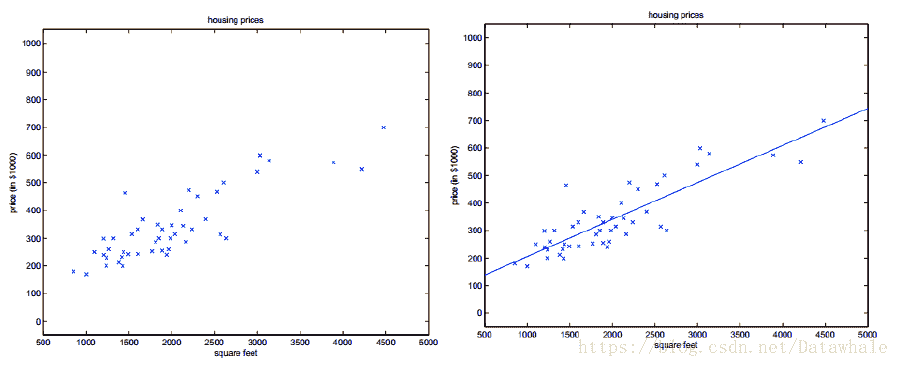

## 通俗描述

线性回归模型是利用线性函数对一个或多个自变量和因变量 （ y ） （y） （y）之间关系进行拟合的模型。

## 公式推导

**数据输入**
给定数据集 D = { ( x 1 , y 1 ) , ( x 2 , y 2 ) , … , ( x m , y m ) } ， y i ∈ R D=\{(x_1,y_1),(x_2,y_2),…,(x_m,y_m)\}，y_i\in R D={(x1​,y1​),(x2​,y2​),…,(xm​,ym​)}，yi​∈R
**1）一元线性回归**：当 x i x_i xi​只有一个特征值， x i = ( x i 1 ) x_i=(x_{i1}) xi​=(xi1​)

| 原始模型 | f ( x i ) = w x i + b f(x_i)=wx_i+b f(xi​)=wxi​+b |
| --- | --- |
| 性能度量 | 均方误差 ∑ i = 1 m ( f ( x i ) − y i ) 2 \sum\limits_{i=1}^{m}(f(x_i)-y_i)^2 i=1∑m​(f(xi​)−yi​)2 |
| 目标函数 | 求使均方误差最小时的 w , b w,b w,b，即最小二乘法 ( w ∗ , b ∗ ) = a r g m i n ( w , b ) ∑ i = 1 m ( y i − w x i − b ) 2 \\ (w^*,b^*)={argmin \atop (w, b)}\sum\limits_{i=1}^m(y_i - wx_i - b)^2 (w∗,b∗)=(w,b)argmin​i=1∑m​(yi​−wxi​−b)2 |
| 方程求解 | ∂ E ( w , b ) ∂ w = 2 ( w ∑ i = 1 m x i 2 − ∑ i = 1 m ( y i − b ) x i ) = 0 \\\frac{\partial E_{(w,b)} }{\partial w}=2\left(w\sum\limits_{i=1}^{m}x^2_i-\sum\limits_{i=1}^{m}(y_i-b)x_i \right)=0 ∂w∂E(w,b)​​=2(wi=1∑m​xi2​−i=1∑m​(yi​−b)xi​)=0 ∂ E ( w , b ) ∂ b = 2 ( m b − ∑ i = 1 m ( y i − w x i ) ) = 0 \\ \frac{\partial E_{(w,b)} }{\partial b}=2\left(mb-\sum\limits_{i=1}^{m}(y_i-wx_i)\right)=0 ∂b∂E(w,b)​​=2(mb−i=1∑m​(yi​−wxi​))=0 w ∗ = ∑ i = 1 m y i ( x i − x ˉ ) ∑ i = 1 m x i 2 − 1 m ( ∑ i = 1 m x i ) 2 w^*=\frac{\sum\limits_{i=1}^{m}y_i(x_i-\bar x)}{\sum\limits_{i=1}^{m}x_i^2-\frac{1}{m}(\sum\limits_{i=1}^{m}x_i)^2} w∗=i=1∑m​xi2​−m1​(i=1∑m​xi​)2i=1∑m​yi​(xi​−xˉ)​ b ∗ = 1 m ∑ i = 1 m ( y i − w x i ) \\ b^*=\frac{1}{m}\sum\limits_{i=1}^{m}(y_i-wx_i) b∗=m1​i=1∑m​(yi​−wxi​)其中 x ˉ = 1 m ∑ i = 1 m x i \bar x=\frac{1}{m}\sum\limits_{i=1}^{m}x_i xˉ=m1​i=1∑m​xi​ 为 x x x的均值 |
| 模型输出 | f ( x i ) = w ∗ x i + b ∗ f(x_i)=w^{*}x_i+b^* f(xi​)=w∗xi​+b∗ |

**2）多元线性回归**： x i = ( x i 1 , x i 2 , … , x i d ) ， y = ( y 1 , y 2 , … , y m ) x_i=(x_{i1},x_{i2},…,x_{id})，y=(y_1,y_2,…,y_m) xi​=(xi1​,xi2​,…,xid​)，y=(y1​,y2​,…,ym​)

| 原始模型 | f ( x ^ i ) = w ^ T X ， 其 中 X = ( x i T ; 1 ) , w ^ = ( x i ; b ) f(\hat x_i)=\hat w^TX，其中X=(x_i^T;1),\hat w=(x_i;b) f(x^i​)=w^TX，其中X=(xiT​;1),w^=(xi​;b) |
| --- | --- |
| 性能度量 | 均方误差 |
| 目标函数 | w ^ ∗ = a r g m i n w ^ ( y − X w ^ ) T ( y − X w ^ ) \hat w^*={argmin\atop{\hat w}}(y-X\hat w)^{T}(y-X\hat w) w^∗=w^argmin​(y−Xw^)T(y−Xw^) |
| 方程求解 | ∂ E w ^ ∂ w ^ = 2 X T ( X w ^ − y ) = 0 \\\frac{\partial E_{\hat w}}{\partial {\hat w}}=2 X^{T}(X\hat w-y)=0 ∂w^∂Ew^​​=2XT(Xw^−y)=0 w ^ ∗ = ( X T X ) − 1 X T y \hat w^{*}=(X^{T}X)^{-1}X^Ty w^∗=(XTX)−1XTy |
| 模型输出 | f ( x ^ i ) = w ^ ∗ T X f(\hat x_i)={\hat w^*}^TX f(x^i​)=w^∗TX |

## 基本概念

【1】 线性 = 直线？

*   线性函数的定义是：一阶或零阶多项式。特征是一维时，线性模型在二维空间构成一条直线；特征是二维时，线性模型在三维空间中构成一个平面；特征是三维时，则最终模型在四维空间中构成一个体；以此类推…

【2】[最小二乘法](https://blog.csdn.net/iterate7/article/details/78992015)

*   在线性回归中，最小二乘法就是试图找到一条直线，使所有样本到直线的欧式距离最小之后最小。

【3】[最大似然估计](https://blog.csdn.net/ppn029012/article/details/8908104)

*   一种重要而普遍的求估计量的方法。通过调整估计参数，使得已经实现的样本发生概率最大。

【4】[梯度下降法](https://gitbook.cn/gitchat/column/5ad70dea9a722231b25ddbf8/topic/5b19c29485f83d502a1c01a4)

*   从任意点开始，在该点对目标函数求导，沿着导数方向（梯度）“走”（下降）一个给定步长，如此循环迭代，直至“走”到导数为0的位置，则达到极小值。

【5】凸函数

*   对区间 [ a , b ] [a,b] [a,b]上定义的函数 f f f，若它对区间上任意两点 x 1 , x 2 x_1,x_2 x1​,x2​均有 f ( x 1 + x 2 2 ) ≤ f ( x 1 ) + f ( x 2 ) 2 f(\frac{x_1+x_2}{2})\leq \frac{f(x_1)+f(x_2)}{2} f(2x1​+x2​​)≤2f(x1​)+f(x2​)​，则称 f f f是区间 [ a , b ] [a,b] [a,b]上的凸函数。
*   对实数集上的函数，可以通过二阶导数来判别：若二阶导数在区间上非负，则称为凸函数；若二阶导数在区间上恒大于0，则称为严格凸函数。

【6】[线性回归模型评价标准](https://blog.csdn.net/skullFang/article/details/79107127)

*   回归评价指标 MSE(均方误差)、RMSE(均方根误差)、MAE(平均绝对误差)、R-Squared( R 2 R^2 R2)

【7】L1和L2范数

*   [机器学习中正则化项L1和L2的直观理解](https://blog.csdn.net/jinping_shi/article/details/52433975)
*   [机器学习中的范数规则化-L0,L1和L2范式](http://blog.sina.com.cn/s/blog_7103b28a0102w73g.html)

## 算法实践

[算法实践_线性回归](https://blog.csdn.net/Datawhale/article/details/82953863)

## 总结

*   优点：实现简单，计算简单
*   缺点：不能很好地拟合非线性数据
*   应用场景：线性回归简单、易于使用，但是现实生活中数据的特征和目标之间并不是简单的线性组合，所以并不能很好的解决具体问题。所以线性回归常用于数据特征稀疏，并且数据过大的问题中，可以通过线性回归进行特征筛选。在比赛中也可以用线性回归做一个Baseline。

## 问题

1.  线性回归可以进行分类么
2.  线性回归可以做特征选择么
3.  线性回归、Ridge回归（L2范式）、Lasso 回归（L1范式）的区别和适用条件
4.  最小二乘法的算法复杂度怎么分析
5.  线性回归能处理非线性数据么

## 参考

1.  [李烨-机器学习极简入门课](https://gitbook.cn/gitchat/column/5ad70dea9a722231b25ddbf8/topic/5b1db764096f3a3c830eb2b8)
2.  机器学习-周志华
3.  [几个常用算法的适应场景及其优缺点](https://blog.csdn.net/u010159842/article/details/52918815)
4.  [有道云笔记-线性回归](https://note.youdao.com/share/index.html?id=981825c617d47c10f4e0c373e8b7bfff&type=note&from=groupmessage#/)
5.  [https://github.com/Heitao5200/Heitao5200_MachineLearning/blob/master/LR/LinearRegression.md](https://github.com/Heitao5200/Heitao5200_MachineLearning/blob/master/LR/LinearRegression.md)
6.  [https://blog.csdn.net/weixin_41246832/article/details/82916841](https://blog.csdn.net/weixin_41246832/article/details/82916841)