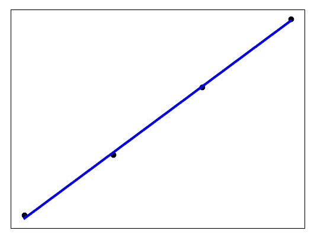

## 参数解释

| sklearn.linear_model.LinearRegression(fit_intercept=True, normalize=False, copy_X=True, n_jobs=None) |
| --- |

| 超参 | 解释 | 类型(默认值) |
| --- | --- | --- |
| fit_intercept | 是否计算模型的截距；如果设置为 False，计算将不使用截距（即：期望数据已经进行了中心化处理) | boolean(True) |
| normalize | 是否将数据归一化；fit_intercept 设置为 False 时，这个参数可以忽略。如果设置为 True，回归之前将通过减去均值并除l2范数进行归一化。如果需要进行标准化，请在调用估计器 normalize=False的 fit 函数之前使用[sklearn.preprocessing.StandardScaler](http://scikit-learn.org/stable/modules/generated/sklearn.preprocessing.StandardScaler.html#sklearn.preprocessing.StandardScaler) | boolean(False) |
| n_jobs | 确定cpu的核数 (None表示1，-1 表示使用所有) | int or None(None) |

| 属性 | 解释 | 类型 |
| --- | --- | --- |
| coef_ | 回归系数(斜率) | array |
| intercept_ | 截距 | array |

| 方法 | 解释 | 类型 |
| --- | --- | --- |
| fit(X, y[, sample_weight]) | 训练模型 | X : array-like or 稀疏矩阵，y : array_like，sample_weight : numpy array |
| predict(X) | 预测 | X : array_like or 稀疏矩阵 |
| score(X, y[, sample_weight]) | [评分指标](https://blog.csdn.net/skullFang/article/details/79107127) R 2 = 1 − ( ∑ i = 1 m ( y ( i ) − y ^ ( i ) ) 2 ) / m ( ∑ i = 1 m ( y ( i ) − y ˉ ) 2 ) / m R^2 = 1 - \frac{(\sum_{i=1}^{m}(y^{(i)} - \hat y^{(i)})^{2})/m}{(\sum_{i=1}^{m}(y^{(i)} - \bar y)^{2})/m} R2=1−(∑i=1m​(y(i)−yˉ​)2)/m(∑i=1m​(y(i)−y^​(i))2)/m​ | float |

## 调包实践

```
 import matplotlib.pyplot as plt
    import numpy as np
    from sklearn import datasets, linear_model
    from sklearn.metrics import mean_squared_error, r2_score

    experiences = np.array([0,1,2,3,4,5,6,7,8,9,10])
    salaries = np.array([103100, 104900, 106800, 108700, 110400, 112300, 114200, 116100, 117800, 119700, 121600])

    # 将特征数据集分为训练集和测试集，除了最后5个作为测试用例，其他都用于训练
    X_train = experiences[:7]
    X_train = X_train.reshape(-1,1)
    X_test = experiences[7:]
    X_test = X_test.reshape(-1,1)

    # 把目标数据（特征对应的真实值）也分为训练集和测试集
    y_train = salaries[:7]
    y_test = salaries[7:]

    # 创建线性回归模型
    regr = linear_model.LinearRegression()

    # 用训练集训练模型——看就这么简单，一行搞定训练过程
    regr.fit(X_train, y_train)

    # 用训练得出的模型进行预测
    diabetes_y_pred = regr.predict(X_test)

    # 将测试结果以图标的方式显示出来
    plt.scatter(X_test, y_test,  color='black')
    plt.plot(X_test, diabetes_y_pred, color='blue', linewidth=3)

    plt.xticks(())
    plt.yticks(())

    plt.show() 
```



## 参考链接

1.  [sklearn.linear_model.LinearRegression](http://scikit-learn.org/stable/modules/generated/sklearn.linear_model.LinearRegression.html)
2.  [李烨-机器学习极简入门课](https://gitbook.cn/gitchat/column/5ad70dea9a722231b25ddbf8/topic/5b1db764096f3a3c830eb2b8)
3.  [https://github.com/Heitao5200/Heitao5200_MachineLearning/blob/master/LR/LinearRegression.md](https://github.com/Heitao5200/Heitao5200_MachineLearning/blob/master/LR/LinearRegression.md)