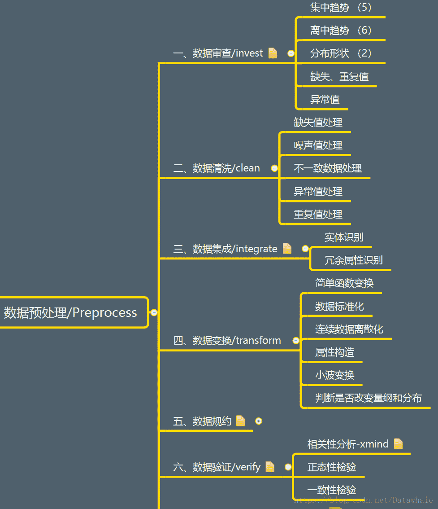

## 特征工程

1.  [Feature-Engineering中文版](https://github.com/apachecn/feature-engineering-for-ml-zh)
2.  [特征学习笔记_Fire](https://github.com/fire717/Machine-Learning/blob/master/other/note/FeatureEngneering.md)
3.  [特征选择](https://blog.csdn.net/shingle_/article/details/51725054)
4.  [缺失值处理](https://blog.csdn.net/Katherine_hsr/article/details/80279963)
5.  数据预处理_林逸飞