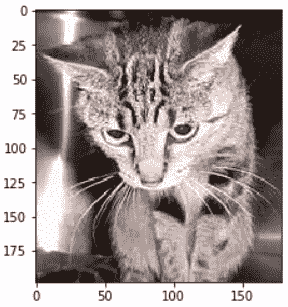

> 原文：[Deep Learning 2: Part 1 Lesson 1](https://medium.com/@hiromi_suenaga/deep-learning-2-part-1-lesson-1-602f73869197)
> 
> 作者：[Hiromi Suenaga](https://medium.com/@hiromi_suenaga)

*   [课程论坛](http://forums.fast.ai/t/wiki-lesson-1/9398/1)

## [](https://github.com/apachecn/fastai-ml-dl-notes-zh/blob/master/zh/dl1.md#%E5%85%A5%E9%97%A8-000)入门 [[0:00](https://youtu.be/IPBSB1HLNLo)]：

*   为了训练神经网络，你肯定需要图形处理单元（GPU） - 特别是 NVIDIA GPU，因为它是唯一支持 CUDA（几乎所有深度学习库和从业者都使用的语言和框架）的设备。
*   租用 GPU 有几种方法：Crestle [[04:06](https://youtu.be/IPBSB1HLNLo%3Ft%3D4m06s)] ，Paperspace [[06:10](https://youtu.be/IPBSB1HLNLo%3Ft%3D6m10s)]

## [](https://github.com/apachecn/fastai-ml-dl-notes-zh/blob/master/zh/dl1.md#jupyter-%E7%AC%94%E8%AE%B0%E6%9C%AC%E5%92%8C%E7%8C%AB%E7%8B%97%E8%AF%86%E5%88%AB%E7%9A%84%E4%BB%8B%E7%BB%8D-1239)[Jupyter 笔记本和猫狗识别的介绍](https://github.com/fastai/fastai/blob/master/courses/dl1/lesson1.ipynb) [[12:39](https://youtu.be/IPBSB1HLNLo%3Ft%3D12m39s)]

*   你可以通过选择它并按下`shift+enter`来运行单元格（你可以按住`shift`并多次按`enter`键来继续下拉单元格），或者你可以单击顶部的“运行”按钮。单元格可以包含代码，文本，图片，视频等。
*   [Fast.ai](http://Fast.ai) 需要 Python 3

```
%reload_ext autoreload  
%autoreload 2  
%matplotlib inline 
```

```
# This file contains all the main external libs we'll use  
from fastai.imports import * 
```

```
from fastai.transforms import *  
from fastai.conv_learner import *  
from fastai.model import *  
from fastai.dataset import *  
from fastai.sgdr import *  
from fastai.plots import * 
```

```
PATH = "data/dogscats/"  
sz=224 
```

先看图片 [[15:39](https://youtu.be/IPBSB1HLNLo%3Ft%3D15m40s)]

```
!ls {PATH} 
```

```
models sample test1 tmp train valid 
```

*   `!`表明使用 bash（shell）而不是 python
*   如果你不熟悉训练集和验证集，请查看 Practical Machine Learning 课程（或阅读 [Rachel 的博客](http://www.fast.ai/2017/11/13/validation-sets/)）

```
!ls {PATH}valid 
```

```
cats dogs 
```

```
files = !ls {PATH}valid/cats | head  files 
```

```
['cat.10016.jpg',  'cat.1001.jpg',  'cat.10026.jpg',  'cat.10048.jpg',  'cat.10050.jpg',  'cat.10064.jpg',  'cat.10071.jpg',  'cat.10091.jpg',  'cat.10103.jpg',  'cat.10104.jpg'] 
```

*   此文件夹结构是共享和提供图像分类数据集的最常用方法。 每个文件夹都会告诉你标签（例如`dogs`或`cats`）。

```
img = plt.imread(f' {PATH} valid/cats/ {files[0]} ')  plt.imshow(img); 
```

[](https://github.com/apachecn/fastai-ml-dl-notes-zh/blob/master/img/1_Uqy-JLzpyZedFNdpm15N2A.png)

*   `f'{PATH}valid/cats/{files[0]}'` - 这是一个 Python 3.6 格式化字符串，可以方便地格式化字符串。

```
img.shape 
```

```
(198, 179, 3) 
```

```
img[:4,:4] 
```

```
array([[[ 29, 20, 23],  [ 31, 22, 25],  [ 34, 25, 28],  [ 37, 28, 31]], 
```

```
[[ 60, 51, 54],  [ 58, 49, 52],  [ 56, 47, 50],  [ 55, 46, 49]], 
```

```
[[ 93, 84, 87],  [ 89, 80, 83],  [ 85, 76, 79],  [ 81, 72, 75]], 
```

```
[[104, 95, 98],  [103, 94, 97],  [102, 93, 96],  [102, 93, 96]]], dtype=uint8) 
```

*   `img`是一个三维数组（又名 3 维张量）
*   这三个维度（例如`[29, 20, 23]`）表示 0 到 255 之间的红绿蓝像素值
*   我们的想法是利用这些数字来预测这些数字是代表猫还是狗，基于查看猫和狗的大量图片。
*   这个数据集来自 [Kaggle 竞赛](https://www.kaggle.com/c/dogs-vs-cats)，当它发布时（早在 2013 年），最先进的技术准确率为 80%。

让我们训练一个模型 [[20:21](https://youtu.be/IPBSB1HLNLo%3Ft%3D20m21s)]

以下是训练模型所需的三行代码：

```
data = ImageClassifierData.from_paths(PATH, tfms=tfms_from_model(resnet34, sz))  
learn = ConvLearner.pretrained(resnet34, data, precompute= True )  
learn.fit (0.01, 3) 
```

```
[ 0\. 0.04955 0.02605 0.98975]  [ 1\. 0.03977 0.02916 0.99219]  [ 2\. 0.03372 0.02929 0.98975] 
```

*   这将执行 3 个迭代，这意味着它将三次查看整个图像集。
*   输出中的三个数字中的最后一个是验证集上的准确度。
*   前两个是训练集和验证集的损失函数值（在这种情况下是交叉熵损失）。
*   开始（例如，`1.`）是迭代数。
*   我们通过 3 行代码在 17 秒内达到了 ~99% （这将在 2013 年赢得 Kaggle 比赛）！[[21:49](https://youtu.be/IPBSB1HLNLo%3Ft%3D21m49s)]
*   很多人都认为深度学习需要大量的时间，大量的资源和大量的数据 - 一般来说，这不是真的！

## [阅读更多](https://github.com/apachecn/fastai-ml-dl-notes-zh/blob/master/zh/dl1.md)