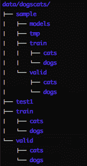
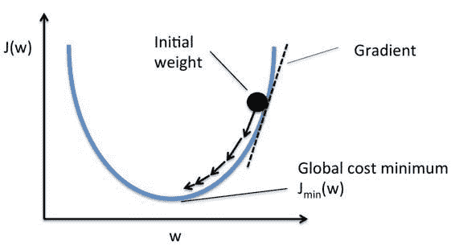

> 原文：[Deep Learning 2: Part 1 Lesson 2](https://medium.com/@hiromi_suenaga/deep-learning-2-part-1-lesson-2-eeae2edd2be4)
> 
> 作者：[Hiromi Suenaga](https://medium.com/@hiromi_suenaga)

*   [论坛](http://forums.fast.ai/t/wiki-lesson-2/9399/1)
*   [笔记本](https://github.com/fastai/fastai/blob/master/courses/dl1/lesson1.ipynb)

## [](https://github.com/apachecn/fastai-ml-dl-notes-zh/blob/master/zh/dl2.md#%E5%9B%9E%E9%A1%BE%E4%B8%8A%E4%B8%80%E8%AF%BE-0102)回顾上一课 [[01:02](https://youtu.be/JNxcznsrRb8%3Ft%3D1m2s)]

*   我们使用 3 行代码来构建图像分类器。
*   为了训练模型，需要在`PATH`下以某种方式组织数据（在本例中为`data/dogscats/` ）：

[](https://github.com/apachecn/fastai-ml-dl-notes-zh/blob/master/img/1_DdsnEeT2DrnAAp_NrHc-jA.png)

*   应该有`train`文件夹和`valid`文件夹，并且在每个文件夹下都有带有分类标签的文件夹（例如本例中的`cats` ），其中包含相应的图像。
*   训练输出： `[epoch #, training loss, validation loss, accuracy]`

```
 [ 0\. 0.04955 0.02605 0.98975] 
```

## [](https://github.com/apachecn/fastai-ml-dl-notes-zh/blob/master/zh/dl2.md#%E5%AD%A6%E4%B9%A0%E7%8E%87-454)学习率 [[4:54](https://youtu.be/JNxcznsrRb8%3Ft%3D4m54s)]

*   学习率的基本思想是，它将决定我们解决方案改进的速度。

[](https://github.com/apachecn/fastai-ml-dl-notes-zh/blob/master/img/1_bl1EuPH_XEGvMcMW6ZloNg.jpeg)

*   如果学习率太小，则需要很长时间才能达到最低点。
*   如果学习率太大，它可能会在底部摆动。
*   学习率查找器（ `learn.lr_find` ）将在每个小批量之后提高学习率。 最终，学习率太高，损失会变得更糟。 然后，我们查看学习率与损失的关系曲线，确定最低点并返回一个幅度，并选择它作为学习率（下例中为`1e-2` ）。
*   小批量是我们每次查看的一组图像，因此我们有效地使用 GPU 的并行处理能力（通常一次 64 或 128 个图像）
*   在 Python 中：

[](https://github.com/apachecn/fastai-ml-dl-notes-zh/blob/master/img/1_3ZW61inLJykJLs0FntGrqA.png)

[](https://github.com/apachecn/fastai-ml-dl-notes-zh/blob/master/img/1_GgOPv2YCx3QOUpCwolFCyA.png)

[](https://github.com/apachecn/fastai-ml-dl-notes-zh/blob/master/img/1_5EdBB9JTXXf-5ccqzDr5Kg.png)

*   通过调整这一个数字，你应该能够获得相当不错的结果。 [fast.ai](http://fast.ai) 库为你选择其余的超参数。 但随着课程的进展，我们将了解到还有一些我们可以调整的东西，可以获得更好的结果。 但学习率是我们设定的关键数字。
*   学习率查找器位于其他优化器（例如动量，Adam 等）的上层，并根据你正在使用的调整（例如高级优化器但不限于优化器）帮助你选择最佳学习率。
*   问题：在迭代期间改变学习率，优化器会发生什么？ 这个查找器是否选择了初始学习率？ [[14:05](https://youtu.be/JNxcznsrRb8%3Ft%3D14m5s)] 我们稍后会详细了解优化器，但基本答案是否定的。 即使 Adam 的学习率也会除以先前的平均梯度以及最近的梯度的平方和。 即使那些所谓的“动态学习率”方法也具有学习率。
*   使模型更好的最重要的事情是，为它提供更多数据。 由于这些模型有数百万个参数，如果你训练它们一段时间，它们就会开始所谓的“过拟合”。
*   过拟合 - 模型开始在训练集中看到图像的具体细节，而不是学习可以传递到验证集的一般内容。
*   我们可以收集更多数据，但另一种简单方法是数据增强。

## [阅读更多](https://github.com/apachecn/fastai-ml-dl-notes-zh/blob/master/zh/dl2.md)