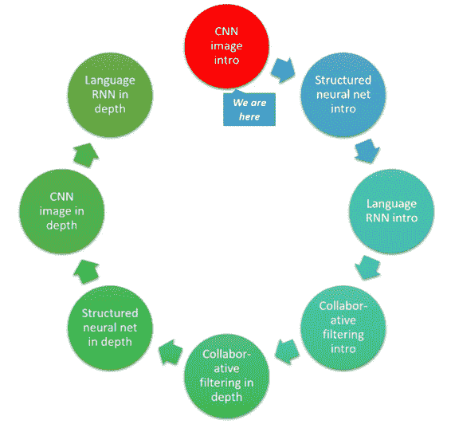
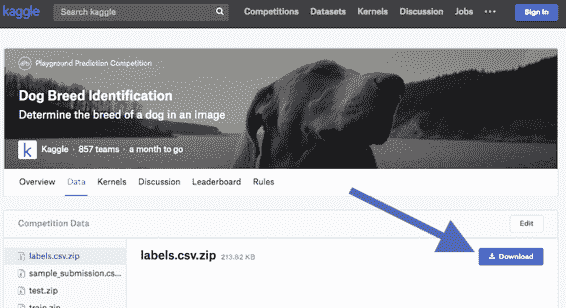
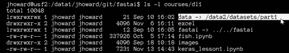
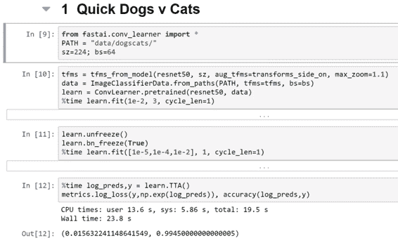

> 原文：[Deep Learning 2: Part 1 Lesson 3](https://medium.com/@hiromi_suenaga/deep-learning-2-part-1-lesson-3-74b0ef79e56)
> 
> 作者：[Hiromi Suenaga](https://medium.com/@hiromi_suenaga)

*   [课程论坛](http://forums.fast.ai/t/wiki-lesson-3/9401/1)

### [](https://github.com/apachecn/fastai-ml-dl-notes-zh/blob/master/zh/dl3.md#%E5%AD%A6%E7%94%9F%E5%88%9B%E5%BB%BA%E7%9A%84%E6%9C%89%E7%94%A8%E6%9D%90%E6%96%99)学生创建的有用材料：

*   [AWS 操作方法](https://github.com/reshamas/fastai_deeplearn_part1/blob/master/tools/aws_ami_gpu_setup.md)
*   [TMUX](https://github.com/reshamas/fastai_deeplearn_part1/blob/master/tools/tmux.md)
*   [第 2 课总结](https://medium.com/%40apiltamang/case-study-a-world-class-image-classifier-for-dogs-and-cats-err-anything-9cf39ee4690e)
*   [学习率查找器](https://towardsdatascience.com/estimating-optimal-learning-rate-for-a-deep-neural-network-ce32f2556ce0)
*   [PyTorch](https://towardsdatascience.com/a-practitioners-guide-to-pytorch-1d0f6a238040)
*   [学习率与批量大小](https://miguel-data-sc.github.io/2017-11-05-first/)
*   [误差表面的平滑区域与泛化](https://medium.com/%40radekosmulski/do-smoother-areas-of-the-error-surface-lead-to-better-generalization-b5f93b9edf5b)
*   [5 分钟搞定卷积神经网络](https://medium.com/%40init_27/convolutional-neural-network-in-5-minutes-8f867eb9ca39)
*   [解码 ResNet 架构](http://teleported.in/posts/decoding-resnet-architecture/)
*   [另一个 ResNet 教程](https://medium.com/%40apiltamang)

### [](https://github.com/apachecn/fastai-ml-dl-notes-zh/blob/master/zh/dl3.md#%E6%88%91%E4%BB%AC%E7%A6%BB%E5%BC%80%E7%9A%84%E5%9C%B0%E6%96%B9)我们离开的地方：

[](https://github.com/apachecn/fastai-ml-dl-notes-zh/blob/master/img/1_w03TpHU-IgKy5GsLuMYxzw.png)

## [](https://github.com/apachecn/fastai-ml-dl-notes-zh/blob/master/zh/dl3.md#%E5%9B%9E%E9%A1%BE-0824-)回顾 [[08:24](https://youtu.be/9C06ZPF8Uuc%3Ft%3D8m24s)] ：

### [](https://github.com/apachecn/fastai-ml-dl-notes-zh/blob/master/zh/dl3.md#kaggle-cli%E5%A6%82%E4%BD%95%E4%B8%8B%E8%BD%BD%E6%95%B0%E6%8D%AE-1)Kaggle CLI：如何下载数据 1：

从 Kaggle 下载时， [Kaggle CLI](https://github.com/floydwch/kaggle-cli) 是一个很好的工具。 因为它从 Kaggle 网站下载数据（通过屏幕抓取），它会在网站更改时损坏。 当发生这种情况时，运行`pip install kaggle-cli --upgrade` 。

然后你可以运行：

```
$ kg download -u <username> -p <password> -c <competition> 
```

将`<username>`，`<password>`替换为你的凭证，`<competition>`是 URL 中的`/c/`。 例如，如果你尝试从`https://www.kaggle.com/c/dog-breed-identification`下载狗品种数据，该命令将如下所示：

```
$ kg download -u john.doe -p mypassword -c dog-breed-identification 
```

确保你曾从计算机上单击过`Download`按钮并接受以下规则：

[](https://github.com/apachecn/fastai-ml-dl-notes-zh/blob/master/img/1_NE_vFqUgrq_ZY-Ez8lYD1Q.png)

### [](https://github.com/apachecn/fastai-ml-dl-notes-zh/blob/master/zh/dl3.md#curwgetchrome-%E6%89%A9%E5%B1%95%E7%A8%8B%E5%BA%8F%E5%A6%82%E4%BD%95%E4%B8%8B%E8%BD%BD%E6%95%B0%E6%8D%AE-2)CurWget（Chrome 扩展程序）：如何下载数据 2：

[](https://chrome.google.com/webstore/detail/curlwget/jmocjfidanebdlinpbcdkcmgdifblncg)

### [](https://github.com/apachecn/fastai-ml-dl-notes-zh/blob/master/zh/dl3.md#%E7%AE%80%E5%8D%95%E7%9A%84%E7%8C%AB%E7%8B%97%E8%AF%86%E5%88%AB-1339)简单的猫狗识别 [[13:39](https://youtu.be/9C06ZPF8Uuc%3Ft%3D13m39s)]

```
from fastai.conv_learner import *  
PATH = 'data/dogscats/'  
sz=224
bs=64 
```

笔记本通常假设你的数据位于`data`文件夹中。 但也许你想把它们放在其他地方。 在这种情况下，你可以使用符号链接（简称`symlink`）：

[](https://github.com/apachecn/fastai-ml-dl-notes-zh/blob/master/img/1_f835x3bUfRPT9pFaqjvutw.png)

这是一个端到端的过程，用于获得猫狗识别的最新结果：

[](https://github.com/apachecn/fastai-ml-dl-notes-zh/blob/master/img/1_ItxElIWV6hU9f_fwEZ9jMQ.png)

简单的猫狗识别

## [阅读更多](https://github.com/apachecn/fastai-ml-dl-notes-zh/blob/master/zh/dl3.md)