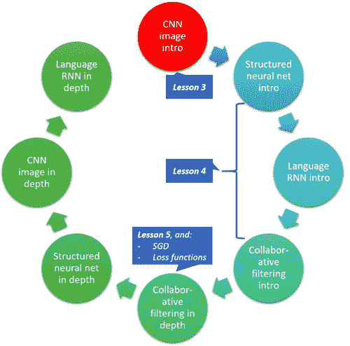
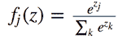

> 原文：[Deep Learning 2: Part 1 Lesson 4](https://medium.com/@hiromi_suenaga/deep-learning-2-part-1-lesson-4-2048a26d58aa)
> 
> 作者：[Hiromi Suenaga](https://medium.com/@hiromi_suenaga)

*   [课程论坛](http://forums.fast.ai/t/wiki-lesson-4/9402/1)

学生的文章：

*   [改善学习率的方式](https://techburst.io/improving-the-way-we-work-with-learning-rate-5e99554f163b)
*   [循环学习率技术](http://teleported.in/posts/cyclic-learning-rate/)
*   [探索带有重启动的随机梯度下降（SGDR）](https://medium.com/38th-street-studios/exploring-stochastic-gradient-descent-with-restarts-sgdr-fa206c38a74e)
*   [使用差异学习率的迁移学习](https://towardsdatascience.com/transfer-learning-using-differential-learning-rates-638455797f00)
*   [让计算机看得比人类更好](https://medium.com/%40ArjunRajkumar/getting-computers-to-see-better-than-humans-346d96634f73)

[](https://github.com/apachecn/fastai-ml-dl-notes-zh/blob/master/img/1_D0WqPCX7RfOL47TOEfkzYg.png)

### [](https://github.com/apachecn/fastai-ml-dl-notes-zh/blob/master/zh/dl4.md#dropout-0459)Dropout [04:59]

```
learn = ConvLearner.pretrained(arch, data, ps=0.5, precompute=True) 
```

*   `precompute=True` ：预计算来自最后一个卷积层的激活。 请记住，激活是一个数字，它是根据构成内核/过滤器的一些权重/参数计算出来的，它们会应用于上一层的激活或输入。

```
learn 
```

```
Sequential(
  (0): BatchNorm1d(1024, eps=1e-05, momentum=0.1, affine=True)
  (1): Dropout(p=0.5)
  (2): Linear(in_features=1024, out_features=512)
  (3): ReLU()
  (4): BatchNorm1d(512, eps=1e-05, momentum=0.1, affine=True)
  (5): Dropout(p=0.5)
  (6): Linear(in_features=512, out_features=120)
  (7): LogSoftmax()
) 
```

`learn` - 这将显示我们最后添加的层。 这些是我们在`precompute=True`时训练的层

（0），（4）： `BatchNorm`将在上一课中介绍

（1），（5）：`Dropout`

（2）： `Linear`层仅仅是矩阵乘法。 这是一个包含 1024 行和 512 列的矩阵，因此它将接受 1024 个激活并输出 512 个激活。

（3）： `ReLU` - 只是用零替换负数

（6）： `Linear` - 第二个线性层，从前一个线性层获取 512 个激活并将它们乘以 512 乘 120 的新矩阵并输出 120 个激活

（7）： `Softmax` - 激活函数，返回最大为 1 的数字，每个数字在 0 和 1 之间：

[](https://github.com/apachecn/fastai-ml-dl-notes-zh/blob/master/img/1_PNRoFZeNc0DfGyqsq-S7sA.png)

出于较小的数值精度原因，事实证明最好直接使用 softmax 的 log 而不是 softmax [[15:03](https://youtu.be/gbceqO8PpBg%3Ft%3D15m3s)]。这就是为什么当我们从模型中得到预测时，我们必须执行`np.exp(log_preds)`。

## [阅读更多](https://github.com/apachecn/fastai-ml-dl-notes-zh/blob/master/zh/dl4.md)