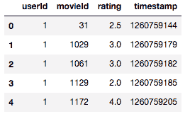
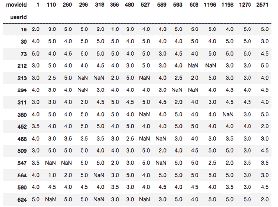
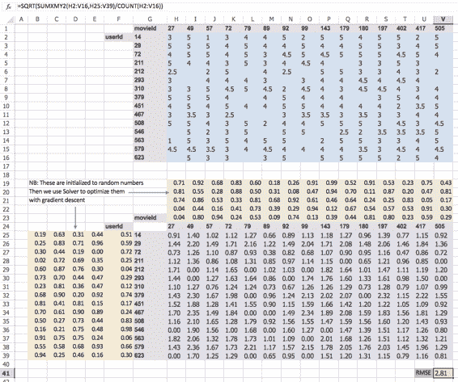
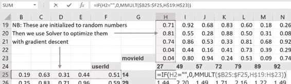

> 原文：[Deep Learning 2: Part 1 Lesson 5](https://medium.com/@hiromi_suenaga/deep-learning-2-part-1-lesson-5-dd904506bee8)
> 
> 作者：[Hiromi Suenaga](https://medium.com/@hiromi_suenaga)

*   [课程论坛](http://forums.fast.ai/t/wiki-lesson-5/9403)

## [](https://github.com/apachecn/fastai-ml-dl-notes-zh/blob/master/zh/dl5.md#%E4%B8%80%E5%BC%95%E8%A8%80)一，引言

没有足够的关于结构化深度学习的出版物，但它肯定出现在行业中：

[结构化深度学习](https://towardsdatascience.com/structured-deep-learning-b8ca4138b848)，作者：Kerem Turgutlu @datascience.com

你可以使用[此工具](https://github.com/hardikvasa/google-images-download)从 Google 下载图片并解决自己的问题：

[小型图像数据集的乐趣（第2部分）](https://towardsdatascience.com/fun-with-small-image-data-sets-part-2-54d683ca8c96)，作者：Nikhil B @datascience.com

如何训练神经网络的介绍（一篇伟大的技术写作）：

[我们如何“训练”神经网络？](https://towardsdatascience.com/how-do-we-train-neural-networks-edd985562b73)，由 Vitaly Bushaev @datascience.com

学生们在 [Kaggle 幼苗分类比赛](https://www.kaggle.com/c/plant-seedlings-classification/leaderboard)中与 Jeremy 竞争。

## [](https://github.com/apachecn/fastai-ml-dl-notes-zh/blob/master/zh/dl5.md#ii-%E5%8D%8F%E5%90%8C%E8%BF%87%E6%BB%A4---%E4%BD%BF%E7%94%A8-movielens-%E6%95%B0%E6%8D%AE%E9%9B%86)II. 协同过滤 - 使用 MovieLens 数据集

讨论的笔记本可以在[这里](https://github.com/fastai/fastai/blob/master/courses/dl1/lesson5-movielens.ipynb)找到（`lesson5-movielens.ipynb`）。

我们来看看数据。 我们将使用`userId` （类别）， `movieId` （类别）和`rating`（因变量）进行建模。

```
ratings = pd.read_csv(path+'ratings.csv')
ratings.head() 
```

[](https://github.com/apachecn/fastai-ml-dl-notes-zh/blob/master/img/1_p-154IwDcs32F5_betEmEw.png)

### [](https://github.com/apachecn/fastai-ml-dl-notes-zh/blob/master/zh/dl5.md#%E4%B8%BA-excel-%E5%88%9B%E5%BB%BA%E5%AD%90%E9%9B%86)为 Excel 创建子集

我们创建了最受欢迎的电影和大多数电影狂热粉的交叉表，我们将其复制到 Excel 中进行可视化。

```
g=ratings.groupby('userId')['rating'].count()  
topUsers=g.sort_values(ascending=False)[:15] 
```

```
g=ratings.groupby('movieId')['rating'].count()  
topMovies=g.sort_values(ascending=False)[:15] 
```

```
top_r = ratings.join(topUsers, rsuffix='_r', how='inner', on='userId')
top_r = top_r.join(topMovies, rsuffix='_r', how='inner', on='movieId') 
```

```
pd.crosstab(top_r.userId, top_r.movieId, top_r.rating, aggfunc=np.sum) 
```

[](https://github.com/apachecn/fastai-ml-dl-notes-zh/blob/master/img/1_QO-Doqw_0YGOU-vmI-R5CA.png)

[这](https://github.com/fastai/fastai/blob/master/courses/dl1/excel/collab_filter.xlsx)是包含上述信息的 excel 文件。 首先，我们将使用矩阵分解而不构建神经网络。

[](https://github.com/apachecn/fastai-ml-dl-notes-zh/blob/master/img/1_ps-Mq2y88JBT3JsKBh-sKQ.png)

*   蓝色单元格 - 实际评级
*   紫色单元格 - 我们的预测
*   红色单元格 - 我们的损失函数即均方根误差（RMSE）
*   绿色单元格 - 电影嵌入（随机初始化）
*   橙色单元格 - 用户嵌入（随机初始化）

每个预测是电影嵌入向量和用户嵌入向量的点积。 在线性代数术语中，它等于矩阵乘积，因为一个是行，一个是列。 如果没有实际评级，我们将预测设置为零（将其视为测试数据 - 而不是训练数据）。

[](https://github.com/apachecn/fastai-ml-dl-notes-zh/blob/master/img/1_2SeWMcKe9VCLkVQVuCvU8g.png)

然后我们使用梯度下降来减少损失。 Microsoft Excel 在加载项中有一个“求解器”，可以通过更改所选单元格来最小化变量（`GRG Nonlinear`是你要使用的方法）。

这可称为“浅学习”（与深度学习相反），因为没有非线性层或第二线性层。 那么我们直觉上做了什么呢？ 每部电影的五个数字称为“嵌入”（潜在因式） - 第一个数字可能代表科幻和幻想的程度，第二个数字可能是电影使用了多少特效，第三个可能是对话驱动的程度。与之类似，每个用户还有 5 个数字，例如，表示用户喜欢幻想，特效和对话驱动的电影的程度。 我们的预测是这些向量的叉乘。 由于我们没有每个用户的每个电影评论，因此我们试图找出哪些电影与这部电影相似，以及其他用户评价其他电影，如何与这个用户评价这个电影类似（因此称为“协同”）。

我们如何处理新用户或新电影 - 我们是否需要重新训练模型？ 我们现在没有时间来讨论这个问题，但基本上你需要有一个新的用户模型或最初会使用的新电影模型，随着时间的推移你需要重新训练模型。

## [阅读更多](https://github.com/apachecn/fastai-ml-dl-notes-zh/blob/master/zh/dl5.md)