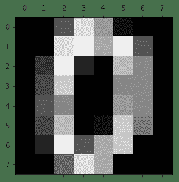
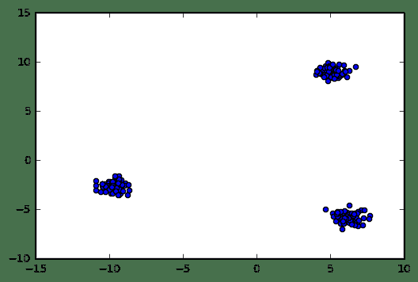

# 二、数据准备

> 作者：[Chris Albon](https://chrisalbon.com/)
> 
> 译者：[飞龙](https://github.com/)
> 
> 协议：[CC BY-NC-SA 4.0](http://creativecommons.org/licenses/by-nc-sa/4.0/)

## 从字典加载特征

```
from sklearn.feature_extraction import DictVectorizer

staff = [{'name': 'Steve Miller', 'age': 33.},
         {'name': 'Lyndon Jones', 'age': 12.},
         {'name': 'Baxter Morth', 'age': 18.}]

# 为我们的字典向量化器创建对象
vec = DictVectorizer()

# 之后将 staff 字典转换为向量，并输出数组
vec.fit_transform(staff).toarray()

'''
array([[ 33.,   0.,   0.,   1.],
       [ 12.,   0.,   1.,   0.],
       [ 18.,   1.,   0.,   0.]]) 
'''

# 获取特征名称
vec.get_feature_names()

# ['age', 'name=Baxter Morth', 'name=Lyndon Jones', 'name=Steve Miller'] 
```

## 加载 scikit-learn 的波士顿住房数据集

```
# 加载库
from sklearn import datasets
import matplotlib.pyplot as plt 
```

## 加载波士顿住房数据集

[波士顿住房数据集](http://www.cs.toronto.edu/~delve/data/boston/bostonDetail.html) 是 20 世纪 70 年代的着名数据集。 它包含506个关于波士顿周边房价的观测。 它通常用于回归示例，包含 15 个特征。

```
# 加载数据集
boston = datasets.load_boston()

# 创建特征矩阵
X = boston.data

# 创建目标向量
y = boston.target

# 查看第一个观测的特征值
X[0]

'''
array([  6.32000000e-03,   1.80000000e+01,   2.31000000e+00,
         0.00000000e+00,   5.38000000e-01,   6.57500000e+00,
         6.52000000e+01,   4.09000000e+00,   1.00000000e+00,
         2.96000000e+02,   1.53000000e+01,   3.96900000e+02,
         4.98000000e+00]) 
''' 
```

如您所见，特征未标准化。 如果我们将值显示为小数，则更容易看到：

```
# 将第一个观测的每个特征值展示为浮点
['{:f}'.format(x) for x in X[0]]

'''
['0.006320',
 '18.000000',
 '2.310000',
 '0.000000',
 '0.538000',
 '6.575000',
 '65.200000',
 '4.090000',
 '1.000000',
 '296.000000',
 '15.300000',
 '396.900000',
 '4.980000'] 
''' 
```

因此，标准化的特征值通常是有益的和/或需要的。

## 加载 scikit-learn 的数字数据集

```
# 加载库
from sklearn import datasets
import matplotlib.pyplot as plt 
```

数字是手写数字的数据集。 每个特征是 8×8 图像的一个像素的强度。

```
# 加载数字数据集
digits = datasets.load_digits()

# 创建特征矩阵
X = digits.data

# 创建目标向量
y = digits.target

# 查看第一个观测的特征值
X[0]

'''
array([  0.,   0.,   5.,  13.,   9.,   1.,   0.,   0.,   0.,   0.,  13.,
        15.,  10.,  15.,   5.,   0.,   0.,   3.,  15.,   2.,   0.,  11.,
         8.,   0.,   0.,   4.,  12.,   0.,   0.,   8.,   8.,   0.,   0.,
         5.,   8.,   0.,   0.,   9.,   8.,   0.,   0.,   4.,  11.,   0.,
         1.,  12.,   7.,   0.,   0.,   2.,  14.,   5.,  10.,  12.,   0.,
         0.,   0.,   0.,   6.,  13.,  10.,   0.,   0.,   0.]) 
''' 
```

观测的特征值展示为向量。 但是，通过使用`images`方法，我们可以将相同的特征值加载为矩阵，然后可视化实际的手写字符：

```
# 将第一个观测的特征作为矩阵查看
digits.images[0]

'''
array([[  0.,   0.,   5.,  13.,   9.,   1.,   0.,   0.],
       [  0.,   0.,  13.,  15.,  10.,  15.,   5.,   0.],
       [  0.,   3.,  15.,   2.,   0.,  11.,   8.,   0.],
       [  0.,   4.,  12.,   0.,   0.,   8.,   8.,   0.],
       [  0.,   5.,   8.,   0.,   0.,   9.,   8.,   0.],
       [  0.,   4.,  11.,   0.,   1.,  12.,   7.,   0.],
       [  0.,   2.,  14.,   5.,  10.,  12.,   0.,   0.],
       [  0.,   0.,   6.,  13.,  10.,   0.,   0.,   0.]]) 
'''

# 将第一个观测的特征作为图像可视化
plt.gray() 
plt.matshow(digits.images[0]) 
plt.show()

# <matplotlib.figure.Figure at 0x1068494a8> 
```



## 加载 scikit-learn 的鸢尾花数据集

```
# 加载库
from sklearn import datasets
import matplotlib.pyplot as plt 
```

The [Iris flower dataset](https://en.wikipedia.org/wiki/Iris_flower_data_set) is one of the most famous databases for classification. It contains three classes (i.e. three species of flowers) with 50 observations per class.

```
# 加载数字数据集
iris = datasets.load_iris()

# 创建特征矩阵
X = iris.data

# 创建目标向量
y = iris.target

# 查看第一个观测的特征值
X[0]

# array([ 5.1,  3.5,  1.4,  0.2]) 
```

## 为分类制作模拟数据

```
from sklearn.datasets import make_classification
import pandas as pd

# 创建模拟的特征矩阵和输出向量，带有 100 个样本，
features, output = make_classification(n_samples = 100,
                                       # 十个特征
                                       n_features = 10,
                                       # 五个实际预测输出分类的特征，
                                       n_informative = 5,
                                       # 五个随机特征，和输出分类无关，
                                       n_redundant = 5,
                                       # 三个输出分类
                                       n_classes = 3,
                                       # 第一类有 20% 的观测，第二类有 30%，
                                       # 第三类有 50%，'None' 表示均衡分类。
                                       weights = [.2, .3, .8])

# 查看前五个管泽志和它们的 10 个特征
pd.DataFrame(features).head() 
```

|  | 0 | 1 | 2 | 3 | 4 | 5 | 6 | 7 | 8 | 9 |
| --- | --- | --- | --- | --- | --- | --- | --- | --- | --- | --- |
| 0 | -1.338796 | 2.218025 | 3.333541 | 2.586772 | -2.050240 | -5.289060 | 4.364050 | 3.010074 | 3.073564 | 0.827317 |
| 1 | 1.535519 | 1.964163 | -0.053789 | 0.610150 | -4.256450 | -6.044707 | 7.617702 | 4.654903 | 0.632368 | 3.234648 |
| 2 | 0.249576 | -4.051890 | -4.578764 | -1.629710 | 2.188123 | 1.488968 | -1.977744 | -2.888737 | -4.957220 | 3.599833 |
| 3 | 3.778789 | -4.797895 | -1.187821 | 0.724315 | 1.083952 | 0.165924 | -0.352818 | 0.615942 | -4.392519 | 1.683278 |
| 4 | 0.856266 | 0.568888 | -0.520666 | -1.970701 | 0.597743 | 2.224923 | 0.065515 | 0.250906 | -1.512495 | -0.859869 |

```
# 查看前五个观测的分类
pd.DataFrame(output).head() 
```

|  | 0 |
| --- | --- |
| 0 | 2 |
| 1 | 2 |
| 2 | 1 |
| 3 | 2 |
| 4 | 2 |

## 为矩阵生成模拟数据

```
from sklearn.datasets import make_blobs
import matplotlib.pyplot as plt

# 生成特征（X）和输出（Y），带有 200 个样本，
X, y = make_blobs(n_samples = 200,
                  # 两个特征，
                  n_features = 2,
                  # 三个簇，
                  centers = 3,
                  # .5 的簇内标准差，
                  cluster_std = 0.5,
                  # 并打乱。
                  shuffle = True)

# 创建前两个特征的散点图
plt.scatter(X[:,0],
            X[:,1])

# 展示散点图
plt.show() 
```



## 为回归制作模拟数据

```
import pandas as pd
from sklearn.datasets import make_regression

# 生成特征，输出和真实的相关度，样本为 100，
features, output, coef = make_regression(n_samples = 100,
                                         # 三个特征，
                                         n_features = 3,
                                         # 只有两个特征是有用的，
                                         n_informative = 2,
                                         # 每个观测有一个目标值，
                                         n_targets = 1,
                                         # 高斯噪声的标准差为 0.0，
                                         noise = 0.0,
                                         # 展示用于生成数据的真实相关度。
                                         coef = True)

# 查看前五行的特征
pd.DataFrame(features, columns=['Store 1', 'Store 2', 'Store 3']).head() 
```

|  | Store 1 | Store 2 | Store 3 |
| --- | --- | --- | --- |
| 0 | -0.166697 | -0.177142 | -2.329568 |
| 1 | -0.093566 | -0.544292 | 0.685165 |
| 2 | 0.625958 | -0.193049 | 1.168012 |
| 3 | -0.843925 | -0.567444 | -0.193631 |
| 4 | -1.079227 | -0.819236 | 1.609171 |

```
# 查看前五行的输出
pd.DataFrame(output, columns=['Sales']).head() 
```

|  | Sales |
| --- | --- |
| 0 | -149.387162 |
| 1 | -4.164344 |
| 2 | 52.166904 |
| 3 | -56.996180 |
| 4 | 27.246575 |

```
# 查看用于生成数据的真实相关度
pd.DataFrame(coef, columns=['True Coefficient Values']) 
```

|  | True Coefficient Values |
| --- | --- |
| 0 | 0.000000 |
| 1 | 80.654346 |
| 2 | 57.993548 |

# Scikit 中的感知机

感知机学习器是最早的机器学习技术之一，并且仍然是许多现代神经网络的基础。 在本教程中，我们使用感知器学习器来分类[经典的鸢尾花数据集](https://en.wikipedia.org/wiki/Iris_flower_data_set)。这个教程受 [Sebastian Raschka 的 Python 机器学习](http://amzn.to/2iyMbpA)的启发。

```
# 加载所需的库
from sklearn import datasets
from sklearn.preprocessing import StandardScaler
from sklearn.linear_model import Perceptron
from sklearn.model_selection import train_test_split
from sklearn.metrics import accuracy_score
import numpy as np

# 加载鸢尾花数据集
iris = datasets.load_iris()

# 创建 X 和 y 数据
X = iris.data
y = iris.target

# 查看 y 数据的前五个观测
y[:5]

# array([0, 0, 0, 0, 0]) 

# 查看 x 数据的前五个观测
# 注意有四个独立变量（特征）
X[:5]

'''
array([[ 5.1,  3.5,  1.4,  0.2],
       [ 4.9,  3\. ,  1.4,  0.2],
       [ 4.7,  3.2,  1.3,  0.2],
       [ 4.6,  3.1,  1.5,  0.2],
       [ 5\. ,  3.6,  1.4,  0.2]]) 
'''

# 将数据分割为 70% 训练集和 30% 测试集
X_train, X_test, y_train, y_test = train_test_split(X, y, test_size=0.3)

# 训练缩放器，将所有特征标准化为均值为 0 和标准差为 1。
sc = StandardScaler()
sc.fit(X_train)

# StandardScaler(copy=True, with_mean=True, with_std=True) 

# 对 X 训练数据引用缩放器
X_train_std = sc.transform(X_train)

# 对 X 测试数据应用相同的缩放器
X_test_std = sc.transform(X_test)

# 创建感知机对象，参数为，40 个迭代，0.1 的学习率
ppn = Perceptron(n_iter=40, eta0=0.1, random_state=0)

# 训练感知机
ppn.fit(X_train_std, y_train)

'''
Perceptron(alpha=0.0001, class_weight=None, eta0=0.1, fit_intercept=True,
      n_iter=40, n_jobs=1, penalty=None, random_state=0, shuffle=True,
      verbose=0, warm_start=False) 
'''

# 在 X 数据上应用已训练的感知机，来对 y 测试数据做预测
y_pred = ppn.predict(X_test_std)

# 查看预测的 y 测试数据
y_pred

'''
array([0, 0, 0, 0, 0, 0, 2, 2, 0, 0, 0, 1, 1, 0, 2, 2, 2, 0, 0, 0, 0, 0, 2,
       2, 1, 0, 0, 2, 1, 0, 0, 0, 0, 2, 1, 0, 2, 0, 2, 0, 2, 0, 2, 0, 1]) 
'''

# 查看真实的 y 测试数据
y_test

'''
array([0, 0, 0, 1, 0, 0, 2, 2, 0, 0, 1, 1, 1, 0, 2, 2, 2, 1, 0, 0, 0, 0, 2,
       2, 1, 1, 0, 2, 1, 1, 1, 0, 0, 2, 1, 0, 2, 0, 2, 0, 2, 0, 2, 0, 1]) 
'''

# 查看模型准确率，它是：1 -（预测错的观测 / 总观测）
print('Accuracy: %.2f' % accuracy_score(y_test, y_pred))

# Accuracy: 0.87 
```

# 保存机器学习模型

在 scikit 中，有两种方式来保存模型以便将来使用：pickle 字符串和作为文件的 pickled 模型。

```
from sklearn.linear_model import LogisticRegression
from sklearn import datasets
import pickle
from sklearn.externals import joblib

# 加载鸢尾花数据
iris = datasets.load_iris()

# 创建特征矩阵 X，和向量 y
X, y = iris.data, iris.target

# 训练原始的 logistic 回归模型
clf = LogisticRegression(random_state=0)
clf.fit(X, y) 

'''
LogisticRegression(C=1.0, class_weight=None, dual=False, fit_intercept=True,
          intercept_scaling=1, max_iter=100, multi_class='ovr', n_jobs=1,
          penalty='l2', random_state=0, solver='liblinear', tol=0.0001,
          verbose=0, warm_start=False) 
'''

# 将已训练的模型保存为 pickle 字符串
saved_model = pickle.dumps(clf)

# 查看 pickled 模型
saved_model

# b'\x80\x03csklearn.linear_model.logistic\nLogisticRegression\nq\x00)\x81q\x01}q\x02(X\x07\x00\x00\x00penaltyq\x03X\x02\x00\x00\x00l2q\x04X\x0b\x00\x00\x00multi_classq\x05X\x03\x00\x00\x00ovrq\x06X\x08\x00\x00\x00max_iterq\x07KdX\x08\x00\x00\x00classes_q\x08cnumpy.core.multiarray\n_reconstruct\nq\tcnumpy\nndarray\nq\nK\x00\x85q\x0bC\x01bq\x0c\x87q\rRq\x0e(K\x01K\x03\x85q\x0fcnumpy\ndtype\nq\x10X\x02\x00\x00\x00i8q\x11K\x00K\x01\x87q\x12Rq\x13(K\x03X\x01\x00\x00\x00<q\x14NNNJ\xff\xff\xff\xffJ\xff\xff\xff\xffK\x00tq\x15b\x89C\x18\x00\x00\x00\x00\x00\x00\x00\x00\x01\x00\x00\x00\x00\x00\x00\x00\x02\x00\x00\x00\x00\x00\x00\x00q\x16tq\x17bX\x07\x00\x00\x00n_iter_q\x18h\th\nK\x00\x85q\x19h\x0c\x87q\x1aRq\x1b(K\x01K\x01\x85q\x1ch\x10X\x02\x00\x00\x00i4q\x1dK\x00K\x01\x87q\x1eRq\x1f(K\x03h\x14NNNJ\xff\xff\xff\xffJ\xff\xff\xff\xffK\x00tq b\x89C\x04\x07\x00\x00\x00q!tq"bX\x06\x00\x00\x00n_jobsq#K\x01X\x11\x00\x00\x00intercept_scalingq$K\x01X\x03\x00\x00\x00tolq%G?\x1a6\xe2\xeb\x1cC-X\x07\x00\x00\x00verboseq&K\x00X\x04\x00\x00\x00dualq\'\x89X\x0c\x00\x00\x00random_stateq(K\x00X\x05\x00\x00\x00coef_q)h\th\nK\x00\x85q*h\x0c\x87q+Rq,(K\x01K\x03K\x04\x86q-h\x10X\x02\x00\x00\x00f8q.K\x00K\x01\x87q/Rq0(K\x03h\x14NNNJ\xff\xff\xff\xffJ\xff\xff\xff\xffK\x00tq1b\x88C`\x9a\x1c\x904+\x8f\xda?v5\xf6\x7f9\xaa\xda?FVL\xe5\x05R\xfb\xbf\xf6\xad\xd9^ya\xf7?\x89\x86\x10B\x03\x9d\xf9\xbf\x7f\xa7x\xf5\\\x8c\xf8\xbf\x8b$8y\xdd\x18\x02\xc0\xac\x8f\xee\xd9+|\xe2?\\\x10\xf2\xcc\x8c\xc4\[[email protected]](/cdn-cgi/l/email-protection)\xda\xb0;l,w\xf0\xbf8_\xe7W*+\xf6\xbf\xefT`-lq\[[email protected]](/cdn-cgi/l/email-protection)\n\x00\x00\x00intercept_q4h\th\nK\x00\x85q5h\x0c\x87q6Rq7(K\x01K\x03\x85q8h0\x89C\x18\xd4\x86D\x03\xb1\xff\xd0?\xa2\xcc=I\xe5]\xf1?\x84\'\xad\x8dxo\xf3\xbfq9tq:bX\n\x00\x00\x00warm_startq;\x89X\x01\x00\x00\x00Cq<G?\xf0\x00\x00\x00\x00\x00\x00X\r\x00\x00\x00fit_interceptq=\x88X\x06\x00\x00\x00solverq>X\t\x00\x00\x00liblinearq?X\x0c\x00\x00\[[email protected]](/cdn-cgi/l/email-protection)' 

# 加载 pickled 模型
clf_from_pickle = pickle.loads(saved_model)

# 使用加载的 pickled 模型来做预测
clf_from_pickle.predict(X)

'''
array([0, 0, 0, 0, 0, 0, 0, 0, 0, 0, 0, 0, 0, 0, 0, 0, 0, 0, 0, 0, 0, 0, 0,
       0, 0, 0, 0, 0, 0, 0, 0, 0, 0, 0, 0, 0, 0, 0, 0, 0, 0, 0, 0, 0, 0, 0,
       0, 0, 0, 0, 1, 1, 1, 1, 1, 1, 1, 1, 1, 1, 1, 1, 1, 1, 1, 1, 2, 1, 1,
       1, 2, 1, 1, 1, 1, 1, 1, 1, 1, 1, 1, 1, 1, 2, 2, 2, 1, 1, 1, 1, 1, 1,
       1, 1, 1, 1, 1, 1, 1, 1, 2, 2, 2, 2, 2, 2, 2, 2, 2, 2, 2, 2, 2, 2, 2,
       2, 2, 2, 2, 2, 2, 2, 2, 2, 2, 2, 2, 2, 2, 1, 2, 2, 2, 2, 2, 2, 2, 2,
       2, 2, 2, 2, 2, 2, 2, 2, 2, 2, 2, 2]) 
'''

# 将模型作为 pickle 保存到文件
joblib.dump(clf, 'filename.pkl') 

'''
['filename.pkl',
 'filename.pkl_01.npy',
 'filename.pkl_02.npy',
 'filename.pkl_03.npy',
 'filename.pkl_04.npy'] 
'''

# 从文件加载模型
clf_from_joblib = joblib.load('filename.pkl') 

# 使用加载的模型做预测
clf_from_joblib.predict(X)

'''
array([0, 0, 0, 0, 0, 0, 0, 0, 0, 0, 0, 0, 0, 0, 0, 0, 0, 0, 0, 0, 0, 0, 0,
       0, 0, 0, 0, 0, 0, 0, 0, 0, 0, 0, 0, 0, 0, 0, 0, 0, 0, 0, 0, 0, 0, 0,
       0, 0, 0, 0, 1, 1, 1, 1, 1, 1, 1, 1, 1, 1, 1, 1, 1, 1, 1, 1, 2, 1, 1,
       1, 2, 1, 1, 1, 1, 1, 1, 1, 1, 1, 1, 1, 1, 2, 2, 2, 1, 1, 1, 1, 1, 1,
       1, 1, 1, 1, 1, 1, 1, 1, 2, 2, 2, 2, 2, 2, 2, 2, 2, 2, 2, 2, 2, 2, 2,
       2, 2, 2, 2, 2, 2, 2, 2, 2, 2, 2, 2, 2, 2, 1, 2, 2, 2, 2, 2, 2, 2, 2,
       2, 2, 2, 2, 2, 2, 2, 2, 2, 2, 2, 2]) 
''' 
```