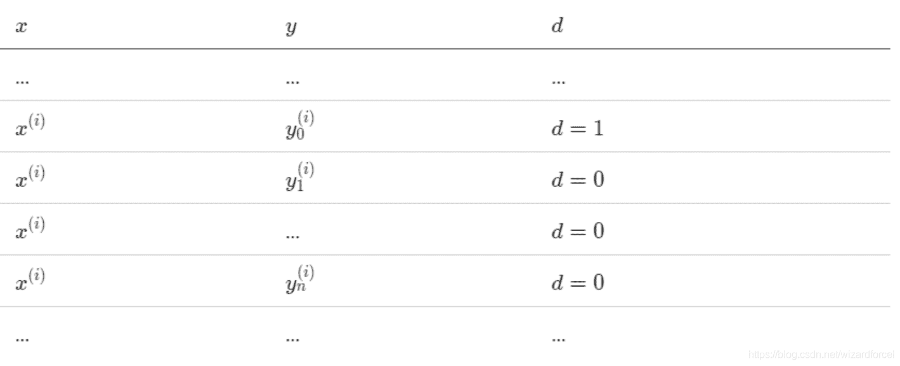

> 本来不想先写这篇的，有个任务要用到，就花了一天时间弄清楚，然后总觉得要写点什么，就写了。

## NCE（噪声对比估计）

负采样可以看成 NCE 的特化，所以有必要先讲一下 NCE。

在 Softmax 回归中，样本属于某个分类的概率是：

P ( y = k ∣ x ) = exp ⁡ ( w k T x + b k ) ∑ j e x p ( w j T x + b j ) &ThinSpace; = exp ⁡ ( w k T x + b k ) Z P(y=k|x) = \frac{\exp(w_k^T x + b_k)}{\sum_j exp(w_j^T x + b_j)} \\ \, \\ = \frac{\exp(w_k^T x + b_k)}{Z} P(y=k∣x)=∑j​exp(wjT​x+bj​)exp(wkT​x+bk​)​=Zexp(wkT​x+bk​)​

也就是说，要计算它属于某个分类的概率，就要把所有分类的概率都计算出来。有的时候算力计算一个是够的，但不够计算这么多。

NCE 的想法很简洁，把多分类变成二分类，还用相同的参数。

我们需要在数据集上采样。对于每个样本，它的特征为 x x x，选取它所属的类别 y 0 y_0 y0​，并根据某个分布 N ( y ) N(y) N(y) 选取 n n n 个其它类别 y 1 . . . y n y_1 ... y_n y1​...yn​。然后把每个 ( x , y i ) (x, y_i) (x,yi​) 当做新样本的特征。

然后给每个新样本一个标签 d d d，如果 x x x 属于 y i y_i yi​，那么 d = 1 d = 1 d=1，否则 d = 0 d = 0 d=0。

然后整个问题就变成了优化 P ( d = 1 ∣ y , x ) P(d = 1| y, x) P(d=1∣y,x)。

> 注：这里把 y = k y=k y=k 省略为 y y y，下同。

我们观察到，在新的数据集中，如果我们选取 d = 1 d = 1 d=1 的样本，它们的 x , y x, y x,y 和原始样本一样。也就是：

P ( y ∣ x , d = 1 ) = P 0 ( y ∣ x ) P(y | x, d = 1) = P_0(y | x) P(y∣x,d=1)=P0​(y∣x)

为了避免混淆，把原数据集上的那个函数加了个下标 0。

如果我们选取 d = 0 d = 0 d=0 的样本，它们的 y y y 就是分布 N ( y ) N(y) N(y)。

P ( y ∣ x , d = 0 ) = N ( y ) P(y | x, d = 0) = N(y) P(y∣x,d=0)=N(y)

还有，对于每个 x x x， d d d 总会有一个 1 和 n n n 个 0。

P ( d = 1 ∣ x ) = 1 n + 1 &ThinSpace; P ( d = 0 ∣ x ) = n x + 1 P(d = 1 | x) = \frac{1}{n + 1} \\ \, \\ P(d = 0 | x) = \frac{n}{x + 1} P(d=1∣x)=n+11​P(d=0∣x)=x+1n​

把它们乘一起，就得到了联合分布：

P ( d = 1 , y ∣ x ) = 1 n + 1 P 0 ( y ∣ x ) &ThinSpace; P ( d = 0 , y ∣ x ) = n n + 1 N ( y ) P(d = 1, y | x) = \frac{1}{n + 1} P_0(y | x) \\ \, \\ P(d = 0, y | x) = \frac{n}{n + 1} N(y) P(d=1,y∣x)=n+11​P0​(y∣x)P(d=0,y∣x)=n+1n​N(y)

然后计算需要优化的那个函数：

P ( d = 1 ∣ y , x ) = P ( d = 1 , y ∣ x ) P ( d = 1 , y ∣ x ) + P ( d = 0 , y ∣ x ) &ThinSpace; = P 0 ( y ∣ x ) P 0 ( y ∣ x ) + n N ( y ) P(d = 1| y, x) = \frac{P(d = 1, y | x)}{P(d = 1, y | x) + P(d = 0, y | x)} \\ \, \\ = \frac{P_0(y | x)}{P_0(y | x) + nN(y)} P(d=1∣y,x)=P(d=1,y∣x)+P(d=0,y∣x)P(d=1,y∣x)​=P0​(y∣x)+nN(y)P0​(y∣x)​

## 负采样

到现在还是算不出来，Mikolov 在此基础上做了两个改动：

第一，把 N ( y ) N(y) N(y) 变成所抽样标签上的均匀分布，那么 n N ( y ) = 1 nN(y) = 1 nN(y)=1。

第二，把配分项 Z Z Z 变成模型的一个参数 z z z。

于是，

P ( d = 1 ∣ y , x ) = P 0 ( y ∣ x ) P 0 ( y ∣ x ) + 1 &ThinSpace; = exp ⁡ ( w k T x + b k ) exp ⁡ ( w k T x + b k ) + z &ThinSpace; = 1 1 + exp ⁡ ( − w k T x − b k + log ⁡ z ) &ThinSpace; = σ ( w k T x + b k − log ⁡ z ) P(d = 1 | y, x) = \frac{P_0(y | x)}{P_0(y | x) + 1} \\ \, \\ = \frac{\exp(w_k^T x + b_k)}{\exp(w_k^T x + b_k) + z} \\ \, \\ = \frac{1}{1 + \exp(- w_k^T x - b_k + \log z)} \\ \, \\ = \sigma(w_k^T x + b_k - \log z) P(d=1∣y,x)=P0​(y∣x)+1P0​(y∣x)​=exp(wkT​x+bk​)+zexp(wkT​x+bk​)​=1+exp(−wkT​x−bk​+logz)1​=σ(wkT​x+bk​−logz)

然后在多次试验中发现 z z z 始终等于 1，就把这项去掉了。现在它就是二分类了。

P ( d = 1 ∣ y , x ) = σ ( w k T x + b k ) P(d = 1 | y, x) = \sigma(w_k^T x + b_k) P(d=1∣y,x)=σ(wkT​x+bk​)

优化的时候，我们随机选个 x x x。由于 y y y 是均匀的，我们再随机选个 k k k，计算 P ( d = 1 ∣ y , x ) P(d = 1 | y, x) P(d=1∣y,x)。之后再用它和 d d d 算交叉熵损失，用梯度下降来更新参数即可。

## 参考

1.  [arxiv 1410.8251: Notes on Noise Contrastive Estimation and Negative Sampling](https://www.arxiv-vanity.com/papers/1410.8251/)