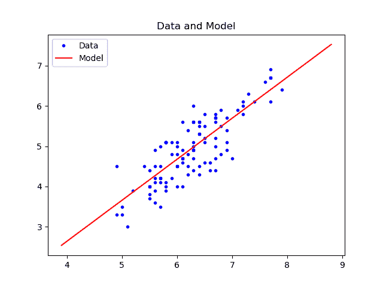
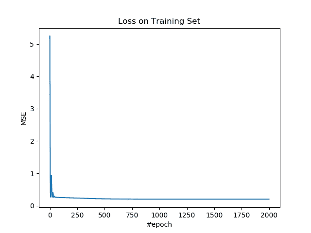
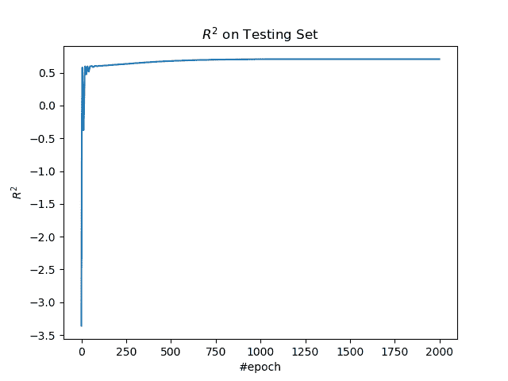

# 1.1 线性回归

线性回归是你能用 TF 搭出来的最简单的模型。

## 操作步骤

导入所需的包。

```
import tensorflow as tf
import numpy as np
import matplotlib.pyplot as plt
import sklearn.datasets as ds
import sklearn.model_selection as ms 
```

导入数据，并进行预处理。我们使用鸢尾花数据集中的后两个品种，根据萼片长度预测花瓣长度。

```
iris = ds.load_iris()

x_ = iris.data[50:, 0]
y_ = iris.data[50:, 2]
x_ = np.expand_dims(x_, 1)
y_ = np.expand_dims(y_, 1)

x_train, x_test, y_train, y_test = \
    ms.train_test_split(x_, y_, train_size=0.7, test_size=0.3) 
```

定义所需超参数。为了方便展示，我们进行一元线性回归，但是特征数还是单独定义出来，便于各位扩展。

| 变量 | 含义 |
| --- | --- |
| `n_input` | 样本特征数 |
| `n_epoch` | 迭代数 |
| `lr` | 学习率 |

```
n_input = 1
n_epoch = 2000
lr = 0.05 
```

搭建模型。

| 变量 | 含义 |
| --- | --- |
| `x` | 输入 |
| `y` | 真实标签 |
| `w` | 权重 |
| `b` | 偏置 |
| `z` | 输出，也就是标签预测值 |

```
x = tf.placeholder(tf.float64, [None, n_input])
y = tf.placeholder(tf.float64, [None, 1])
w = tf.Variable(np.random.rand(n_input, 1))
b = tf.Variable(np.random.rand(1, 1))
z = x @ w + b 
```

定义损失、优化操作、和 R 方度量指标。

我们使用 MSE 损失函数，如下：

L = 1 n ∥ Z − Y ∥ 2 L = \frac{1}{n} \| Z - Y \|^2 L=n1​∥Z−Y∥2

其中`Z`是模型输出，`Y`是真实标签，`n`是样本量。由于我们并不需要手动计算梯度，系数`1/2`就省了。

| 变量 | 含义 |
| --- | --- |
| `loss` | 损失 |
| `op` | 优化操作 |
| `y_mean` | `y`的均值 |
| `r_sqr` | R 方值 |

> 注
> 
> `AdamOptimizer`是目前 TF 中最好的优化器。我们一开始就是用这个优化器，可以避免很多坑。

```
loss = tf.reduce_mean((z - y) ** 2)
op = tf.train.AdamOptimizer(lr).minimize(loss)

y_mean = tf.reduce_mean(y)
r_sqr = 1 - tf.reduce_sum((y - z) ** 2) / tf.reduce_sum((y - y_mean) ** 2) 
```

使用训练集训练模型。

```
losses = []
r_sqrs = []

with tf.Session() as sess:
    sess.run(tf.global_variables_initializer())
    for e in range(n_epoch):
        _, loss_ = sess.run([op, loss], feed_dict={x: x_train, y: y_train})
        losses.append(loss_) 
```

使用测试集计算 R 方。

```
 r_sqr_ = sess.run(r_sqr, feed_dict={x: x_test, y: y_test})
        r_sqrs.append(r_sqr_) 
```

每一百步打印损失和度量值。

```
 if e % 100 == 0:
            print(f'epoch: {e}, loss: {loss_}, r_sqr: {r_sqr_}') 
```

得到拟合直线：

```
 x_min = x_.min() - 1
    x_max = x_.max() + 1
    x_rng = np.arange(x_min, x_max, 0.1)
    x_rng = np.expand_dims(x_rng, 1)
    y_rng = sess.run(z, feed_dict={x: x_rng}) 
```

输出：

```
epoch: 0, loss: 5.246808867412861, r_sqr: -3.3580545179249626
epoch: 100, loss: 0.25004445837782013, r_sqr: 0.6041164943701897
epoch: 200, loss: 0.23843082653827946, r_sqr: 0.6236514954522687
epoch: 300, loss: 0.2269390629355829, r_sqr: 0.6450002345272472
epoch: 400, loss: 0.21722877318795483, r_sqr: 0.6634834235462157
epoch: 500, loss: 0.20989747215734747, r_sqr: 0.6779371113275436
epoch: 600, loss: 0.20484664052302196, r_sqr: 0.6884008829992205
epoch: 700, loss: 0.20163908809697076, r_sqr: 0.6955228132490906
epoch: 800, loss: 0.19975160600281744, r_sqr: 0.7001369890134553
epoch: 900, loss: 0.19871975070335382, r_sqr: 0.703016047551422
epoch: 1000, loss: 0.198195164170451, r_sqr: 0.7047660277836822
epoch: 1100, loss: 0.19794716641396798, r_sqr: 0.7058129761451779
epoch: 1200, loss: 0.19783823837210518, r_sqr: 0.7064340685560638
epoch: 1300, loss: 0.19779385162364785, r_sqr: 0.7068004742345046
epoch: 1400, loss: 0.19777710515759306, r_sqr: 0.7070149540532822
epoch: 1500, loss: 0.19777126958353536, r_sqr: 0.7071387737013775
epoch: 1600, loss: 0.1977693968167384, r_sqr: 0.7072087165692382
epoch: 1700, loss: 0.1977688451271843, r_sqr: 0.7072470717155128
epoch: 1800, loss: 0.19776869649521, r_sqr: 0.707267350669178
epoch: 1900, loss: 0.19776866002369958, r_sqr: 0.7072776300744172 
```

绘制整个数据集的预测结果。

```
plt.figure()
plt.plot(x_, y_, 'b.', label='Data')
plt.plot(x_rng.ravel(), y_rng.ravel(), 'r', label='Model')
plt.title('Data and Model')
plt.legend()
plt.show() 
```



绘制训练集上的损失。

```
plt.figure()
plt.plot(losses)
plt.title('Loss on Training Set')
plt.xlabel('#epoch')
plt.ylabel('MSE')
plt.show() 
```



绘制测试集上的 R 方。

```
plt.figure()
plt.plot(r_sqrs)
plt.title('$R^2$ on Testing Set')
plt.xlabel('#epoch')
plt.ylabel('$R^2$')
plt.show() 
```



## 扩展阅读

*   [斯坦福 CS229 笔记：二、单变量线性回归](http://www.ai-start.com/ml2014/html/week1.html#header-n178)
*   [斯坦福 CS229 笔记：四、多变量线性回归](http://www.ai-start.com/ml2014/html/week2.html#header-n5)