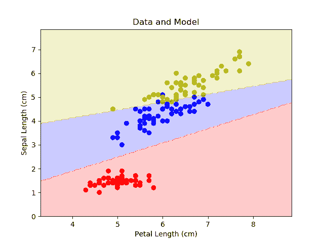
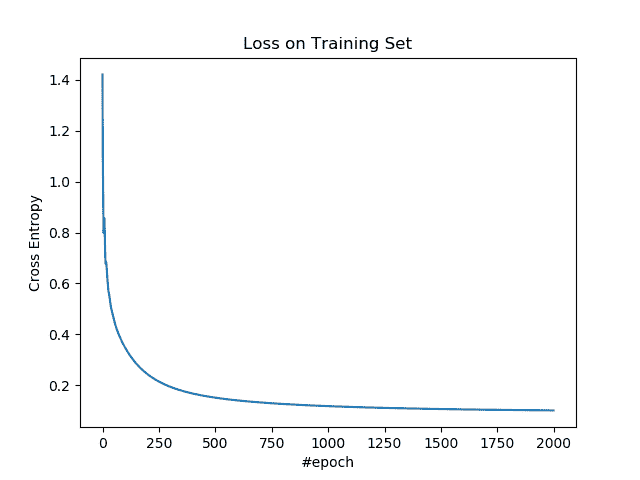
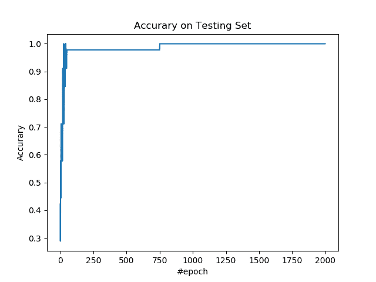

# 1.4 Softmax 回归

Softmax 回归可以看成逻辑回归在多个类别上的推广。

## 操作步骤

导入所需的包。

```
import tensorflow as tf
import numpy as np
import matplotlib as mpl
import matplotlib.pyplot as plt
import sklearn.datasets as ds
import sklearn.model_selection as ms 
```

导入数据，并进行预处理。我们使用鸢尾花数据集所有样本，根据萼片长度和花瓣长度预测样本属于三个品种中的哪一种。

```
iris = ds.load_iris()

x_ = iris.data[:, [0, 2]]
y_ = np.expand_dims(iris.target , 1)

x_train, x_test, y_train, y_test = \
    ms.train_test_split(x_, y_, train_size=0.7, test_size=0.3) 
```

定义超参数。

```
n_input = 2
n_output = 3
n_epoch = 2000
lr = 0.05 
```

| 变量 | 含义 |
| --- | --- |
| `n_input` | 样本特征数 |
| `n_ouput` | 样本类别数 |
| `n_epoch` | 迭代数 |
| `lr` | 学习率 |

搭建模型。

| 变量 | 含义 |
| --- | --- |
| `x` | 输入 |
| `y` | 真实标签 |
| `y_oh` | 独热的真实标签 |
| `w` | 权重 |
| `b` | 偏置 |
| `z` | 中间变量，`x`的线性变换 |
| `a` | 输出，也就是样本是某个类别的概率 |

```
x = tf.placeholder(tf.float64, [None, n_input])
y = tf.placeholder(tf.int64, [None, 1])
y_oh = tf.one_hot(y, n_output)
y_oh = tf.to_double(tf.reshape(y_oh, [-1, n_output]))
w = tf.Variable(np.random.rand(n_input, n_output))
b = tf.Variable(np.random.rand(1, n_output))
z = x @ w + b
a = tf.nn.softmax(z) 
```

定义损失、优化操作、和准确率度量指标。分类问题有很多指标，这里只展示一种。

我们使用交叉熵损失函数，对于多分类问题，需要改一改，如下。

− m e a n ( s u m a x i s = 1 ( Y ⊗ log ⁡ ( A ) ) ) -mean(sum_{axis=1}(Y \otimes \log(A))) −mean(sumaxis=1​(Y⊗log(A)))

| 变量 | 含义 |
| --- | --- |
| `loss` | 损失 |
| `op` | 优化操作 |
| `y_hat` | 标签的预测值 |
| `acc` | 准确率 |

```
loss = - tf.reduce_mean(tf.reduce_sum(y_oh * tf.log(a), 1))
op = tf.train.AdamOptimizer(lr).minimize(loss)

y_hat = tf.argmax(a, 1)
y_hat = tf.expand_dims(y_hat, 1)
acc = tf.reduce_mean(tf.to_double(tf.equal(y_hat, y))) 
```

使用训练集训练模型。

```
losses = []
accs = []

with tf.Session() as sess:
    sess.run(tf.global_variables_initializer())
    saver = tf.train.Saver(max_to_keep=1)

    for e in range(n_epoch):
        _, loss_ = sess.run([op, loss], feed_dict={x: x_train, y: y_train})
        losses.append(loss_) 
```

使用测试集计算准确率。

```
 acc_ = sess.run(acc, feed_dict={x: x_test, y: y_test})
        accs.append(acc_) 
```

每一百步打印损失和度量值。

```
 if e % 100 == 0:
            print(f'epoch: {e}, loss: {loss_}, acc: {acc_}')
            saver.save(sess,'logit/logit', global_step=e) 
```

得到决策边界：

```
 x_plt = x_[:, 0]
    y_plt = x_[:, 1]
    c_plt = y_.ravel()
    x_min = x_plt.min() - 1
    x_max = x_plt.max() + 1
    y_min = y_plt.min() - 1
    y_max = y_plt.max() + 1
    x_rng = np.arange(x_min, x_max, 0.05)
    y_rng = np.arange(y_min, y_max, 0.05)
    x_rng, y_rng = np.meshgrid(x_rng, y_rng)
    model_input = np.asarray([x_rng.ravel(), y_rng.ravel()]).T
    model_output = sess.run(y_hat, feed_dict={x: model_input}).astype(int)
    c_rng = model_output.reshape(x_rng.shape) 
```

输出：

```
epoch: 0, loss: 1.4210691245230944, acc: 0.4222222222222222
epoch: 100, loss: 0.34817911438772636, acc: 0.9777777777777777
epoch: 200, loss: 0.24319161311060128, acc: 0.9777777777777777
epoch: 300, loss: 0.19423490522003387, acc: 0.9777777777777777
epoch: 400, loss: 0.16772540127514665, acc: 0.9777777777777777
epoch: 500, loss: 0.15148045580780634, acc: 0.9777777777777777
epoch: 600, loss: 0.14055638836845924, acc: 0.9777777777777777
epoch: 700, loss: 0.1326877769387738, acc: 0.9777777777777777
epoch: 800, loss: 0.12672480658251276, acc: 1.0
epoch: 900, loss: 0.12203422030859229, acc: 1.0
epoch: 1000, loss: 0.11824285244695919, acc: 1.0
epoch: 1100, loss: 0.11511738393720357, acc: 1.0
epoch: 1200, loss: 0.11250383205230477, acc: 1.0
epoch: 1300, loss: 0.11029541725080125, acc: 1.0
epoch: 1400, loss: 0.10841477350763963, acc: 1.0
epoch: 1500, loss: 0.10680373944570205, acc: 1.0
epoch: 1600, loss: 0.10541728211943671, acc: 1.0
epoch: 1700, loss: 0.10421972968246913, acc: 1.0
epoch: 1800, loss: 0.10318232665398802, acc: 1.0
epoch: 1900, loss: 0.10228157312421919, acc: 1.0 
```

绘制整个数据集以及决策边界。

```
plt.figure()
cmap = mpl.colors.ListedColormap(['r', 'b', 'y'])
plt.scatter(x_plt, y_plt, c=c_plt, cmap=cmap)
plt.contourf(x_rng, y_rng, c_rng, alpha=0.2, linewidth=5, cmap=cmap)
plt.title('Data and Model')
plt.xlabel('Petal Length (cm)')
plt.ylabel('Sepal Length (cm)')
plt.show() 
```



绘制训练集上的损失。

```
plt.figure()
plt.plot(losses)
plt.title('Loss on Training Set')
plt.xlabel('#epoch')
plt.ylabel('Cross Entropy')
plt.show() 
```



绘制测试集上的准确率。

```
plt.figure()
plt.plot(accs)
plt.title('Accurary on Testing Set')
plt.xlabel('#epoch')
plt.ylabel('Accurary')
plt.show() 
```



## 扩展阅读

*   [WikiPedia: Multinomial logistic regression](https://en.wikipedia.org/wiki/Multinomial_logistic_regression)