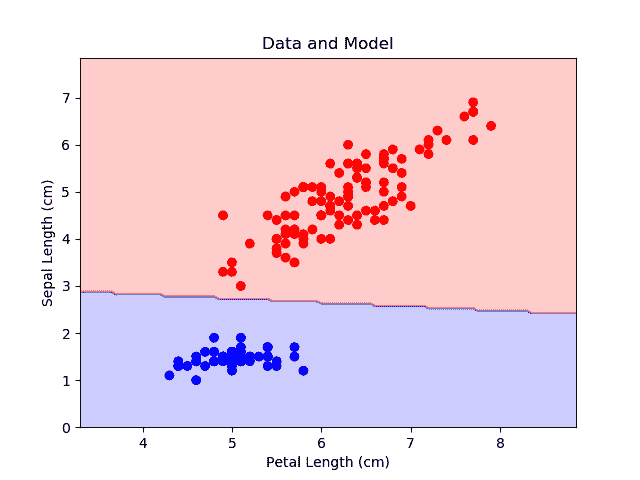
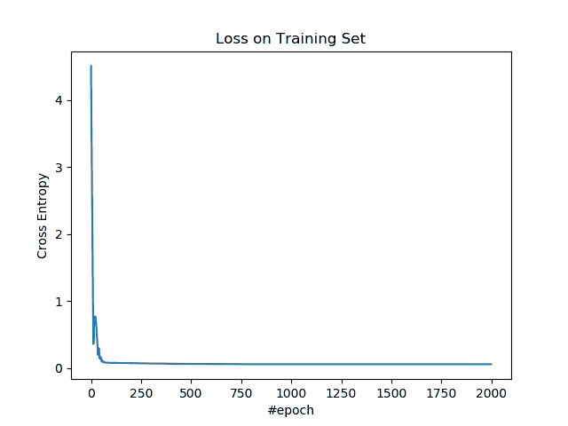
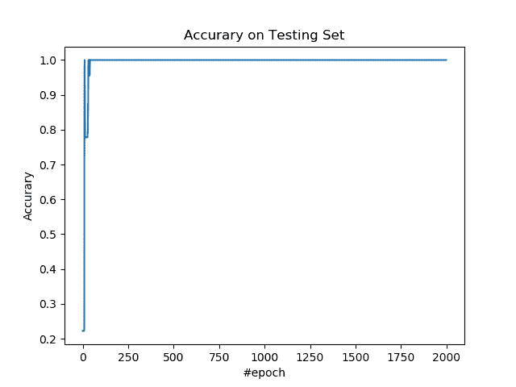

在传统机器学习方法，支持向量机算是比较厉害的方法，但是计算过程非常复杂。软间隔支持向量机通过减弱了其约束，使计算变得简单。

## 操作步骤

导入所需的包。

```
import tensorflow as tf
import numpy as np
import matplotlib as mpl
import matplotlib.pyplot as plt
import sklearn.datasets as ds
import sklearn.model_selection as ms 
```

导入数据，并进行预处理。我们使用鸢尾花数据集所有样本，根据萼片长度和花瓣长度预测样本是不是山鸢尾（第一种）。注意，支持向量机只接受 1 和 -1 的标签。

```
iris = ds.load_iris()

x_ = iris.data[:, [0, 2]]
y_ = (iris.target == 0).astype(int)
y_[y_ == 0] = -1
y_ = np.expand_dims(y_ , 1)

x_train, x_test, y_train, y_test = \
    ms.train_test_split(x_, y_, train_size=0.7, test_size=0.3) 
```

定义超参数。

| 变量 | 含义 |
| --- | --- |
| `n_input` | 样本特征数 |
| `n_epoch` | 迭代数 |
| `lr` | 学习率 |
| `lam` | L2 正则化项的系数 |

```
n_input = 2
n_epoch = 2000
lr = 0.05
lam = 0.05 
```

搭建模型。

| 变量 | 含义 |
| --- | --- |
| `x` | 输入 |
| `y` | 真实标签 |
| `w` | 权重 |
| `b` | 偏置 |
| `z` | `x`的线性变换 |

```
x = tf.placeholder(tf.float64, [None, n_input])
y = tf.placeholder(tf.float64, [None, 1])
w = tf.Variable(np.random.rand(n_input, 1))
b = tf.Variable(np.random.rand(1, 1))
z = x @ w + b 
```

定义损失、优化操作、和准确率度量指标。分类问题有很多指标，这里只展示一种。

我们使用 Hinge 损失和 L2 损失的组合。Hinge 损失为：

m e a n ( max ⁡ ( 1 − Z ⊗ Y , 0 ) ) mean(\max(1 - Z \otimes Y, 0)) mean(max(1−Z⊗Y,0))

在原始的模型中，约束是样本必须落在支持边界之外，也就是 y z &gt; = 1 yz &gt;= 1 yz>=1。我们将这个约束加到损失中，就得到了 Hinge 损失。它的意思是，对于满足约束的点，它的损失是零，对于不满足约束的点，它的损失是 1 − y z 1 - yz 1−yz。这样让样本尽可能到支持边界之外。

L2 损失用于最小化支持边界的几何距离，也就是 2 ∥ w ∥ \frac{2}{\|w\|} ∥w∥2​。

| 变量 | 含义 |
| --- | --- |
| `hinge_loss` | Hinge 损失 |
| `l2_loss` | L2 损失 |
| `loss` | 总损失 |
| `op` | 优化操作 |
| `y_hat` | 标签的预测值 |
| `acc` | 准确率 |

```
hinge_loss = tf.reduce_mean(tf.maximum(1 - y * z, 0))
l2_loss = lam * tf.reduce_sum(w ** 2)
loss = hinge_loss + l2_loss
op = tf.train.AdamOptimizer(lr).minimize(loss)

y_hat = tf.to_double(z > 0) - tf.to_double(z <= 0)
acc = tf.reduce_mean(tf.to_double(tf.equal(y_hat, y))) 
```

使用训练集训练模型。

```
losses = []
accs = []

with tf.Session() as sess:
    sess.run(tf.global_variables_initializer())
    saver = tf.train.Saver(max_to_keep=1)

    for e in range(n_epoch):
        _, loss_ = sess.run([op, loss], feed_dict={x: x_train, y: y_train})
        losses.append(loss_) 
```

使用测试集计算准确率。

```
 acc_ = sess.run(acc, feed_dict={x: x_test, y: y_test})
        accs.append(acc_) 
```

每一百步打印损失和度量值。

```
 if e % 100 == 0:
            print(f'epoch: {e}, loss: {loss_}, acc: {acc_}')
            saver.save(sess,'logit/logit', global_step=e) 
```

得到决策边界：

```
 x_plt = x_[:, 0]
    y_plt = x_[:, 1]
    c_plt = y_.ravel()
    x_min = x_plt.min() - 1
    x_max = x_plt.max() + 1
    y_min = y_plt.min() - 1
    y_max = y_plt.max() + 1
    x_rng = np.arange(x_min, x_max, 0.05)
    y_rng = np.arange(y_min, y_max, 0.05)
    x_rng, y_rng = np.meshgrid(x_rng, y_rng)
    model_input = np.asarray([x_rng.ravel(), y_rng.ravel()]).T
    model_output = sess.run(y_hat, feed_dict={x: model_input}).astype(int)
    c_rng = model_output.reshape(x_rng.shape) 
```

输出：

```
epoch: 0, loss: 4.511212919815273, acc: 0.2222222222222222
epoch: 100, loss: 0.0814942611949705, acc: 1.0
epoch: 200, loss: 0.07629443566925993, acc: 1.0
epoch: 300, loss: 0.07146107394130172, acc: 1.0
epoch: 400, loss: 0.06791927215796319, acc: 1.0
epoch: 500, loss: 0.06529065400047798, acc: 1.0
epoch: 600, loss: 0.06335060635876646, acc: 1.0
epoch: 700, loss: 0.061836271593737835, acc: 1.0
epoch: 800, loss: 0.06079800773555345, acc: 1.0
epoch: 900, loss: 0.06042716484730995, acc: 1.0
epoch: 1000, loss: 0.06091475237291386, acc: 1.0
epoch: 1100, loss: 0.06021069445352348, acc: 1.0
epoch: 1200, loss: 0.06019457351257251, acc: 1.0
epoch: 1300, loss: 0.06000348375369489, acc: 1.0
epoch: 1400, loss: 0.060206981088196394, acc: 1.0
epoch: 1500, loss: 0.060210741691625935, acc: 1.0
epoch: 1600, loss: 0.060570783158962985, acc: 1.0
epoch: 1700, loss: 0.06003457018203537, acc: 1.0
epoch: 1800, loss: 0.060203912161627175, acc: 1.0
epoch: 1900, loss: 0.06019910894894441, acc: 1.0 
```

绘制整个数据集以及决策边界。

```
plt.figure()
cmap = mpl.colors.ListedColormap(['r', 'b'])
plt.scatter(x_plt, y_plt, c=c_plt, cmap=cmap)
plt.contourf(x_rng, y_rng, c_rng, alpha=0.2, linewidth=5, cmap=cmap)
plt.title('Data and Model')
plt.xlabel('Petal Length (cm)')
plt.ylabel('Sepal Length (cm)')
plt.show() 
```



绘制训练集上的损失。

```
plt.figure()
plt.plot(losses)
plt.title('Loss on Training Set')
plt.xlabel('#epoch')
plt.ylabel('Cross Entropy')
plt.show() 
```



绘制测试集上的准确率。

```
plt.figure()
plt.plot(accs)
plt.title('Accurary on Testing Set')
plt.xlabel('#epoch')
plt.ylabel('Accurary')
plt.show() 
```



## 扩展阅读

*   [斯坦福 CS229 笔记：十二、支持向量机](http://www.ai-start.com/ml2014/html/week7.html)
*   [Wikipedia: Support vector machine](https://en.wikipedia.org/wiki/Support_vector_machine)