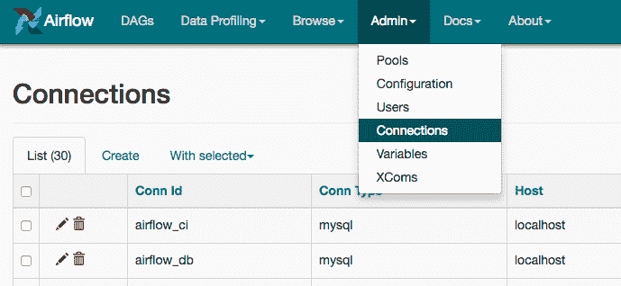
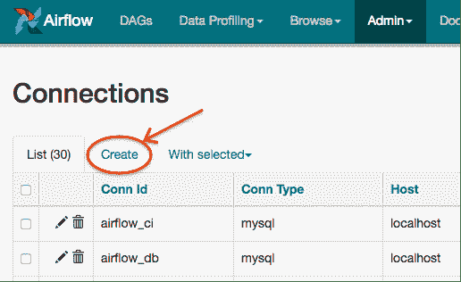

Airflow需要知道如何连接到您的环境。 其他系统和服务的主机名，端口，登录名和密码等信息在UI的`Admin-&gt;Connection`部分中处理。 您将创作的管道代码将引用Connection对象的“conn_id”。

可以使用UI或环境变量创建和管理连接。

有关更多信息，请参阅[Connenctions Concepts](https://apachecn.github.io/airflow-doc-zh/concepts.html)文档。

## 使用UI创建连接

打开UI的`Admin-&gt;Connection`部分。 单击“ `Create`链接以创建新连接。

1.  使用所需的连接ID填写`Conn Id`字段。 建议您使用小写字符和单独的带下划线的单词。
2.  使用`Conn Type`字段选择连接类型。
3.  填写其余字段。 有关属于不同连接类型的字段的说明，请参阅连接类型。
4.  单击“ `Save`按钮以创建连接。

> [**阅读全文／改进本文**](https://github.com/apachecn/airflow-doc-zh/blob/master/zh/10.md)