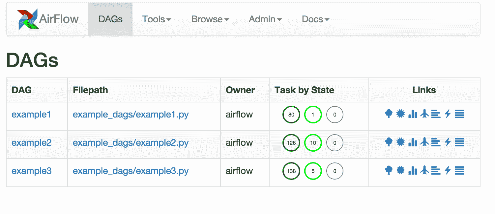
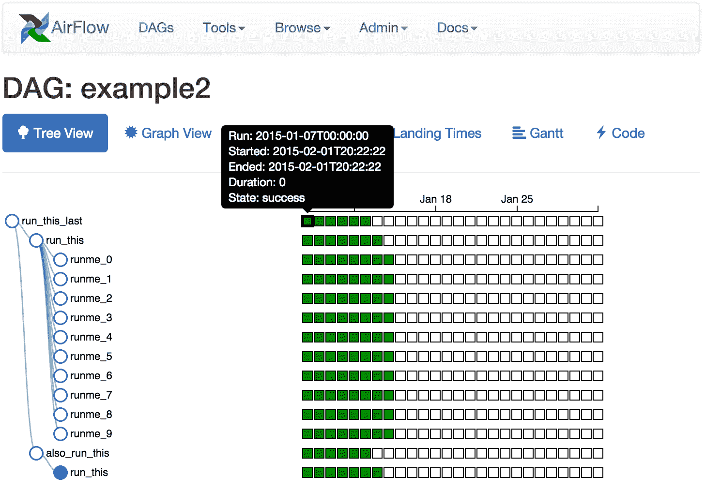

通过Airflow UI，您可以轻松监控数据管道并对其进行故障排除。 以下是您可以在Airflow UI中找到的一些功能和可视化的快速概述。

## DAGs查看

您环境中的DAG列表，以及一组有用页面的快捷方式。 您可以一目了然地查看成功，失败或当前正在运行的任务数量。

* * *

* * *

## 树视图

跨越时间的DAG的树表示。 如果管道延迟，您可以快速查看不同步骤的位置并识别阻塞步骤。

* * *

> [**阅读全文／改进本文**](https://github.com/apachecn/airflow-doc-zh/blob/master/zh/19.md)