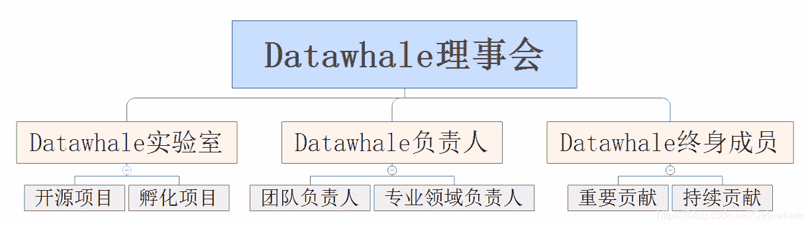
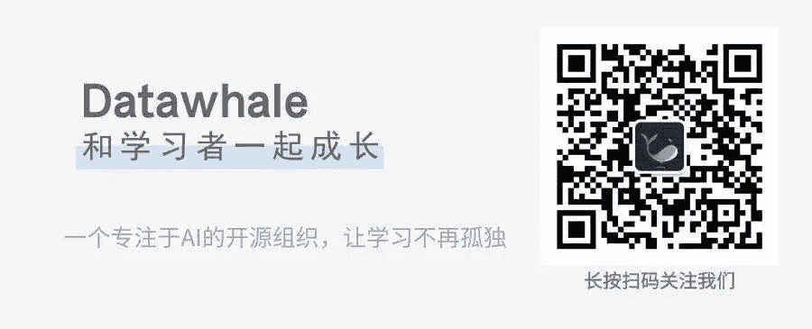

## 关于Datawhale

*   [Datawhale是什么?](https://blog.csdn.net/Datawhale/article/details/85100466)

## Datawhale组织架构

| 团队 | 职责 |
| --- | --- |
| 数据科学团队 | 1.数据竞赛，2.数据科学项目 |
| 内容输出团队 | 1.输出原创优质文章 2.构建开源内容和开源项目 |
| 社群管理团队 | 社群管理及安排 |
| Changer团队 | 1.组队学习安排 2.专业领域人才 |
| Brainer团队 | 学习方案制定和优化 |
| 文化运营团队 | 1.公众号等平台运营 2.活动策划 |
| 人工智能团队 | 1.AI前沿理论研究 2.AI理论应用 |
| 技术研发团队 | 网站和小程序的开发 |

| 团队 | 核心成员 |
| --- | --- |
| Datawhale理事会 | 五柳，静修，落木 ，凌恒，爱人 ，含光，扶苏 |
| Datawhale实验室 | 五柳，静修，落木 |
| Datawhale专业团队 | 求索，遥雪，思睿，有容，闻天，莲说，初九，木心 |

其中Datawhale专业团队包含：

| 专业团队 | 负责人 | 领域 |
| --- | --- | --- |
| 编程基础 | 求索 | leetcode，编程实践 |
| 基础知识 | 遥雪 | 统计学、数学、python、excel |
| 数据科学 | 思睿 | MySQL、爬虫、数据分析、数据挖掘 |
| 机器学习 | 有容 | ML算法 |
| 深度学习 | 闻天 | DL算法 |
| 金融科技 | 初九 | 信贷评分模型、欺诈模型、时序分析等 |
| 产品 | 木心 |  |
| 自然语言处理 | 莲说 |  |

## Datawhale团队成员

目前内部团队成员50人左右。有来自清华，北大，上交，浙大，武大，港科大，伯克利，UMD等顶尖名校以及国科大，华中科大，电子科大，中科院，华南理工，东南大学，四川大学，中山大学等知名学府，也有来自微软，阿里，百度，头条，盛大，猎豹，新浪，毕马威等国内外知名企业。

| 核心团队 | 负责人 | 团队成员 |
| --- | --- | --- |
| 数据科学 |  | ML67，lurker，Yuan，宁静致远，Jassy_shan，李焱琪，李威，兰钧，施添儒，陈曦，Pinkman，梦大大，邱荣发，木木，林有夕 |
| 内容输出 | 马晶敏 | 王佳旭，谢文睿，孙超，吕雪杰，追风者，李奇锋，王晓强，Summer，康兵兵，李文乐，地山谦，程旭，肖然，ZDou，程钰俊，lurker，丽萍，李威，Shasha，黄海广，进击的合成尸，宁静致远，于洪飞，大薇 |
| 社群管理 | 陈焕森 | 小尧，陈焕森，追风者，程钰俊，李文乐，Summer，蓝昔，金子楗 |
| Changer | 范晶晶 | 排骨、居居、苏静 、老表 |
| Brainer | 胡联粤 | Jepson、于鸿飞、李严、杨煜 |
| 文化运营 | 杜佳乐 | 李方、小雪、无多、icebear、甘放、刑杰、毛毛、小鱼 |

