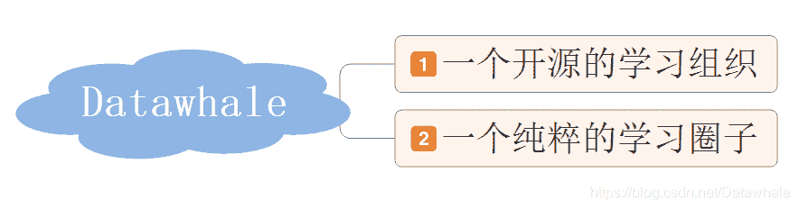

## Datawhale是什么？

[Datawhale组织网站](https://datawhale.club/)

*   Datawhale是一个专注于AI领域的[开源组织](http://www.datawhale.club/)，致力于构建一个纯粹的学习圈子，帮助学习者更好地成长。我们专注于机器学习，深度学习，编程和数学等AI领域的内容学习，我们不是内容的生产者，我们向优秀的资料和优秀的学习者致敬。
*   我们将渴望改变的小伙伴聚集在一起，共同构建一个互促高效的学习氛围；我们将一群有能力有想法的理想青年们集结在一起，共同改善学习的模式。在这里，我们没有标签。如果你是小白，我们将为你提供学习和改变的机会，如果你是优秀的Learner，我们将向你提供提升和发展的平台。
*   Datawhale发展于2018年12月6日。目前团队成员也在不断扩大，有来自双非院校的优秀同学，也有来自上交、武大、清华等名校的小伙伴，同时也有来自微软的工程师、头条、百度等企业的算法工程师。我们将共同努力去做好一件有价值的事。
    

## 我们为学习者带来了什么？

**1.合理的学习方向**

*   Datawhale提供的学习内容由Datawhale团队成员用心制定，并经过学习者的反馈不断更新迭代和完善。帮助小白在入门阶段少走弯路，同时也帮助有一定基础的学习者快速提升。

**2.良好的学习环境**。

*   Datawhale推出周训的学习模式，将渴望改变的小伙伴聚集在一起，针对某一方向进行集中学习，以期望为更深入的学习做铺垫和准备。
*   将分享+点评融合，通过分享所学将学习内容内化为自己的知识，再通过点评其他人的学习来巩固补充自己的学习架构，最大程度调动学习积极性，增强学习者之间的交流，营造了一个纯粹的学习环境。

**3.极佳的互促氛围**

*   Datawhale除了参与集训的学习者，还会有负责人，准负责人以及优秀的助教成员和大家一起探讨、交流和学习。我们没有教学，我们向每一个优秀者学习，通过互促和共享，使得所有的学习者都能有机会去成长和提升自己的能力。

## 我们为团队成员提供什么？

**1.学习机会**

*   成为团队的一员，你将优先获得Datawhale集训的名额，你可以根据需要选择任意的集训加入学习，同时你可以和优秀的团队成员一起共事，互相学习，不断提升自己的学习能力和组织能力。

**2.发展空间**

*   Datawhale为团队成员提供了多样的发展路径。如果你有极佳的学习能力和专研能力，可以作为学习边界的开拓者和学习内容的完善者，也就是Brainer；如果你除了有学习能力还有极佳的组织能力，那么可以成为集训学习的负责人，也就是Changer；还有一部分成员本身特别优秀，因为在职或学术的原因，时间特别有限，那么可以通过筛选成为荣誉助教，参与指引和解惑交流。

**3.自我价值**

*   这其实是非常空的东西，但又是最重要的东西，也是我们创建Datawhale的原因：实现自我价值。学习成长的满足感和赋能的成就感在不断促使我们前行。

## 我们的愿景是什么？

**for the learner ，和学习者一起成长**。坚持开源的模式，坚持不断的进取，改善这个世界是我们的梦想。

