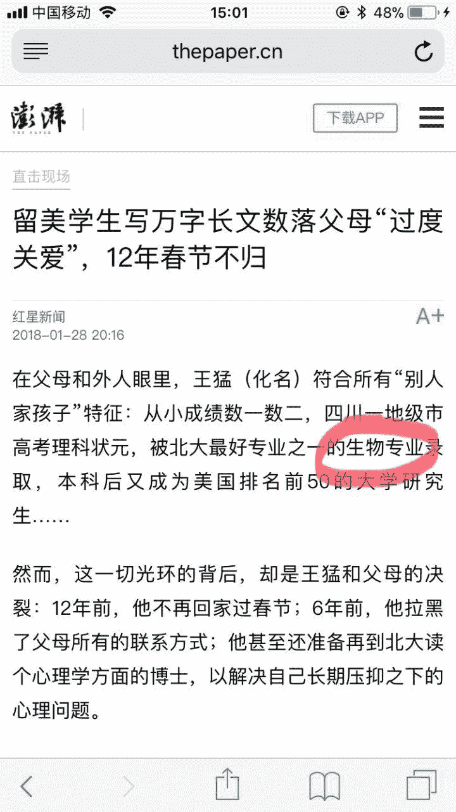
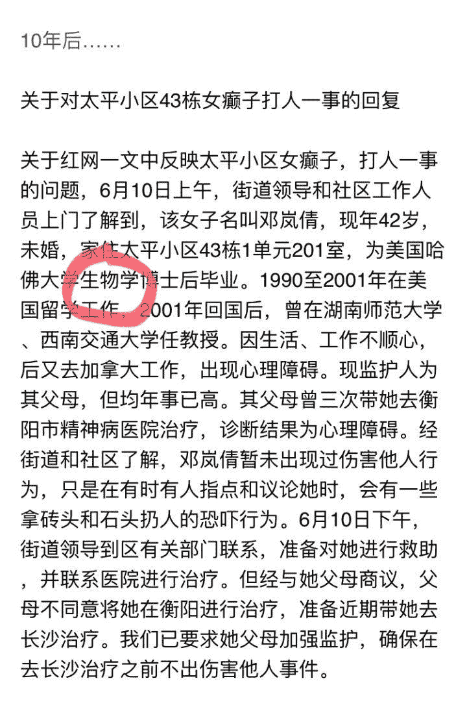
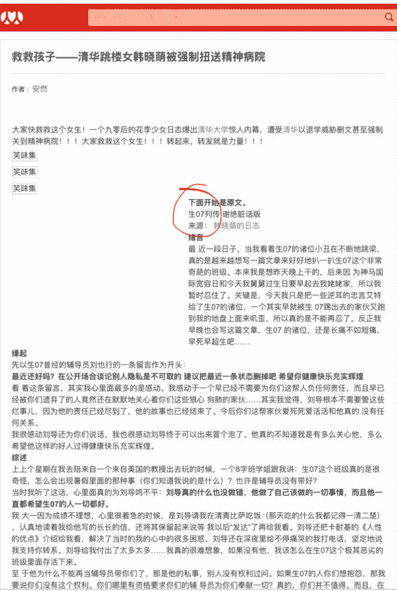
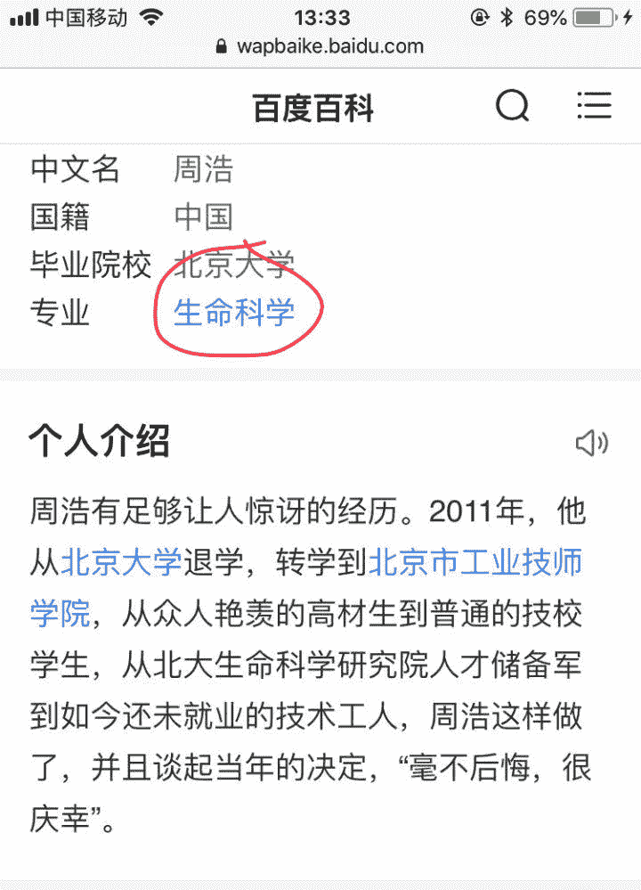

> 作者：[匿名作者](http://bestmajor.org/article/5c2728f27f467e55e41a727a)

喝茶归来，更新如下：

在2018年，清华大学成为了全国排名第一的世界一流大学，人们对清华二字的恐惧根深蒂固，不敢谈论他，甚至不敢说出他的名字，于是以“神秘大学”称之。

* * *

利益相关：神秘大学生命科学学院201X届毕业生，已转行，劝退党徒，匿名。如果你猜出来了我是谁，我恳求你保持沉默。

本人受知乎生化环材劝退前辈们恩情甚多，终有一日能报答劝退社区，为其添砖加瓦，是我数年来的愿望。这是我第一篇也是最后一篇劝退文章，毕竟重担已经卸下，还要努力前行。在此感谢几位素昧平生的好人[@弗兰克扬](http://www.zhihu.com/people/c3239475688a09f3252cc320cc214ce4)[@到处挖坑蒋玉成](http://www.zhihu.com/people/fdf39532883a73e7d2d09b485588d7c7)[@材料劝退奥特曼](http://www.zhihu.com/people/2ee3649b52cc5f28cd1e904558f08040)[@葉神月](http://www.zhihu.com/people/347f8ad5c5a88fa0da7420cc95d88d8f)[@云天](http://www.zhihu.com/people/5d6460ba7157f21c8d87e8df818dc4b0)[@白如冰](http://www.zhihu.com/people/9558cac1a967147f0318fe6b7b1a0f7b)[@贱贱](http://www.zhihu.com/people/789a006980ffe4e7d86594fd2c21c927)[@罗多克神射手](http://www.zhihu.com/people/491ae53373c9ce73143247dff62b4468)等等太多，恕不能遍历所有帮助过我的人，但我在此向所有劝退党良心人士道谢，你的每一点点文字，都让一个人看到了划过沉重黑暗的一线光明。

约在201X-2年夏季，我在知乎上看到了一个话题，叫做“生物劝退”。我是冒着冷汗看完整个话题下的所有回答的，看完后感觉上了一个弥天大当，副校长给我们画下的大饼，在我看来成了一个剧毒的诱饵，唯恐避之不及。在此我就不转载各路劝退前辈的警句名言了，只举出数个不那么极端血腥的事例，祭奠我那无辜浪费的数年青春。

[图片上传失败…(image-10a259-1546245310837)]

[图片上传失败…(image-d32a6d-1546245310837)]

[图片上传失败…(image-f79c37-1546245310837)]

然而我也知道，仅凭几则事例，并不足以说服所有理智的人。有朋友问过我这样的问题：

你只是取了几个失败案例而已，而且是故意取的生化方向。副校长也搞生物，做得很成功啊。

这个问题问得好。不论我在举例子的时候，还是你在举副校长的例子的时候，都在谈论个例。只要稍懂一点概率就会知道，个例没有普遍的参考意义，我们应该关注统计概率，看看生命学院就业率究竟是多少。岂不闻顺天者昌，逆天者亡，个人命运终究不可以抗拒统计规律。

根据官方的《神秘大学201X年毕业生就业质量报告》，神秘大学生命学院的本科生、硕士生、博士生的就业率分别为97%、100%、98%。

嗯。

然而你若真诚相信了以上数据，是会过错年的。知乎上有前辈指出生命学院就业率是8开头的，并写文章怒斥生命学院的就业情况低于全校正常水平10个百分点，自院长以下众多肉食者难辞其咎。

哼。

真实数据是51%。

你没看错，堂堂神秘大学生命科学学院，包括应届本科生、硕士生、博士生，出国深造、国内深造、找工作全部统计在内，201X年总就业率51%。优质就业单位有汉东省委组织部、学而思网校、神秘大学附属中学等，科研单位都不多见了。

但总有人拿副校长的教导反驳我：

神秘大学学子不应该考虑就业！

我自江东通过高考而来，以几乎是万中选一的成绩来到这所学校。我期待你能帮助我改变命运，至少不要浪费我的优势。你给我的答卷就是这个？我何颜去见江东父老？你有何面目去见汉朝二十四代先帝？

我从未见过有如此，厚颜无耻之人！

除了51%，其他人去哪了？

Who Cares?

你的数据真实吗？

这份内部文件是生院学生组向就业指导中心的汇报，其中有两个就业率。系统就业率31%，是学校使用全校统一的统计方法，根据生院就业登记情况得到的统计；而实际排查就业率51%，是学生组挨个约谈毕业生后得到的统计。就业中心主任老师因这份文件大发雷霆，呵斥生院无视学生前途，培养了过多博士而社会不需要。生院教授们听得无动于衷。

有需要这份文件者，请移步评论区并尽量保密。

我不听我不听！太夸张了，这个数据是假的！

我不知道你为什么不肯相信白纸黑字的数据，但是：

如果你是坑外人士，请勿对他人的痛苦妄加评论。

如果你是坑内人士，希望在你找工作那天，也能有勇气对hr嚷嚷“我不听我不听”。

不过评论区还是很友好的，看来天下苦秦久矣，已有众多知友愿意支持我们劝退党了，我感到很满意很感激。

看到这里，你还敢说什么“生物科研做好了一样有前途”吗？

何不食肉糜？