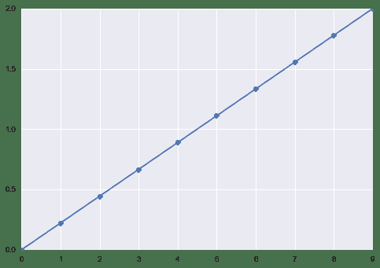
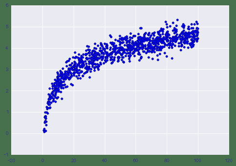

## 9.1 NumPy

> 致谢：派生于 Olivier Grisel 分享的 [scikit-learn 和 IPython 并行机器学习](https://github.com/ogrisel/parallel_ml_tutorial)
> 
> 译者：[飞龙](https://github.com/wizardforcel)
> 
> 协议：[CC BY-NC-SA 4.0](http://creativecommons.org/licenses/by-nc-sa/4.0/)

*   NumPy 数组，`dtype`和形状
*   常见数组操作
*   原地修改形状和更新
*   合并数组
*   创建示例数据

```
import numpy as np 
```

### NumPy 数组，`dtype`和形状

```
a = np.array([1, 2, 3])
print(a)
print(a.shape)
print(a.dtype)

'''
[1 2 3]
(3,)
int64
'''

b = np.array([[0, 2, 4], [1, 3, 5]])
print(b)
print(b.shape)
print(b.dtype)

'''
[[0 2 4]
 [1 3 5]]
(2, 3)
int64
'''

np.zeros(5)

# array([ 0.,  0.,  0.,  0.,  0.])

np.ones(shape=(3, 4), dtype=np.int32)

'''
array([[1, 1, 1, 1],
       [1, 1, 1, 1],
       [1, 1, 1, 1]], dtype=int32)
''' 
```

### 常见数组操作

```
c = b * 0.5
print(c)
print(c.shape)
print(c.dtype)

'''
[[ 0\.   1\.   2\. ]
 [ 0.5  1.5  2.5]]
(2, 3)
float64
'''

d = a + c
print(d)

'''
[[ 1\.   3\.   5\. ]
 [ 1.5  3.5  5.5]]
'''

d[0]

# array([ 1.,  3.,  5.])

d[0, 0]

# 1.0

d[:, 0]

# array([ 1\. ,  1.5])

d.sum()

# 19.5

d.mean()

# 3.25

d.sum(axis=0)

# array([  2.5,   6.5,  10.5])

d.mean(axis=1)

# array([ 3\. ,  3.5]) 
```

### 原地修改形状和更新

```
e = np.arange(12)
print(e)

# [ 0  1  2  3  4  5  6  7  8  9 10 11]

# f 是 e 的内容的视图
f = e.reshape(3, 4)
print(f)

'''
[[ 0  1  2  3]
 [ 4  5  6  7]
 [ 8  9 10 11]]
'''

# 将 e 从索引 5 开始的值设为 0
e[5:] = 0
print(e)

# [0 1 2 3 4 0 0 0 0 0 0 0]

# f 也更新了
f

'''
array([[0, 1, 2, 3],
       [4, 0, 0, 0],
       [0, 0, 0, 0]])
'''

# OWNDATA 展示了 f 并没有自己的数据
f.flags

'''
C_CONTIGUOUS : True
F_CONTIGUOUS : False
OWNDATA : False
WRITEABLE : True
ALIGNED : True
UPDATEIFCOPY : False
''' 
```

### 合并数组

```
a

# array([1, 2, 3])

b

'''
array([[0, 2, 4],
       [1, 3, 5]])
'''

d

'''
array([[ 1\. ,  3\. ,  5\. ],
       [ 1.5,  3.5,  5.5]])
'''

np.concatenate([a, a, a])

# array([1, 2, 3, 1, 2, 3, 1, 2, 3])

# 广播在需要时自动完成
np.vstack([a, b, d])

'''
array([[ 1\. ,  2\. ,  3\. ],
       [ 0\. ,  2\. ,  4\. ],
       [ 1\. ,  3\. ,  5\. ],
       [ 1\. ,  3\. ,  5\. ],
       [ 1.5,  3.5,  5.5]])
'''

# 在机器学习中，使用 hstack
# 来扩充或者添加新的/交叉特征很有用
np.hstack([b, d])

'''
array([[ 0\. ,  2\. ,  4\. ,  1\. ,  3\. ,  5\. ],
       [ 1\. ,  3\. ,  5\. ,  1.5,  3.5,  5.5]])
''' 
```

### 创建样例数据

```
%matplotlib inline

import pylab as plt
import seaborn

seaborn.set()

# 创建特定区间上的等间隔的数字
x = np.linspace(0, 2, 10)
plt.plot(x, 'o-');
plt.show() 
```



```
# 创建样例数据，添加一些噪声
x = np.random.uniform(1, 100, 1000)
y = np.log(x) + np.random.normal(0, .3, 1000)

plt.scatter(x, y)
plt.show() 
```

