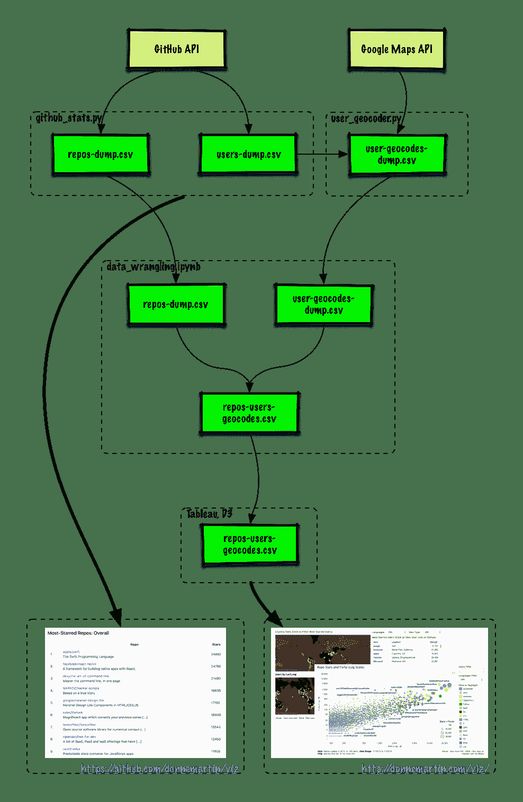

# 7.2 数据整理

> 原文：[Data Wrangling](https://github.com/donnemartin/viz/blob/master/githubstats/data_wrangling.ipynb)
> 
> 译者：[飞龙](https://github.com/wizardforcel)
> 
> 协议：[CC BY-NC-SA 4.0](http://creativecommons.org/licenses/by-nc-sa/4.0/)（原文协议：[Apache License 2.0](https://github.com/donnemartin/data-science-ipython-notebooks/blob/master/LICENSE)）

## 数据流



直接从 GitHub 挖掘数据，`Viz`由 [GitHub API](https://developer.github.com/v3/) 提供支持，并利用以下内容：

*   通过 Python 使用[`github3.py`](https://github.com/sigmavirus24/github3.py) 访问 GitHub API。
*   将下面的 [IPython 笔记本](https://github.com/donnemartin/viz/blob/master/githubstats/data_wrangling.ipynb) 中的[`pandas`](https://github.com/pydata/pandas)用于数据整理。
*   通过[`geocoder`](https://github.com/DenisCarriere/geocoder)使用 [Google 地图 API](https://developers.google.com/maps/?hl=en) 访问位置数据。
*   将 [Tableau Public](https://public.tableau.com/s/) 用于可视化。

将来，[Google BigQuery](https://cloud.google.com/bigquery/) 和 [GitHub Archive](https://www.githubarchive.org/) 也可以补充 GitHub API。

## 导入

```
import re

import pandas as pd 
```

## 准备仓库数据

加载仓库数据并删除重复：

```
repos = pd.read_csv("data/2017/repos-dump.csv", quotechar='"', skipinitialspace=True)
print('Shape before dropping duplicates', repos.shape)
repos = repos.drop_duplicates(subset='full_name', keep='last')
print('Shape after  dropping duplicates', repos.shape)
repos.head()

'''
Shape before dropping duplicates (8697, 5)
Shape after  dropping duplicates (8697, 5)
''' 
```

|  | full_name | stars | forks | description | language |
| --- | --- | --- | --- | --- | --- |
| 0 | thedaviddias/Front-End-Checklist | 24267 | 2058 | ? The perfect Front-End Checklist for modern w… | JavaScript |
| 1 | GoogleChrome/puppeteer | 21976 | 1259 | Headless Chrome Node API | JavaScript |
| 2 | parcel-bundler/parcel | 13981 | 463 | ?? Blazing fast, zero configuration web applic… | JavaScript |
| 3 | Chalarangelo/30-seconds-of-code | 13466 | 1185 | Curated collection of useful Javascript snippe… | JavaScript |
| 4 | wearehive/project-guidelines | 11279 | 970 | A set of best practices for JavaScript projects | JavaScript |

将`user`和`repo`从`full_name`分离，变成新列：

```
def extract_user(line):
    return line.split('/')[0]

def extract_repo(line):
    return line.split('/')[1]

repos['user'] = repos['full_name'].str[:].apply(extract_user)
repos['repo'] = repos['full_name'].str[:].apply(extract_repo)
print(repos.shape)
repos.head()

# (8697, 7) 
```

|  | full_name | stars | forks | description | language | user | repo |
| --- | --- | --- | --- | --- | --- | --- | --- |
| 0 | thedaviddias/Front-End-Checklist | 24267 | 2058 | ? The perfect Front-End Checklist for modern w… | JavaScript | thedaviddias | Front-End-Checklist |
| 1 | GoogleChrome/puppeteer | 21976 | 1259 | Headless Chrome Node API | JavaScript | GoogleChrome | puppeteer |
| 2 | parcel-bundler/parcel | 13981 | 463 | ?? Blazing fast, zero configuration web applic… | JavaScript | parcel-bundler | parcel |
| 3 | Chalarangelo/30-seconds-of-code | 13466 | 1185 | Curated collection of useful Javascript snippe… | JavaScript | Chalarangelo | 30-seconds-of-code |
| 4 | wearehive/project-guidelines | 11279 | 970 | A set of best practices for JavaScript projects | JavaScript | wearehive | project-guidelines |

## 准备用户数据

加载用户数据并删除重复：

```
users = pd.read_csv("data/2017/user-geocodes-dump.csv", quotechar='"', skipinitialspace=True)
print('Shape before dropping duplicates', users.shape)
users = users.drop_duplicates(subset='id', keep='last')
print('Shape after  dropping duplicates', users.shape)
users.head()

'''
Shape before dropping duplicates (6426, 8)
Shape after  dropping duplicates (6426, 8)
''' 
```

|  | id | name | type | location | lat | long | city | country |
| --- | --- | --- | --- | --- | --- | --- | --- | --- |
| 0 | dns-violations | NaN | Organization | NaN | NaN | NaN | NaN | NaN |
| 1 | hannob | Hanno Böck | User | Berlin | 52.520007 | 13.404954 | Berlin | Germany |
| 2 | takecian | Takeshi Fujiki | User | Tokyo, Japan | 35.689487 | 139.691706 | Tokyo | Japan |
| 3 | jtomschroeder | Tom Schroeder | User | Chicago | 41.878114 | -87.629798 | Chicago | United States |
| 4 | wapiflapi | Wannes Rombouts | User | France | 46.227638 | 2.213749 | NaN | France |

将`id`列重命名为`user`：

```
users.rename(columns={'id': 'user'}, inplace=True)
users.head() 
```

|  | user | name | type | location | lat | long | city | country |
| --- | --- | --- | --- | --- | --- | --- | --- | --- |
| 0 | dns-violations | NaN | Organization | NaN | NaN | NaN | NaN | NaN |
| 1 | hannob | Hanno Böck | User | Berlin | 52.520007 | 13.404954 | Berlin | Germany |
| 2 | takecian | Takeshi Fujiki | User | Tokyo, Japan | 35.689487 | 139.691706 | Tokyo | Japan |
| 3 | jtomschroeder | Tom Schroeder | User | Chicago | 41.878114 | -87.629798 | Chicago | United States |
| 4 | wapiflapi | Wannes Rombouts | User | France | 46.227638 | 2.213749 | NaN | France |

## 合并仓库和用户数据

左连接仓库和用户：

```
repos_users = pd.merge(repos, users, on='user', how='left')
print('Shape repos:', repos.shape)
print('Shape users:', users.shape)
print('Shape repos_users:', repos_users.shape)
repos_users.head()

'''
Shape repos: (8697, 7)
Shape users: (6426, 8)
Shape repos_users: (8697, 14)
''' 
```

|  | full_name | stars | forks | description | language | user | repo | name | type | location | lat | long | city | country |
| --- | --- | --- | --- | --- | --- | --- | --- | --- | --- | --- | --- | --- | --- | --- |
| 0 | thedaviddias/Front-End-Checklist | 24267 | 2058 | ? The perfect Front-End Checklist for modern w… | JavaScript | thedaviddias | Front-End-Checklist | David Dias | User | France, Mauritius, Canada | NaN | NaN | NaN | NaN |
| 1 | GoogleChrome/puppeteer | 21976 | 1259 | Headless Chrome Node API | JavaScript | GoogleChrome | puppeteer | NaN | Organization | NaN | NaN | NaN | NaN | NaN |
| 2 | parcel-bundler/parcel | 13981 | 463 | ?? Blazing fast, zero configuration web applic… | JavaScript | parcel-bundler | parcel | Parcel | Organization | NaN | NaN | NaN | NaN | NaN |
| 3 | Chalarangelo/30-seconds-of-code | 13466 | 1185 | Curated collection of useful Javascript snippe… | JavaScript | Chalarangelo | 30-seconds-of-code | Angelos Chalaris | User | Athens, Greece | 37.983810 | 23.727539 | Athens | Greece |
| 4 | wearehive/project-guidelines | 11279 | 970 | A set of best practices for JavaScript projects | JavaScript | wearehive | project-guidelines | Hive | Organization | London | 51.507351 | -0.127758 | London | United Kingdom |

## 整理仓库和用户数据

重新排序列：

```
repos_users = repos_users.reindex_axis(['full_name',
                                        'repo',
                                        'description',
                                        'stars',
                                        'forks',
                                        'language',
                                        'user',
                                        'name',
                                        'type',
                                        'location',
                                        'lat',
                                        'long',
                                        'city',
                                        'country'], axis=1)
print(repos_users.shape)
repos_users.head()

# (8697, 14) 
```

|  | full_name | repo | description | stars | forks | language | user | name | type | location | lat | long | city | country |
| --- | --- | --- | --- | --- | --- | --- | --- | --- | --- | --- | --- | --- | --- | --- |
| 0 | thedaviddias/Front-End-Checklist | Front-End-Checklist | ? The perfect Front-End Checklist for modern w… | 24267 | 2058 | JavaScript | thedaviddias | David Dias | User | France, Mauritius, Canada | NaN | NaN | NaN | NaN |
| 1 | GoogleChrome/puppeteer | puppeteer | Headless Chrome Node API | 21976 | 1259 | JavaScript | GoogleChrome | NaN | Organization | NaN | NaN | NaN | NaN | NaN |
| 2 | parcel-bundler/parcel | parcel | ?? Blazing fast, zero configuration web applic… | 13981 | 463 | JavaScript | parcel-bundler | Parcel | Organization | NaN | NaN | NaN | NaN | NaN |
| 3 | Chalarangelo/30-seconds-of-code | 30-seconds-of-code | Curated collection of useful Javascript snippe… | 13466 | 1185 | JavaScript | Chalarangelo | Angelos Chalaris | User | Athens, Greece | 37.983810 | 23.727539 | Athens | Greece |
| 4 | wearehive/project-guidelines | project-guidelines | A set of best practices for JavaScript projects | 11279 | 970 | JavaScript | wearehive | Hive | Organization | London | 51.507351 | -0.127758 | London | United Kingdom |

## 添加整体排名

根据星数对每个元素排名：

```
repos_users['rank'] = repos_users['stars'].rank(ascending=False)
print(repos_users.shape)
repos_users.head()

# (8697, 15) 
```

|  | full_name | repo | description | stars | forks | language | user | name | type | location | lat | long | city | country | rank |
| --- | --- | --- | --- | --- | --- | --- | --- | --- | --- | --- | --- | --- | --- | --- | --- |
| 0 | thedaviddias/Front-End-Checklist | Front-End-Checklist | ? The perfect Front-End Checklist for modern w… | 24267 | 2058 | JavaScript | thedaviddias | David Dias | User | France, Mauritius, Canada | NaN | NaN | NaN | NaN | 3 |
| 1 | GoogleChrome/puppeteer | puppeteer | Headless Chrome Node API | 21976 | 1259 | JavaScript | GoogleChrome | NaN | Organization | NaN | NaN | NaN | NaN | NaN | 4 |
| 2 | parcel-bundler/parcel | parcel | ?? Blazing fast, zero configuration web applic… | 13981 | 463 | JavaScript | parcel-bundler | Parcel | Organization | NaN | NaN | NaN | NaN | NaN | 11 |
| 3 | Chalarangelo/30-seconds-of-code | 30-seconds-of-code | Curated collection of useful Javascript snippe… | 13466 | 1185 | JavaScript | Chalarangelo | Angelos Chalaris | User | Athens, Greece | 37.983810 | 23.727539 | Athens | Greece | 13 |
| 4 | wearehive/project-guidelines | project-guidelines | A set of best practices for JavaScript projects | 11279 | 970 | JavaScript | wearehive | Hive | Organization | London | 51.507351 | -0.127758 | London | United Kingdom | 16 |

## 验证结果：用户

等价于 [GitHub 搜索查询](https://github.com/search?utf8=%E2%9C%93&q=created%3A2017-01-01..2017-12-31+stars%3A%3E%3D100+user%3Adonnemartin&type=Repositories&ref=searchresults)：`created：2017-01-01..2017-12-31 stars：> = 100 user：donnemartin`

注意：数据可能稍微差了一些，因为搜索查询将考虑执行查询时的数据。 此笔记本中的数据于 2017 年 1 月 1 日采集，来“冻结” 2017 年的结果。从 2017 年 1 月 1 日开始，执行搜索的时间越长，差异越大。

```
repos_users[repos_users['user'] == 'donnemartin'] 
```

|  | full_name | repo | description | stars | forks | language | user | name | type | location | lat | long | city | country | rank |
| --- | --- | --- | --- | --- | --- | --- | --- | --- | --- | --- | --- | --- | --- | --- | --- |
| 3308 | donnemartin/system-design-primer | system-design-primer | Learn how to design large-scale systems. Prep … | 21780 | 2633 | Python | donnemartin | Donne Martin | User | Washington, D.C. | 38.907192 | -77.036871 | Washington | United States | 5 |

## 验证结果：Python 仓库

等价于 [GitHub 搜索查询](https://github.com/search?utf8=%E2%9C%93&q=created%3A2017-01-01..2017-12-31+stars%3A%3E%3D100+language%3Apython&type=Repositories&ref=searchresults)：`created:2017-01-01..2017-12-31 stars:>=100 language:python`

注意：数据可能稍微差了一些，因为搜索查询将考虑执行查询时的数据。 此笔记本中的数据于 2017 年 1 月 1 日采集，来“冻结” 2017 年的结果。从 2017 年 1 月 1 日开始，执行搜索的时间越长，差异越大。

```
print(repos_users[repos_users['language'] == 'Python'].shape)
repos_users[repos_users['language'] == 'Python'].head()

# (1357, 15) 
```

|  | full_name | repo | description | stars | forks | language | user | name | type | location | lat | long | city | country | rank |
| --- | --- | --- | --- | --- | --- | --- | --- | --- | --- | --- | --- | --- | --- | --- | --- |
| 3308 | donnemartin/system-design-primer | system-design-primer | Learn how to design large-scale systems. Prep … | 21780 | 2633 | Python | donnemartin | Donne Martin | User | Washington, D.C. | 38.907192 | -77.036871 | Washington | United States | 5 |
| 3309 | python/cpython | cpython | The Python programming language | 15060 | 3779 | Python | python | Python | Organization | NaN | NaN | NaN | NaN | NaN | 9 |
| 3310 | ageitgey/face_recognition | face_recognition | The world’s simplest facial recognition api fo… | 8487 | 1691 | Python | ageitgey | Adam Geitgey | User | Various places | NaN | NaN | NaN | NaN | 31 |
| 3311 | tonybeltramelli/pix2code | pix2code | pix2code: Generating Code from a Graphical Use… | 8037 | 605 | Python | tonybeltramelli | Tony Beltramelli | User | Denmark | NaN | NaN | NaN | NaN | 34 |
| 3312 | google/python-fire | python-fire | Python Fire is a library for automatically gen… | 7663 | 386 | Python | google | Google | Organization | NaN | NaN | NaN | NaN | NaN | 36 |

## 验证结果：所有仓库

等价于 [GitHub 搜索查询](https://github.com/search?utf8=%E2%9C%93&q=created%3A2017-01-01..2017-12-31+stars%3A%3E%3D100&type=Repositories&ref=searchresults)：`created:2017-01-01..2017-12-31 stars:>=100`

注意：数据可能稍微差了一些，因为搜索查询将考虑执行查询时的数据。 此笔记本中的数据于 2017 年 1 月 1 日采集，来“冻结” 2017 年的结果。从 2017 年 1 月 1 日开始，执行搜索的时间越长，差异越大。

```
print(repos_users.shape)
repos_users.head()

# (8697, 15) 
```

|  | full_name | repo | description | stars | forks | language | user | name | type | location | lat | long | city | country | rank |
| --- | --- | --- | --- | --- | --- | --- | --- | --- | --- | --- | --- | --- | --- | --- | --- |
| 0 | thedaviddias/Front-End-Checklist | Front-End-Checklist | ? The perfect Front-End Checklist for modern w… | 24267 | 2058 | JavaScript | thedaviddias | David Dias | User | France, Mauritius, Canada | NaN | NaN | NaN | NaN | 3 |
| 1 | GoogleChrome/puppeteer | puppeteer | Headless Chrome Node API | 21976 | 1259 | JavaScript | GoogleChrome | NaN | Organization | NaN | NaN | NaN | NaN | NaN | 4 |
| 2 | parcel-bundler/parcel | parcel | ?? Blazing fast, zero configuration web applic… | 13981 | 463 | JavaScript | parcel-bundler | Parcel | Organization | NaN | NaN | NaN | NaN | NaN | 11 |
| 3 | Chalarangelo/30-seconds-of-code | 30-seconds-of-code | Curated collection of useful Javascript snippe… | 13466 | 1185 | JavaScript | Chalarangelo | Angelos Chalaris | User | Athens, Greece | 37.983810 | 23.727539 | Athens | Greece | 13 |
| 4 | wearehive/project-guidelines | project-guidelines | A set of best practices for JavaScript projects | 11279 | 970 | JavaScript | wearehive | Hive | Organization | London | 51.507351 | -0.127758 | London | United Kingdom | 16 |

## 输出结果

将结果写出到 csv 来在 Tableau 中可视化：

```
users.to_csv('data/2017/users.csv', index=False)
repos_users.to_csv('data/2017/repos-users-geocodes.csv', index=False)
repos_users.to_csv('data/2017/repos-users.csv', index=False)

repos_rank = repos_users.reindex_axis(['full_name', 'rank'], axis=1)
repos_rank.to_csv('data/2017/repos-ranks.csv', index=False) 
```