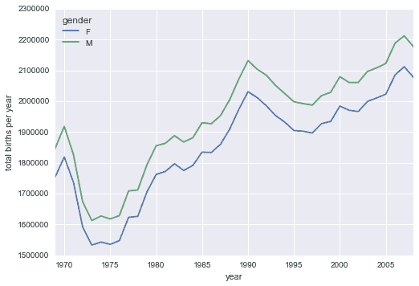
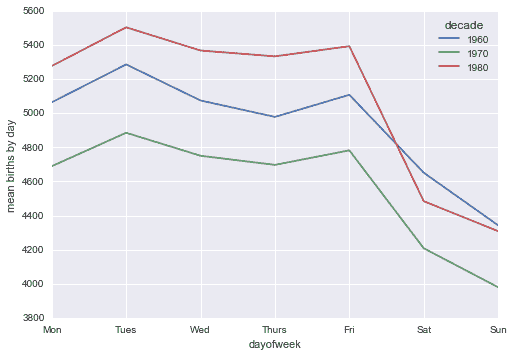

# 7.12 透视表

> 原文：[Pivot Tables](https://nbviewer.jupyter.org/github/donnemartin/data-science-ipython-notebooks/blob/master/pandas/03.09-Pivot-Tables.ipynb)
> 
> 译者：[飞龙](https://github.com/wizardforcel)
> 
> 协议：[CC BY-NC-SA 4.0](http://creativecommons.org/licenses/by-nc-sa/4.0/)
> 
> 本节是[《Python 数据科学手册》](https://github.com/jakevdp/PythonDataScienceHandbook)（Python Data Science Handbook）的摘录。

我们已经看到`GroupBy`抽象如何让我们探索数据集中的关系。透视表是一种类似的操作，常见于电子表格，和其他操作表格数据的程序中。透视表将简单的逐列数据作为输入，并将条目分组为二维表格，该表提供数据的多维汇总。

数据透视表和`GroupBy`之间的区别有时会引起混淆；它帮助我将透视表视为`GroupBy`聚合的多维版本。
也就是说，你执行分割-应用-组合，但是分割和组合都不在一维索引上执行，而是跨越二维网格。

## 透视表的动机

对于本节中的示例，我们将使用泰坦尼克上的乘客数据库，可通过 Seaborn 库获得（参见“可视化与 Seaborn”）：

```
import numpy as np
import pandas as pd
import seaborn as sns
titanic = sns.load_dataset('titanic') 
```

```
titanic.head() 
```

|  | survived | pclass | sex | age | sibsp | parch | fare | embarked | class | who | adult_male | deck | embark_town | alive | alone |
| --- | --- | --- | --- | --- | --- | --- | --- | --- | --- | --- | --- | --- | --- | --- | --- |
| 0 | 0 | 3 | male | 22.0 | 1 | 0 | 7.2500 | S | Third | man | True | NaN | Southampton | no | False |
| 1 | 1 | 1 | female | 38.0 | 1 | 0 | 71.2833 | C | First | woman | False | C | Cherbourg | yes | False |
| 2 | 1 | 3 | female | 26.0 | 0 | 0 | 7.9250 | S | Third | woman | False | NaN | Southampton | yes | True |
| 3 | 1 | 1 | female | 35.0 | 1 | 0 | 53.1000 | S | First | woman | False | C | Southampton | yes | False |
| 4 | 0 | 3 | male | 35.0 | 0 | 0 | 8.0500 | S | Third | man | True | NaN | Southampton | no | True |

这包含这个厄运的航程的每位乘客的大量信息，包括性别，年龄，班级，支付的票价等等。

## 手动创建透视表

为了开始更加了解这些数据，我们可以根据性别，生存状态或其某些组合进行分组。如果你已阅读上一节，你可能会想要应用`GroupBy`操作 - 例如，让我们按性别查看存活率：

```
titanic.groupby('sex')[['survived']].mean() 
```

|  | survived |
| --- | --- |
| sex |  |
| female | 0.742038 |
| male | 0.188908 |

这立即给了我们一些见解：总体而言，船上每四名女性中就有三名幸免于难，而五分之一的男性幸免于难！

这很有用，但我们可能更深入一步，看看性别，比如舱位的生存情况。使用`GroupBy`的词汇表，我们可以继续执行这样的过程：我们分组舱位和性别，选择生存列，应用平均聚合，组合生成的分组，然后对分层索引取消堆叠，来揭示隐藏的多维度。 在代码中：

```
titanic.groupby(['sex', 'class'])['survived'].aggregate('mean').unstack() 
```

| class | First | Second | Third |
| --- | --- | --- | --- |
| sex |  |  |  |
| female | 0.968085 | 0.921053 | 0.500000 |
| male | 0.368852 | 0.157407 | 0.135447 |

这让我们更好地了解性别和舱位如何影响生存，但代码开始看起来有点乱。虽然根据我们之前讨论过的工具，这条流水线的每一步都是有意义的，但是长串代码并不是特别容易阅读或使用。这个二维的`GroupBy`很常见，Pandas 包含一个便利例程`pivot_table`，它简洁地处理了这类多维聚合。

## 透视表语法

这里是`DataFrame`的`pivot_table`方法，等效于前面的操作：

```
titanic.pivot_table('survived', index='sex', columns='class') 
```

| class | First | Second | Third |
| --- | --- | --- | --- |
| sex |  |  |  |
| female | 0.968085 | 0.921053 | 0.500000 |
| male | 0.368852 | 0.157407 | 0.135447 |

这比`groupby`方法更可读，并产生相同的结果。正如你对 20 世纪早期的跨大西洋游轮所期望的那样，生存梯度有利于女性和更高舱位的游客。头等舱女性几乎一定能幸存下来（嗨，罗斯！），而十分之一的三等舱男性幸存下来（对不起，杰克！）。

### 多层透视表

就像在`GroupBy`中一样，透视表中的分组可以使用多个层次指定，也可以通过多个选项指定。例如，我们可能有兴趣将年龄看作第三个维度。我们将使用`pd.cut`函数来填充年龄：

```
age = pd.cut(titanic['age'], [0, 18, 80])
titanic.pivot_table('survived', ['sex', age], 'class') 
```

|  | class | First | Second | Third |
| --- | --- | --- | --- | --- |
| sex | age |  |  |  |
| female | (0, 18] | 0.909091 | 1.000000 | 0.511628 |
| (18, 80] | 0.972973 | 0.900000 | 0.423729 |  |
| male | (0, 18] | 0.800000 | 0.600000 | 0.215686 |
| (18, 80] | 0.375000 | 0.071429 | 0.133663 |  |

我们也可以在处理列时应用相同的策略；让我们添加使用`pd.qcut`支付的票价信息，来自动计算分位数：

```
fare = pd.qcut(titanic['fare'], 2)
titanic.pivot_table('survived', ['sex', age], [fare, 'class']) 
```

|  | fare | [0, 14.454] | (14.454, 512.329] |
| --- | --- | --- | --- |
|  | class | First | Second |
| sex | age |  |  |
| female | (0, 18] | NaN | 1.000000 |
| (18, 80] | NaN | 0.880000 | 0.444444 |
| male | (0, 18] | NaN | 0.000000 |
| (18, 80] | 0.0 | 0.098039 | 0.125000 |

结果是具有分层索引的四维聚合（参见“分层索引”），在网格中显示了值之间的关系。

### 额外的透视表选项

The full call signature of the `pivot_table` method of `DataFrame`s is as follows:

```
# Pandas 0.18 的签名
DataFrame.pivot_table(data, values=None, index=None, columns=None,
                      aggfunc='mean', fill_value=None, margins=False,
                      dropna=True, margins_name='All') 
```

我们已经看到了前三个参数的例子；在这里，我们将快速浏览其余的。其中两个选项`fill_value`和`dropna`与缺失数据有关，而且非常简单；我们不会在这里展示它们的例子。

`aggfunc`关键字控制应用的聚合类型，默认情况下是均值。与在`GroupBy`中一样，聚合规则可以是表示几种常见选择之一的字符串（例如，`'sum'`，`'mean'`，`'count'`，`'min'`，`'max'`等）或实现聚合的函数（例如，`np.sum()`，`min()`，`sum()`， 等等。）。此外，它可以指定为，将列映射到任何上述所需选项的字典：

```
titanic.pivot_table(index='sex', columns='class',
                    aggfunc={'survived':sum, 'fare':'mean'}) 
```

|  | fare | survived |
| --- | --- | --- |
| class | First | Second |
| sex |  |  |
| female | 106.125798 | 21.970121 |
| male | 67.226127 | 19.741782 |

另请注意，我们省略了`values`关键字；在为`aggfunc`指定映射时，会自动确定。

有时，计算每个分组的总数是有用的。这可以通过`margins`关键字来完成：

```
titanic.pivot_table('survived', index='sex', columns='class', margins=True) 
```

| class | First | Second | Third | All |
| --- | --- | --- | --- | --- |
| sex |  |  |  |  |
| female | 0.968085 | 0.921053 | 0.500000 | 0.742038 |
| male | 0.368852 | 0.157407 | 0.135447 | 0.188908 |
| All | 0.629630 | 0.472826 | 0.242363 | 0.383838 |

在这里，它会自动为我们提供，按性别划分的舱位生存率，按舱位划分的性别生存率，以及 38% 的总生存率的信息。可以使用`margins_name`关键字指定`margin`标签，默认为`"All"`。

## 示例：出生率数据

作为一个更有趣的例子，让我们来看看美国疾病控制中心（CDC）提供的免费提供的美国出生数据。这些数据可以在 [https://raw.githubusercontent.com/jakevdp/data-CDCbirths/master/births.csv](https://raw.githubusercontent.com/jakevdp/data-CDCbirths/master/births.csv) 找到。（这个数据集已由 Andrew Gelman 及其小组进行了相当广泛的分析；例如[此博客文章](http://andrewgelman.com/2012/06/14/cool-ass-signal-processing-using-gaussian-processes/)）：

```
# 下载数据的 shell 命令：
# !curl -O https://raw.githubusercontent.com/jakevdp/data-CDCbirths/master/births.csv 
```

```
births = pd.read_csv('data/births.csv') 
```

看一下数据，我们看到它相对简单 - 它包含按日期和性别分组的出生人数：

```
births.head() 
```

|  | year | month | day | gender | births |
| --- | --- | --- | --- | --- | --- |
| 0 | 1969 | 1 | 1 | F | 4046 |
| 1 | 1969 | 1 | 1 | M | 4440 |
| 2 | 1969 | 1 | 2 | F | 4454 |
| 3 | 1969 | 1 | 2 | M | 4548 |
| 4 | 1969 | 1 | 3 | F | 4548 |

我们可以通过使用数据透视表开始更加了解这些数据。
让我们添加`decade`列，并看看男性和女性的出生对于十年的函数：

```
births['decade'] = 10 * (births['year'] // 10)
births.pivot_table('births', index='decade', columns='gender', aggfunc='sum') 
```

| gender | F | M |
| --- | --- | --- |
| decade |  |  |
| 1960 | 1753634 | 1846572 |
| 1970 | 16263075 | 17121550 |
| 1980 | 18310351 | 19243452 |
| 1990 | 19479454 | 20420553 |
| 2000 | 18229309 | 19106428 |

我们立即看到，每十年中男性的出生人数超过了女性的出生人数。
为了更清楚地看到这一趋势，我们可以使用 Pandas 中的内置绘图工具来显示每年的出生总数（Matplotlib 绘图的讨论请参见“Matplotlib 简介”）：

```
%matplotlib inline
import matplotlib.pyplot as plt
sns.set()  # 使用 Seaborn 风格
births.pivot_table('births', index='year', columns='gender', aggfunc='sum').plot()
plt.ylabel('total births per year'); 
```



使用简单的数据透视表和`plot()`方法，我们可以立即看到按性别划分的出生年度趋势。看上去，过去 50 年来，男性出生人数超过女性出生人数约 5%。

### 深入的数据探索

虽然这不一定与透视表有关，但我们可以使用到目前为止涵盖的 Pandas 工具，从这个数据集中提取一些更有趣的特征。我们必须从一点清理数据开始，删除由错误日期（例如，6 月 31 日）或缺失值（例如，6 月 99 日）产生的异常值。一次性删除所有这些的简单方法是截断异常值；我们将通过强大的 sigma-clipping 操作来完成此操作：

```
quartiles = np.percentile(births['births'], [25, 50, 75])
mu = quartiles[1]
sig = 0.74 * (quartiles[2] - quartiles[0]) 
```

最后一行是样本均值的稳健估计，其中 0.74 来自高斯分布的四分位数范围（你可以在我与 ?eljkoIvezi?，Andrew J. Connolly 和 Alexander Gray 共同撰写的一本书中，了解更多 sigma-clipping 操作的信息：[“Statistics, Data Mining, and Machine Learning in Astronomy”](http://press.princeton.edu/titles/10159.html)（普林斯顿大学出版社，2014 年））。

有了这个，我们可以使用`query()`方法（在“高性能 Pandas：`eval()`和`query()`”中进一步讨论）过滤掉出生数量在这些值以外的行：

```
births = births.query('(births > @mu - 5 * @sig) & (births < @mu + 5 * @sig)') 
```

接下来我们将`day`列设置为整数；以前它是一个字符串，因为数据集中的某些列包含值`'null'`：

```
# 将 'day' 列设为整数，由于 null 它原来是字符串
births['day'] = births['day'].astype(int) 
```

最后，我们可以组合年月日来创建日期索引（请参阅“处理时间序列”）。这允许我们快速计算每行对应的工作日：

```
# 从年月日创建 datetime 索引
births.index = pd.to_datetime(10000 * births.year +
                              100 * births.month +
                              births.day, format='%Y%m%d')

births['dayofweek'] = births.index.dayofweek 
```

有了这个，我们可以按工作日绘制几个十年的出生人数：

```
import matplotlib.pyplot as plt
import matplotlib as mpl

births.pivot_table('births', index='dayofweek',
                    columns='decade', aggfunc='mean').plot()
plt.gca().set_xticklabels(['Mon', 'Tues', 'Wed', 'Thurs', 'Fri', 'Sat', 'Sun'])
plt.ylabel('mean births by day'); 
```



显然，周末出生的人数比工作日要少一些！ 请注意，由于疾病预防控制中心的数据仅包含从 1989 年开始的出生月份，因此缺少 20 世纪 90 年代和 21 实际 00 年代。

另一个有趣的观点是绘制一年中每天的平均出生数。我们首先分别按月和日分组数据：

```
births_by_date = births.pivot_table('births', 
                                    [births.index.month, births.index.day])
births_by_date.head()

'''
1  1    4009.225
   2    4247.400
   3    4500.900
   4    4571.350
   5    4603.625
Name: births, dtype: float64
''' 
```

结果是月和日的多重索引。为了使这个容易绘制，我们将这些月份和日期转换为一个日期，方法是将它们与虚拟年份变量关联（确保选择闰年来正确处理 2 月 29 日！）

```
births_by_date.index = [pd.datetime(2012, month, day)
                        for (month, day) in births_by_date.index]
births_by_date.head()

'''
2012-01-01    4009.225
2012-01-02    4247.400
2012-01-03    4500.900
2012-01-04    4571.350
2012-01-05    4603.625
Name: births, dtype: float64
''' 
```

我们只关注月和日，我们现在有了一个时间序列，反映了一年中每天的平均出生人数。由此，我们可以使用`plot`方法绘制数据。 它揭示了一些有趣的趋势：

```
# 绘制结果
fig, ax = plt.subplots(figsize=(12, 4))
births_by_date.plot(ax=ax); 
```


特别是，该图的显着特征是美国假期（例如，独立日，劳动节，感恩节，圣诞节，新年）的出生率下降，尽管这可能反映了预定/诱导分娩的趋势，而不是自然分娩的一些深层的心身影响。对于此趋势的更多讨论，请参阅 [Andrew Gelman 的博客文章](http://andrewgelman.com/2012/06/14/cool-ass-signal-processing-using-gaussian-processes/)中这个主题的分析和链接。我们将在“示例：美国出生率的假期效应”中返回此图，我们将使用 Matplotlib 的工具来注解这个图。

看一下这个简短的例子，你可以看到，我们在这一点上看到的许多 Python 和 Pandas 工具，可以结合起来用于从各种数据集中获得洞察力。我们将在以后的章节中，看到这些数据操作的一些更复杂的应用！