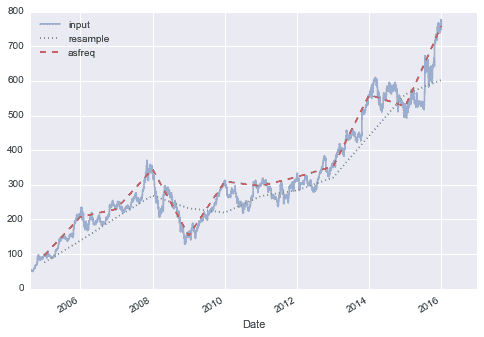
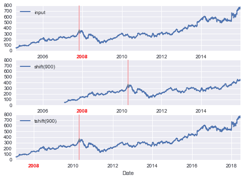
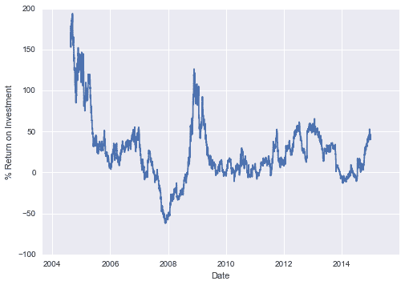
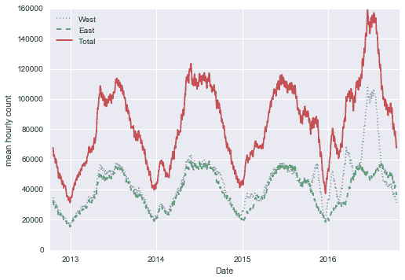
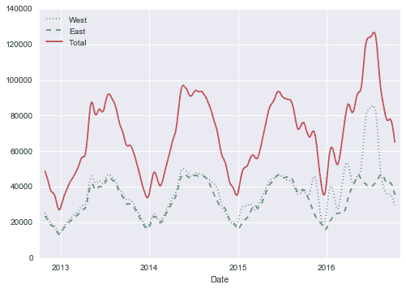
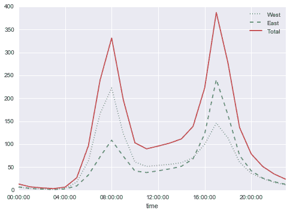
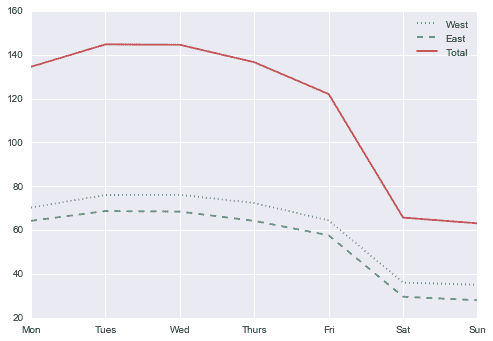

# 7.14 处理时间序列

> 原文：[Working with Time Series](https://nbviewer.jupyter.org/github/donnemartin/data-science-ipython-notebooks/blob/master/pandas/03.11-Working-with-Time-Series.ipynb)
> 
> 译者：[飞龙](https://github.com/wizardforcel)
> 
> 协议：[CC BY-NC-SA 4.0](http://creativecommons.org/licenses/by-nc-sa/4.0/)
> 
> 本节是[《Python 数据科学手册》](https://github.com/jakevdp/PythonDataScienceHandbook)（Python Data Science Handbook）的摘录。

Pandas 是在金融建模的背景下开发的，正如你所料，它包含一组相当广泛的工具，用于处理日期，时间和时间索引数据。日期和时间数据有几种，我们将在这里讨论：

*   时间戳：引用特定时刻（例如，2015 年 7 月 4 日上午 7:00）。
*   时间间隔（interval）和时间段：引用特定开始和结束点之间的时间长度；例如，2015 年。时间段通常引用时间间隔的特殊情况，其中每个间隔具有统一的长度并且不重叠（例如，构成每天的 24 小时长的时间段）。
*   时间增量或间隔（duration）：引用确切的时间长度（例如，间隔为 22.56 秒）。

在本节中，我们将介绍如何在 Pandas 中使用这些类型的日期/时间数据。这个简短的章节绝不是 Python 或 Pandas 中可用的时间序列工具的完整指南，而是用户应如何处理时间序列的广泛概述。

我们将首先简要讨论 Python 中处理日期和时间的工具，然后再更具体地讨论 Pandas 提供的工具。在列出了一些更深入的资源之后，我们将回顾一些在 Pandas 中处理时间序列数据的简短示例。

## Python 中的日期和时间

Python 世界有许多可用的日期，时间，增量和时间跨度表示。虽然 Pandas 提供的时间序列工具往往对数据科学应用最有用，但查看它们与 Python 中使用的其他包的关系会很有帮助。

### Python 原生日期和时间：`datetime`和`dateutil`

Python 处理日期和时间的基本对象位于内置的`datetime`模块中。你可以与第三方`dateutil`模块一起使用它，在日期和时间快速执行许多有用的功能。例如，你可以使用`datetime`类型手动构建日期：

```
from datetime import datetime
datetime(year=2015, month=7, day=4)

# datetime.datetime(2015, 7, 4, 0, 0) 
```

或者，使用`dateutil`模块，你可以从各种字符串格式解析日期：

```
from dateutil import parser
date = parser.parse("4th of July, 2015")
date

# datetime.datetime(2015, 7, 4, 0, 0) 
```

一旦你有了`datetime`对象，你可以做一些事情，比如打印星期几：

```
date.strftime('%A')

# 'Saturday' 
```

在最后一行中，我们使用了一个标准的字符串格式代码来打印星期几（`"%A"`），你可以阅读 [Python `datetime`文档的`strftime`部分](https://docs.python.org/3/library/datetime.html)。其他有用的日期工具的文档，可以在[`dateutil`的在线文档](http://labix.org/python-dateutil)中找到。需要注意的一个相关包是[`pytz`](http://pytz.sourceforge.net/)，其中包含用于处理时区的工具，它是大部分时间序列数据的令人头疼的部分。

`datetime`和`dateutil`的强大之处，是它们的灵活性和简单的语法：你可以使用这些对象及其内置方法，轻松执行你可能感兴趣的几乎任何操作。
他们的缺陷是当你处理大量的日期和时间的时候：

正如 Python 数值变量的列表不如 NumPy 风格的数值数组，与编码日期的类型化数组相比，Python 日期时间对象的列表不是最优的。

### 时间的类型化数组：NumPy 的`datetime64`

Python 的日期时间格式的缺陷，启发了 NumPy 团队，向 NumPy 添加一组原生时间序列数据类型。`datetime64 dtype`将日期编码为 64 位整数，因此可以非常紧凑地表示日期数组。`datetime64`需要一个非常具体的输入格式：

```
import numpy as np
date = np.array('2015-07-04', dtype=np.datetime64)
date

# array(datetime.date(2015, 7, 4), dtype='datetime64[D]') 
```

但是，一旦我们格式化了这个日期，我们就可以快速对它进行向量化操作：

```
date + np.arange(12)

'''
array(['2015-07-04', '2015-07-05', '2015-07-06', '2015-07-07',
       '2015-07-08', '2015-07-09', '2015-07-10', '2015-07-11',
       '2015-07-12', '2015-07-13', '2015-07-14', '2015-07-15'], dtype='datetime64[D]')
''' 
```

由于 NumPy `datetime64`数组中的统一类型，这类操作可以比我们直接使用 Python 的`datetime`对象快得多，特别是当数组变大时（我们在“NumPy 数组的计算：通用函数”中介绍了这种类型的向量化）。

`datetime64`和`timedelta64`对象的一个细节是，它们建立在基本时间单位上。因为`datetime64`对象限制为 64 位精度，所以可编码时间的范围是这个基本单位的`2^64`倍。换句话说，`datetime64`在时间分辨率和最大时间跨度之间进行权衡。

例如，如果你想要纳秒的时间分辨率，你只有足够的信息来编码`2^64`纳秒或不到 600 年的范围。NumPy 将从输入中推断出所需的单位；例如，这是基于日期的日期时间：

```
np.datetime64('2015-07-04')

# numpy.datetime64('2015-07-04') 
```

这是基于分钟的日期时间：

```
np.datetime64('2015-07-04 12:00')

# numpy.datetime64('2015-07-04T12:00') 
```

请注意，时区会自动设置为执行代码的计算机上的本地时间。你可以使用多种格式代码之一，来强制任何所需的基本单位；例如，在这里我们将强制基于纳秒的时间：

```
np.datetime64('2015-07-04 12:59:59.50', 'ns')

# numpy.datetime64('2015-07-04T12:59:59.500000000') 
```

下表来自 [NumPy `datetime64`文档](http://docs.scipy.org/doc/numpy/reference/arrays.datetime.html)，列出了可用的格式代码，以及它们可以编码的相对和绝对时间跨度：

| 代码 | 含义 | 时间跨度（相对） | 时间跨度（绝对） |
| --- | --- | --- | --- |
| `Y` | 年 | ± 9.2e18 年 | [9.2e18 BC, 9.2e18 AD] |
| `M` | 月 | ± 7.6e17 年 | [7.6e17 BC, 7.6e17 AD] |
| `W` | 星期 | ± 1.7e17 年 | [1.7e17 BC, 1.7e17 AD] |
| `D` | 日 | ± 2.5e16 年 | [2.5e16 BC, 2.5e16 AD] |
| `h` | 小时 | ± 1.0e15 年 | [1.0e15 BC, 1.0e15 AD] |
| `m` | 分钟 | ± 1.7e13 年 | [1.7e13 BC, 1.7e13 AD] |
| `s` | 秒钟 | ± 2.9e12 年 | [ 2.9e9 BC, 2.9e9 AD] |
| `ms` | 毫秒 | ± 2.9e9 年 | [ 2.9e6 BC, 2.9e6 AD] |
| `us` | 微秒 | ± 2.9e6 年 | [290301 BC, 294241 AD] |
| `ns` | 纳秒 | ± 292 年 | [ 1678 AD, 2262 AD] |
| `ps` | 皮秒 | ± 106 天 | [ 1969 AD, 1970 AD] |
| `fs` | 飞秒 | ± 2.6 小时 | [ 1969 AD, 1970 AD] |
| `as` | 阿秒 | ± 9.2 秒 | [ 1969 AD, 1970 AD] |

对于我们在现实世界中看到的数据类型，有用的默认值是`datetime64[ns]`，因为它可以编码现代日期的有用范围，具有相当好的精度。

最后，我们将注意到，虽然`datetime64`数据类型解决了 Python 内置`datetime`类型的一些缺陷，但它缺少`datetime`提供的许多便利方法和函数。特别是`dateutil`。更多信息可以在 [NumPy 的`datetime64`文档](http://docs.scipy.org/doc/numpy/reference/arrays.datetime.html)中找到。

### Pandas 中的日期和时间：两全其美

例如，我们可以使用 Pandas 工具重复上面的演示。我们可以解析格式灵活的字符串日期，并使用格式代码输出星期几：

```
import pandas as pd
date = pd.to_datetime("4th of July, 2015")
date

# Timestamp('2015-07-04 00:00:00') 
```

```
date.strftime('%A')

# 'Saturday' 
```

另外，我们可以直接在同一个对象上进行 NumPy 风格的向量化操作：

```
date + pd.to_timedelta(np.arange(12), 'D')

'''
DatetimeIndex(['2015-07-04', '2015-07-05', '2015-07-06', '2015-07-07',
               '2015-07-08', '2015-07-09', '2015-07-10', '2015-07-11',
               '2015-07-12', '2015-07-13', '2015-07-14', '2015-07-15'],
              dtype='datetime64[ns]', freq=None)
''' 
```

在下一节中，我们将仔细研究，使用 Pandas 提供的工具处理时间序列数据。

## Pandas 时间序列：按时间索引

Pandas 时间序列工具真正有用的地方，是按时间戳索引数据。例如，我们可以构造一个具有时间索引的`Series`对象：

```
index = pd.DatetimeIndex(['2014-07-04', '2014-08-04',
                          '2015-07-04', '2015-08-04'])
data = pd.Series([0, 1, 2, 3], index=index)
data

'''
2014-07-04    0
2014-08-04    1
2015-07-04    2
2015-08-04    3
dtype: int64
''' 
```

现在我们的`Series`中有这些数据，我们可以使用前面章节中讨论过的任何`Series`索引模式，传递可以强制转换为日期的值：

```
data['2014-07-04':'2015-07-04']

'''
2014-07-04    0
2014-08-04    1
2015-07-04    2
dtype: int64
''' 
```

还有其他特殊的仅限日期的索引操作，例如传入一年来获取该年所有数据的切片：

```
data['2015']

'''
2015-07-04    2
2015-08-04    3
dtype: int64
''' 
```

之后，我们将看到日期索引的其他便捷之处的示例。但首先，仔细研究可用的时间序列数据结构。

## Pandas 时间序列数据结构

本节将介绍用于处理时间序列数据的基本Pandas数据结构：

*   对于时间戳，Pandas 提供`Timestamp`类型。 如前所述，它本质上是 Python 原生`datetime`的替代品，但它基于更高效的`numpy.datetime64`数据类型。 相关的索引结构是`DatetimeIndex`。
*   对于时间周期，Pandas 提供`Period`类型。这基于`numpy.datetime64`编码固定频率的间隔。 相关的索引结构是`PeriodIndex`。
*   对于时间增量或间隔，Pandas 提供`Timedelta`类型。 `Timedelta`是 Python 原生`datetime.timedelta`类型的更有效的替代品，它基于`numpy.timedelta64`。相关的索引结构是`TimedeltaIndex`。

这些日期/时间对象中，最基本的是`Timestamp`和`DatetimeIndex`对象。虽然可以直接调用这些类对象，但更常见的是使用`pd.to_datetime()`函数，它可以解析各种格式。将单个日期传递给`pd.to_datetime()`会产生`Timestamp`；默认情况下传递一系列日期会产生一个`DatetimeIndex`：

```
dates = pd.to_datetime([datetime(2015, 7, 3), '4th of July, 2015',
                       '2015-Jul-6', '07-07-2015', '20150708'])
dates

'''
DatetimeIndex(['2015-07-03', '2015-07-04', '2015-07-06', '2015-07-07',
               '2015-07-08'],
              dtype='datetime64[ns]', freq=None)
''' 
```

任何`DatetimeIndex`都可以使用`to_period()`函数，转换为`PeriodIndex`并添加频率代码；在这里我们用`'D'`来表示每日频率：

```
dates.to_period('D')

'''
PeriodIndex(['2015-07-03', '2015-07-04', '2015-07-06', '2015-07-07',
             '2015-07-08'],
            dtype='int64', freq='D')
''' 
```

例如，当从日期中减去另一个日期时，会创建一个`TimedeltaIndex`：

```
dates - dates[0]

'''
TimedeltaIndex(['0 days', '1 days', '3 days', '4 days', '5 days'], dtype='timedelta64[ns]', freq=None)
''' 
```

### 常规序列：`pd.date_range()`

为了更方便地创建常规日期序列，Pandas 为此提供了一些函数：`pd.date_range()`用于时间戳，`pd.period_range()`用于周期，`pd.timedelta_range()`用于时间增量。我们已经看到，Python 的`range()`和 NumPy 的`np.arange()`将起点，终点和可选的步长转换成一个序列。类似地，`pd.date_range()`接受开始日期，结束日期和可选频率代码，来创建常规日期序列。默认情况下，频率为一天：

```
pd.date_range('2015-07-03', '2015-07-10')

'''
DatetimeIndex(['2015-07-03', '2015-07-04', '2015-07-05', '2015-07-06',
               '2015-07-07', '2015-07-08', '2015-07-09', '2015-07-10'],
              dtype='datetime64[ns]', freq='D')
''' 
```

或者，可以不使用起点和终点来指定日期范围，而是使用起始点和周期数量来指定日期范围：

```
pd.date_range('2015-07-03', periods=8)

'''
DatetimeIndex(['2015-07-03', '2015-07-04', '2015-07-05', '2015-07-06',
               '2015-07-07', '2015-07-08', '2015-07-09', '2015-07-10'],
              dtype='datetime64[ns]', freq='D')
''' 
```

可以通过改变`freq`参数来修改频率，默认为`D`。例如，这里我们将构建一系列每小时的时间戳：

```
pd.date_range('2015-07-03', periods=8, freq='H')

'''
DatetimeIndex(['2015-07-03 00:00:00', '2015-07-03 01:00:00',
               '2015-07-03 02:00:00', '2015-07-03 03:00:00',
               '2015-07-03 04:00:00', '2015-07-03 05:00:00',
               '2015-07-03 06:00:00', '2015-07-03 07:00:00'],
              dtype='datetime64[ns]', freq='H')
''' 
```

要创建`Period`或`Timedelta`值的常规序列，非常相似的`pd.period_range()`和`pd.timedelta_range()`函数是有用的。以下是一些每月的周期：

```
pd.period_range('2015-07', periods=8, freq='M')

'''
PeriodIndex(['2015-07', '2015-08', '2015-09', '2015-10', '2015-11', '2015-12',
             '2016-01', '2016-02'],
            dtype='int64', freq='M')
''' 
```

以及按小时递增的间隔序列：

```
pd.timedelta_range(0, periods=10, freq='H')

'''
TimedeltaIndex(['00:00:00', '01:00:00', '02:00:00', '03:00:00', '04:00:00',
                '05:00:00', '06:00:00', '07:00:00', '08:00:00', '09:00:00'],
               dtype='timedelta64[ns]', freq='H')
''' 
```

所有这些都需要了解 Pandas 频率代码，我们将在下一节中进行总结。

## 频率和偏移

这些 Pandas 时间序列工具的基础是频率或日期偏移的概念。就像我们在上面看到`D`（天）和`H`（小时）代码一样，我们可以使用这些代码来指定任何所需的频率间隔。下表总结了可用的主要代码：

| 代码 | 描述 | 代码 | 描述 |
| --- | --- | --- | --- |
| `D` | 日历日 | `B` | 商业日 |
| `W` | 星期 |  |  |
| `M` | 月份 | `BM` | 商业月份 |
| `Q` | 季度 | `BQ` | 商业季度 |
| `A` | 年度 | `BA` | 商业年度 |
| `H` | 小时 | `BH` | 商业小时 |
| `T` | 分钟 |  |  |
| `S` | 秒钟 |  |  |
| `L` | 毫秒 |  |  |
| `U` | 微秒 |  |  |
| `N` | 纳秒 |  |  |

月度，季度和年度的频率都标记在指定时间段的末尾。通过为这些中的任何一个添加`S`后缀，它们将在开头标记：

| 代码 | 描述 | 代码 | 描述 |
| --- | --- | --- | --- |
| `MS` | 月份的起始 | `BMS` | 商业月份的起始 |
| `QS` | 季度的起始 | `BQS` | 商业季度的起始 |
| `AS` | 年度的起始 | `BAS` | 商业年度的起始 |

此外，你可以通过添加三个字母的月份代码作为后缀，来更改用于标记任何季度或年度代码的月份：

*   `Q-JAN`，`BQ-FEB`，`QS-MAR`，`BQS-APR`，以及其他。
*   `A-JAN`，`BA-FEB`，`AS-MAR`，`BAS-APR`，以及其他。

同样，可以通过添加三个字母的星期代码，来修改每周频率的分割点：

*   `W-SUN`，`W-MON`，`W-TUE`，`W-WED`，以及其他。

除此之外，代码可以与数字组合以指定其他频率。例如，对于 2 小时 30 分钟的频率，我们可以将小时（`H`）和分钟（`T`）代码组合如下：

```
pd.timedelta_range(0, periods=9, freq="2H30T")

'''
TimedeltaIndex(['00:00:00', '02:30:00', '05:00:00', '07:30:00', '10:00:00',
                '12:30:00', '15:00:00', '17:30:00', '20:00:00'],
               dtype='timedelta64[ns]', freq='150T')
''' 
```

```
from pandas.tseries.offsets import BDay
pd.date_range('2015-07-01', periods=5, freq=BDay())

'''
DatetimeIndex(['2015-07-01', '2015-07-02', '2015-07-03', '2015-07-06',
               '2015-07-07'],
              dtype='datetime64[ns]', freq='B')
''' 
```

频率和偏移的使用的更多讨论，请参阅 Pandas 文档的“日期偏移”部分。

## 重采样，平移和窗口化

使用日期和时间作为索引，来直观地组织和访问数据的能力，是 Pandas 时间序列工具的重要组成部分。一般情况下，索引数据的优势（操作期间的自动对齐，直观的数据切片和访问等）仍然有效，并且 Pandas 提供了一些额外的时间序列特定的操作。

我们将以一些股票价格数据为例，看看其中的一些。由于 Pandas 主要是在金融环境中开发的，因此它包含一些非常具体的金融数据工具。

例如，附带的`pandas-datareader`包（可通过`conda install pandas-datareader`安装）知道如何从许多可用来源导入金融数据，包括 Yahoo finance，Google Finance 等。在这里，我们将加载 Google 的收盘价历史记录：

```
from pandas_datareader import data

goog = data.DataReader('GOOG', start='2004', end='2016',
                       data_source='google')
goog.head() 
```

|  | Open | High | Low | Close | Volume |
| --- | --- | --- | --- | --- | --- |
| Date |  |  |  |  |  |
| 2004-08-19 | 49.96 | 51.98 | 47.93 | 50.12 | NaN |
| 2004-08-20 | 50.69 | 54.49 | 50.20 | 54.10 | NaN |
| 2004-08-23 | 55.32 | 56.68 | 54.47 | 54.65 | NaN |
| 2004-08-24 | 55.56 | 55.74 | 51.73 | 52.38 | NaN |
| 2004-08-25 | 52.43 | 53.95 | 51.89 | 52.95 | NaN |

为简单起见，我们仅使用收盘价：

```
goog = goog['Close'] 
```

在普通的 Matplotlib 样板设置之后，我们可以使用`plot()`方法将其可视化（参见第四章））：

```
%matplotlib inline
import matplotlib.pyplot as plt
import seaborn; seaborn.set() 
```

```
goog.plot(); 
```


### 重采样和转换频率

时间序列数据的一个常见需求，是以更高或更低的频率重采样。这可以使用`resample()`方法，或更简单的`asfreq()`方法来完成。两者之间的主要区别在于，`resample()`基本上是数据聚合，而`asfreq()`基本上是数据选择。

看一下谷歌的收盘价，让我们比较一下我们对数据下采样时的回报。在这里，我们将在商业年度结束时重采样数据：

```
goog.plot(alpha=0.5, style='-')
goog.resample('BA').mean().plot(style=':')
goog.asfreq('BA').plot(style='--');
plt.legend(['input', 'resample', 'asfreq'],
           loc='upper left'); 
```



注意区别：在每一点，`resample`报告前一年的平均值，而`asfreq`报告年末的值。

对于上采样，`resample()`和`asfreq()`在很大程度上是等效的，尽管`resample`有更多可用的选项。在这种情况下，两种方法的默认设置是将上采样点留空，即填充 NA 值。就像之前讨论过的`pd.fillna()`函数一样，`asfreq()`接受一个`method`参数来指定值的估算方式。在这里，我们将以每日频率（即包括周末）重新采样商业日数据：

```
fig, ax = plt.subplots(2, sharex=True)
data = goog.iloc[:10]

data.asfreq('D').plot(ax=ax[0], marker='o')

data.asfreq('D', method='bfill').plot(ax=ax[1], style='-o')
data.asfreq('D', method='ffill').plot(ax=ax[1], style='--o')
ax[1].legend(["back-fill", "forward-fill"]); 
```


顶部面板是默认值：非工作日保留为 NA 值，并且不会显示在图表上。底部面板显示填补空白的两种策略之间的差异：向前填充和向后填充。

### 时间平移

另一种常见的时间序列特定的操作是按时间平移数据。Pandas 有两个密切相关的计算方法：`shift()`和`tshift()`。简而言之，它们之间的区别在于，`shift()`平移数据，而`tshift()`平移索引。在这两种情况下，平移都指定为频率的倍数。

在这里，我们使用`shift()`和`tshift()`来平移 900 天；

```
fig, ax = plt.subplots(3, sharey=True)

# 对数据应用频率
goog = goog.asfreq('D', method='pad')

goog.plot(ax=ax[0])
goog.shift(900).plot(ax=ax[1])
goog.tshift(900).plot(ax=ax[2])

# 图例和注解
local_max = pd.to_datetime('2007-11-05')
offset = pd.Timedelta(900, 'D')

ax[0].legend(['input'], loc=2)
ax[0].get_xticklabels()[2].set(weight='heavy', color='red')
ax[0].axvline(local_max, alpha=0.3, color='red')

ax[1].legend(['shift(900)'], loc=2)
ax[1].get_xticklabels()[2].set(weight='heavy', color='red')
ax[1].axvline(local_max + offset, alpha=0.3, color='red')

ax[2].legend(['tshift(900)'], loc=2)
ax[2].get_xticklabels()[1].set(weight='heavy', color='red')
ax[2].axvline(local_max + offset, alpha=0.3, color='red'); 
```



我们在这里看到`shift(900)`将数据移动 900 天，将其中的一些移出图的末尾（并在另一端留下 NA 值），而``tshift(900)将索引移动 900 天。

这种类型转换的常见背景，是计算随时间的差异。 例如，我们使用移位值来计算 Google 股票在数据集过程中的一年投资回报：

```
ROI = 100 * (goog.tshift(-365) / goog - 1)
ROI.plot()
plt.ylabel('% Return on Investment'); 
```



这有助于我们看到谷歌股票的总体趋势：到目前为止，投资谷歌的最有利的时期（回想一下，不出所料）在其 IPO 后不久，以及在 2009 年中期经济衰退期间。

### 滚动窗口

滚动统计量是 Pandas 实现的第三种时间序列特定的操作。
这些可以通过`Series`和`DataFrame`对象的`rolling()`属性来完成，它返回一个视图，类似于我们在`groupby`操作中看到的东西（参见“聚合和分组”）。这个滚动视图默认提供许多聚合操作。

例如，以下是 Google 股票价格的一年中心化滚动均值和标准差：

```
rolling = goog.rolling(365, center=True)

data = pd.DataFrame({'input': goog,
                     'one-year rolling_mean': rolling.mean(),
                     'one-year rolling_std': rolling.std()})
ax = data.plot(style=['-', '--', ':'])
ax.lines[0].set_alpha(0.3) 
```


与分组操作一样，`aggregate()`和`apply()`方法可用于自定义滚动计算。

## 在哪里了解更多

本节仅简要概述了 Pandas 提供的时间序列工具的一些最基本功能；更完整的讨论请参阅 Pandas 在线文档的[“时间序列/日期”部分](http://pandas.pydata.org/pandas-docs/stable/timeseries.html)。另一个优秀的资源是 Wes McKinney 的书籍[《利用 Python 进行数据分析》](https://github.com/apachecn/pyda-2e-zh)（Python for Data Analysis (OReilly 2012)）。

虽然现在已有几年历史，但它是 Pandas 用法的宝贵资源。特别是，本书重点讲解商业和金融环境中的时间序列工具，并更多地关注商业日历，时区和相关主题的特定细节。

与往常一样，你也可以使用 IPython 帮助功能，来探索和尝试可用于此处讨论的函数和方法的更多选项。 我发现这通常是学习新 Python 工具的最佳方式。

## 示例：可视化西雅图自行车数量

作为处理时间序列数据的一个更为复杂的例子，让我们来看看西雅图[Fremont Bridge](http://www.openstreetmap.org/#map=17/47.64813/-122.34965)的自行车数量。这些数据来自于 2012 年底安装的自动化自行车计数器，在桥的东西侧人行道上设有感应式传感器。每小时自行车计数可以从 [http://data.seattle.gov/](http://data.seattle.gov/) 下载；这是[数据集的直接链接](https://data.seattle.gov/Transportation/Fremont-Bridge-Hourly-Bicycle-Counts-by-Month-Octo/65db-xm6k)。

截至 2016 年夏季，CSV 可以按如下方式下载：

```
# !curl -o FremontBridge.csv https://data.seattle.gov/api/views/65db-xm6k/rows.csv?accessType=DOWNLOAD 
```

下载此数据集后，我们可以使用 Pandas 将 CSV 读入`DataFrame`。我们将指定，我们希望`Date`作为索引，并且我们希望自动解析这些日期：

```
data = pd.read_csv('FremontBridge.csv', index_col='Date', parse_dates=True)
data.head() 
```

|  | Fremont Bridge West Sidewalk | Fremont Bridge East Sidewalk |
| --- | --- | --- |
| Date |  |  |
| 2012-10-03 00:00:00 | 4.0 | 9.0 |
| 2012-10-03 01:00:00 | 4.0 | 6.0 |
| 2012-10-03 02:00:00 | 1.0 | 1.0 |
| 2012-10-03 03:00:00 | 2.0 | 3.0 |
| 2012-10-03 04:00:00 | 6.0 | 1.0 |

为方便起见，我们将通过缩短列名并添加`'Total'`列，来进一步处理此数据集：

```
data.columns = ['West', 'East']
data['Total'] = data.eval('West + East') 
```

现在让我们来看看这些数据的摘要统计信息：

```
data.dropna().describe() 
```

|  | West | East | Total |
| --- | --- | --- | --- |
| count | 35752.000000 | 35752.000000 | 35752.000000 |
| mean | 61.470267 | 54.410774 | 115.881042 |
| std | 82.588484 | 77.659796 | 145.392385 |
| min | 0.000000 | 0.000000 | 0.000000 |
| 25% | 8.000000 | 7.000000 | 16.000000 |
| 50% | 33.000000 | 28.000000 | 65.000000 |
| 75% | 79.000000 | 67.000000 | 151.000000 |
| max | 825.000000 | 717.000000 | 1186.000000 |

### 可视化数据

我们可以通过可视化来获得对数据集的一些了解。让我们从绘制原始数据开始：

```
%matplotlib inline
import seaborn; seaborn.set() 
```

```
data.plot()
plt.ylabel('Hourly Bicycle Count'); 
```


大约 25,000 小时的样本太密集了，我们无法理解。我们可以通过将数据重采样到更粗糙的网格，来获得更多见解。让我们按周重采样：

```
weekly = data.resample('W').sum()
weekly.plot(style=[':', '--', '-'])
plt.ylabel('Weekly bicycle count'); 
```


这向我们展示了一些有趣的季节性趋势：正如你所料，人们在夏天骑自行车比冬季更多，甚至在特定的季节内，自行车的使用每周也不同（可能取决于天气；参见“深度：线性回归”，我们在那里进一步探索它）。

另一种方便的汇总数据的方法是滚动均值，使用`pd.rolling_mean()`函数。在这里，我们将对数据进行 30 天的滚动操作，确保窗口居中：

```
daily = data.resample('D').sum()
daily.rolling(30, center=True).sum().plot(style=[':', '--', '-'])
plt.ylabel('mean hourly count'); 
```



结果的锯齿状是由于窗口的硬截断造成的。我们可以使用窗口函数（例如，高斯窗口）获得更平滑的滚动平均版本。以下代码指定了窗口的宽度（我们选择了 50 天）和窗口内的高斯宽度（我们选择了 10 天）：

```
daily.rolling(50, center=True,
              win_type='gaussian').sum(std=10).plot(style=[':', '--', '-']); 
```



### 深挖数据

虽然这些平滑的数据视图对于了解数据的总体趋势很有用，但它们隐藏了许多有趣的结构。例如，我们可能希望，将平均流量视为一天中的时间的函数。我们可以使用“聚合和分组”中讨论的`GroupBy`功能来执行此操作：

```
by_time = data.groupby(data.index.time).mean()
hourly_ticks = 4 * 60 * 60 * np.arange(6)
by_time.plot(xticks=hourly_ticks, style=[':', '--', '-']); 
```



每小时流量是一个强烈的双峰分布，早上 8 点到晚上 5 点都是峰值。这可能是一个重要证据，通勤交通的一个重要组成部分跨越桥梁。西侧人行道（通常用于前往西雅图市中心）和东侧的人行道（通常用于远离西雅图市中心）之间的差异，进一步证明了这一点，前者在早上是强烈的峰值，而后者在晚上是强烈的峰值。

我们也可能对事情如何基于一周中的某一天发生变化感到好奇。 同样，我们可以通过一个简单的`groupby`来实现：

```
by_weekday = data.groupby(data.index.dayofweek).mean()
by_weekday.index = ['Mon', 'Tues', 'Wed', 'Thurs', 'Fri', 'Sat', 'Sun']
by_weekday.plot(style=[':', '--', '-']); 
```



这显示了工作日和周末数量之间的强烈差异，周一至周五过桥的平均骑手数量是周六和周日的两倍。

考虑到这一点，让我们执行复合的`GroupBy`，看一下工作日和周末的每小时趋势。我们首先按照标记周末的标志，和一天中的时间分组：

```
weekend = np.where(data.index.weekday < 5, 'Weekday', 'Weekend')
by_time = data.groupby([weekend, data.index.time]).mean() 
```

现在我们将使用“多个子图”中描述的一些 Matplotlib 工具，来并排绘制两个面板：

```
import matplotlib.pyplot as plt
fig, ax = plt.subplots(1, 2, figsize=(14, 5))
by_time.ix['Weekday'].plot(ax=ax[0], title='Weekdays',
                           xticks=hourly_ticks, style=[':', '--', '-'])
by_time.ix['Weekend'].plot(ax=ax[1], title='Weekends',
                           xticks=hourly_ticks, style=[':', '--', '-']); 
```


结果非常有趣：我们在工作日期间看到双峰通勤模式，在周末看到单峰休闲模式。更详细地挖掘这些数据，并检查天气，温度，一年中的时间，以及其他因素对人们通勤模式的影响，将会很有趣；进一步的讨论请参阅我的博客文章[“Is Seattle Really Seeing an Uptick In Cycling?”](https://jakevdp.github.io/blog/2014/06/10/is-seattle-really-seeing-an-uptick-in-cycling/)，它使用这些数据的一个子集。我们还将在“深入：线性回归”中的建模环境中，回顾这个数据集。