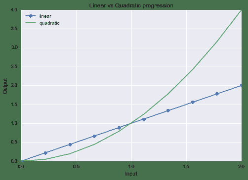
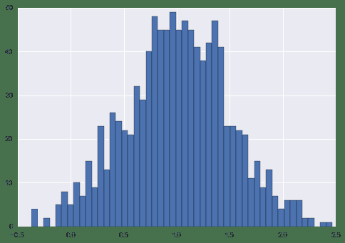
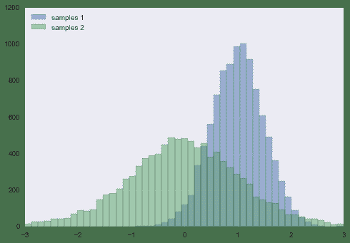

# 8.1 matplotlib

> 原文：[matplotlib](https://nbviewer.jupyter.org/github/donnemartin/data-science-ipython-notebooks/blob/master/matplotlib/matplotlib.ipynb)
> 
> 译者：[飞龙](https://github.com/wizardforcel)
> 
> 协议：[CC BY-NC-SA 4.0](http://creativecommons.org/licenses/by-nc-sa/4.0/)
> 
> 致谢：派生于 Olivier Grisel 的 [sklearn 和 IPython 并行机器学习](https://github.com/ogrisel/parallel_ml_tutorial)

*   设置全局参数
*   基本绘图
*   直方图
*   相同绘图上的两个直方图
*   散点图

```
%matplotlib inline
import pandas as pd
import numpy as np
import pylab as plt
import seaborn 
```

## 设置全局参数

```
# 设置 matplotlib 图形的全局默认大小
plt.rc('figure', figsize=(10, 5))

# 将 seaborn 美学参数设为默认值
seaborn.set() 
```

## 基本绘图

```
x = np.linspace(0, 2, 10)

plt.plot(x, x, 'o-', label='linear')
plt.plot(x, x ** 2, 'x-', label='quadratic')

plt.legend(loc='best')
plt.title('Linear vs Quadratic progression')
plt.xlabel('Input')
plt.ylabel('Output');
plt.show() 
```



## 直方图

```
# 高斯，均值 1，标准差 0.5，1000 个元素
samples = np.random.normal(loc=1.0, scale=0.5, size=1000)
print(samples.shape)
print(samples.dtype)
print(samples[:30])
plt.hist(samples, bins=50);
plt.show()

'''
(1000,)
float64
[ 0.6806888   0.72202042  1.40490113  1.13979846  0.5729488   1.32584077
  0.61635621  0.60340336  1.29453467  0.69841457  0.6975998   0.72315991
  0.66912189  1.03420801  0.62283168  0.38582511  0.89488414  1.4802518
  1.43819256  0.98605861  0.60402232  1.03820507  0.35598796  1.32901087
  1.03194436  1.3374366   1.82526334  1.26614489  1.20061661  0.86344001]
''' 
```



## 相同绘图上的两个直方图

```
samples_1 = np.random.normal(loc=1, scale=.5, size=10000)
samples_2 = np.random.standard_t(df=10, size=10000)
bins = np.linspace(-3, 3, 50)

# 设置透明度，并使用相同的桶
# 因为我们绘制两个直方图
plt.hist(samples_1, bins=bins, alpha=0.5, label='samples 1')
plt.hist(samples_2, bins=bins, alpha=0.5, label='samples 2')
plt.legend(loc='upper left');
plt.show() 
```



## 散点图

```
plt.scatter(samples_1, samples_2, alpha=0.1);
plt.show() 
```

