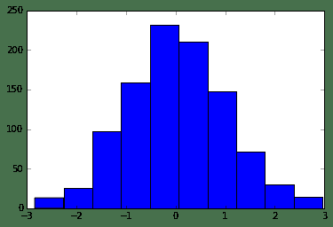
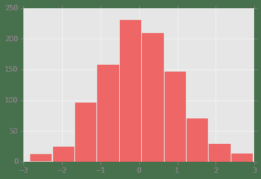
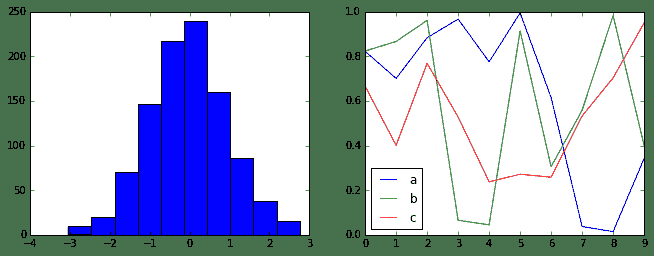
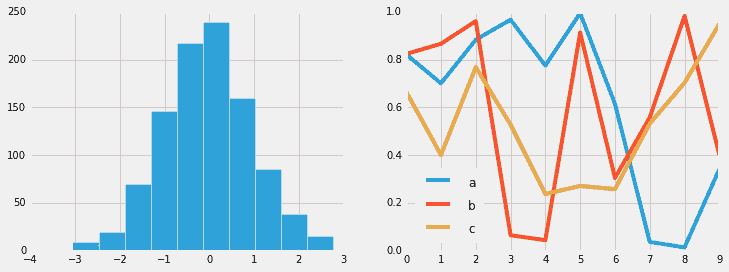
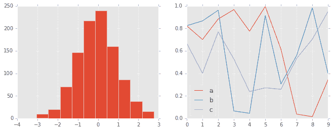
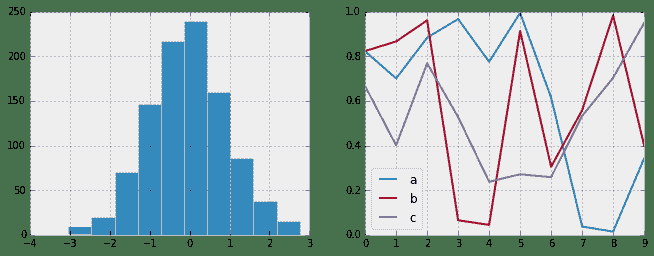
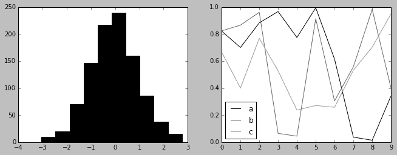

# 8.14 自定义 Matplotlib：配置和样式表

> 原文：[Customizing Matplotlib: Configurations and Stylesheets](https://nbviewer.jupyter.org/github/donnemartin/data-science-ipython-notebooks/blob/master/matplotlib/04.11-Settings-and-Stylesheets.ipynb)
> 
> 译者：[飞龙](https://github.com/wizardforcel)
> 
> 协议：[CC BY-NC-SA 4.0](http://creativecommons.org/licenses/by-nc-sa/4.0/)
> 
> 本节是[《Python 数据科学手册》](https://github.com/jakevdp/PythonDataScienceHandbook)（Python Data Science Handbook）的摘录。

Matplotlib 的默认绘图设置通常是其用户所抱怨的主题。虽然在 2016 年末的 Matplotlib 2.0 版本中有很多改进的内容，但自定义默认设置的能力，有助于使软件包符合你自己的审美偏好。

在这里，我们将介绍一些 Matplotlib 的运行时配置（`rc`）选项，并查看较新的样式表功能，其中包含一些不错的默认配置。

## 手动的绘图自定义

通过本章，我们已经看到了如何调整单个绘图设置，最终得到看起来比默认设置更好一些的东西。可以为每个单独的绘图执行这些自定义。例如，这是一个相当单调的默认直方图：

```
import matplotlib.pyplot as plt
plt.style.use('classic')
import numpy as np

%matplotlib inline

x = np.random.randn(1000)
plt.hist(x); 
```



我们可以手动调整它，使其看上去好看一些：

```
# 使用灰色背景
ax = plt.axes(axisbg='#E6E6E6')
ax.set_axisbelow(True)

# 绘制白色实网格线draw solid white grid lines
plt.grid(color='w', linestyle='solid')

# 隐藏轴的刻度
for spine in ax.spines.values():
    spine.set_visible(False)

# 隐藏顶部和右侧刻度
ax.xaxis.tick_bottom()
ax.yaxis.tick_left()

# 将刻度和标签变亮
ax.tick_params(colors='gray', direction='out')
for tick in ax.get_xticklabels():
    tick.set_color('gray')
for tick in ax.get_yticklabels():
    tick.set_color('gray')

# 控制直方图的人脸和边界颜色
ax.hist(x, edgecolor='#E6E6E6', color='#EE6666'); 
```


这看起来更好，你可能会认为外观受 R 语言的`ggplot`可视化包的启发。但这需要付出很多精力！我们绝对不希望每次创建绘图时都要做所有调整。幸运的是，有一种方法可以调整这些默认值，它将适用于所有绘图。

## 修改默认值：`rcParams`

每次加载 Matplotlib 时，它都会定义一个运行时配置（`rc`），其中包含你创建的每个绘图元素的默认样式。可以使用`plt.rc`便利例程随时调整此配置。让我们修改`rc`参数，使我们的默认绘图看起来与之前相似，并看看它的样子。

我们首先保存当前`rcParams`字典的副本，这样我们就可以在当前会话中轻松重置这些更改：

```
IPython_default = plt.rcParams.copy() 
```

现在我们可以使用`plt.rc`函数来改变其中的一些设置：

```
from matplotlib import cycler
colors = cycler('color',
                ['#EE6666', '#3388BB', '#9988DD',
                 '#EECC55', '#88BB44', '#FFBBBB'])
plt.rc('axes', facecolor='#E6E6E6', edgecolor='none',
       axisbelow=True, grid=True, prop_cycle=colors)
plt.rc('grid', color='w', linestyle='solid')
plt.rc('xtick', direction='out', color='gray')
plt.rc('ytick', direction='out', color='gray')
plt.rc('patch', edgecolor='#E6E6E6')
plt.rc('lines', linewidth=2) 
```

通过定义这些设置，我们现在可以创建一个绘图并查看我们的设置：

```
plt.hist(x); 
```



让我们看看使用`rc`参数，简单线条图是什么样：

```
for i in range(4):
    plt.plot(np.random.rand(10)) 
```


我发现这比默认样式更美观。如果你不同意我的审美，好消息是你可以根据自己的喜好调整`rc`参数！这些设置可以保存在`.matplotlibrc`文件中，你可以阅读 [Matplotlib 文档](http://Matplotlib.org/users/customizing.html)来了解。也就是说，我更喜欢使用样式表来定制 Matplotlib。

## 样式表

2014 年 8 月发布的 Matplotlib 1.4 版增加了一个非常方便的`style`模块，其中包含许多新的默认样式表，以及创建和打包自己的样式的功能。这些样式表的格式与前面提到的`.matplotlibrc`文件类似，但必须使用`.mplstyle`扩展名来命名。

即使你不创建自己的样式，默认包含的样式表也非常有用。可用的样式在`plt.style.available`中列出 - 这里为了简洁我只列出前五个：

```
plt.style.available[:5]

'''
['fivethirtyeight',
     'seaborn-pastel',
     'seaborn-whitegrid',
     'ggplot',
     'grayscale']
''' 
```

切换样式表的基本方法是调用：

```
plt.style.use('stylename') 
```

但请记住，这将改变会话剩余部分的风格！或者，你可以使用样式上下文管理器，它可以临时设置样式：

```
with plt.style.context('stylename'):
    make_a_plot() 
```

让我们创建一个函数，它将生成两种基本类型的绘图：

```
def hist_and_lines():
    np.random.seed(0)
    fig, ax = plt.subplots(1, 2, figsize=(11, 4))
    ax[0].hist(np.random.randn(1000))
    for i in range(3):
        ax[1].plot(np.random.rand(10))
    ax[1].legend(['a', 'b', 'c'], loc='lower left') 
```

我们将使用它，以及各种内置样式的样式来探索这些绘图。

### 默认样式

默认样式是我们到目前为止所看到的内容；我们将从它开始。首先，让我们将运行时配置重置为笔记本默认值：

```
# 重置 rcParams
plt.rcParams.update(IPython_default); 
```

现在让我们看看它的外观：

```
hist_and_lines() 
```



### FiveThiryEight 样式

`fivethirtyeight`风格模仿流行的 [FiveThirtyEight 网站](https://fivethirtyeight.com)上的图形。正如你在这里看到的那样，它以深色，粗线条和透明的轴为代表：

```
with plt.style.context('fivethirtyeight'):
    hist_and_lines() 
```



### `ggplot`

R 语言中的`ggplot`包是非常流行的可视化工具。Matplotlib 的`ggplot`样式模仿该包的默认样式：

```
with plt.style.context('ggplot'):
    hist_and_lines() 
```



### “黑客的贝叶斯方法”风格

有一本非常好的在线简短书籍，叫做[黑客的概率编程和贝叶斯方法](http://camdavidsonpilon.github.io/Probabilistic-Programming-and-Bayesian-Methods-for-Hackers/)；它具有使用 Matplotlib 创建的图形，并使用一组很好的`rc`参数，在整本书中创建一致且视觉上吸引人的风格。这种风格在`bmh`样式表中复现：

```
with plt.style.context('bmh'):
    hist_and_lines() 
```



### 暗黑背景

对于演示文稿中使用的图形，使用深色而非浅色背景通常很有用。`dark_background`样式提供了这个：

```
with plt.style.context('dark_background'):
    hist_and_lines() 
```


### 灰度

有时你可能会发现，自己正在为不接受彩色图形的印刷出版物准备图形。为此，此处展示的“灰度”样式非常有用：

```
with plt.style.context('grayscale'):
    hist_and_lines() 
```



### Seaborn 样式

Matplotlib 还有受 Seaborn 库启发的样式表（在“可视化和 Seaborn”中进行了更全面的讨论）。正如我们将看到的，将 Seaborn 导入笔记本时，这些样式会自动加载。我发现这些设置非常好，并且倾向于在我自己的数据探索中将它们用作默认设置。

```
import seaborn
hist_and_lines() 
```


使用所有这些用于各种绘图样式的内置选项，对于交互式可视化和用于出版图形的创建，Matplotlib 变得更加有用。在本书中，我通常会在创建绘图时使用这些样式约定中的一个或多个。