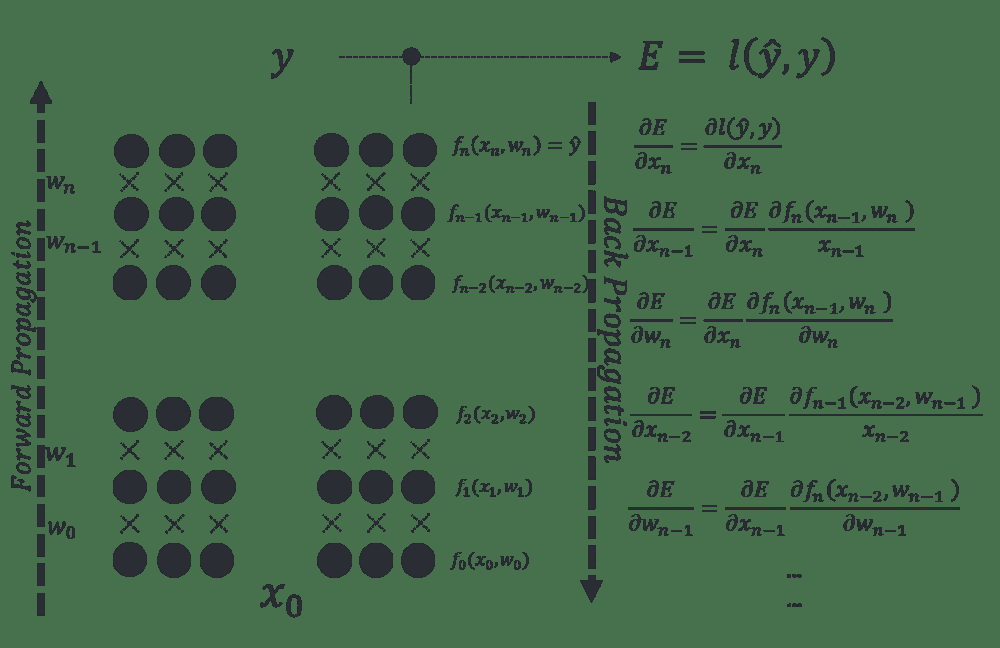

# 四、Keras（上）

> 原文：[keras-tutorials](https://github.com/donnemartin/data-science-ipython-notebooks#keras-tutorials)
> 
> 译者：[飞龙](https://github.com/wizardforcel)
> 
> 协议：[CC BY-NC-SA 4.0](http://creativecommons.org/licenses/by-nc-sa/4.0/)

# 4.1 深度学习导论

> 致谢：派生于 Valerio Maggio 的 [deep-learning-keras-tensorflow](https://github.com/leriomaggio/deep-learning-keras-tensorflow)

深度学习允许由多**层**组成的计算模型，来学习具有多个抽象级别的数据表示。这些方法极大地改进了语音识别，视觉对象识别，物体检测，以及药物发现和基因组学等许多其他领域的最新技术。

**深度学习**是目前数据分析领域的主要工具之一，深度学习最常见的框架之一是 **Keras**。该教程将使用带有实际代码示例的`keras`介绍深度学习。

## 人工神经网络（ANN）

在机器学习和认知科学中，人工神经网络（ANN）是受生物神经网络启发的网络，用于估计或近似可取决于大量输入的函数，这些输入通常是未知的。

ANN 从堆叠的节点（神经元）构建，它们位于特征向量和目标向量之间的层中。神经网络中的节点根据权重和激活函数构建。从一个节点构建的 ANN 的早期版本被称为**感知机**。


感知机是用于二元分类器的监督学习算法。 它是一个函数，可以决定输入（由数字向量表示）是属于一个类还是另一个类的。与逻辑回归非常相似，神经网络中的权重乘以输入向量并求和，并馈送给激活函数的输入。感知机网络可以设计为多层，产生**多层感知器**（又名“MLP”）。


每个神经元的权重是通过**梯度下降**来学习的，其中每个神经元的误差根据它的权重得出。在称为**反向传播**的技术中，针对前一层对每一层进行优化。



## 从零构建神经网络

### 点子：

我们将从第一原则构建神经网络。我们将创建一个非常简单的模型并理解它是如何工作的。我们还将实现反向传播算法。**请注意，此代码未经过优化，不能用于生产**。这是出于教学目的 - 让我们了解 ANN 的工作原理。`theano`这样的库具有高度优化的代码。

（以下代码受到[这个非常棒的笔记本](https://github.com/dennybritz/nn-from-scratch)的启发）

```
# 导入所需的包
import numpy as np
import pandas as pd
import matplotlib
import matplotlib.pyplot as plt
import scipy

# 内联展示绘图 
%matplotlib inline
# 定义绘图的默认图形大小
matplotlib.rcParams['figure.figsize'] = (10.0, 8.0)

import random
random.seed(123)

# 读取数据集
train = pd.read_csv("data/intro_to_ann.csv")

X, y = np.array(train.ix[:,0:2]), np.array(train.ix[:,2])

X.shape

# (500, 2)

y.shape

# (500,)

# 让我们绘制数据集，来看看它什么样
plt.scatter(X[:,0], X[:,1], s=40, c=y, cmap=plt.cm.BuGn)

# <matplotlib.collections.PathCollection at 0x110b4b0f0> 
```


## 开始构建我们的 ANN 积木

注意：此过程最终将产生我们自己的神经网络类

### 看一看细节


### 接受两个数字并生成一个随机数的函数

**它将用在哪里？**：当我们初始化神经网络时，必须随机分配权重。

```
# 计算满足 a <= rand < b 的随机数
def rand(a, b):
    return (b-a)*random.random() + a

# 创建矩阵
def makeMatrix(I, J, fill=0.0):
    return np.zeros([I,J]) 
```

### 定义我们的激活函数。让我们使用 sigmoid 函数

```
# 我们的 sigmoid 函数
def sigmoid(x):
    # 返回 math.tanh(x)
    return 1/(1+np.exp(-x)) 
```

### 对我们的激活函数求导

注意：当我们运行反向传播算法时，我们需要这个

```
# sigmoid 函数对输出（也就是 y）的导数
def dsigmoid(y):
    return y - y**2 
```

### 我们的神经网络类

当我们首次创建神经网络架构时，我们需要知道输入的数量，隐藏层的数量和输出的数量。权重必须随机初始化。

```
class ANN:
    def __init__(self, ni, nh, no):
        # 输入，隐层和输出节点的数量
        self.ni = ni + 1 # +1 用于偏置节点
        self.nh = nh
        self.no = no

        # 节点的激活
        self.ai = [1.0]*self.ni
        self.ah = [1.0]*self.nh
        self.ao = [1.0]*self.no

        # 创建权重
        self.wi = makeMatrix(self.ni, self.nh)
        self.wo = makeMatrix(self.nh, self.no)

        # 将它们设为随机值
        self.wi = rand(-0.2, 0.2, size=self.wi.shape)
        self.wo = rand(-2.0, 2.0, size=self.wo.shape)

        # 最后为动量修改权重
        self.ci = makeMatrix(self.ni, self.nh)
        self.co = makeMatrix(self.nh, self.no) 
```

### 激活函数

```
def activate(self, inputs):

    if len(inputs) != self.ni-1:
        print(inputs)
        raise ValueError('wrong number of inputs')

    # 输入激活
    for i in range(self.ni-1):
        self.ai[i] = inputs[i]

    # 隐层激活
    for j in range(self.nh):
        sum_h = 0.0
        for i in range(self.ni):
            sum_h += self.ai[i] * self.wi[i][j]
        self.ah[j] = sigmoid(sum_h)

    # 输出激活
    for k in range(self.no):
        sum_o = 0.0
        for j in range(self.nh):
            sum_o += self.ah[j] * self.wo[j][k]
        self.ao[k] = sigmoid(sum_o)

    return self.ao[:] 
```

### 反向传播

```
def backPropagate(self, targets, N, M):

    if len(targets) != self.no:
        print(targets)
        raise ValueError('wrong number of target values')

    # 为输出计算误差项
    output_deltas = np.zeros(self.no)
    for k in range(self.no):
        error = targets[k]-self.ao[k]
        output_deltas[k] = dsigmoid(self.ao[k]) * error

    # 为隐层计算误差项
    hidden_deltas = np.zeros(self.nh)
    for j in range(self.nh):
        error = 0.0
        for k in range(self.no):
            error += output_deltas[k]*self.wo[j][k]
        hidden_deltas[j] = dsigmoid(self.ah[j]) * error

    # 更新输出权重
    for j in range(self.nh):
        for k in range(self.no):
            change = output_deltas[k] * self.ah[j]
            self.wo[j][k] += N*change + 
                             M*self.co[j][k]
            self.co[j][k] = change

    # 更新输入权重
    for i in range(self.ni):
        for j in range(self.nh):
            change = hidden_deltas[j]*self.ai[i]
            self.wi[i][j] += N*change + 
                             M*self.ci[i][j]
            self.ci[i][j] = change

    # 计算误差
    error = 0.0
    for k in range(len(targets)):
        error += 0.5*(targets[k]-self.ao[k])**2
    return error

## 把所有东西放在一起

class ANN:
    def __init__(self, ni, nh, no):
        # 输入，隐层和输出节点的数量
        self.ni = ni + 1 # +1 用于偏置节点
        self.nh = nh
        self.no = no

        # 节点的激活
        self.ai = [1.0]*self.ni
        self.ah = [1.0]*self.nh
        self.ao = [1.0]*self.no

        # 创建权重
        self.wi = makeMatrix(self.ni, self.nh)
        self.wo = makeMatrix(self.nh, self.no)

        # 将它们设为随机值
        for i in range(self.ni):
            for j in range(self.nh):
                self.wi[i][j] = rand(-0.2, 0.2)
        for j in range(self.nh):
            for k in range(self.no):
                self.wo[j][k] = rand(-2.0, 2.0)

        # 最后为动量修改权重
        self.ci = makeMatrix(self.ni, self.nh)
        self.co = makeMatrix(self.nh, self.no)

    def backPropagate(self, targets, N, M):

        if len(targets) != self.no:
            print(targets)
            raise ValueError('wrong number of target values')

        # 为输出计算误差项
        output_deltas = np.zeros(self.no)
        for k in range(self.no):
            error = targets[k]-self.ao[k]
            output_deltas[k] = dsigmoid(self.ao[k]) * error

        # 为隐层计算误差项
        hidden_deltas = np.zeros(self.nh)
        for j in range(self.nh):
            error = 0.0
            for k in range(self.no):
                error += output_deltas[k]*self.wo[j][k]
            hidden_deltas[j] = dsigmoid(self.ah[j]) * error

        # 更新输出权重
        for j in range(self.nh):
            for k in range(self.no):
                change = output_deltas[k] * self.ah[j]
                self.wo[j][k] += N*change + M*self.co[j][k]
                self.co[j][k] = change

        # 更新输入权重
        for i in range(self.ni):
            for j in range(self.nh):
                change = hidden_deltas[j]*self.ai[i]
                self.wi[i][j] += N*change + M*self.ci[i][j]
                self.ci[i][j] = change

        # 计算误差
        error = 0.0
        for k in range(len(targets)):
            error += 0.5*(targets[k]-self.ao[k])**2
        return error

    def test(self, patterns):
        self.predict = np.empty([len(patterns), self.no])
        for i, p in enumerate(patterns):
            self.predict[i] = self.activate(p)
            #self.predict[i] = self.activate(p[0])

    def activate(self, inputs):

        if len(inputs) != self.ni-1:
            print(inputs)
            raise ValueError('wrong number of inputs')

        # 输入激活
        for i in range(self.ni-1):
            self.ai[i] = inputs[i]

        # 隐层激活
        for j in range(self.nh):
            sum_h = 0.0
            for i in range(self.ni):
                sum_h += self.ai[i] * self.wi[i][j]
            self.ah[j] = sigmoid(sum_h)

        # 输出激活
        for k in range(self.no):
            sum_o = 0.0
            for j in range(self.nh):
                sum_o += self.ah[j] * self.wo[j][k]
            self.ao[k] = sigmoid(sum_o)

        return self.ao[:]

    def train(self, patterns, iterations=1000, N=0.5, M=0.1):
        # N: 学习率
        # M: 动量因子
        patterns = list(patterns)
        for i in range(iterations):
            error = 0.0
            for p in patterns:
                inputs = p[0]
                targets = p[1]
                self.activate(inputs)
                error += self.backPropagate([targets], N, M)
            if i % 5 == 0:
                print('error in interation %d : %-.5f' % (i,error))
            print('Final training error: %-.5f' % error) 
```

### 在数据集上运行模型

```
# 创建网络，带有两个输入，一个隐层，和一个输出节点
ann = ANN(2, 1, 1)

%timeit -n 1 -r 1 ann.train(zip(X,y), iterations=2)

'''
error in interation 0 : 53.62995
Final training error: 53.62995
Final training error: 47.35136
1 loop, best of 1: 97.6 ms per loop
''' 
```

### 预测训练数据集，并测量样本内准确率

```
%timeit -n 1 -r 1 ann.test(X)

# 1 loop, best of 1: 22.6 ms per loop

prediction = pd.DataFrame(data=np.array([y, np.ravel(ann.predict)]).T, 
                          columns=["actual", "prediction"])
prediction.head() 
```

|  | actual | prediction |
| --- | --- | --- |
| 0 | 1.0 | 0.491100 |
| 1 | 1.0 | 0.495469 |
| 2 | 0.0 | 0.097362 |
| 3 | 0.0 | 0.400006 |
| 4 | 1.0 | 0.489664 |

```
np.min(prediction.prediction)

# 0.076553078113180129 
```

### 让我们可视化并观察结果

```
# 绘制决策边界的辅助函数
# 它生成等高线图，来展示决策边界
def plot_decision_boundary(nn_model):
    # 设置最大最小值并给它一些填充
    x_min, x_max = X[:, 0].min() - .5, X[:, 0].max() + .5
    y_min, y_max = X[:, 1].min() - .5, X[:, 1].max() + .5
    h = 0.01
    # 生成点的网格，它们之间距离为 h
    xx, yy = np.meshgrid(np.arange(x_min, x_max, h), 
                         np.arange(y_min, y_max, h))
    # 为整个网格预测函数值
    nn_model.test(np.c_[xx.ravel(), yy.ravel()])
    Z = nn_model.predict
    Z[Z>=0.5] = 1
    Z[Z<0.5] = 0
    Z = Z.reshape(xx.shape)
    # 绘制等高线和训练样本
    plt.contourf(xx, yy, Z, cmap=plt.cm.Spectral)
    plt.scatter(X[:, 0], X[:, 1], s=40,  c=y, cmap=plt.cm.BuGn)

plot_decision_boundary(ann)
plt.title("Our initial model")

# <matplotlib.text.Text at 0x110bdb940> 
```


**练习**：

在上面的代码中创建具有 10 个隐藏节点的神经网络。对准确率有什么影响？

```
# 将你的代码放在这里
# （或者如果你想作弊，加载答案）

# %load solutions/sol_111.py
ann = ANN(2, 10, 1)
%timeit -n 1 -r 1 ann.train(zip(X,y), iterations=2)
plot_decision_boundary(ann)
plt.title("Our next model with 10 hidden units")

'''
error in interation 0 : 34.91394
Final training error: 34.91394
Final training error: 25.36183
1 loop, best of 1: 288 ms per loop

<matplotlib.text.Text at 0x11151f630>
''' 
```


**练习：**

通过增加迭代来训练神经网络。对准确率有什么影响？

```
# 把你的代码放在这里

# %load solutions/sol_112.py
ann = ANN(2, 10, 1)
%timeit -n 1 -r 1 ann.train(zip(X,y), iterations=100)
plot_decision_boundary(ann)
plt.title("Our model with 10 hidden units and 100 iterations")

'''
error in interation 0 : 31.63185
Final training error: 31.63185
Final training error: 25.12319
Final training error: 24.92547
Final training error: 24.89692
Final training error: 24.88124
...
error in interation 95 : 7.50499
Final training error: 7.50499
Final training error: 7.46215
Final training error: 7.42298
Final training error: 7.38707
Final training error: 7.35410
1 loop, best of 1: 14.5 s per loop

<matplotlib.text.Text at 0x1115951d0>
''' 
```


## 附录

仓库中还有一个额外的笔记本，即“用于 MNIST 的 ANN 的简单实现”，用于实现 **SGD** 和 **MLP** 并用于 **MNIST** 数据集。它和 [http://neuralnetworksanddeeplearning.com/](http://neuralnetworksanddeeplearning.com/) 配套。强烈推荐这本书。

# 4.2 Theano

> 致谢：派生于 Valerio Maggio 的 [deep-learning-keras-tensorflow](https://github.com/leriomaggio/deep-learning-keras-tensorflow)

语言中的语言。

处理权重矩阵和梯度可能是棘手的，有时不是没有意义的。Theano 是处理向量，矩阵和高维张量代数的一个很好的框架。本教程的大部分内容都将引用 Theano，但 TensorFlow 是另一个伟大的框架，能够为复杂代数提供令人难以置信的抽象。TensorFlow 的更多信息请参阅下一章。

```
import theano
import theano.tensor as T 
```

## 符号变量

Theano 拥有自己的变量和函数，定义如下：

```
x = T.scalar()

x 
```

变量可以用在表达式中：

```
y = 3*(x**2) + 1 
```

`y`现在是一个表达式。结果也是符号：

```
type(y)
y.shape

# Shape.0 
```

##### 打印

我们将要看到，正常的打印对于 theano 来说并不是最好的：

```
print(y)

# Elemwise{add,no_inplace}.0

theano.pprint(y)

# '((TensorConstant{3} * (<TensorType(float32, scalar)> ** TensorConstant{2})) + TensorConstant{1})'

theano.printing.debugprint(y)

'''
Elemwise{add,no_inplace} [@A] ''   
 |Elemwise{mul,no_inplace} [@B] ''   
 | |TensorConstant{3} [@C]
 | |Elemwise{pow,no_inplace} [@D] ''   
 |   |<TensorType(float32, scalar)> [@E]
 |   |TensorConstant{2} [@F]
 |TensorConstant{1} [@G]
''' 
```

## 表达式求值

提供将变量映射到值的`dict`：

```
y.eval({x: 2})

# array(13.0, dtype=float32) 
```

或者编译函数：

```
f = theano.function([x], y)

f(2)

# array(13.0, dtype=float32) 
```

## 其它张量类型

```
X = T.vector()
X = T.matrix()
X = T.tensor3()
X = T.tensor4() 
```

## 自动求导

*   梯度是自动的！

```
x = T.scalar()
y = T.log(x)

gradient = T.grad(y, x)
print gradient
print gradient.eval({x: 2})
print (2 * gradient)

'''
Elemwise{true_div}.0
0.5
Elemwise{mul,no_inplace}.0
''' 
```

## 共享变量

*   符号 + 存储

```
import numpy as np
x = theano.shared(np.zeros((2, 3), dtype=theano.config.floatX))

x

# <CudaNdarrayType(float32, matrix)> 
```

我们可以获取和设置变量的值。

```
values = x.get_value()
print(values.shape)
print(values)

'''
(2, 3)
[[ 0\.  0\.  0.]
 [ 0\.  0\.  0.]]
'''

x.set_value(values) 
```

共享变量也可以在表达式中使用：

```
(x + 2) ** 2

# Elemwise{pow,no_inplace}.0 
```

在求值时，它们的值用作输入：

```
((x + 2) ** 2).eval()

'''
array([[ 4.,  4.,  4.],
       [ 4.,  4.,  4.]], dtype=float32)
'''

theano.function([], (x + 2) ** 2)()

'''
array([[ 4.,  4.,  4.],
       [ 4.,  4.,  4.]], dtype=float32)
''' 
```

## 更新

*   储存函数求值的结果
*   `dict`将共享变量映射到新的值

```
count = theano.shared(0)
new_count = count + 1
updates = {count: new_count}

f = theano.function([], count, updates=updates)

f()

# array(0)

f()

# array(1)

f()

# array(2) 
```

### 热身！逻辑回归

```
%matplotlib inline

import numpy as np
import pandas as pd
import theano
import theano.tensor as T
import matplotlib.pyplot as plt
from sklearn.preprocessing import StandardScaler
from sklearn.preprocessing import LabelEncoder 
from keras.utils import np_utils

# Using Theano backend. 
```

在本节中，我们将使用 Kaggle otto 挑战。如果你想关注它，请从 Kaggle 获取数据：[https://www.kaggle.com/c/otto-group-product-classification-challenge/data](https://www.kaggle.com/c/otto-group-product-classification-challenge/data)

#### 关于数据

奥托集团是世界上最大的电子商务公司之一，对产品性能的一致分析至关重要。 然而，由于全球基础设施多样化，许多相同的产品具有不同分类。在本次比赛中，我们提供了超过 200,000 种产品和 93 个特征的数据集。 目标是建立一个能够区分我们主要产品类别的预测模型。每行对应一个产品。 共有 93 个数字特征，代表不同事件的计数。 所有特征都已经过混淆，不再进一步定义。

[https://www.kaggle.com/c/otto-group-product-classification-challenge/data](https://www.kaggle.com/c/otto-group-product-classification-challenge/data)

```
def load_data(path, train=True):
    """从 CSV 文件加载数据

    参数
    ----------
    path: str
        CSV 文件的路径

    train: bool (默认为 True)
        决定数据是否是*训练数据*
        如果为 True，执行一些打乱

    返回值
    ------
    X: numpy.ndarray 
        作为浮点的多维数组的数据
    ids: numpy.ndarray
        每个样本的 id 向量
    """
    df = pd.read_csv(path)
    X = df.values.copy()
    if train:
        np.random.shuffle(X)  # https://youtu.be/uyUXoap67N8
        X, labels = X[:, 1:-1].astype(np.float32), X[:, -1]
        return X, labels
    else:
        X, ids = X[:, 1:].astype(np.float32), X[:, 0].astype(str)
        return X, ids

def preprocess_data(X, scaler=None):
    """通过减去均值并缩放到单位方差
    来标准化数据，来处理输入数据"""
    if not scaler:
        scaler = StandardScaler()
        scaler.fit(X)
    X = scaler.transform(X)
    return X, scaler

def preprocess_labels(labels, encoder=None, categorical=True):
    """使用 0~`n-classes-1` 的值编码标签"""
    if not encoder:
        encoder = LabelEncoder()
        encoder.fit(labels)
    y = encoder.transform(labels).astype(np.int32)
    if categorical:
        y = np_utils.to_categorical(y)
    return y, encoder

print("Loading data...")
X, labels = load_data('train.csv', train=True)
X, scaler = preprocess_data(X)
Y, encoder = preprocess_labels(labels)

X_test, ids = load_data('test.csv', train=False)
X_test, ids = X_test[:1000], ids[:1000]

# 绘制数据
print(X_test[:1])

X_test, _ = preprocess_data(X_test, scaler)

nb_classes = Y.shape[1]
print(nb_classes, 'classes')

dims = X.shape[1]
print(dims, 'dims')

'''
Loading data...
[[  0\.   0\.   0\.   0\.   0\.   0\.   0\.   0\.   0\.   3\.   0\.   0\.   0\.   3.
    2\.   1\.   0\.   0\.   0\.   0\.   0\.   0\.   0\.   5\.   3\.   1\.   1\.   0.
    0\.   0\.   0\.   0\.   1\.   0\.   0\.   1\.   0\.   1\.   0\.   1\.   0\.   0.
    0\.   0\.   0\.   0\.   0\.   0\.   0\.   0\.   0\.   0\.   0\.   0\.   0\.   0.
    0\.   0\.   0\.   0\.   0\.   0\.   0\.   3\.   0\.   0\.   0\.   0\.   1\.   1.
    0\.   1\.   0\.   0\.   0\.   0\.   0\.   0\.   0\.   0\.   0\.   0\.   0\.   0.
    0\.  11\.   1\.  20\.   0\.   0\.   0\.   0\.   0.]]
(9L, 'classes')
(93L, 'dims')
''' 
```

现在让我们创建并训练逻辑回归模型

#### 实战 - 逻辑回归

```
# 基于来自 DeepLearning.net 的示例
rng = np.random
N = 400
feats = 93
training_steps = 1

# 声明 Theano 符号变量
x = T.matrix("x")
y = T.vector("y")
w = theano.shared(rng.randn(feats), name="w")
b = theano.shared(0., name="b")

# 构造 Theano 表达式图
p_1 = 1 / (1 + T.exp(-T.dot(x, w) - b))   # 目标为 1 的概率
prediction = p_1 > 0.5                    # 预测阈值
xent = -y * T.log(p_1) - (1-y) * T.log(1-p_1) # 交叉熵损失函数
cost = xent.mean() + 0.01 * (w ** 2).sum()# 要最小化的损失
gw, gb = T.grad(cost, [w, b])             # 计算损失的梯度
                                          # （我们将在这个教程的后面的章节中返回这里）

# 编译
train = theano.function(
          inputs=[x,y],
          outputs=[prediction, xent],
          updates=((w, w - 0.1 * gw), (b, b - 0.1 * gb)),
          allow_input_downcast=True)
predict = theano.function(inputs=[x], outputs=prediction, allow_input_downcast=True)

# class1 的变换
y_class1 = []
for i in Y:
    y_class1.append(i[0])
y_class1 = np.array(y_class1)

# 训练
for i in range(training_steps):
    print('Epoch %s' % (i+1,))
    pred, err = train(X, y_class1)

print("target values for Data:")
print(y_class1)
print("prediction on training set:")
print(predict(X))

'''
Epoch 1
target values for Data:
[ 0\.  0\.  1\. ...,  0\.  0\.  0.]
prediction on training set:
[0 0 0 ..., 0 0 0]
''' 
```

# 4.3 Keras

> 致谢：派生于 Valerio Maggio 的 [deep-learning-keras-tensorflow](https://github.com/leriomaggio/deep-learning-keras-tensorflow)

```
%matplotlib inline

import numpy as np
import pandas as pd
import theano
import theano.tensor as T
import matplotlib.pyplot as plt
import keras 
from sklearn.preprocessing import StandardScaler
from sklearn.preprocessing import LabelEncoder 
from keras.utils import np_utils
from sklearn.cross_validation import train_test_split
from keras.callbacks import EarlyStopping, ModelCheckpoint
from keras.models import Sequential
from keras.layers import Dense, Activation

# Using Theano backend. 
```

## 用于 Theano 和 TensorFlow 的深度学习库

Keras 是一个极简，高度模块化的神经网络库，用 Python 编写，能够在 TensorFlow 或 Theano 之上运行。 它的开发重点是实现快速实验。 能够在最短时间内将理念变成结果，是进行良好研究的关键。

参考：[https://keras.io/](https://keras.io/)

## Keras，为什么是这个名字?

Keras（κέρας）在希腊语中的意思是号角。 它是古希腊和拉丁文学的文学形象的参考，首先在《奥德赛》中发现，其中梦灵（*Oneiroi*，单数为 *Oneiros*）被分为用虚假异象欺骗人的一种，它们通过象牙门到达地球，以及宣布未来的另一种，它们通过号角之门到达。 这是一个关于单词 κέρας（号角）/κραίνω（履行）和 ἐλέφας（象牙）/ἐλεφαίρομαι（欺骗）的戏剧。

Keras 最初作为项目 ONEIROS（开放式神经电子智能机器人操作系统）的研究工作的一部分而开发。

> “Oneiroi are beyond our unravelling --who can be sure what tale they tell? Not all that men look for comes to pass. Two gates there are that give passage to fleeting Oneiroi; one is made of horn, one of ivory. The Oneiroi that pass through sawn ivory are deceitful, bearing a message that will not be fulfilled; those that come out through polished horn have truth behind them, to be accomplished for men who see them.”
> 
> Homer, Odyssey 19\. 562 ff (Shewring translation).

## 实战 - Keras 逻辑回归

```
dims = X.shape[1]
print(dims, 'dims')
print("Building model...")

nb_classes = Y.shape[1]
print(nb_classes, 'classes')

model = Sequential()
model.add(Dense(nb_classes, input_shape=(dims,)))
model.add(Activation('softmax'))
model.compile(optimizer='sgd', loss='categorical_crossentropy')
model.fit(X, Y)

'''
(93L, 'dims')
Building model...
(9L, 'classes')
Epoch 1/10
61878/61878 [==============================] - 1s - loss: 1.0574     
Epoch 2/10
61878/61878 [==============================] - 1s - loss: 0.7730     
Epoch 3/10
61878/61878 [==============================] - 1s - loss: 0.7297     
Epoch 4/10
61878/61878 [==============================] - 1s - loss: 0.7080     
Epoch 5/10
61878/61878 [==============================] - 1s - loss: 0.6948     
Epoch 6/10
61878/61878 [==============================] - 1s - loss: 0.6854     
Epoch 7/10
61878/61878 [==============================] - 1s - loss: 0.6787     
Epoch 8/10
61878/61878 [==============================] - 1s - loss: 0.6734     
Epoch 9/10
61878/61878 [==============================] - 1s - loss: 0.6691     
Epoch 10/10
61878/61878 [==============================] - 1s - loss: 0.6657     
'''

# <keras.callbacks.History at 0x23d330f0> 
```

简洁是非常令人印象深刻的吗？现在让我们理解：

> Keras 的核心数据结构是**模型**，一种组织层的方法。主要类型的模型是**顺序**模型，层的线性栈。

我们在这里做的是，从输入到输出堆叠可训练权重的全连接（**密集**）层，并在权重层顶部堆叠**激活**层。

##### 密集层（`Dense`）

```
from keras.layers.core import Dense

Dense(output_dim, init='glorot_uniform', activation='linear', 
      weights=None, W_regularizer=None, b_regularizer=None,
      activity_regularizer=None, W_constraint=None, 
      b_constraint=None, bias=True, input_dim=None) 
```

##### 激活（`Activation`）

```
from keras.layers.core import Activation

Activation(activation) 
```

##### 优化器

如果需要，你可以进一步配置优化器。Keras 的核心原则是使事情变得相当简单，同时在需要的时候，允许用户完全控制（终极控制是源代码的易扩展性）。在这里，我们使用 **SGD**随机梯度下降）作为我们可训练权重的优化算法。

## 对这个示例执行更多的"数据分析"

我们在这里做的很好，但是在现实世界中由于过拟合而无法使用。让我们尝试用交叉验证来解决它。

##### 过拟合

在过度拟合中，统计模型描述随机误差或噪声而不是底层关系。 当模型过于复杂时发生过拟合，例如相对于观察数量参数太多。过拟合的模型具有较差的预测表现，因为它对训练数据中的微小波动过度反应。


为了避免过拟合，我们将首先将数据拆分为训练集和测试集，并在测试集上测试模型。下一步：我们将使用两个 keras 的回调`EarlyStopping`和`ModelCheckpoint`。

```
X, X_test, Y, Y_test = train_test_split(X, Y, test_size=0.15, random_state=42)

fBestModel = 'best_model.h5' 
early_stop = EarlyStopping(monitor='val_loss', patience=4, verbose=1) 
best_model = ModelCheckpoint(fBestModel, verbose=0, save_best_only=True)
model.fit(X, Y, validation_data = (X_test, Y_test), nb_epoch=20, 
          batch_size=128, verbose=True, validation_split=0.15, 
          callbacks=[best_model, early_stop]) 

'''
Train on 19835 samples, validate on 3501 samples
Epoch 1/20
19835/19835 [==============================] - 0s - loss: 0.6391 - val_loss: 0.6680
Epoch 2/20
19835/19835 [==============================] - 0s - loss: 0.6386 - val_loss: 0.6689
Epoch 3/20
19835/19835 [==============================] - 0s - loss: 0.6384 - val_loss: 0.6695
Epoch 4/20
19835/19835 [==============================] - 0s - loss: 0.6381 - val_loss: 0.6702
Epoch 5/20
19835/19835 [==============================] - 0s - loss: 0.6378 - val_loss: 0.6709
Epoch 6/20
19328/19835 [============================>.] - ETA: 0s - loss: 0.6380Epoch 00005: early stopping
19835/19835 [==============================] - 0s - loss: 0.6375 - val_loss: 0.6716
'''

# <keras.callbacks.History at 0x1d7245f8> 
```

## 多层感知机和全连接

那么，用 keras 构建多层感知器有多难？它是一样的，只需添加更多层！

```
model = Sequential()
model.add(Dense(100, input_shape=(dims,)))
model.add(Dense(nb_classes))
model.add(Activation('softmax'))
model.compile(optimizer='sgd', loss='categorical_crossentropy')
model.fit(X, Y) 
```

你的回合！

## 实战 - Keras 全连接

花几分钟时间尝试优化层数和层中的参数数量，来获得最佳效果。

```
model = Sequential()
model.add(Dense(100, input_shape=(dims,)))

# ...
# ...
# 玩转它！按你的想法添加一些层！尝试获得更好的结果。

model.add(Dense(nb_classes))
model.add(Activation('softmax'))
model.compile(optimizer='sgd', loss='categorical_crossentropy')
model.fit(X, Y) 
```

构建问答系统，图像分类模型，神经图灵机，word2vec 嵌入器或任何其他模型，是同样快的。 深度学习背后的想法很简单，那么为什么他们的实现会很痛苦呢？

#### 深度的理论动机

> 有很多研究都是关于神经网络的深度。已经在数学上 [1] 和经验上证明，卷积神经网络从深度中获益！
> 
> [1] - On the Expressive Power of Deep Learning: A Tensor Analysis - Cohen, et al 2015

神经网络的一个引用定理说明：

> 通用近似定理 [1] 表明，具有单个隐层包含有限数量的神经元的前馈网络（即多层感知器），在激活函数的温和假设下，可以近似 R n \mathbb{R}^n Rn 的紧致子集上的连续函数。因此该定理表明，当给出适当的参数时，简单的神经网络可以表示各种有趣的函数；但是，它没有涉及这些参数的算法可学习性。
> 
> [1] - Approximation Capabilities of Multilayer Feedforward Networks - Kurt Hornik 1991

# 4.4 用于 MNIST 的 ANN 简单实现

> 致谢：派生于 Valerio Maggio 的 [deep-learning-keras-tensorflow](https://github.com/leriomaggio/deep-learning-keras-tensorflow)
> 
> 代码取自：[https://github.com/mnielsen/neural-networks-and-deep-learning](https://github.com/mnielsen/neural-networks-and-deep-learning)
> 
> 这一节与在线文本 [http://neuralnetworksanddeeplearning.com/](http://neuralnetworksanddeeplearning.com/) 配套。强烈推荐这本书。

```
# 导入库
import random
import numpy as np
import keras
from keras.datasets import mnist

'''
Using Theano backend.
Using gpu device 0: GeForce GTX 760 (CNMeM is enabled with initial size: 90.0% of memory, cuDNN 4007)
'''

# 将完整路径设为 mnist.pkl.gz
# 将其指向仓库里的数据文件夹
path_to_dataset = "euroscipy2016_dl-tutorial/data/mnist.pkl.gz"

!mkdir -p $HOME/.keras/datasets/euroscipy2016_dl-tutorial/data/

# 加载数据集
(X_train, y_train), (X_test, y_test) = mnist.load_data(path_to_dataset)

'''
Downloading data from https://s3.amazonaws.com/img-datasets/mnist.pkl.gz
15286272/15296311 [============================>.] - ETA: 0s
'''

print(X_train.shape, y_train.shape)
print(X_test.shape, y_test.shape)

'''
(60000, 28, 28) (60000,)
(10000, 28, 28) (10000,)
'''

"""
network.py
~~~~~~~~~~
为前馈神经网络实现随机梯度下降学习算法的模块。
使用反向传播计算梯度。
请注意，我专注于使代码简单，易读且易于修改。
它没有经过优化，省略了许多理想的特性。
"""

#### 库
# 标准库
import random

# 三方库
import numpy as np

class Network(object):

    def __init__(self, sizes):
        """列表``sizes``包含网络各层中的神经元数量。 例如，
        如果列表是 [2,3,1] 那么它将是三层网络，第一层包含 2
        个神经元，第二层 3 个神经元，第三层 1 个神经元。
        网络的偏置和权重是随机初始化的，使用均值为 0 方差为 1
        的高斯分布。注意，假设第一层是输入层，按照惯例，我们不会
        为这些神经元设置任何偏置，因为偏差只用于计算后面的层的输出。"""
        self.num_layers = len(sizes)
        self.sizes = sizes
        self.biases = [np.random.randn(y, 1) for y in sizes[1:]]
        self.weights = [np.random.randn(y, x)
                        for x, y in zip(sizes[:-1], sizes[1:])]

    def feedforward(self, a):
        """如果输入``a``，则返回网络的输出。"""
        for b, w in zip(self.biases, self.weights):
            a = sigmoid(np.dot(w, a)+b)
        return a

    def SGD(self, training_data, epochs, mini_batch_size, eta,
            test_data=None):
        """使用小批量随机梯度下降训练神经网络。``training_data``
        是``(x, y)``元组的列表，表示训练输入和所需输出。其他非可选
        参数是不言自明的。如果提供``test_data``，那么将在每个
        迭代之后对测试数据评估网络，并打印出部分进度。这对于
        跟踪进度很有用，但会大大减慢速度。"""
        training_data = list(training_data)
        test_data = list(test_data)
        if test_data: n_test = len(test_data)
        n = len(training_data)
        for j in range(epochs):
            random.shuffle(training_data)
            mini_batches = [
                training_data[k:k+mini_batch_size]
                for k in range(0, n, mini_batch_size)]
            for mini_batch in mini_batches:
                self.update_mini_batch(mini_batch, eta)
            if test_data:
                print( "Epoch {0}: {1} / {2}".format(
                    j, self.evaluate(test_data), n_test))
            else:
                print( "Epoch {0} complete".format(j))

    def update_mini_batch(self, mini_batch, eta):
        """通过使用反向传播，将梯度下降应用于
        单个小批量，来更新网络的权重和偏差。 
        ``mini_batch``是``(x, y)``元组列表，``eta``是学习率。"""
        nabla_b = [np.zeros(b.shape) for b in self.biases]
        nabla_w = [np.zeros(w.shape) for w in self.weights]
        for x, y in mini_batch:
            delta_nabla_b, delta_nabla_w = self.backprop(x, y)
            nabla_b = [nb+dnb for nb, dnb in zip(nabla_b, delta_nabla_b)]
            nabla_w = [nw+dnw for nw, dnw in zip(nabla_w, delta_nabla_w)]
        self.weights = [w-(eta/len(mini_batch))*nw
                        for w, nw in zip(self.weights, nabla_w)]
        self.biases = [b-(eta/len(mini_batch))*nb
                       for b, nb in zip(self.biases, nabla_b)]

    def backprop(self, x, y):
        """返回元组``(nabla_b, nabla_w)，表示损失函数
        C_x 的梯度``。 ``nabla_b``和``nabla_w``是 numpy 
        数组的逐层列表，类似于``self.biases``和``self.weights``。"""
        nabla_b = [np.zeros(b.shape) for b in self.biases]
        nabla_w = [np.zeros(w.shape) for w in self.weights]
        # 前馈
        activation = x
        activations = [x] # 用于逐层储存所有激活的列表
        zs = [] # 用于逐层储存所有 z 向量的列表
        for b, w in zip(self.biases, self.weights):
            z = np.dot(w, activation)+b
            zs.append(z)
            activation = sigmoid(z)
            activations.append(activation)
        # 反向传播
        delta = self.cost_derivative(activations[-1], y) * \
            sigmoid_prime(zs[-1])
        nabla_b[-1] = delta
        nabla_w[-1] = np.dot(delta, activations[-2].transpose())
        # 请注意，下面循环中的变量`l`与本书第 2 章中的表示法略有不同。 
        # 这里，`l = 1`表示最后一层神经元，`l = 2`表示倒数第二层，
        # 依此类推。 它是本书中方案的重新编号，
        # 利用了可以在 Python 列表中使用负数索引的事实。
        for l in range(2, self.num_layers):
            z = zs[-l]
            sp = sigmoid_prime(z)
            delta = np.dot(self.weights[-l+1].transpose(), delta) * sp
            nabla_b[-l] = delta
            nabla_w[-l] = np.dot(delta, activations[-l-1].transpose())
        return (nabla_b, nabla_w)

    def evaluate(self, test_data):
        """返回神经网络输出正确结果的测试输入数。 
        注意，神经网络的输出被假定为，
        具有最高激活的最终层中任何神经元的索引。"""
        test_results = [(np.argmax(self.feedforward(x)), y)
                        for (x, y) in test_data]
        return sum(int(x == y) for (x, y) in test_results)

    def cost_derivative(self, output_activations, y):
        """为输出激活返回 C_x 对 a 的偏导数"""
        return (output_activations-y)

#### 杂项函数
def sigmoid(z):
    """sigmoid 函数"""
    return 1.0/(1.0+np.exp(-z))

def sigmoid_prime(z):
    """sigmoid 函数的导数"""
    return sigmoid(z)*(1-sigmoid(z))

def vectorized_result(j):
    """返回一个 10 维单位向量，其中第 j 个位置为 1.0，
    其他位置为零。 这用于将数字 0~9 转换为
    来自神经网络的对应的期望输出。"""
    e = np.zeros((10, 1))
    e[j] = 1.0
    return e

net = Network([784, 30, 10])

training_inputs = [np.reshape(x, (784, 1)) for x in X_train.copy()]
training_results = [vectorized_result(y) for y in y_train.copy()]
training_data = zip(training_inputs, training_results)

test_inputs = [np.reshape(x, (784, 1)) for x in X_test.copy()]
test_data = zip(test_inputs, y_test.copy())

net.SGD(training_data, 10, 10, 3.0, test_data=test_data)

'''
Epoch 0: 1348 / 10000
Epoch 1: 1939 / 10000
Epoch 2: 2046 / 10000
Epoch 3: 1422 / 10000
Epoch 4: 1365 / 10000
Epoch 5: 1351 / 10000
Epoch 6: 1879 / 10000
Epoch 7: 1806 / 10000
Epoch 8: 1754 / 10000
Epoch 9: 1974 / 10000
'''

net = Network([784, 10, 10])

training_inputs = [np.reshape(x, (784, 1)) for x in X_train.copy()]
training_results = [vectorized_result(y) for y in y_train.copy()]
training_data = zip(training_inputs, training_results)

test_inputs = [np.reshape(x, (784, 1)) for x in X_test.copy()]
test_data = zip(test_inputs, y_test.copy())

net.SGD(training_data, 10, 10, 1.0, test_data=test_data)

'''
Epoch 0: 3526 / 10000
Epoch 1: 3062 / 10000
Epoch 2: 2946 / 10000
Epoch 3: 2462 / 10000
Epoch 4: 3617 / 10000
Epoch 5: 3773 / 10000
Epoch 6: 3568 / 10000
Epoch 7: 4459 / 10000
Epoch 8: 3009 / 10000
Epoch 9: 2660 / 10000
''' 
```

# 4.5 卷积神经网络

> 致谢：派生于 Valerio Maggio 的 [deep-learning-keras-tensorflow](https://github.com/leriomaggio/deep-learning-keras-tensorflow)

### 参考：

我使用的一些图片和内容来自[这篇精彩的博客文章](https://adeshpande3.github.io/adeshpande3.github.io/)和这本非常棒的书，[《神经网络和深度学习》](http://neuralnetworksanddeeplearning.com/)，由 Michael Nielsen 撰写（**强烈推荐**）。

卷积神经网络（CNN，或 ConvNet）是一种**前馈**人工神经网络，其神经元之间的连接模式受到动物视觉皮层组织的启发。网络由多层小神经元集合组成，它们处理输入图像的部分，称为**感受域**。然后展开这些集合的输出，使它们的输入区域重叠，来获得原始图像的更好表示。 对于每个这样的层重复这一过程。

## 看起来是什么样呢？


> 来源：[https://flickrcode.files.wordpress.com/2014/10/conv-net2.png](https://flickrcode.files.wordpress.com/2014/10/conv-net2.png)

## 问题空间

## 图像分类

图像分类是一类任务，获取输入图像并输出类别（猫，狗等），或最能描述图像的类别的概率。对于人类而言，这种识别的任务是我们从出生那一刻开始学习的第一个技能之一，也是成年人自然而轻松地学习的技能之一。这些技能，能够快速识别模式，*从先前知识泛化*并适应不同图像环境，是我们和机器不同的技能。

## 输入和输出


> 来源：[http://www.pawbuzz.com/wp-content/uploads/sites/551/2014/11/corgi-puppies-21.jpg](http://www.pawbuzz.com/wp-content/uploads/sites/551/2014/11/corgi-puppies-21.jpg)

当计算机看到图像（接受图像作为输入）时，它将看到一个像素值数组。根据图像的分辨率和大小，它将看到一个 32 x 32 x 3 的数字数组（3 表示 RGB 值）。假设我们有 JPG 格式的彩色图像，其大小为 480 x 480。表示数组将为 480 x 480 x 3。这些数字中的每一个都提供 0 到 255 之间的值，该值描述了该点的像素强度。

## 目标

我们希望计算机做的是，能够区分给它的所有图像，并找出使狗成为狗或使猫成为猫的独特特征。当我们看一张狗的照片时，如果照片有可识别的特征，如爪子或四条腿，我们可以将它分类。以类似的方式，计算机应该能够通过查找*低级*特征（例如边和曲线），然后通过一系列**卷积层**构建更抽象的概念来执行图像分类。

## CNN 的结构

> A more detailed overview of what CNNs do would be that you take the image, pass it through a series of convolutional, nonlinear, pooling (downsampling), and fully connected layers, and get an output. As we said earlier, the output can be a single class or a probability of classes that best describes the image.
> 
> 来源：[1]

## 卷积层

CNN 中的第一层始终是**卷积层**。


### 卷积过滤器

像图像识别中的**内核**一样，卷积滤波器是一个小的矩阵，可用于模糊，锐化，浮雕，边缘检测等。这是通过内核和图像之间的卷积来实现的。另一个主要区别是，卷积核是**学到的**。


当过滤器在输入图像上滑动或**卷积**时，它将过滤器中的值乘以图像的原始像素值（也称为计算**逐元素乘法**）。


现在，我们对输入图像上的每个位置重复此过程。（下一步是将过滤器向右移动 1 个单位，然后再向右移动 1，依此类推）。将过滤器滑过所有位置后，我们会留下一组数字，通常称为**激活映射**或**特征映射**。

## 高阶视角

让我们从高层简单谈谈，这个卷积实际上做的事情。这些过滤器中的每一个都可以被认为是**特征标识符**（例如*直边，简单颜色，曲线*）。


### 感知域的可视化

  

值要低得多！ 这是因为图像部分中没有任何响应曲线检测过滤器的内容。 请记住，此卷积层的输出是激活映射。

## 深入网络

现在，在传统的**卷积神经网络**架构中，还有其他层散布在这些卷积层之间。


## ReLU（整流线性单元）层

在每个卷积层之后，通常立即应用*非线性层*（或**激活层**）。

这一层的目的是为一个系统引入非线性，该系统基本上只是在卷积层中计算线性运算（只是元素乘法和加法）。在过去，使用 tanh 和 Sigmoid 等非线性函数，但研究人员发现 **ReLU** 工作得更好，因为网络能够训练得更快（因为计算效率），而没有准确性的显着差异。

它还有助于缓解**梯度消失问题**，这是网络的较低层训练得非常缓慢的问题，因为通过各层的梯度呈指数下降。

（**简而言之**）消失梯度问题取决于激活函数的选择。许多常见的激活函数（例如`sigmoid`或`tanh`）*以非常非线性的方式，将它们压缩到非常小的输出范围内。例如，sigmoid 将实数映射到 [0,1] 的“小”范围。结果，输入空间的大区域被映射到极小的范围。在输入空间的这些区域中，即使输入的大的变化也会在输出中产生小的变化 - 因此**梯度很小**。

### ReLu

**ReLu** 函数定义为 f ( x ) = max ⁡ ( 0 , x ) , f(x) = \max(0, x), f(x)=max(0,x), [2]。整流器的平滑近似是*解析函数*： f ( x ) = ln ⁡ ( 1 + e x ) f(x) = \ln(1 + e^x) f(x)=ln(1+ex)，这被称为 **softplus** 函数。softplus 的导数是 f ′ ( x ) = e x / ( e x + 1 ) = 1 / ( 1 + e − x ) f&#x27;(x) = e^x / (e^x + 1) = 1 / (1 + e^{-x}) f′(x)=ex/(ex+1)=1/(1+e−x)，即**逻辑函数**。

> [2]  by G. E. Hinton

## 池化层

在一些 ReLU 层之后，通常应用**池化层**（也称为*下采样层*）。在这个类别中，还有几个层的选项，**最大池化**是最受欢迎的。

最大池化过滤器的示例：


池化层的其他选项是平均池化和 L2 标准池化。这个池化层背后的直觉是，一旦我们知道特定特征在原始输入中（高激活值的地方），其确切位置就不如与其他特征的相对位置一样重要。因此，该层极大地减小了输入的空间尺寸（长度和宽度，但不是深度）。

这有两个主要目的：减少参数的数量；控制过拟合。可以用一个例子来直观解释池化的作用：让我们假设我们有一个用于检测面部的过滤器。面部的确切像素位置，与面部“位于顶部某处”的事实相关性较小。

## 丢弃层

**丢失层**具有非常特殊的功能，即通过在前向传递中将它们设置为零，来剔除该层中的一组随机激活。就那么简单。它允许避免*过拟合*，但必须在训练时使用而不是测试期间。

## 全连接层

然而，最后一层是重要的层，即**全连接层**。基本上，FC 层会查看与特定类别相关度最强的高级特征，并且具有特定权重，以便在计算权重和上一层的乘积时，可以获得不同类别的正确概率。


## Keras 中的 CNN

**Keras** 支持：

*   1D 卷积层；
*   2D 卷积层；
*   3D 卷积层；

相应的`keras`包是`keras.layers.convolutional`。

#### `Convolution1D`

```
from keras.layers.convolutional import Convolution1D
Convolution1D(nb_filter, filter_length, init='uniform',
              activation='linear', weights=None,
              border_mode='valid', subsample_length=1,
              W_regularizer=None, b_regularizer=None,
              activity_regularizer=None, W_constraint=None,
              b_constraint=None, bias=True, input_dim=None,
              input_length=None) 
```

> 用于过滤一维输入的邻域的**卷积算子**。 当使用此层作为模型中的第一层时，要么提供关键字参数`input_dim`（`int`，例如 128 表示 128 维向量的序列），要么提供`input_shape`（整数元组，例如`(10, 128)`表示 128 维向量的 10 个向量的序列。

#### 示例

```
# 在 10 个时间步骤的序列上应用
# 带有 64 个输出过滤器的长度为 3 的一维卷积
model = Sequential()
model.add(Convolution1D(64, 3, border_mode='same', input_shape=(10, 32)))
# 现在 model.output_shape == (None, 10, 64)

# 添加新的add a new conv1d on top
model.add(Convolution1D(32, 3, border_mode='same'))
# 现在 model.output_shape == (None, 10, 32) 
```

#### `Convolution2D`

```
from keras.layers.convolutional import Convolution2D
Convolution2D(nb_filter, nb_row, nb_col, 
              init='glorot_uniform',
              activation='linear', weights=None,
              border_mode='valid', subsample=(1, 1),
              dim_ordering='default', W_regularizer=None,
              b_regularizer=None, activity_regularizer=None,
              W_constraint=None, b_constraint=None, 
              bias=True) 
```

#### 示例

```
 # 在 256x256 图像上应用带有 64 个过滤器的 3x3 卷积
model = Sequential()
model.add(Convolution2D(64, 3, 3, border_mode='same', 
          input_shape=(3, 256, 256)))
# 现在 model.output_shape == (None, 64, 256, 256)

# 在顶上添加 3x3 卷积，带有 32 个输出过滤器
model.add(Convolution2D(32, 3, 3, border_mode='same'))
# 现在 model.output_shape == (None, 32, 256, 256) 
```

## Keras 中的卷积过滤器的维度

ConvNets 的复杂结构可能使表示难以理解。当然，维度根据卷积滤波器的维度（例如 1D，2D）而变化

### `Convolution1D`

**输入形状**：

**3D** 张量，形状为：`(samples, steps, input_dim)`。

**输出形状**：

**3D** 张量，形状为：`(samples, new_steps, nb_filter)`。

### `Convolution2D`

**输入形状**：

**4D** 张量，形状为：

*   `(samples, channels, rows, cols)`，如果`dim_ordering='th'`
*   `(samples, rows, cols, channels)`，如果`dim_ordering='tf'`

**输出形状**：

**4D** 张量，形状为：

*   `(samples, nb_filter, new_rows, new_cols)`，如果`dim_ordering='th'`
*   `(samples, new_rows, new_cols, nb_filter)`，如果`dim_ordering='tf'`

# 4.6 Keras ConvNet 实战

> 致谢：派生于 Valerio Maggio 的 [deep-learning-keras-tensorflow](https://github.com/leriomaggio/deep-learning-keras-tensorflow)

## 问题定义

识别手写数字。

## 数据

[MNIST 数据库](http://yann.lecun.com/exdb/mnist) 有一个手写数字数据集。训练集有 60,000 个样本。测试集有 10,000 个样本。数字是尺寸标准化的并且以固定尺寸的图像为中心。数据页面描述了如何收集数据。 它还报告了测试数据集上各种算法的基准。

### 加载数据

数据存在于仓库的`data`文件夹中。让我们使用`keras`库加载它。现在，让我们加载数据并查看它的外观。

```
import numpy as np
import keras
from keras.datasets import mnist

'''
Using Theano backend.
Using gpu device 0: GeForce GTX 760 (CNMeM is enabled with initial size: 90.0% of memory, cuDNN 4007)
'''

!mkdir -p $HOME/.keras/datasets/euroscipy_2016_dl-keras/data/

# 将完整路径设为 mnist.pkl.gz
path_to_dataset = "euroscipy_2016_dl-keras/data/mnist.pkl.gz"

# 加载数据集
(X_train, y_train), (X_test, y_test) = mnist.load_data(path_to_dataset)

'''
Downloading data from https://s3.amazonaws.com/img-datasets/mnist.pkl.gz
15024128/15296311 [============================>.] - ETA: 0s
''' 
```

## 数据集上的基本数据分析

```
# X_train 的类型是什么？

# y_train 的类型是什么？

# 寻找训练数据中的观测数

# 寻找测试数据中的观测数

# 展示 X_train 的前两个记录

'''
array([[[0, 0, 0, ..., 0, 0, 0],
    [0, 0, 0, ..., 0, 0, 0],
    [0, 0, 0, ..., 0, 0, 0],
    ..., 
    [0, 0, 0, ..., 0, 0, 0],
    [0, 0, 0, ..., 0, 0, 0],
    [0, 0, 0, ..., 0, 0, 0]],

   [[0, 0, 0, ..., 0, 0, 0],
    [0, 0, 0, ..., 0, 0, 0],
    [0, 0, 0, ..., 0, 0, 0],
    ..., 
    [0, 0, 0, ..., 0, 0, 0],
    [0, 0, 0, ..., 0, 0, 0],
    [0, 0, 0, ..., 0, 0, 0]]], dtype=uint8)
'''

# 展示 y_train 的前十个记录

# array([5, 0, 4, 1, 9, 2, 1, 3, 1, 4], dtype=uint8)

# 寻找 y_train 数据集中每个数字的观测数

'''
(array([0, 1, 2, 3, 4, 5, 6, 7, 8, 9], dtype=uint8),
 array([5923, 6742, 5958, 6131, 5842, 5421, 5918, 6265, 5851, 5949]))
'''

# 寻找 y_test 数据集中每个数字的观测数

'''
(array([0, 1, 2, 3, 4, 5, 6, 7, 8, 9], dtype=uint8),
 array([ 980, 1135, 1032, 1010,  982,  892,  958, 1028,  974, 1009]))
'''

# X_train 的维度是什么，这是什么意思？

# (60000, 28, 28) 
```

### 展示图像

现在让我们展示一些图像并看看它们的外观。我们将使用`matplotlib`库来显示图像。

```
from matplotlib import pyplot
import matplotlib as mpl
%matplotlib inline

# 展示第一个训练数据

fig = pyplot.figure()
ax = fig.add_subplot(1,1,1)
imgplot = ax.imshow(X_train[1], cmap=mpl.cm.Greys)
imgplot.set_interpolation('nearest')
ax.xaxis.set_ticks_position('top')
ax.yaxis.set_ticks_position('left')
pyplot.show() 
```


```
# 让我们展示第 11 个记录 
```

