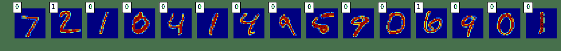
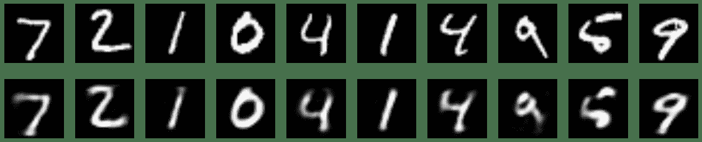
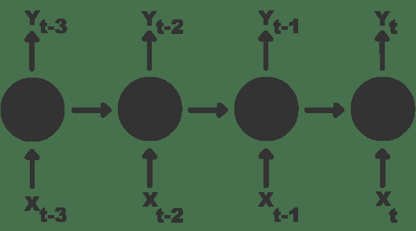
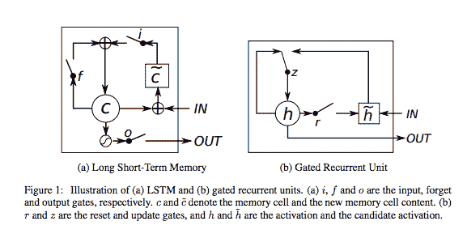
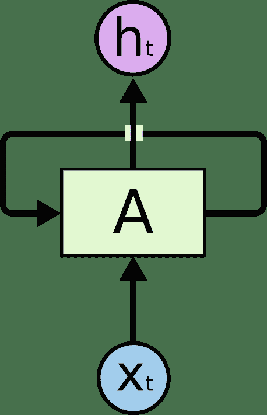
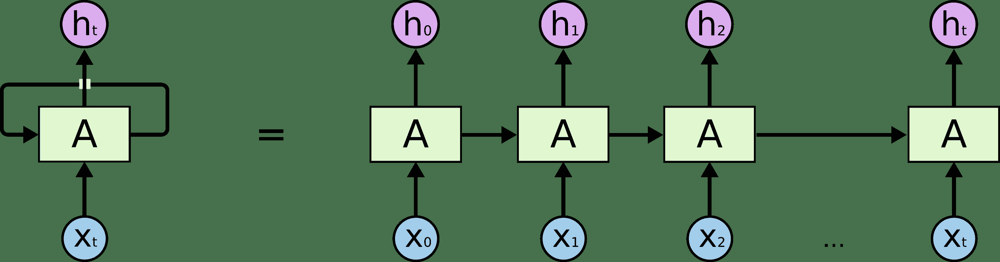
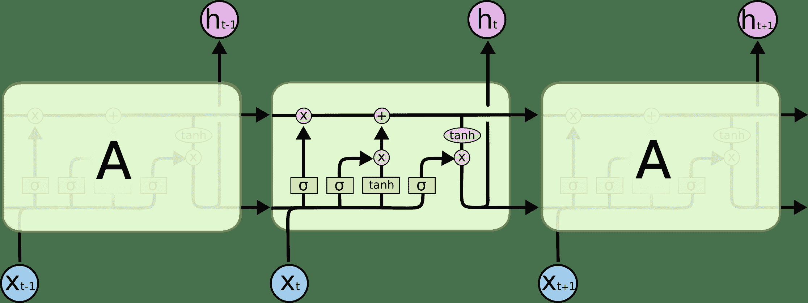

# 四、Keras（下）

> 原文：[keras-tutorials](https://github.com/donnemartin/data-science-ipython-notebooks#keras-tutorials)
> 
> 译者：[飞龙](https://github.com/wizardforcel)
> 
> 协议：[CC BY-NC-SA 4.0](http://creativecommons.org/licenses/by-nc-sa/4.0/)

# 4.7 用于 MNIST 的卷积网络

> 致谢：派生于 Valerio Maggio 的 [deep-learning-keras-tensorflow](https://github.com/leriomaggio/deep-learning-keras-tensorflow)

深度学习模型可能需要相当长的时间来运行，尤其是在不使用 GPU 的情况下。

为了节省时间，你可以采样一个观测子集（例如 1000 个），这是你选择的特定数字（例如 6）和 1000 非特定数字的观察值（即非 6）。我们将使用它构建一个模型，并查看它在测试数据集上的表现。

```
# 导入所需的库
import numpy as np
np.random.seed(1338)

from keras.datasets import mnist

'''
Using Theano backend.
Using gpu device 0: GeForce GTX 760 (CNMeM is enabled with initial size: 90.0% of memory, cuDNN 4007)
'''

from keras.models import Sequential

from keras.layers.core import Dense, Dropout, Activation, Flatten

from keras.layers.convolutional import Convolution2D
from keras.layers.pooling import MaxPooling2D

from keras.utils import np_utils
from keras.optimizers import SGD 
```

## 加载数据

```
path_to_dataset = "euroscipy_2016_dl-keras/data/mnist.pkl.gz"

# 加载训练和测试数据
(X_train, y_train), (X_test, y_test) = mnist.load_data(path_to_dataset)

X_test_orig = X_test 
```

## 数据准备

```
img_rows, img_cols = 28, 28

X_train = X_train.reshape(X_train.shape[0], 1, img_rows, img_cols)
X_test = X_test.reshape(X_test.shape[0], 1, img_rows, img_cols)

X_train = X_train.astype('float32')
X_test = X_test.astype('float32')

X_train /= 255
X_test /= 255

# 用于复现的种子
np.random.seed(1338)

# 测试数据
X_test = X_test.copy()
Y = y_test.copy()

# 将输出转换为二元分类（6 => 1，!6 => 0）
Y_test = Y == 6
Y_test = Y_test.astype(int)

# 选择输出是 6 的 5918 个样本
X_six = X_train[y_train == 6].copy()
Y_six = y_train[y_train == 6].copy()

# 选择输出不是 6 的样本
X_not_six = X_train[y_train != 6].copy()
Y_not_six = y_train[y_train != 6].copy()

# 从输出不是 6 的数据 6000 个随机样本
random_rows = np.random.randint(0,X_six.shape[0],6000)
X_not_six = X_not_six[random_rows]
Y_not_six = Y_not_six[random_rows]

# 附加输出是 6 的数据，和输出不是 6 的数据
X_train = np.append(X_six,X_not_six)

# 改变附加数据的形状
X_train = X_train.reshape(X_six.shape[0] + X_not_six.shape[0], 
                          1, img_rows, img_cols)

# 附加标签，并将标签转换为二元分类（6 => 1，!6 => 0）
Y_labels = np.append(Y_six,Y_not_six)
Y_train = Y_labels == 6 
Y_train = Y_train.astype(int)

print(X_train.shape, Y_labels.shape, X_test.shape, Y_test.shape)

# (11918, 1, 28, 28) (11918,) (10000, 1, 28, 28) (10000, 2)

# 将分类转换为二元类别形式
nb_classes = 2
Y_train = np_utils.to_categorical(Y_train, nb_classes)
Y_test = np_utils.to_categorical(Y_test, nb_classes) 
```

## 简单的 CNN

```
# 为卷积神经网络初始化值
nb_epoch = 2
batch_size = 128
# 要使用的卷积过滤器数量
nb_filters = 32
# 用于最大池化的池化区数量
nb_pool = 2
# 卷积核大小
nb_conv = 3

sgd = SGD(lr=0.1, decay=1e-6, momentum=0.9, nesterov=True) 
```

### 第一步：模型定义

```
model = Sequential()

model.add(Convolution2D(nb_filters, nb_conv, nb_conv,
                        border_mode='valid',
                        input_shape=(1, img_rows, img_cols)))
model.add(Activation('relu'))

model.add(Flatten())
model.add(Dense(nb_classes))
model.add(Activation('softmax')) 
```

### 第二步：编译

```
model.compile(loss='categorical_crossentropy',
              optimizer='sgd',
              metrics=['accuracy']) 
```

### 第三步：拟合

```
model.fit(X_train, Y_train, batch_size=batch_size, 
          nb_epoch=nb_epoch,verbose=1,
          validation_data=(X_test, Y_test))

'''
Train on 11918 samples, validate on 10000 samples
Epoch 1/2
11918/11918 [==============================] - 0s - loss: 0.2890 - acc: 0.9326 - val_loss: 0.1251 - val_acc: 0.9722
Epoch 2/2
11918/11918 [==============================] - 0s - loss: 0.1341 - acc: 0.9612 - val_loss: 0.1298 - val_acc: 0.9599

<keras.callbacks.History at 0x7f6ccb68f630>
''' 
```

### 第四步：评估

```
# 在测试数据上评估模型
score, accuracy = model.evaluate(X_test, Y_test, verbose=0)
print('Test score:', score)
print('Test accuracy:', accuracy)

'''
Test score: 0.129807630396
Test accuracy: 0.9599
''' 
```

### 让我们绘制模型预测

```
import matplotlib.pyplot as plt

%matplotlib inline

slice = 15
predicted = model.predict(X_test[:slice]).argmax(-1)

plt.figure(figsize=(16,8))
for i in range(slice):
    plt.subplot(1, slice, i+1)
    plt.imshow(X_test_orig[i], interpolation='nearest')
    plt.text(0, 0, predicted[i], color='black', 
             bbox=dict(facecolor='white', alpha=1))
    plt.axis('off') 
```



## 添加更多密集层

```
model = Sequential()
model.add(Convolution2D(nb_filters, nb_conv, nb_conv,
                        border_mode='valid',
                        input_shape=(1, img_rows, img_cols)))
model.add(Activation('relu'))

model.add(Flatten())
model.add(Dense(128))
model.add(Activation('relu'))

model.add(Dense(nb_classes))
model.add(Activation('softmax'))

model.compile(loss='categorical_crossentropy',
              optimizer='sgd',
              metrics=['accuracy'])

model.fit(X_train, Y_train, batch_size=batch_size, 
          nb_epoch=nb_epoch,verbose=1,
          validation_data=(X_test, Y_test))

'''
Train on 11918 samples, validate on 10000 samples
Epoch 1/2
11918/11918 [==============================] - 0s - loss: 0.3044 - acc: 0.9379 - val_loss: 0.1469 - val_acc: 0.9625
Epoch 2/2
11918/11918 [==============================] - 0s - loss: 0.1189 - acc: 0.9640 - val_loss: 0.1058 - val_acc: 0.9655

<keras.callbacks.History at 0x7f6cf59f7358>
'''

# 在测试数据上评估模型
score, accuracy = model.evaluate(X_test, Y_test, verbose=0)
print('Test score:', score)
print('Test accuracy:', accuracy)

'''
Test score: 0.105762729073
Test accuracy: 0.9655
''' 
```

## 添加丢弃

```
model = Sequential()

model.add(Convolution2D(nb_filters, nb_conv, nb_conv,
                        border_mode='valid',
                        input_shape=(1, img_rows, img_cols)))
model.add(Activation('relu'))

model.add(Flatten())
model.add(Dense(128))
model.add(Activation('relu'))
model.add(Dropout(0.5))
model.add(Dense(nb_classes))
model.add(Activation('softmax'))

model.compile(loss='categorical_crossentropy',
              optimizer='sgd',
              metrics=['accuracy'])

model.fit(X_train, Y_train, batch_size=batch_size, 
          nb_epoch=nb_epoch,verbose=1,
          validation_data=(X_test, Y_test))

'''
Train on 11918 samples, validate on 10000 samples
Epoch 1/2
11918/11918 [==============================] - 0s - loss: 0.3128 - acc: 0.9097 - val_loss: 0.1438 - val_acc: 0.9624
Epoch 2/2
11918/11918 [==============================] - 0s - loss: 0.1362 - acc: 0.9580 - val_loss: 0.1145 - val_acc: 0.9628

<keras.callbacks.History at 0x7f6ccb180208>
'''

# 在测试数据上评估模型
score, accuracy = model.evaluate(X_test, Y_test, verbose=0)
print('Test score:', score)
print('Test accuracy:', accuracy)

'''
Test score: 0.11448907243
Test accuracy: 0.9628
''' 
```

## 添加更多卷积层

```
model = Sequential()
model.add(Convolution2D(nb_filters, nb_conv, nb_conv,
                        border_mode='valid',
                        input_shape=(1, img_rows, img_cols)))
model.add(Activation('relu'))
model.add(Convolution2D(nb_filters, nb_conv, nb_conv))
model.add(Activation('relu'))
model.add(MaxPooling2D(pool_size=(nb_pool, nb_pool)))
model.add(Dropout(0.25))

model.add(Flatten())
model.add(Dense(128))
model.add(Activation('relu'))
model.add(Dropout(0.5))
model.add(Dense(nb_classes))
model.add(Activation('softmax'))

model.compile(loss='categorical_crossentropy',
              optimizer='sgd',
              metrics=['accuracy'])

model.fit(X_train, Y_train, batch_size=batch_size, 
          nb_epoch=nb_epoch,verbose=1,
          validation_data=(X_test, Y_test))

'''
Train on 11918 samples, validate on 10000 samples
Epoch 1/2
11918/11918 [==============================] - 1s - loss: 0.4707 - acc: 0.8288 - val_loss: 0.2307 - val_acc: 0.9399
Epoch 2/2
11918/11918 [==============================] - 1s - loss: 0.1882 - acc: 0.9383 - val_loss: 0.1195 - val_acc: 0.9621

<keras.callbacks.History at 0x7f6cc97b8748>
'''

# 在测试数据上评估模型 
score, accuracy = model.evaluate(X_test, Y_test, verbose=0)
print('Test score:', score)
print('Test accuracy:', accuracy)

'''
Test score: 0.11954063682
Test accuracy: 0.9621
''' 
```

## 练习

上面的代码已经编写为函数。改变一些**超参数**并看看会发生什么。

```
# 用于构造卷积神经网络的函数
# 如果你希望的话，随便添加参数

def build_model():
    """"""
    model = Sequential()
    model.add(Convolution2D(nb_filters, nb_conv, nb_conv,
                        border_mode='valid',
                        input_shape=(1, img_rows, img_cols)))
    model.add(Activation('relu'))
    model.add(Convolution2D(nb_filters, nb_conv, nb_conv))
    model.add(Activation('relu'))
    model.add(MaxPooling2D(pool_size=(nb_pool, nb_pool)))
    model.add(Dropout(0.25))

    model.add(Flatten())
    model.add(Dense(128))
    model.add(Activation('relu'))
    model.add(Dropout(0.5))
    model.add(Dense(nb_classes))
    model.add(Activation('softmax'))

    model.compile(loss='categorical_crossentropy',
              optimizer='sgd',
              metrics=['accuracy'])

    model.fit(X_train, Y_train, batch_size=batch_size, 
              nb_epoch=nb_epoch,verbose=1,
              validation_data=(X_test, Y_test))

    # 在测试集上评估模型
    score, accuracy = model.evaluate(X_test, Y_test, verbose=0)
    print('Test score:', score)
    print('Test accuracy:', accuracy)

# 计算需要多久来构建模型并测试
%timeit -n1 -r1 build_model()

'''
Train on 11918 samples, validate on 10000 samples
Epoch 1/2
11918/11918 [==============================] - 1s - loss: 0.5634 - acc: 0.7860 - val_loss: 0.3574 - val_acc: 0.9363
Epoch 2/2
11918/11918 [==============================] - 1s - loss: 0.2372 - acc: 0.9292 - val_loss: 0.2253 - val_acc: 0.9190
Test score: 0.225333989978
Test accuracy: 0.919
1 loop, best of 1: 5.45 s per loop
''' 
```

## 批量标准化

在每批中标准化前一层的激活，即应用一个变换，保持激活均值接近 0 且标准差接近 1。

## 如何在 Keras 中 BatchNorm

```
from keras.layers.normalization import BatchNormalization

BatchNormalization(epsilon=1e-06, mode=0, 
                   axis=-1, momentum=0.99, 
                   weights=None, beta_init='zero', 
                   gamma_init='one')

# 尝试向模型添加新的 BatchNormalization 层
# （在 Dropout 层之后） 
```

# 4.8 深度学习实战

> 致谢：派生于 Valerio Maggio 的 [deep-learning-keras-tensorflow](https://github.com/leriomaggio/deep-learning-keras-tensorflow)

从头开始构建和训练你自己的 ConvNet 可能很难并且是一项长期任务。在深度学习中使用的一个常见技巧是使用**预训练的**模型，并将其微调到它将用于的特定数据。

## Keras 中的著名模型

此笔记本包含以下 Keras 模型的代码和参考（收集自 [https://github.com/fchollet/deep-learning-models](https://github.com/fchollet/deep-learning-models)）。

*   VGG16
*   VGG19
*   ResNet50
*   Inception v3

## 参考

*   [Very Deep Convolutional Networks for Large-Scale Image Recognition](https://arxiv.org/abs/1409.1556) - 如果你在工作中使用 VGG 模型，请引用本文。
*   [Deep Residual Learning for Image Recognition](https://arxiv.org/abs/1512.03385) - 如果你在工作中使用 ResNet 模型，请引用本文。
*   [Rethinking the Inception Architecture for Computer Vision](http://arxiv.org/abs/1512.00567) - 如果你在工作中使用 Inception v3 模型，请引用本文。

所有架构都兼容 TensorFlow 和 Theano，并且在实例化时，模型将根据 Keras 配置文件中设置的图像维度顺序构建，位于`~/.keras/keras.json`。例如，如果你设置了`image_dim_ordering=tf`，则根据 TensorFlow 维度顺序约定“Width-Height-Depth”，来构建从此仓库加载的任何模型。

### Keras 配置文件

```
!cat ~/.keras/keras.json

'''
{
    "image_dim_ordering": "th",
    "floatx": "float32",
    "epsilon": 1e-07,
    "backend": "theano"
}
'''

!sed -i 's/theano/tensorflow/g' ~/.keras/keras.json
!cat ~/.keras/keras.json

'''
{
    "image_dim_ordering": "th",
    "floatx": "float32",
    "epsilon": 1e-07,
    "backend": "tensorflow"
}
'''

import keras

# Using TensorFlow backend.

import theano

'''
Using gpu device 0: GeForce GTX 760 (CNMeM is enabled with initial size: 90.0% of memory, cuDNN 4007)
'''

!sed -i 's/tensorflow/theano/g' ~/.keras/keras.json
!cat ~/.keras/keras.json

'''
{
    "image_dim_ordering": "th",
    "backend": "theano",
    "floatx": "float32",
    "epsilon": 1e-07
}
'''

import keras

'''
Using Theano backend.
Using gpu device 0: GeForce GTX 760 (CNMeM is enabled with initial size: 90.0% of memory, cuDNN 4007)
'''

# %load deep_learning_models/imagenet_utils.py
import numpy as np
import json

from keras.utils.data_utils import get_file
from keras import backend as K

CLASS_INDEX = None
CLASS_INDEX_PATH = 'https://s3.amazonaws.com/deep-learning-models/image-models/imagenet_class_index.json'

def preprocess_input(x, dim_ordering='default'):
    if dim_ordering == 'default':
        dim_ordering = K.image_dim_ordering()
    assert dim_ordering in {'tf', 'th'}

    if dim_ordering == 'th':
        x[:, 0, :, :] -= 103.939
        x[:, 1, :, :] -= 116.779
        x[:, 2, :, :] -= 123.68
        # 'RGB'->'BGR'
        x = x[:, ::-1, :, :]
    else:
        x[:, :, :, 0] -= 103.939
        x[:, :, :, 1] -= 116.779
        x[:, :, :, 2] -= 123.68
        # 'RGB'->'BGR'
        x = x[:, :, :, ::-1]
    return x

def decode_predictions(preds):
    global CLASS_INDEX
    assert len(preds.shape) == 2 and preds.shape[1] == 1000
    if CLASS_INDEX is None:
        fpath = get_file('imagenet_class_index.json',
                         CLASS_INDEX_PATH,
                         cache_subdir='models')
        CLASS_INDEX = json.load(open(fpath))
    indices = np.argmax(preds, axis=-1)
    results = []
    for i in indices:
        results.append(CLASS_INDEX[str(i)])
    return results

'''
Using Theano backend.
Using gpu device 0: GeForce GTX 760 (CNMeM is enabled with initial size: 90.0% of memory, cuDNN 4007)
'''

IMAGENET_FOLDER = 'https://gitee.com/wizardforcel/ds-ipynb-zh/raw/master/img/imagenet'  #in the repo 
```

## VGG16

```
# %load deep_learning_models/vgg16.py
'''
用于 Keras 的 VGG16 模型。

# 参考：

- [Very Deep Convolutional Networks for Large-Scale Image Recognition](https://arxiv.org/abs/1409.1556)

'''
from __future__ import print_function

import numpy as np
import warnings

from keras.models import Model
from keras.layers import Flatten, Dense, Input
from keras.layers import Convolution2D, MaxPooling2D
from keras.preprocessing import image
from keras.utils.layer_utils import convert_all_kernels_in_model
from keras.utils.data_utils import get_file
from keras import backend as K

TH_WEIGHTS_PATH = 'https://github.com/fchollet/deep-learning-models/releases/download/v0.1/vgg16_weights_th_dim_ordering_th_kernels.h5'
TF_WEIGHTS_PATH = 'https://github.com/fchollet/deep-learning-models/releases/download/v0.1/vgg16_weights_tf_dim_ordering_tf_kernels.h5'
TH_WEIGHTS_PATH_NO_TOP = 'https://github.com/fchollet/deep-learning-models/releases/download/v0.1/vgg16_weights_th_dim_ordering_th_kernels_notop.h5'
TF_WEIGHTS_PATH_NO_TOP = 'https://github.com/fchollet/deep-learning-models/releases/download/v0.1/vgg16_weights_tf_dim_ordering_tf_kernels_notop.h5'

def VGG16(include_top=True, weights='imagenet',
          input_tensor=None):
    '''实例化 VGG16 架构，可选择加载 ImageNet 上预先训练的权重。
    请注意，使用 TensorFlow 时，为了获得最佳性能，你应该在
    `~/.keras/keras.json`的 Keras 配置中设置`image_dim_ordering='tf'`。

    模型和权重与 TensorFlow 和 Theano 兼容。
    模型使用的维度顺序约定是 Keras 配置文件中规定的约定。

    # 参数
        include_top: 是否在网络顶部包含三个全连接层
        weights: `None`（随机初始化）或 "imagenet"（ImageNet 上的预训练）
        input_tensor: 可选的 Keras 张量（也就是`layers.Input()`的输出），用作模型的图像输入

    # 返回值
        Keras 模型实例
    '''
    if weights not in {'imagenet', None}:
        raise ValueError('The `weights` argument should be either '
                         '`None` (random initialization) or `imagenet` '
                         '(pre-training on ImageNet).')
    # 确定合适的输入大小
    if K.image_dim_ordering() == 'th':
        if include_top:
            input_shape = (3, 224, 224)
        else:
            input_shape = (3, None, None)
    else:
        if include_top:
            input_shape = (224, 224, 3)
        else:
            input_shape = (None, None, 3)

    if input_tensor is None:
        img_input = Input(shape=input_shape)
    else:
        if not K.is_keras_tensor(input_tensor):
            img_input = Input(tensor=input_tensor)
        else:
            img_input = input_tensor
    # 块 1
    x = Convolution2D(64, 3, 3, activation='relu', border_mode='same', name='block1_conv1')(img_input)
    x = Convolution2D(64, 3, 3, activation='relu', border_mode='same', name='block1_conv2')(x)
    x = MaxPooling2D((2, 2), strides=(2, 2), name='block1_pool')(x)

    # 块 2
    x = Convolution2D(128, 3, 3, activation='relu', border_mode='same', name='block2_conv1')(x)
    x = Convolution2D(128, 3, 3, activation='relu', border_mode='same', name='block2_conv2')(x)
    x = MaxPooling2D((2, 2), strides=(2, 2), name='block2_pool')(x)

    # 块 3
    x = Convolution2D(256, 3, 3, activation='relu', border_mode='same', name='block3_conv1')(x)
    x = Convolution2D(256, 3, 3, activation='relu', border_mode='same', name='block3_conv2')(x)
    x = Convolution2D(256, 3, 3, activation='relu', border_mode='same', name='block3_conv3')(x)
    x = MaxPooling2D((2, 2), strides=(2, 2), name='block3_pool')(x)

    # 块 4
    x = Convolution2D(512, 3, 3, activation='relu', border_mode='same', name='block4_conv1')(x)
    x = Convolution2D(512, 3, 3, activation='relu', border_mode='same', name='block4_conv2')(x)
    x = Convolution2D(512, 3, 3, activation='relu', border_mode='same', name='block4_conv3')(x)
    x = MaxPooling2D((2, 2), strides=(2, 2), name='block4_pool')(x)

    # 块 5
    x = Convolution2D(512, 3, 3, activation='relu', border_mode='same', name='block5_conv1')(x)
    x = Convolution2D(512, 3, 3, activation='relu', border_mode='same', name='block5_conv2')(x)
    x = Convolution2D(512, 3, 3, activation='relu', border_mode='same', name='block5_conv3')(x)
    x = MaxPooling2D((2, 2), strides=(2, 2), name='block5_pool')(x)

    if include_top:
        # 分类块
        x = Flatten(name='flatten')(x)
        x = Dense(4096, activation='relu', name='fc1')(x)
        x = Dense(4096, activation='relu', name='fc2')(x)
        x = Dense(1000, activation='softmax', name='predictions')(x)

    # 创建模型
    model = Model(img_input, x)

    # 加载权重
    if weights == 'imagenet':
        print('K.image_dim_ordering:', K.image_dim_ordering())
        if K.image_dim_ordering() == 'th':
            if include_top:
                weights_path = get_file('vgg16_weights_th_dim_ordering_th_kernels.h5',
                                        TH_WEIGHTS_PATH,
                                        cache_subdir='models')
            else:
                weights_path = get_file('vgg16_weights_th_dim_ordering_th_kernels_notop.h5',
                                        TH_WEIGHTS_PATH_NO_TOP,
                                        cache_subdir='models')
            model.load_weights(weights_path)
            if K.backend() == 'tensorflow':
                warnings.warn('You are using the TensorFlow backend, yet you '
                              'are using the Theano '
                              'image dimension ordering convention '
                              '(`image_dim_ordering="th"`). '
                              'For best performance, set '
                              '`image_dim_ordering="tf"` in '
                              'your Keras config '
                              'at ~/.keras/keras.json.')
                convert_all_kernels_in_model(model)
        else:
            if include_top:
                weights_path = get_file('vgg16_weights_tf_dim_ordering_tf_kernels.h5',
                                        TF_WEIGHTS_PATH,
                                        cache_subdir='models')
            else:
                weights_path = get_file('vgg16_weights_tf_dim_ordering_tf_kernels_notop.h5',
                                        TF_WEIGHTS_PATH_NO_TOP,
                                        cache_subdir='models')
            model.load_weights(weights_path)
            if K.backend() == 'theano':
                convert_all_kernels_in_model(model)
    return model

import os

model = VGG16(include_top=True, weights='imagenet')

img_path = os.path.join(IMAGENET_FOLDER, 'strawberry_1157.jpeg')
img = image.load_img(img_path, target_size=(224, 224))
x = image.img_to_array(img)
x = np.expand_dims(x, axis=0)
x = preprocess_input(x)
print('Input image shape:', x.shape)

preds = model.predict(x)
print('Predicted:', decode_predictions(preds)) 
```

K.image_dim_ordering: th
Input image shape: (1, 3, 224, 224)
Predicted: [[‘n07745940’, ‘strawberry’]]

## Fine Tuning of a Pre-Trained Model

```
def VGG16_FT(weights_path = None, 
             img_width = 224, img_height = 224, 
             f_type = None, n_labels = None ):

    """调优基于 VGG16 的网络"""

    # 最后一层之前都是 VGG16！
    model = Sequential()
    model.add(ZeroPadding2D((1, 1), 
                            input_shape=(3, 
                            img_width, img_height)))

    model.add(Convolution2D(64, 3, 3, activation='relu', 
                            name='conv1_1'))
    model.add(ZeroPadding2D((1, 1)))
    model.add(Convolution2D(64, 3, 3, activation='relu', 
                            name='conv1_2'))
    model.add(MaxPooling2D((2, 2), strides=(2, 2)))

    model.add(ZeroPadding2D((1, 1)))
    model.add(Convolution2D(128, 3, 3, activation='relu', 
                            name='conv2_1'))
    model.add(ZeroPadding2D((1, 1)))
    model.add(Convolution2D(128, 3, 3, activation='relu', 
                            name='conv2_2'))
    model.add(MaxPooling2D((2, 2), strides=(2, 2)))

    model.add(ZeroPadding2D((1, 1)))
    model.add(Convolution2D(256, 3, 3, activation='relu', 
                            name='conv3_1'))
    model.add(ZeroPadding2D((1, 1)))
    model.add(Convolution2D(256, 3, 3, activation='relu', 
                            name='conv3_2'))
    model.add(ZeroPadding2D((1, 1)))
    model.add(Convolution2D(256, 3, 3, activation='relu', 
                            name='conv3_3'))
    model.add(MaxPooling2D((2, 2), strides=(2, 2)))

    model.add(ZeroPadding2D((1, 1)))
    model.add(Convolution2D(512, 3, 3, activation='relu', 
                            name='conv4_1'))
    model.add(ZeroPadding2D((1, 1)))
    model.add(Convolution2D(512, 3, 3, activation='relu', 
                            name='conv4_2'))
    model.add(ZeroPadding2D((1, 1)))
    model.add(Convolution2D(512, 3, 3, activation='relu', 
                            name='conv4_3'))
    model.add(MaxPooling2D((2, 2), strides=(2, 2)))

    model.add(ZeroPadding2D((1, 1)))
    model.add(Convolution2D(512, 3, 3, activation='relu', 
                            name='conv5_1'))
    model.add(ZeroPadding2D((1, 1)))
    model.add(Convolution2D(512, 3, 3, activation='relu', 
                            name='conv5_2'))
    model.add(ZeroPadding2D((1, 1)))
    model.add(Convolution2D(512, 3, 3, activation='relu', 
                            name='conv5_3'))
    model.add(MaxPooling2D((2, 2), strides=(2, 2)))
    model.add(Flatten())

    # 插入新的层
    model.add(Dense(768, activation='sigmoid'))
    model.add(Dropout(0.0))
    model.add(Dense(768, activation='sigmoid'))
    model.add(Dropout(0.0))

    last_layer = Dense(n_labels, activation='sigmoid')
    loss = 'categorical_crossentropy'
    optimizer = optimizers.Adam(lr=1e-4, epsilon=1e-08)
    batch_size = 128

    assert os.path.exists(weights_path), 'Model weights not found (see "weights_path" variable in script).'
    #model.load_weights(weights_path)
    f = h5py.File(weights_path)
    for k in range(len(f.attrs['layer_names'])):
       g = f[f.attrs['layer_names'][k]]
       weights = [g[g.attrs['weight_names'][p]] 
                   for p in range(len(g.attrs['weight_names']))]
       if k >= len(model.layers):
           break
       else:
           model.layers[k].set_weights(weights)
    f.close()
    print('Model loaded.')

    model.add(last_layer)

    # 将前 25 层（最后的卷积块之前）设为不可训练
    # （权重不会更新）
    for layer in model.layers[:25]:
        layer.trainable = False

    # 使用 SGD 或动量优化器以及非常小的学习率编译模型
    model.compile(loss=loss,
                  optimizer=optimizer,
                  metrics=['accuracy'])
    return model, batch_size 
```

## 实战：

### 尝试用其他模型做相同的事情

```
%load deep_learning_models/vgg19.py

%load deep_learning_models/resnet50.py 
```

# 4.9 无监督学习

> 致谢：派生于 Valerio Maggio 的 [deep-learning-keras-tensorflow](https://github.com/leriomaggio/deep-learning-keras-tensorflow)

### 自编码器

自动编码器是用于学习有效编码的人工神经网络。自动编码器的目的是学习一组数据表示（编码），通常用于降维。


无监督学习是一种机器学习算法，用于从没有标签的输入数据组成的数据集中做出推断。 最常见的无监督学习方法是聚类分析，用于探索性数据分析来发现隐藏的模式或数据分组。

```
# 基于：https://blog.keras.io/building-autoencoders-in-keras.html

encoding_dim = 32  
input_img = Input(shape=(784,))
encoded = Dense(encoding_dim, activation='relu')(input_img)
decoded = Dense(784, activation='sigmoid')(encoded)
autoencoder = Model(input=input_img, output=decoded)
encoder = Model(input=input_img, output=encoded)

encoded_input = Input(shape=(encoding_dim,))
decoder_layer = autoencoder.layers[-1]
decoder = Model(input=encoded_input, output=decoder_layer(encoded_input))

autoencoder.compile(optimizer='adadelta', loss='binary_crossentropy')

(x_train, _), (x_test, _) = mnist.load_data()

x_train = x_train.astype('float32') / 255.
x_test = x_test.astype('float32') / 255.
x_train = x_train.reshape((len(x_train), np.prod(x_train.shape[1:])))
x_test = x_test.reshape((len(x_test), np.prod(x_test.shape[1:])))

#note: x_train, x_train :) 
autoencoder.fit(x_train, x_train,
                nb_epoch=50,
                batch_size=256,
                shuffle=True,
                validation_data=(x_test, x_test))

'''
Train on 60000 samples, validate on 10000 samples
Epoch 1/50
60000/60000 [==============================] - 20s - loss: 0.3832 - val_loss: 0.2730
Epoch 2/50
60000/60000 [==============================] - 19s - loss: 0.2660 - val_loss: 0.2557
Epoch 3/50
60000/60000 [==============================] - 18s - loss: 0.2455 - val_loss: 0.2331
Epoch 4/50
60000/60000 [==============================] - 19s - loss: 0.2254 - val_loss: 0.2152
Epoch 5/50
60000/60000 [==============================] - 19s - loss: 0.2099 - val_loss: 0.2018
...
Epoch 45/50
60000/60000 [==============================] - 19s - loss: 0.1075 - val_loss: 0.1057
Epoch 46/50
60000/60000 [==============================] - 19s - loss: 0.1070 - val_loss: 0.1052
Epoch 47/50
60000/60000 [==============================] - 20s - loss: 0.1065 - val_loss: 0.1047
Epoch 48/50
60000/60000 [==============================] - 17s - loss: 0.1061 - val_loss: 0.1043
Epoch 49/50
60000/60000 [==============================] - 29s - loss: 0.1056 - val_loss: 0.1039
Epoch 50/50
60000/60000 [==============================] - 21s - loss: 0.1052 - val_loss: 0.1034

<keras.callbacks.History at 0x285017b8>
''' 
```

#### 测试自编码器

```
encoded_imgs = encoder.predict(x_test)
decoded_imgs = decoder.predict(encoded_imgs)

n = 10 
plt.figure(figsize=(20, 4))
for i in range(n):
    # 原始
    ax = plt.subplot(2, n, i + 1)
    plt.imshow(x_test[i].reshape(28, 28))
    plt.gray()
    ax.get_xaxis().set_visible(False)
    ax.get_yaxis().set_visible(False)

    # 重构
    ax = plt.subplot(2, n, i + 1 + n)
    plt.imshow(decoded_imgs[i].reshape(28, 28))
    plt.gray()
    ax.get_xaxis().set_visible(False)
    ax.get_yaxis().set_visible(False)
plt.show() 
```



#### 使用自编码器的样本生成

```
encoded_imgs = np.random.rand(10,32)
decoded_imgs = decoder.predict(encoded_imgs)

n = 10 
plt.figure(figsize=(20, 4))
for i in range(n):
    # 生成
    ax = plt.subplot(2, n, i + 1 + n)
    plt.imshow(decoded_imgs[i].reshape(28, 28))
    plt.gray()
    ax.get_xaxis().set_visible(False)
    ax.get_yaxis().set_visible(False)
plt.show() 
```


#### 预训练编码器

自编码器的威力之一，是使用编码器从特征向量生成有意义的表示。

```
# 使用编码器来预训练分类器 
```

## 使用人工神经网络的自然语言处理

> “非上帝不信，非数据不认。” – W. Edwards Deming, 统计学家

## 词嵌入

### 是什么？

将单词转换为高维空间中的向量。 每个维度表示一个方面，如性别，对象/单词的类型。“词嵌入”是一系列自然语言处理技术，旨在将语义意义映射到几何空间。 这通过将数字向量与字典中的每个单词相关联来完成，使得任何两个向量之间的距离（例如，L2 距离或更常见的余弦距离）将捕获两个相关单词之间的语义关系的一部分。由这些向量形成的几何空间称为嵌入空间。

### 为什么？

通过将单词转换为向量，我们在单词之间建立关系。单词在维度中更相似，他们的分数就越接近。

### 示例

```
W(green) = (1.2, 0.98, 0.05, ...)

W(red) = (1.1, 0.2, 0.5, ...) 
```

这里`green`和`red`的向量值在一个维度上非常相似，因为它们都是颜色。第二维的值非常不同，因为红色可能描绘了训练数据中的负面内容，而绿色则用于正面。通过向量化，我们间接在不同类型的词之间建立了关系。

## 使用 gensim 的`word2vec`示例

```
from gensim.models import word2vec
from gensim.models.word2vec import Word2Vec

'''
Using gpu device 0: GeForce GTX 760 (CNMeM is enabled with initial size: 90.0% of memory, cuDNN 4007)
''' 
```

### 从数据目录中读取博客文章

```
import os
import pickle

DATA_DIRECTORY = os.path.join(os.path.abspath(os.path.curdir), 'data')

male_posts = []
female_post = []

with open(os.path.join(DATA_DIRECTORY,"male_blog_list.txt"),"rb") as male_file:
    male_posts= pickle.load(male_file)

with open(os.path.join(DATA_DIRECTORY,"female_blog_list.txt"),"rb") as female_file:
    female_posts = pickle.load(female_file)

print(len(female_posts))
print(len(male_posts))

'''
2252
2611
'''

filtered_male_posts = list(filter(lambda p: len(p) > 0, male_posts))
filtered_female_posts = list(filter(lambda p: len(p) > 0, female_posts))
posts = filtered_female_posts + filtered_male_posts

print(len(filtered_female_posts), len(filtered_male_posts), len(posts))

# 2247 2595 4842 
```

## `Word2Vec`

```
w2v = Word2Vec(size=200, min_count=1)
w2v.build_vocab(map(lambda x: x.split(), posts[:100]), )

w2v.vocab

'''
{'see.': <gensim.models.word2vec.Vocab at 0x7f61aa4f1908>,
 'never.': <gensim.models.word2vec.Vocab at 0x7f61aa4f1dd8>,
 'driving': <gensim.models.word2vec.Vocab at 0x7f61aa4f1e48>,
 'buddy': <gensim.models.word2vec.Vocab at 0x7f61aa4f0240>,
 'DEFENSE': <gensim.models.word2vec.Vocab at 0x7f61aa4f0438>,

 ...}
'''

w2v.similarity('I', 'My')

# 0.082851942583535218

print(posts[5])
w2v.similarity('ring', 'husband')

'''
I've tried starting blog after blog and it just never feels right.  Then I read today that it feels strange to most people, but the more you do it the better it gets (hmm, sounds suspiciously like something else!) so I decided to give it another try.    My husband bought me a notepad at  urlLink McNally  (the best bookstore in Western Canada) with that title and a picture of a 50s housewife grinning desperately.  Each page has something funny like "New curtains!  Hurrah!".  For some reason it struck me as absolutely hilarious and has stuck in my head ever since.  What were those women thinking?

0.037229111896779618

'''

w2v.similarity('ring', 'housewife')

# 0.11547398696865138

w2v.similarity('women', 'housewife')  # 多样性友好

# -0.14627530812290576 
```

## `Doc2Vec`

word2vec 的相同技术可以扩展到文档。 在这里，我们实现了 word2vec 中完成的所有工作，并且我们也将文档向量化。

```
import numpy as np

# 0 for male, 1 for female
y_posts = np.concatenate((np.zeros(len(filtered_male_posts)),
                          np.ones(len(filtered_female_posts))))

len(y_posts)

# 4842 
```

## 用于句子分类的卷积神经网络

为情感分析训练卷积网络。基于 Yoon Kim 的[“用于句子分类的卷积神经网络”](http://arxiv.org/pdf/1408.5882v2.pdf)。

‘CNN-non-static’ 在 61 个迭代之后达到 82.1%，设置如下：

```
embedding_dim = 20          
filter_sizes = (3, 4)
num_filters = 3
dropout_prob = (0.7, 0.8)
hidden_dims = 100 
```

‘CNN-rand’ 在 7-8 个迭代之后达到 78-79%，设置如下：

```
embedding_dim = 20          
filter_sizes = (3, 4)
num_filters = 150
dropout_prob = (0.25, 0.5)
hidden_dims = 150 
```

‘CNN-static’ 在 7 个迭代之后达到 75.4%，设置如下：

```
embedding_dim = 100          
filter_sizes = (3, 4)
num_filters = 150
dropout_prob = (0.25, 0.5)
hidden_dims = 150 
```

事实证明，如此小的数据集“每个评论只有一个句子的电影评论”（Pang 和 Lee，2005）所需的网络，要比原始文章中介绍的要小得多：

*   嵌入维度只有 20（而不是 300；‘CNN-static’ 需要大约 100）
*   过滤器大小为 2（而不是 3）
*   更高的丢弃概率，以及
*   3 个过滤器对于 ‘CNN-non-static’ 就足够了（而不是 100）
*   嵌入初始化不需要预构建的 Google Word2Vec 数据

在相同的“电影评论”数据集上训练 Word2Vec 足以实现文章中报道的性能（81.6％）。另一个明显的区别是长度为 2 的 slidind 最大池化窗口，而不是文章所示的，整个特征映射上的最大池化。

```
import numpy as np
import data_helpers
from w2v import train_word2vec

from keras.models import Sequential, Model
from keras.layers import (Activation, Dense, Dropout, Embedding, 
                          Flatten, Input, Merge, 
                          Convolution1D, MaxPooling1D)

np.random.seed(2)

'''
Using gpu device 0: GeForce GTX 760 (CNMeM is enabled with initial size: 90.0% of memory, cuDNN 4007)
Using Theano backend.
''' 
```

### 参数

模型变体。详细信息请参阅 Kim Yoon 用于句子分类的卷积神经网络，第 3 节。

```
model_variation = 'CNN-rand'  #  CNN-rand | CNN-non-static | CNN-static
print('Model variation is %s' % model_variation)

# 模型变体是 CNN-rand

# 模型超参数
sequence_length = 56
embedding_dim = 20          
filter_sizes = (3, 4)
num_filters = 150
dropout_prob = (0.25, 0.5)
hidden_dims = 150

# 训练参数
batch_size = 32
num_epochs = 100
val_split = 0.1

# Word2Vec 参数，请见 train_word2vec
min_word_count = 1  # 最小词数
context = 10        # 上下文窗口大小 
```

### 数据准备

```
# 加载数据
print("Loading data...")
x, y, vocabulary, vocabulary_inv = data_helpers.load_data()

if model_variation=='CNN-non-static' or model_variation=='CNN-static':
    embedding_weights = train_word2vec(x, vocabulary_inv, 
                                       embedding_dim, min_word_count, 
                                       context)
    if model_variation=='CNN-static':
        x = embedding_weights[0][x]
elif model_variation=='CNN-rand':
    embedding_weights = None
else:
    raise ValueError('Unknown model variation')    

# Loading data...

# 打乱数据
shuffle_indices = np.random.permutation(np.arange(len(y)))
x_shuffled = x[shuffle_indices]
y_shuffled = y[shuffle_indices].argmax(axis=1)

print("Vocabulary Size: {:d}".format(len(vocabulary)))

# Vocabulary Size: 18765 
```

### 构建 CNN 模型

```
graph_in = Input(shape=(sequence_length, embedding_dim))
convs = []
for fsz in filter_sizes:
    conv = Convolution1D(nb_filter=num_filters,
                         filter_length=fsz,
                         border_mode='valid',
                         activation='relu',
                         subsample_length=1)(graph_in)
    pool = MaxPooling1D(pool_length=2)(conv)
    flatten = Flatten()(pool)
    convs.append(flatten)

if len(filter_sizes)>1:
    out = Merge(mode='concat')(convs)
else:
    out = convs[0]

graph = Model(input=graph_in, output=out)

# 主要序列模型
model = Sequential()
if not model_variation=='CNN-static':
    model.add(Embedding(len(vocabulary), embedding_dim, input_length=sequence_length,
                        weights=embedding_weights))
model.add(Dropout(dropout_prob[0], input_shape=(sequence_length, embedding_dim)))
model.add(graph)
model.add(Dense(hidden_dims))
model.add(Dropout(dropout_prob[1]))
model.add(Activation('relu'))
model.add(Dense(1))
model.add(Activation('sigmoid'))

model.compile(loss='binary_crossentropy', optimizer='rmsprop', 
              metrics=['accuracy'])

# 训练模型
# ==================================================
model.fit(x_shuffled, y_shuffled, batch_size=batch_size,
          nb_epoch=num_epochs, validation_split=val_split, verbose=2)

'''
Train on 9595 samples, validate on 1067 samples
Epoch 1/100
1s - loss: 0.6516 - acc: 0.6005 - val_loss: 0.5692 - val_acc: 0.7151
Epoch 2/100
1s - loss: 0.4556 - acc: 0.7896 - val_loss: 0.5154 - val_acc: 0.7573
Epoch 3/100
1s - loss: 0.3556 - acc: 0.8532 - val_loss: 0.5050 - val_acc: 0.7816
Epoch 4/100
1s - loss: 0.2978 - acc: 0.8779 - val_loss: 0.5335 - val_acc: 0.7901
Epoch 5/100
1s - loss: 0.2599 - acc: 0.8972 - val_loss: 0.5592 - val_acc: 0.7769
...
Epoch 95/100
1s - loss: 0.0012 - acc: 0.9997 - val_loss: 2.9582 - val_acc: 0.7545
Epoch 96/100
1s - loss: 0.0058 - acc: 0.9989 - val_loss: 2.8944 - val_acc: 0.7479
Epoch 97/100
1s - loss: 0.0094 - acc: 0.9985 - val_loss: 2.7146 - val_acc: 0.7516
Epoch 98/100
1s - loss: 0.0044 - acc: 0.9993 - val_loss: 2.9052 - val_acc: 0.7498
Epoch 99/100
1s - loss: 0.0030 - acc: 0.9995 - val_loss: 3.1474 - val_acc: 0.7470
Epoch 100/100
1s - loss: 0.0051 - acc: 0.9990 - val_loss: 3.1746 - val_acc: 0.7451

<keras.callbacks.History at 0x7f78362ae400>
''' 
```

## 另一个示例

使用 Keras + [**GloVe**](http://nlp.stanford.edu/projects/glove/) - **用于单词表示的全局向量**

## 在 Keras 模型中使用预训练的词向量

**参考：**[https://blog.keras.io/using-pre-trained-word-embeddings-in-a-keras-model.html](https://blog.keras.io/using-pre-trained-word-embeddings-in-a-keras-model.html)

# 4.10 循环神经网络

> 致谢：派生于 Valerio Maggio 的 [deep-learning-keras-tensorflow](https://github.com/leriomaggio/deep-learning-keras-tensorflow)

### RNN


循环神经网络（RNN）是一类人工神经网络，其中单元之间的连接形成有向循环。 这创建了网络的内部状态，允许它展示动态时间行为。

```
keras.layers.recurrent.SimpleRNN(output_dim, 
                                 init='glorot_uniform', inner_init='orthogonal', activation='tanh', 
                                 W_regularizer=None, U_regularizer=None, b_regularizer=None, 
                                 dropout_W=0.0, dropout_U=0.0) 
```

#### 时间上的反向传播

与前馈神经网络相反，RNN 的特征在于编码更长的过去信息的能力，因此非常适合于序列模型。 BPTT 扩展了普通的 BP 算法来适应循环神经结构。



```
%matplotlib inline

import numpy as np
import pandas as pd
import theano
import theano.tensor as T
import keras 
from keras.models import Sequential
from keras.layers import Dense, Activation
from keras.preprocessing import image
from __future__ import print_function
import numpy as np
import matplotlib.pyplot as plt

from keras.datasets import imdb
from keras.datasets import mnist
from keras.models import Sequential
from keras.layers import Dense, Dropout, Activation, Flatten
from keras.layers import Convolution2D, MaxPooling2D
from keras.utils import np_utils
from keras.preprocessing import sequence
from keras.layers.embeddings import Embedding
from keras.layers.recurrent import LSTM, GRU, SimpleRNN
from sklearn.preprocessing import LabelEncoder
from sklearn.preprocessing import StandardScaler
from sklearn.cross_validation import train_test_split
from keras.layers.core import Activation, TimeDistributedDense, RepeatVector
from keras.callbacks import EarlyStopping, ModelCheckpoint

# Using Theano backend. 
```

#### IMDB 情感分类任务

这是用于二元情感分类的数据集，其包含比先前基准数据集更多的数据。IMDB 为训练提供了 25,000 个高级性电影评论，还有 25,000 个用于测试。还有其他未标记的数据可供使用。提供原始文本和已处理的词袋格式。

[http://ai.stanford.edu/~amaas/data/sentiment/](http://ai.stanford.edu/~amaas/data/sentiment/)

#### 数据准备 - IMDB

```
max_features = 20000
maxlen = 100  # 在这个数量的单词之后截断文本（以及前 max_features 个最常见的单词）
batch_size = 32

print("Loading data...")
(X_train, y_train), (X_test, y_test) = imdb.load_data(nb_words=max_features, test_split=0.2)
print(len(X_train), 'train sequences')
print(len(X_test), 'test sequences')

print('Example:')
print(X_train[:1])

print("Pad sequences (samples x time)")
X_train = sequence.pad_sequences(X_train, maxlen=maxlen)
X_test = sequence.pad_sequences(X_test, maxlen=maxlen)
print('X_train shape:', X_train.shape)
print('X_test shape:', X_test.shape)

'''
Loading data...
20000 train sequences
5000 test sequences
Example:
[ [1, 20, 28, 716, 48, 495, 79, 27, 493, 8, 5067, 7, 50, 5, 4682, 13075, 10, 5, 852, 157, 11, 5, 1716, 3351, 10, 5, 500, 7308, 6, 33, 256, 41, 13610, 7, 17, 23, 48, 1537, 3504, 26, 269, 929, 18, 2, 7, 2, 4284, 8, 105, 5, 2, 182, 314, 38, 98, 103, 7, 36, 2184, 246, 360, 7, 19, 396, 17, 26, 269, 929, 18, 1769, 493, 6, 116, 7, 105, 5, 575, 182, 27, 5, 1002, 1085, 130, 62, 17, 24, 89, 17, 13, 381, 1421, 8, 5167, 7, 5, 2723, 38, 325, 7, 17, 23, 93, 9, 156, 252, 19, 235, 20, 28, 5, 104, 76, 7, 17, 169, 35, 14764, 17, 23, 1460, 7, 36, 2184, 934, 56, 2134, 6, 17, 891, 214, 11, 5, 1552, 6, 92, 6, 33, 256, 82, 7]]
Pad sequences (samples x time)
X_train shape: (20000L, 100L)
X_test shape: (5000L, 100L)
''' 
```

#### 模型构建

```
print('Build model...')
model = Sequential()
model.add(Embedding(max_features, 128, input_length=maxlen))
model.add(SimpleRNN(128))  
model.add(Dropout(0.5))
model.add(Dense(1))
model.add(Activation('sigmoid'))

# 尝试使用不同的优化器和不同的优化器配置
model.compile(loss='binary_crossentropy', optimizer='adam', class_mode="binary")

print("Train...")
model.fit(X_train, y_train, batch_size=batch_size, nb_epoch=1, validation_data=(X_test, y_test), show_accuracy=True)

'''
Build model...
Train...
Train on 20000 samples, validate on 5000 samples
Epoch 1/1
20000/20000 [==============================] - 174s - loss: 0.7213 - val_loss: 0.6179

<keras.callbacks.History at 0x20519860>
''' 
```

### LSTM

LSTM 网络是一种人工神经网络，它包含 LSTM 块而不是常规网络单元，或者除了常规网络单元之外还包含 LSTM 块。 LSTM 块可以被描述为“智能”网络单元，它可以记住任意时间长度的值。

与传统的 RNN 不同，长短期记忆网络非常适合从经验中学习，以便在重要事件之间存在非常长的未知大小的滞后时，对时间序列进行分类，处理和预测。



```
keras.layers.recurrent.LSTM(output_dim, init='glorot_uniform', inner_init='orthogonal', 
                            forget_bias_init='one', activation='tanh', 
                            inner_activation='hard_sigmoid', 
                            W_regularizer=None, U_regularizer=None, b_regularizer=None, 
                            dropout_W=0.0, dropout_U=0.0) 
```

### GRU

门控循环单元是循环神经网络中的门控机制。与 LSTM 非常相似，它们的参数比 LSTM 少，因为它们没有输出门。

```
keras.layers.recurrent.GRU(output_dim, init='glorot_uniform', inner_init='orthogonal', 
                           activation='tanh', inner_activation='hard_sigmoid', 
                           W_regularizer=None, U_regularizer=None, b_regularizer=None, 
                           dropout_W=0.0, dropout_U=0.0) 
```

### 你的回合！ - RNN 实战

```
print('Build model...')
model = Sequential()
model.add(Embedding(max_features, 128, input_length=maxlen))

# 玩转它们！尝试获得更好的结果！
#model.add(SimpleRNN(128)) 
#model.add(GRU(128)) 
#model.add(LSTM(128)) 

model.add(Dropout(0.5))
model.add(Dense(1))
model.add(Activation('sigmoid'))

# 尝试使用不同的优化器和不同的优化器配置
model.compile(loss='binary_crossentropy', optimizer='adam', class_mode="binary")

print("Train...")
model.fit(X_train, y_train, batch_size=batch_size, 
          nb_epoch=4, validation_data=(X_test, y_test), show_accuracy=True)
score, acc = model.evaluate(X_test, y_test, batch_size=batch_size, show_accuracy=True)
print('Test score:', score)
print('Test accuracy:', acc) 
```

## 使用 RNN(LSTM) 的句子生成

```
from keras.models import Sequential
from keras.layers import Dense, Activation, Dropout
from keras.layers import LSTM
from keras.optimizers import RMSprop
from keras.utils.data_utils import get_file
import numpy as np
import random
import sys

path = get_file('nietzsche.txt', origin="https://s3.amazonaws.com/text-datasets/nietzsche.txt")
text = open(path).read().lower()
print('corpus length:', len(text))

chars = sorted(list(set(text)))
print('total chars:', len(chars))
char_indices = dict((c, i) for i, c in enumerate(chars))
indices_char = dict((i, c) for i, c in enumerate(chars))

# 在 maxlen 个字符的半冗余序列中剪切文本
maxlen = 40
step = 3
sentences = []
next_chars = []
for i in range(0, len(text) - maxlen, step):
    sentences.append(text[i: i + maxlen])
    next_chars.append(text[i + maxlen])
print('nb sequences:', len(sentences))

print('Vectorization...')
X = np.zeros((len(sentences), maxlen, len(chars)), dtype=np.bool)
y = np.zeros((len(sentences), len(chars)), dtype=np.bool)
for i, sentence in enumerate(sentences):
    for t, char in enumerate(sentence):
        X[i, t, char_indices[char]] = 1
    y[i, char_indices[next_chars[i]]] = 1

# 构建模型：单 LSTM
print('Build model...')
model = Sequential()
model.add(LSTM(128, input_shape=(maxlen, len(chars))))
model.add(Dense(len(chars)))
model.add(Activation('softmax'))

optimizer = RMSprop(lr=0.01)
model.compile(loss='categorical_crossentropy', optimizer=optimizer)

def sample(preds, temperature=1.0):
    # 用于从概率数组中抽样索引的辅助函数
    preds = np.asarray(preds).astype('float64')
    preds = np.log(preds) / temperature
    exp_preds = np.exp(preds)
    preds = exp_preds / np.sum(exp_preds)
    probas = np.random.multinomial(1, preds, 1)
    return np.argmax(probas)

# 训练模型，输出每个迭代之后生成的文本
for iteration in range(1, 60):
    print()
    print('-' * 50)
    print('Iteration', iteration)
    model.fit(X, y, batch_size=128, nb_epoch=1)

    start_index = random.randint(0, len(text) - maxlen - 1)

    for diversity in [0.2, 0.5, 1.0, 1.2]:
        print()
        print('----- diversity:', diversity)

        generated = ''
        sentence = text[start_index: start_index + maxlen]
        generated += sentence
        print('----- Generating with seed: "' + sentence + '"')
        sys.stdout.write(generated)

        for i in range(400):
            x = np.zeros((1, maxlen, len(chars)))
            for t, char in enumerate(sentence):
                x[0, t, char_indices[char]] = 1.

            preds = model.predict(x, verbose=0)[0]
            next_index = sample(preds, diversity)
            next_char = indices_char[next_index]

            generated += next_char
            sentence = sentence[1:] + next_char

            sys.stdout.write(next_char)
            sys.stdout.flush()
        print()

'''
Downloading data from https://s3.amazonaws.com/text-datasets/nietzsche.txt
598016/600901 [============================>.] - ETA: 0s('corpus length:', 600901)
('total chars:', 59)
('nb sequences:', 200287)
Vectorization...
Build model...
()
--------------------------------------------------
('Iteration', 1)
Epoch 1/1
200287/200287 [==============================] - 1367s - loss: 1.9977  
()
('----- diversity:', 0.2)
----- Generating with seed: "nd the frenzied
speeches of the prophets"
nd the frenzied
speeches of the prophets and the present and and the preases and the soul to the sense of the morals and the some the consequence of the most and one only the some of the proment and interent of the some devertal to the self-consertion of the some deverent of the some distiness and the sense of the some of the morality of the most proves and the some of the some in the seem of the self-conception of the sees of the sense()
()
('----- diversity:', 0.5)
----- Generating with seed: "nd the frenzied
speeches of the prophets"
nd the frenzied
speeches of the prophets of the preat weak to the master of man who onow in interervain of even which who with it is the isitaial conception of the some live the contented the one who exilfacied in the sees to raters, and the passe expecience the inte that the persented in the pass, in the experious of the soulity of the waith the morally distanding of the some of the most interman only and as a period of the sense and o()
()
('----- diversity:', 1.0)
----- Generating with seed: "nd the frenzied
speeches of the prophets"
nd the frenzied
speeches of the prophets of
ar self now no ecerspoped ivent so not,
that itsed undiswerbatarlials. what it is altrenively evok
now be scotnew
prigardiness intagualds, and coumond-grow to
the respence you as penires never wand be
natuented ost ablinice to love worts an who itnopeancew be than mrank againribl
some something lines in the estlenbtupenies of korils divenowry apmains, curte, were,
ind "feulness.  a will, natur()
()
('----- diversity:', 1.2)
----- Generating with seed: "nd the frenzied
speeches of the prophets"
nd the frenzied
speeches of the prophets, ind someaterting will stroour hast-fards and lofe beausold, in souby in ruarest, we withquus. "the capinistin and it a mode what it be
my oc, to th[se condectay
of ymo fre
dunt and so asexthersess renieved concecunaulies tound"), from glubiakeitiouals kenty am feelitafouer deceanw or sumpind, and by afolod peall--phasoos of sole
iy copprajakias
in
in adcyont-mean to prives apf-rigionall thust wi()
()
--------------------------------------------------
('Iteration', 2)
Epoch 1/1
 40576/200287 [=====>........................] - ETA: 1064s - loss: 1.6878
''' 
```

# 4.11 使用 LSTM 的 RNN

> 致谢：派生于 Valerio Maggio 的 [deep-learning-keras-tensorflow](https://github.com/leriomaggio/deep-learning-keras-tensorflow)

  

> 来源：[http://colah.github.io/posts/2015-08-Understanding-LSTMs](http://colah.github.io/posts/2015-08-Understanding-LSTMs)

```
from keras.optimizers import SGD
from keras.preprocessing.text import one_hot, text_to_word_sequence, base_filter
from keras.utils import np_utils
from keras.models import Sequential
from keras.layers.core import Dense, Dropout, Activation
from keras.layers.embeddings import Embedding
from keras.layers.recurrent import LSTM, GRU
from keras.preprocessing import sequence 
```

### 从数据目录读取博客文章

```
import os
import pickle
import numpy as np

DATA_DIRECTORY = os.path.join(os.path.abspath(os.path.curdir), 'data')
print(DATA_DIRECTORY)

# /home/valerio/deep-learning-keras-euroscipy2016/data

male_posts = []
female_post = []

with open(os.path.join(DATA_DIRECTORY,"male_blog_list.txt"),"rb") as male_file:
    male_posts= pickle.load(male_file)

with open(os.path.join(DATA_DIRECTORY,"female_blog_list.txt"),"rb") as female_file:
    female_posts = pickle.load(female_file)

filtered_male_posts = list(filter(lambda p: len(p) > 0, male_posts))
filtered_female_posts = list(filter(lambda p: len(p) > 0, female_posts))

# 文本处理 - 单热构建词索引
male_one_hot = []
female_one_hot = []
n = 30000
for post in filtered_male_posts:
    try:
        male_one_hot.append(one_hot(post, n, split=" ", filters=base_filter(), lower=True))
    except:
        continue

for post in filtered_female_posts:
    try:
        female_one_hot.append(one_hot(post,n,split=" ",filters=base_filter(),lower=True))
    except:
        continue

# 男性为 0，女性为 1
concatenate_array_rnn = np.concatenate((np.zeros(len(male_one_hot)),
                                        np.ones(len(female_one_hot))))

from sklearn.cross_validation import train_test_split

X_train_rnn, X_test_rnn, y_train_rnn, y_test_rnn = train_test_split(np.concatenate((female_one_hot,male_one_hot)),
                                                                    concatenate_array_rnn, 
                                                                    test_size=0.2)

maxlen = 100
X_train_rnn = sequence.pad_sequences(X_train_rnn, maxlen=maxlen)
X_test_rnn = sequence.pad_sequences(X_test_rnn, maxlen=maxlen)
print('X_train_rnn shape:', X_train_rnn.shape, y_train_rnn.shape)
print('X_test_rnn shape:', X_test_rnn.shape, y_test_rnn.shape)

'''
X_train_rnn shape: (3873, 100) (3873,)
X_test_rnn shape: (969, 100) (969,)
'''

max_features = 30000
dimension = 128
output_dimension = 128
model = Sequential()
model.add(Embedding(max_features, dimension))
model.add(LSTM(output_dimension))
model.add(Dropout(0.5))
model.add(Dense(1))
model.add(Activation('sigmoid'))

model.compile(loss='mean_squared_error', optimizer='sgd', metrics=['accuracy'])

model.fit(X_train_rnn, y_train_rnn, batch_size=32,
          nb_epoch=4, validation_data=(X_test_rnn, y_test_rnn))

'''
Train on 3873 samples, validate on 969 samples
Epoch 1/4
3873/3873 [==============================] - 3s - loss: 0.2487 - acc: 0.5378 - val_loss: 0.2506 - val_acc: 0.5191
Epoch 2/4
3873/3873 [==============================] - 3s - loss: 0.2486 - acc: 0.5401 - val_loss: 0.2508 - val_acc: 0.5191
Epoch 3/4
3873/3873 [==============================] - 3s - loss: 0.2484 - acc: 0.5417 - val_loss: 0.2496 - val_acc: 0.5191
Epoch 4/4
3873/3873 [==============================] - 3s - loss: 0.2484 - acc: 0.5399 - val_loss: 0.2502 - val_acc: 0.5191

<keras.callbacks.History at 0x7fa1e96ac4e0>
'''

score, acc = model.evaluate(X_test_rnn, y_test_rnn, batch_size=32)

# 969/969 [==============================] - 0s 

print(score, acc)

# 0.250189056399 0.519091847357 
```

## 将 TFIDF 向量化器用作输入，来代替单热编码器

```
from sklearn.feature_extraction.text import TfidfVectorizer

vectorizer = TfidfVectorizer(decode_error='ignore', norm='l2', min_df=5)
tfidf_male = vectorizer.fit_transform(filtered_male_posts)
tfidf_female = vectorizer.fit_transform(filtered_female_posts)

flattened_array_tfidf_male = tfidf_male.toarray()
flattened_array_tfidf_female = tfidf_male.toarray()

y_rnn = np.concatenate((np.zeros(len(flattened_array_tfidf_male)),
                                        np.ones(len(flattened_array_tfidf_female))))

X_train_rnn, X_test_rnn, y_train_rnn, y_test_rnn = train_test_split(np.concatenate((flattened_array_tfidf_male, 
                                                                                    flattened_array_tfidf_female)),
                                                                    y_rnn,test_size=0.2)

maxlen = 100
X_train_rnn = sequence.pad_sequences(X_train_rnn, maxlen=maxlen)
X_test_rnn = sequence.pad_sequences(X_test_rnn, maxlen=maxlen)
print('X_train_rnn shape:', X_train_rnn.shape, y_train_rnn.shape)
print('X_test_rnn shape:', X_test_rnn.shape, y_test_rnn.shape)

'''
X_train_rnn shape: (4152, 100) (4152,)
X_test_rnn shape: (1038, 100) (1038,)
'''

max_features = 30000
model = Sequential()
model.add(Embedding(max_features, dimension))
model.add(LSTM(output_dimension))
model.add(Dropout(0.5))
model.add(Dense(1))
model.add(Activation('sigmoid'))

model.compile(loss='mean_squared_error',optimizer='sgd', metrics=['accuracy'])

model.fit(X_train_rnn, y_train_rnn, 
          batch_size=32, nb_epoch=4,
          validation_data=(X_test_rnn, y_test_rnn))

'''
Train on 4152 samples, validate on 1038 samples
Epoch 1/4
4152/4152 [==============================] - 3s - loss: 0.2502 - acc: 0.4988 - val_loss: 0.2503 - val_acc: 0.4865
Epoch 2/4
4152/4152 [==============================] - 3s - loss: 0.2507 - acc: 0.4843 - val_loss: 0.2500 - val_acc: 0.4865
Epoch 3/4
4152/4152 [==============================] - 3s - loss: 0.2504 - acc: 0.4952 - val_loss: 0.2501 - val_acc: 0.4865
Epoch 4/4
4152/4152 [==============================] - 3s - loss: 0.2506 - acc: 0.4913 - val_loss: 0.2500 - val_acc: 0.5135

<keras.callbacks.History at 0x7fa1f466f278>
'''

score,acc = model.evaluate(X_test_rnn, y_test_rnn, 
                           batch_size=32)
'''
1038/1038 [==============================] - 0s     
'''

print(score, acc)

'''
0.249981284572 0.513487476145
''' 
```

## 使用 LSTM 的句子生成

```
# 读取所有男性文本数据到一个字符串中
male_post = ' '.join(filtered_male_posts)

# 为男性内容构建字符集
character_set_male = set(male_post)
# 构建两个字典 - 字符到索引的映射，和索引到字符的映射
char_indices = dict((c, i) for i, c in enumerate(character_set_male))
indices_char = dict((i, c) for i, c in enumerate(character_set_male))

# 在 maxlen 个字符的半冗余序列中剪切文本
maxlen = 20
step = 1
sentences = []
next_chars = []
for i in range(0, len(male_post) - maxlen, step):
    sentences.append(male_post[i : i + maxlen])
    next_chars.append(male_post[i + maxlen])

# 将输入向量化
x_male = np.zeros((len(male_post), maxlen, len(character_set_male)), dtype=np.bool)
y_male = np.zeros((len(male_post), len(character_set_male)), dtype=np.bool)

print(x_male.shape, y_male.shape)

for i, sentence in enumerate(sentences):
    for t, char in enumerate(sentence):
        x_male[i, t, char_indices[char]] = 1
    y_male[i, char_indices[next_chars[i]]] = 1

print(x_male.shape, y_male.shape)

'''
(2552476, 20, 152) (2552476, 152)
(2552476, 20, 152) (2552476, 152)
'''

# 构建模型：单 LSTM
print('Build model...')
model = Sequential()
model.add(LSTM(128, input_shape=(maxlen, len(character_set_male))))
model.add(Dense(len(character_set_male)))
model.add(Activation('softmax'))

optimizer = RMSprop(lr=0.01)
model.compile(loss='categorical_crossentropy', optimizer=optimizer)

# Build model...

auto_text_generating_male_model.compile(loss='mean_squared_error',optimizer='sgd')

import random, sys

# 用于从概率数组中抽样索引的辅助函数
def sample(a, diversity=0.75):
    if random.random() > diversity:
        return np.argmax(a)
    while 1:
        i = random.randint(0, len(a)-1)
        if a[i] > random.random():
            return i

# 训练模型，输出每个迭代之后生成的文本
for iteration in range(1,10):
    print()
    print('-' * 50)
    print('Iteration', iteration)
    model.fit(x_male, y_male, batch_size=128, nb_epoch=1)

    start_index = random.randint(0, len(male_post) - maxlen - 1)

    for diversity in [0.2, 0.4, 0.6, 0.8]:
        print()
        print('----- diversity:', diversity)

        generated = ''
        sentence = male_post[start_index : start_index + maxlen]
        generated += sentence
        print('----- Generating with seed: "' + sentence + '"')

        for iteration in range(400):
            try:
                x = np.zeros((1, maxlen, len(character_set_male)))
                for t, char in enumerate(sentence):
                    x[0, t, char_indices[char]] = 1.

                preds = model.predict(x, verbose=0)[0]
                next_index = sample(preds, diversity)
                next_char = indices_char[next_index]

                generated += next_char
                sentence = sentence[1:] + next_char
            except:
                continue

        print(sentence)
        print()

'''

--------------------------------------------------
Iteration 1
Epoch 1/1
2552476/2552476 [==============================] - 226s - loss: 1.8022   

----- diversity: 0.2
----- Generating with seed: "p from the lack of  "
sense of the search 

----- diversity: 0.4
----- Generating with seed: "p from the lack of  "
through that possibl

----- diversity: 0.6
----- Generating with seed: "p from the lack of  "
. This is a "   by p

----- diversity: 0.8
----- Generating with seed: "p from the lack of  "
d he latermal ta we 

...

--------------------------------------------------
Iteration 9
Epoch 1/1
2552476/2552476 [==============================] - 228s - loss: 8.7874   

----- diversity: 0.2
----- Generating with seed: " I’ve always looked "
ea  e ton ann n ffee

----- diversity: 0.4
----- Generating with seed: " I’ve always looked "
o tire n a anV sia a

----- diversity: 0.6
----- Generating with seed: " I’ve always looked "
r i jooe  Vag  o en 

----- diversity: 0.8
----- Generating with seed: " I’ve always looked "
  ao at ge ena oro o
''' 
```