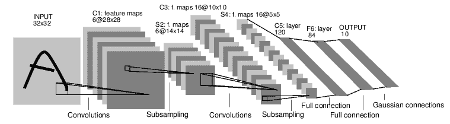

> 译者：[bat67](https://github.com/bat67)
> 
> 最新版会在[译者仓库](https://github.com/bat67/Deep-Learning-with-PyTorch-A-60-Minute-Blitz-cn)首先同步。

可以使用`torch.nn`包来构建神经网络.

我们以及介绍了`autograd`，`nn`包依赖于`autograd`包来定义模型并对它们求导。一个`nn.Module`包含各个层和一个`forward(input)`方法，该方法返回`output`。

例如，下面这个神经网络可以对数字进行分类：



这是一个简单的前馈神经网络（feed-forward network）。它接受一个输入，然后将它送入下一层，一层接一层的传递，最后给出输出。

一个神经网络的典型训练过程如下：

*   定义包含一些可学习参数（或者叫权重）的神经网络
*   在输入数据集上迭代
*   通过网络处理输入
*   计算损失（输出和正确答案的距离）
*   将梯度反向传播给网络的参数
*   更新网络的权重，一般使用一个简单的规则：`weight = weight - learning_rate * gradient`

## 定义网络

让我们定义这样一个网络：

```
import torch
import torch.nn as nn
import torch.nn.functional as F 
```

> [**阅读全文／改进本文**](https://github.com/apachecn/pytorch-doc-zh/blob/master/docs/1.0/blitz_neural_networks_tutorial.md)