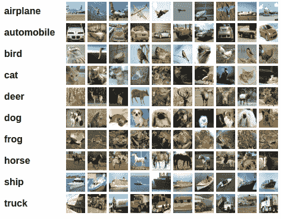

> 译者：[bat67](https://github.com/bat67)
> 
> 最新版会在[译者仓库](https://github.com/bat67/Deep-Learning-with-PyTorch-A-60-Minute-Blitz-cn)首先同步。

目前为止，我们以及看到了如何定义网络，计算损失，并更新网络的权重。

现在可能会想，

## 数据呢？

通常来说，当必须处理图像、文本、音频或视频数据时，可以使用python标准库将数据加载到numpy数组里。然后将这个数组转化成`torch.*Tensor`。

*   对于图片，有Pillow，OpenCV等包可以使用
*   对于音频，有scipy和librosa等包可以使用
*   对于文本，不管是原生python的或者是基于Cython的文本，可以使用NLTK和SpaCy

特别对于视觉方面，我们创建了一个包，名字叫`torchvision`，其中包含了针对Imagenet、CIFAR10、MNIST等常用数据集的数据加载器（data loaders），还有对图片数据变形的操作，即`torchvision.datasets`和`torch.utils.data.DataLoader`。

这提供了极大的便利，可以避免编写样板代码。

在这个教程中，我们将使用CIFAR10数据集，它有如下的分类：“飞机”，“汽车”，“鸟”，“猫”，“鹿”，“狗”，“青蛙”，“马”，“船”，“卡车”等。在CIFAR-10里面的图片数据大小是3x32x32，即三通道彩色图，图片大小是32x32像素。

## 训练一个图片分类器

我们将按顺序做以下步骤：

1.  通过`torchvision`加载CIFAR10里面的训练和测试数据集，并对数据进行标准化
2.  定义卷积神经网络
3.  定义损失函数
4.  利用训练数据训练网络
5.  利用测试数据测试网络

> [**阅读全文／改进本文**](https://github.com/apachecn/pytorch-doc-zh/blob/master/docs/1.0/blitz_cifar10_tutorial.md)