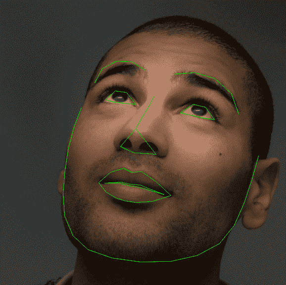

> 译者：[yportne13](https://github.com/yportne13)

**作者**：[Sasank Chilamkurthy](https://chsasank.github.io)

在解决机器学习问题的时候，人们花了大量精力准备数据。pytorch提供了许多工具来让载入数据更简单并尽量让你的代码的可读性更高。在这篇教程中，我们将学习如何加载和预处理/增强一个有价值的数据集。

在运行这个教程前请先确保你已安装以下的包:

*   `scikit-image`: 图形接口以及变换
*   `pandas`: 便于处理csv文件

```
from __future__ import print_function, division
import os
import torch
import pandas as pd
from skimage import io, transform
import numpy as np
import matplotlib.pyplot as plt
from torch.utils.data import Dataset, DataLoader
from torchvision import transforms, utils

# Ignore warnings
import warnings
warnings.filterwarnings("ignore")

plt.ion()   # interactive mode 
```

我们要处理的是一个面部姿态的数据集。也就是按如下方式标注的人脸:


每张脸标注了68个不同的特征点。

> [**阅读全文／改进本文**](https://github.com/apachecn/pytorch-doc-zh/blob/master/docs/1.0/data_loading_tutorial.md)