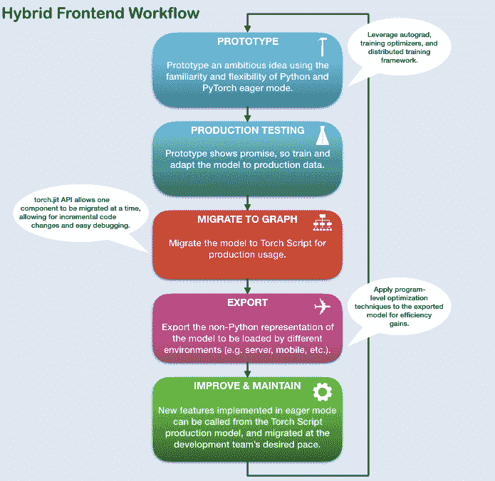

> 译者：[cangyunye](https://github.com/cangyunye)

**作者:** [Matthew Inkawhich](https://github.com/MatthewInkawhich)

本教程将介绍如何是`seq2seq`模型转换为PyTorch可用的前端混合Torch脚本。 我们要转换的模型是来自于聊天机器人教程 [Chatbot tutorial](https://pytorch.org/tutorials/beginner/chatbot_tutorial.html). 你可以把这个教程当做Chatbot tutorial的第二篇章,并且部署你的预训练模型，或者你也可以依据本文使用我们采取的预训练模型。就后者而言，你可以从原始的Chatbot tutorial参考更详细的数据预处理，模型理论和定义以及模型训练。

## 什么是混合前端（Hybrid Frontend）?

在一个基于深度学习项目的研发阶段, 使用像PyTorch这样**即时**`eager`、命令式的界面进行交互能带来很大便利。 这使用户能够在使用Python数据结构、控制流操作、打印语句和调试实用程序时通过熟悉的、惯用的Python脚本编写。尽管即时性界面对于研究和试验应用程序是一个有用的工具，但是对于生产环境中部署模型时，使用**基于图形**`graph-based`的模型表示将更加适用的。 一个延迟的图型展示意味着可以优化，比如无序执行操作，以及针对高度优化的硬件架构的能力。 此外，基于图形的表示支持框架无关的模型导出。PyTorch提供了将即时模式的代码增量转换为Torch脚本的机制，Torch脚本是一个在Python中的静态可分析和可优化的子集，Torch使用它来在Python运行时独立进行深度学习。

在Torch中的`torch.jit`模块可以找到将即时模式的PyTorch程序转换为Torch脚本的API。 这个模块有两个核心模式用于将即时模式模型转换为Torch脚本图形表示: **跟踪**`tracing` 以及 **脚本化**`scripting`。`torch.jit.trace` 函数接受一个模块或者一个函数和一组示例的输入，然后通过函数或模块运行输入示例，同时跟跟踪遇到的计算步骤，然后输出一个可以展示跟踪流程的基于图形的函数。**跟踪**`Tracing`对于不涉及依赖于数据的控制流的直接的模块和函数非常有用，就比如标准的卷积神经网络。然而，如果一个有数据依赖的if语句和循环的函数被跟踪，则只记录示例输入沿执行路径调用的操作。换句话说，控制流本身并没有被捕获。要将带有数据依赖控制流的模块和函数进行转化，已提供了一个脚本化机制。脚本显式地将模块或函数代码转换为Torch脚本，包括所有可能的控制流路径。 如需使用脚本模式`script mode`， 要确定继承了 `torch.jit.ScriptModule`基本类 (取代`torch.nn.Module`) 并且增加 `torch.jit.script` 装饰器到你的Python函数或者 `torch.jit.script_method` 装饰器到你的模块方法。使用脚本化的一个警告是，它只支持Python的一个受限子集。要获取与支持的特性相关的所有详细信息，请参考 Torch Script [language reference](https://pytorch.org/docs/master/jit.html)。为了达到最大的灵活性，可以组合Torch脚本的模式来表示整个程序，并且可以增量地应用这些技术。

## 致谢

本篇教程灵感来自如下资源：

1.  Yuan-Kuei Wu’s pytorch-chatbot implementation: [https://github.com/ywk991112/pytorch-chatbot](https://github.com/ywk991112/pytorch-chatbot)
2.  Sean Robertson’s practical-pytorch seq2seq-translation example: [https://github.com/spro/practical-pytorch/tree/master/seq2seq-translation](https://github.com/spro/practical-pytorch/tree/master/seq2seq-translation)
3.  FloydHub’s Cornell Movie Corpus preprocessing code: [https://github.com/floydhub/textutil-preprocess-cornell-movie-corpus](https://github.com/floydhub/textutil-preprocess-cornell-movie-corpus)

> [**阅读全文／改进本文**](https://github.com/apachecn/pytorch-doc-zh/blob/master/docs/1.0/deploy_seq2seq_hybrid_frontend_tutorial.md)