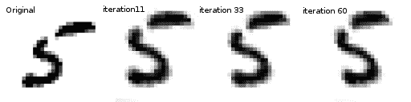

> 译者：[冯宝宝](https://github.com/PEGASUS1993)

**作者**: [Ghassen HAMROUNI](https://github.com/GHamrouni)



在本教程中，您将学习如何使用称为空间变换器网络的视觉注意机制来扩充您的网络。你可以在 [DeepMind paper](https://arxiv.org/abs/1506.02025)阅读有关空间变换器网络的更多内容。

空间变换器网络是对任何空间变换的差异化关注的概括。空间变换器网络（简称STN）允许神经网络学习如何在输入图像上执行空间变换，以增强模型的几何不变性。例如，它可以裁剪感兴趣的区域，缩放并校正图像的方向。它可能是一种有用的机制，因为CNN对于旋转和缩放以及更一般的仿射变换并不是不变的。
关于STN的最棒的事情之一是能够简单地将其插入任何现有的CNN，只需很少的修改。

```
# License: BSD
# 作者: Ghassen Hamrouni

from __future__ import print_function  
import torch  
import torch.nn as nn  
import torch.nn.functional as F  
import torch.optim as optim  
import torchvision  
from torchvision import datasets, transforms  
import matplotlib.pyplot as plt  
import numpy as np  

plt.ion()   # 交互模式 
```

## 加载数据

在这篇文章中，我们尝试了经典的MNIST数据集。使用标准卷积网络增强空间变换器网络。

> [**阅读全文／改进本文**](https://github.com/apachecn/pytorch-doc-zh/blob/master/docs/1.0/spatial_transformer_tutorial.md)