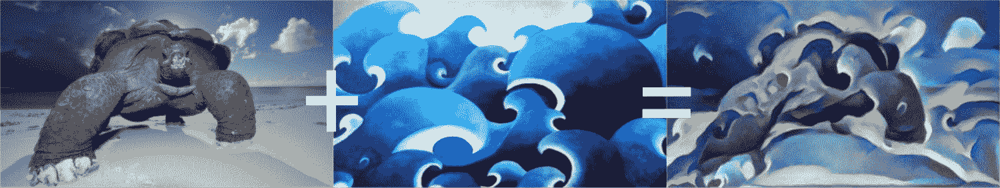

> 译者：[bdqfork](https://github.com/bdqfork)

**作者**: [Alexis Jacq](https://alexis-jacq.github.io)

## 简介

本教程主要讲解如何实现由Leon A. Gatys，Alexander S. Ecker和Matthias Bethge提出的 [Neural-Style 算法](https://arxiv.org/abs/1508.06576)。Neural-Style或者叫Neural-Transfer，可以让你使用一种新的风格将指定的图片进行重构。这个算法使用三张图片，一张输入图片，一张内容图片和一张风格图片，并将输入的图片变得与内容图片相似，且拥有风格图片的优美风格。



## 基本原理

原理很简单：我们定义两个间距，一个用于内容`D_C`，另一个用于风格`D_S`。`D_C`测量两张图片内容的不同，而`D_S`用来测量两张图片风格的不同。然后，我们输入第三张图片，并改变这张图片，使其与内容图片的内容间距和风格图片的风格间距最小化。现在，我们可以导入必要的包，开始图像风格转换。

## 导包并选择设备

下面是一张实现图像风格转换所需包的清单。

*   `torch`, `torch.nn`, `numpy` (使用PyTorch进行风格转换必不可少的包)
*   `torch.optim` (高效的梯度下降)
*   `PIL`, `PIL.Image`, `matplotlib.pyplot` (加载和展示图片)
*   `torchvision.transforms` (将PIL图片转换成张量)
*   `torchvision.models` (训练或加载预训练模型)
*   `copy` (对模型进行深度拷贝；系统包)

```
from __future__ import print_function

import torch
import torch.nn as nn
import torch.nn.functional as F
import torch.optim as optim 
```

> [**阅读全文／改进本文**](https://github.com/apachecn/pytorch-doc-zh/blob/master/docs/1.0/neural_style_tutorial.md)