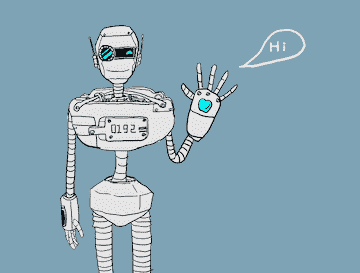

> 译者：[毛毛虫](https://github.com/a625687551)

**作者**: [Matthew Inkawhich](https://github.com/MatthewInkawhich)

在本教程中，我们探索了一个好玩和有趣的循环序列到序列的模型用例。我们将用 [Cornell Movie-Dialogs Corpus](https://www.cs.cornell.edu/~cristian/Cornell_Movie-Dialogs_Corpus.html)处的电影剧本来训练一个简单的聊天机器人。

在人工智能研究领域中对话模型模型是一个非常热门的话题。聊天机器人可以在各种设置中找到，包括客户服务应用和在线帮助。这些机器人通常由基于检索的模型提供支持，这些输出是某些形式问题预先定义的响应。在像公司IT服务台这样高度受限制的领域中，这些模型可能足够了，但是，对于更一般的用例它们不够健壮。教一台机器与多领域的人进行有意义的对话是一个远未解决的研究问题。最近，深度学习热潮已经允许强大的生成模型，如谷歌的神经对话模型 [Neural Conversational Model](https://arxiv.org/abs/1506.05869)，这标志着向多领域生成对话模型迈出了一大步。 在本教程中，我们将在PyTorch中实现这种模型。



```
> hello?
Bot: hello .
> where am I?
Bot: you re in a hospital .
> who are you?
Bot: i m a lawyer .
> how are you doing?
Bot: i m fine .
> are you my friend?
Bot: no .
> you're under arrest
Bot: i m trying to help you !
> i'm just kidding
Bot: i m sorry .
> where are you from?
Bot: san francisco .
> it's time for me to leave
Bot: i know .
> goodbye
Bot: goodbye . 
```

> [**阅读全文／改进本文**](https://github.com/apachecn/pytorch-doc-zh/blob/master/docs/1.0/chatbot_tutorial.md)