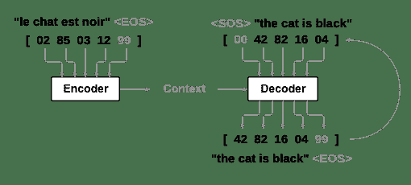

> 译者：[mengfu188](https://github.com/mengfu188)

**作者**: [Sean Robertson](https://github.com/spro/practical-pytorch)

在这个项目中，我们将教一个把把法语翻译成英语的神经网络。

```
[KEY: > input, = target, < output]

> il est en train de peindre un tableau .
= he is painting a picture .
< he is painting a picture .

> pourquoi ne pas essayer ce vin delicieux ?
= why not try that delicious wine ?
< why not try that delicious wine ?

> elle n est pas poete mais romanciere .
= she is not a poet but a novelist .
< she not not a poet but a novelist .

> vous etes trop maigre .
= you re too skinny .
< you re all alone . 
```

… 取得了不同程度的成功

这是通过[seq2seq网络](https://arxiv.org/abs/1409.3215)来进行实现的，在这个网络中使用两个递归的神经网络（编码器网络和解码器网络）一起工作使得一段序列变成令一段序列。 编码器网络将输入序列变成一个向量，解码器网络将该向量展开为新的序列。



我们将使用[注意力机制](https://arxiv.org/abs/1409.0473)改进这个模型，它可以让解码器学会集中在输入序列的特定范围中。

> [**阅读全文／改进本文**](https://github.com/apachecn/pytorch-doc-zh/blob/master/docs/1.0/seq2seq_translation_tutorial.md)