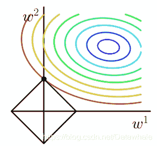
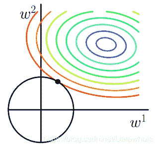
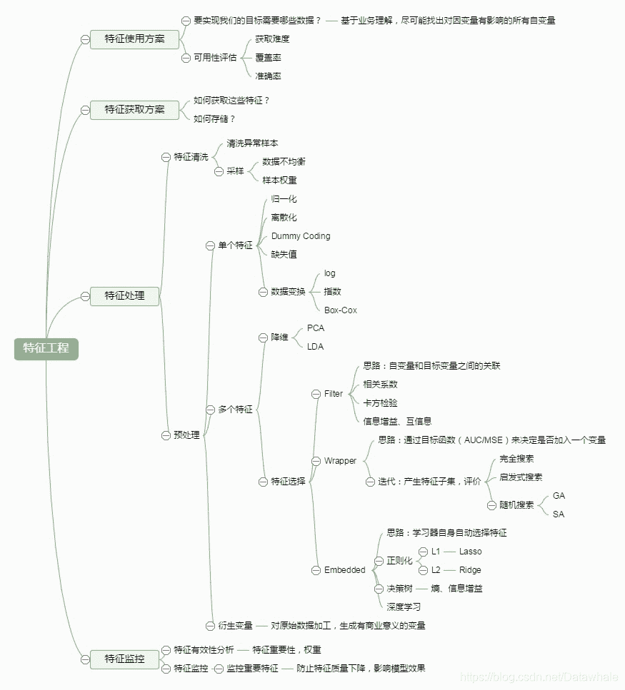
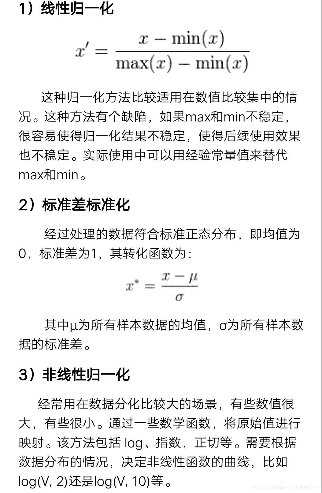
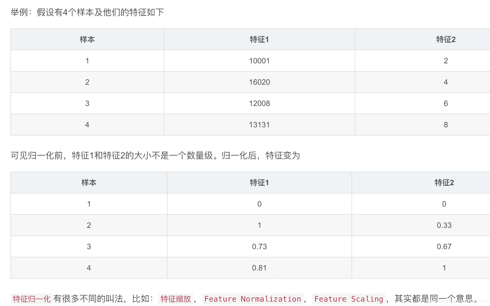

1.【每日一问】
数据分析师在企业中的价值是什么？优秀的数据分析师应该具备哪些技能和特质？

*   优秀回答
    `价值`：根据当前数据，对比历史数据，结合市场规律对具体业务问题进行纠正，指导以及预测。
    `技能`：数据驱动，发现问题，解决问题。普通企业基本excel就能完成90%的数据分析工作，更多的是需要对业务的精通；互联网企业数据库操作能力是基本，R或者Python必会一项，但一般以Python居多，要求更高一点的都需要具备一定的数据挖掘能力。

2.【每日一问】
`背景`：我是研一经济学的学生，想做数据分析师，我现在正在学习SQL和Python，SQL刚开始比较简单，但是我发现无论是SQL还是Python我似乎对计算机算法和结构都不太了解，每次写一些复杂的语句，我总是看别人的能看懂，自己写就写不出来。
`问题`：如何掌握数据分析师所必要的编程能力？

*   优秀回答
    （1）找个简单的案例，模仿着，就算代码抄也要亲自打，然后在此基础上自己发散思维扩展功能，为了实现功能就会逼迫自己去查文档、手册，每天都搞个案例再拓展功能，不出2月自然就熟悉了，最关键的是要有毅力
    （2）初期先看看教程把基本语法学会
    （3）我当时自学数据结构是跟着网课来的，中国大学慕课网 里的 浙大数据结构，讲得十分细致，同时还给出了PAT的题目练习。我基本上从那里开始入的门。
    至于对编程开始有感觉，视野开阔起来。想实现什么就能自己找资料摸索，是在完成真正意义上的一个小项目之后了。做小项目的时候，经常要各种搜索，能力大概是在那个时候提升的。

3.【每日一问】
L1范数和L2范数的区别和作用?

*   优秀回答
    范数：指的是向量的长度
    L1范数是指向量中各个向量元素的绝对值之和。
    L2范数是指各个各个向量元素的平方和再开方。
    L1范式相当于L0范式，是特征更多成为0，即特征稀疏化（L0范数很难求优化，所以用的L1范式），方便特征提取。
    L2范数可以防止过拟合，提升模型的泛化能力。
    
    

4.【每日一问】
Python中，这两个参数是什么意思:*args,**kwargs，我们为什么要使用它们?

*   优秀回答
    在python中，当*和**符号出现在函数定义的参数中时，表示任意数目参数收集。
    `*arg`表示任意多个可变参数，可变参数允许你传入0个或任意个参数，这些可变参数在函数调用时自动组装为一个tuple。
    `**kwargs`表示关键字参数，关键字参数允许你传入0个或任意个含参数名的参数，这些关键字参数在函数内部自动组装为一个dict。使用时需将*arg放在**kwargs之前，否则会有“SyntaxError: non-keyword arg after keyword arg”的语法错误

5.【每日一问】
什么是模型过拟合，请列举一下模型过拟合的原因及解决办法？

*   优秀回答
    `据噪声导致的过拟合`：噪声具有一定的随机性与欺骗性，如果把噪声作为有效信息的话，将会导致过拟合。
    `缺乏代表性样本导致的过拟合`：训练数据集不能很好的反应整体分布可能会导致过拟合；训练数据集较小，但模型过度细化会导致过拟合。
    从定量角度来讲，过拟合常常表现为模型的方差过大，而欠拟合则表现为模型的偏差过大。
    降低过拟合的方法：1\. 增大训练集，更多的样本可以让模型学到更多有效的特征；2\. 正则化，将权重的大小加入损失函数中，避免权值过大引起的过拟合，比如L1/L2正则；3\. 降低模型复杂度，比如 dropout，决策树剪枝等，4\. bagging 的方法。bagging 的思路是对模型的结果取平均。取平均后模型的方差降低，为避免模型之间的相关性过大，像随机森林采取了对特征随机选择的方法，但是boosting并不能显著降低方差，因为各个弱分类器间是强相关的。

6.对特征进行挑选的方法有哪些？

*   优秀回答
    通常来说，从两个方面考虑来选择特征：
    `特征是否发散`：如果一个特征不发散，例如方差接近于0，也就是说样本在这个特征上基本上没有差异，这个特征对于样本的区分并没有什么用。
    `特征与目标的相关性`：这点比较显见，与目标相关性高的特征，应当优选选择。除方差法外，本文介绍的其他方法均从相关性考虑。
    根据特征选择的形式:
    `Filter：过滤法`，按照发散性或者相关性对各个特征进行评分，设定阈值或者待选择阈值的个数，选择特征。通过该方法选出来的特征与具体的预测模型没有关系，因此具有更好的泛化能力。
    `Wrapper：包装法`，根据目标函数（通常是预测效果评分），每次选择若干特征，或者排除若干特征。围绕一定的预测模型，预测模型的估计误差一定程度上反映了特征的有用性。
    `Embedded：集成法`，先使用某些机器学习的算法和模型进行训练，得到各个特征的权值系数，根据系数从大到小选择特征。
    
    参考：[http://www.cnblogs.com/jasonfreak/p/5448385.html](http://www.cnblogs.com/jasonfreak/p/5448385.html)

7.【每日一问】
机器学习中为什么要经常对数据做归一化处理？一般适用于什么情形

*   优秀回答
    
    对于不同的特征向量，比如年龄、购买量、购买额，在数值的量纲上相差十倍或者百千倍。如果不归一化处理，就不容易进行比较、求距离，模型参数和正确度精确度就会受影响，比如：计算样本距离时，如果特征向量取值范围相差很大，如果不进行归一化处理，则值范围更大的特征向量对距离的影响更大，实际情况是，取值范围更小的特征向量对距离影响更大，这样的话，精度就会收到影响。
    
    参考：[https://blog.csdn.net/ybdesire/article/details/56027408](https://blog.csdn.net/ybdesire/article/details/56027408)

拓展：归一化和标准化的区别和联系
`标准化`：在机器学习中，我们可能要处理不同种类的资料，例如，音讯和图片上的像素值，这些资料可能是高维度的，资料标准化后会使每个特征中的数值平均变为0(将每个特征的值都减掉原始资料中该特征的平均)、标准差变为1，这个方法被广泛的使用在许多机器学习算法中(例如：支持向量机、逻辑回归和类神经网络)。
`区别`：
Z-score标准化（标准差标准化 / 零均值标准化）x’ = (x - μ)／σ

归一化 Min-Max Normalization：x’ = (x - X_min) / (X_max - X_min)
归一化是将样本的特征值转换到同一量纲下把数据映射到[0,1]或者[a,b]区间内，仅由变量的极值决定，因此区间放缩法是归一化的一种。
标准化是依照特征矩阵的列处理数据，其通过求z-score的方法，转换为标准正态分布，和整体样本分布相关，每个样本点都能对标准化产生影响。
归一区间，会改变数据的原始距离，分布，信息；标准化一般不会。
`联系`:
它们的相同点在于都能取消由于量纲不同引起的误差；
都是一种线性变换，都是对向量X按照比例压缩再进行平移。
`使用情形`：
什么时候用归一化？什么时候用标准化？
（1）如果对输出结果范围有要求，用归一化。
（2）如果数据较为稳定，不存在极端的最大最小值，用归一化。
（3）如果数据存在异常值和较多噪音，用标准化，可以间接通过中心化避免异常值和极端值的影响。

哪些模型必须归一化/标准化？
①SVM ②KNN ③神经网络 ④PCA
参考：[https://www.zhihu.com/question/20455227/answer/370658612](https://www.zhihu.com/question/20455227/answer/370658612)