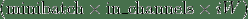
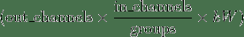

> 译者：[hijkzzz](https://github.com/hijkzzz)

## 卷积函数

### conv1d

```
torch.nn.functional.conv1d(input, weight, bias=None, stride=1, padding=0, dilation=1, groups=1) → Tensor 
```

对由多个输入平面组成的输入信号进行一维卷积.

有关详细信息和输出形状, 请参见[`Conv1d`](#torch.nn.Conv1d "torch.nn.Conv1d").

注意

在某些情况下, 当使用CUDA后端与CuDNN时, 该操作符可能会选择不确定性算法来提高性能. 如果这不是您希望的, 您可以通过设置`torch.backends.cudn .deterministic = True`来尝试使操作具有确定性(可能会以性能为代价). 请参阅关于 [Reproducibility](notes/randomness.html) 了解背景.

参数:

*   **input** – 输入tensor, 形状为 
*   **weight** – 卷积核, 形状为 
*   **bias** – 可选的偏置, 形状为 . 默认值: `None`
*   **stride** – 卷积核的步幅, 可以是单个数字或一个元素元组`(sW,)`. 默认值: 1
*   **padding** – 在输入的两边隐式加零. 可以是单个数字或一个元素元组`(padW, )`. 默认值: 0
*   **dilation** – 核元素之间的空洞. 可以是单个数字或单元素元组`(dW,)`. 默认值: 1
*   **groups** – 将输入分成组,  应该可以被组的数目整除. 默认值: 1

例子:

```
>>> filters = torch.randn(33, 16, 3)
>>> inputs = torch.randn(20, 16, 50)
>>> F.conv1d(inputs, filters) 
```

> [**阅读全文／改进本文**](https://github.com/apachecn/pytorch-doc-zh/blob/master/docs/1.0/nn_functional.md)