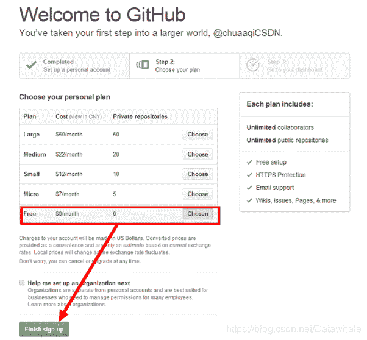

## Github创建

### 注册账号

进入GitHub官网：[https://github.com](https://github.com)

*   步骤1：注册账号
    `username`：不能使用下划线（_），并且短横线不能打头，中文也是不合法昵称。
    `email`：要填写合法邮箱，并且是未在GitHub注册过的邮箱。否则会弹出错误提示。
    `password`：注意密码至少有7个字符，其中至少有一个小写字母，至少有一个是数字。
*   步骤2：选择账户
    付费用户可以拥有私人代码仓库（repos），即别人不能查看你的代码。免费用户的仓库都是公开的，任何人都能查看。
    
*   步骤3：完成问卷
    Github为了分析用户设置了几道问卷题，可以如实回答也可以随便填写。
*   步骤4：验证邮箱
    
    英文水平好的同学可以阅读一下[guide](https://guides.github.com/activities/hello-world/)，不想读的可以直接点start a project开始。在邮箱中找到github回复的邮件，点击链接验证邮箱，验证完以后即可开始建立库。

## Github使用

学习参考

*   [Git-book](https://git-scm.com/book/zh/v2)
*   [廖雪峰Git教程](https://www.liaoxuefeng.com/wiki/0013739516305929606dd18361248578c67b8067c8c017b000)

软件安装

*   [GitHub 客户端](https://desktop.github.com)
*   [Git Bash](https://git-scm.com/)