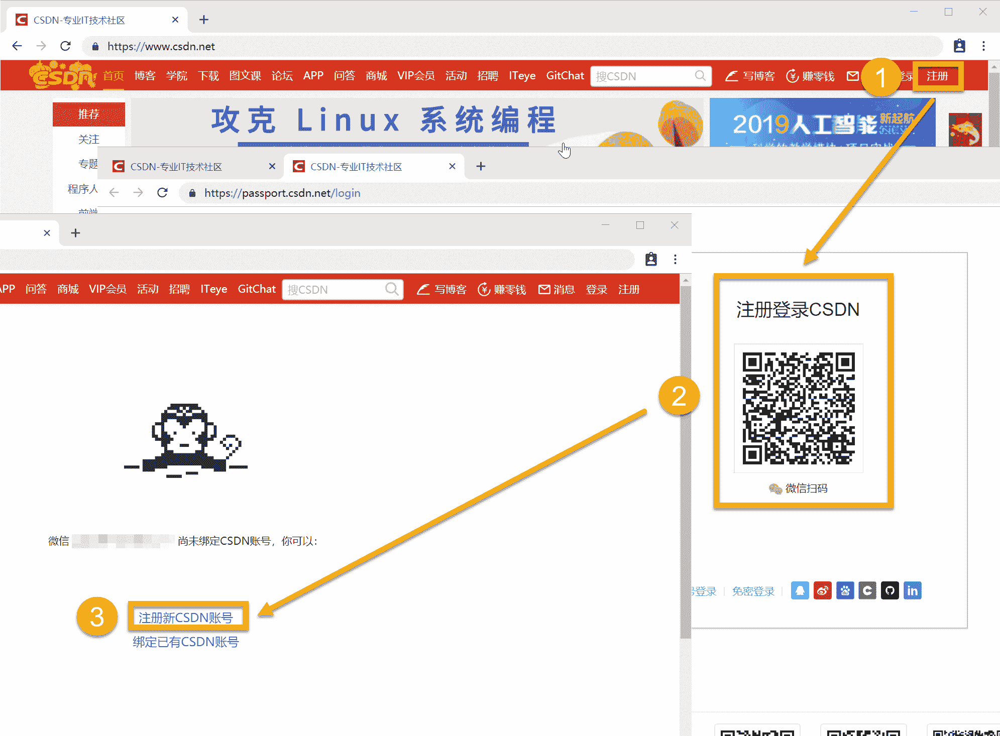
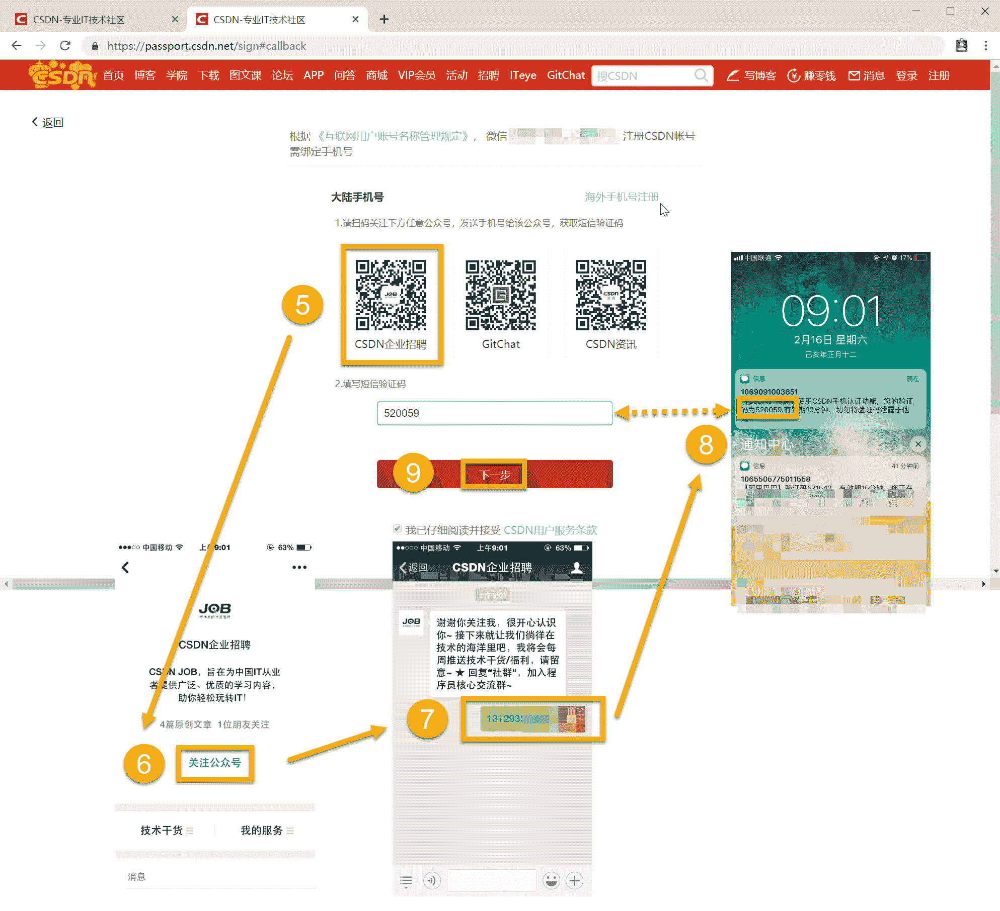
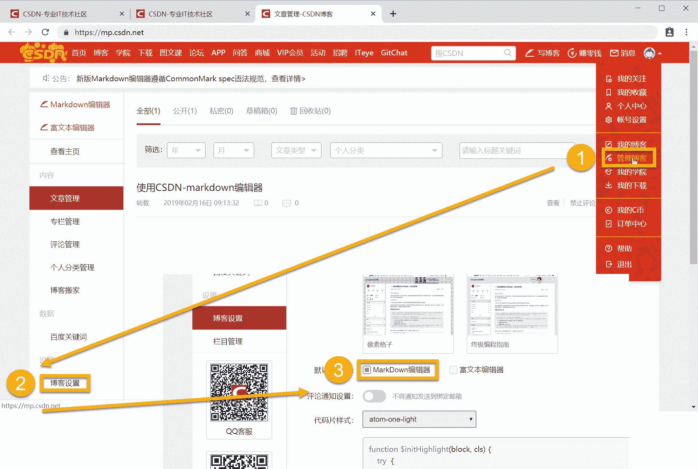
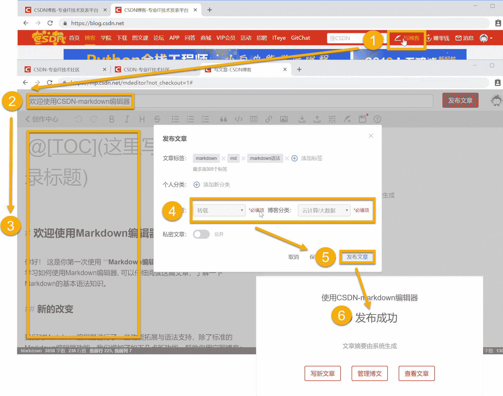

### 文章目录

*   *   [一、创建CSDN博客详细流程](#CSDN_3)
    *   *   [1\. 注册](#1__4)
        *   [2\. 绑定手机](#2__9)
    *   [二、编辑和发布博客](#_13)
    *   *   [1\. 设置markdown格式](#1_markdown_14)
        *   [2\. 发布文章](#2__18)
        *   [3\. 常见的markdown语法](#3_markdown_27)
        *   *   [3.1 分级标题](#31__30)
            *   [3.2 目录](#32__39)
            *   [3.3 代码块高亮](#33__43)
            *   [3.4 链接](#34__48)

## 一、创建CSDN博客详细流程

### 1\. 注册

首先进入CSDN博客首页 [https://blog.csdn.net/](https://blog.csdn.net/)

【1.注册】 ⇒ \Rightarrow ⇒ 【2.微信扫码】 ⇒ \Rightarrow ⇒ 【3.注册新CSDN账号】


### 2\. 绑定手机

【5.选择公众号】 ⇒ \Rightarrow ⇒ 【6.关注公众号】 ⇒ \Rightarrow ⇒ 【7.发送 **手机号** 给公众号】 ⇒ \Rightarrow ⇒ 【8.输入收到 **验证码** 】 ⇒ \Rightarrow ⇒ 【9.下一步】
`注意：输入验证码即可注册成功，此手机号会默认绑定该账号`


## 二、编辑和发布博客

### 1\. 设置markdown格式

【1.管理博客】 ⇒ \Rightarrow ⇒ 【2.博客设置】 ⇒ \Rightarrow ⇒ 【3.MarkDown编辑器】

CSDN有两种编辑器：`Markdown编辑器` 和`富文本编辑器`，这里推荐使用`MarkDown编辑器`

### 2\. 发布文章

点击【1.写博客】进入编辑界面 ⇒ \Rightarrow ⇒ 【2.编辑文章标题】 ⇒ \Rightarrow ⇒ 【3.编辑文章内容】 ⇒ \Rightarrow ⇒ 【4.选择文章类型】 ⇒ \Rightarrow ⇒ 【5.发布文章】 ⇒ \Rightarrow ⇒ 【6.文章发布成功】

`注意：`
`1\. 文章类型和博客分类是必填项。如果有转载文章，选择转载选项`
`2\. 晚上22:00后发布的博客，会进入审稿状态，一般第二天早上9:00会自动发布成功`

### 3\. 常见的markdown语法

这里列举最常用的语法

#### 3.1 分级标题

> # 一级标题
> ## 二级标题
> ### 三级标题
> #### 四级标题
> ##### 五级标题
> ###### 六级标题

#### 3.2 目录

> @[toc]
> 根据分级标题生成目录

#### 3.3 代码块高亮

> ```python
> print(“helloworld”)
> ```

#### 3.4 链接

> [CSDN博客的创建及使用]([https://blog.csdn.net/Datawhale/article/details/87434626](https://blog.csdn.net/Datawhale/article/details/87434626))

更多markdown参考 [Markdown 语法介绍](https://coding.net/help/doc/project/markdown.html)