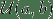

> 译者：[GeneZC](https://github.com/GeneZC)

```
torch.nn.init.calculate_gain(nonlinearity, param=None) 
```

返回给定非线性函数的推荐的增益值。对应关系如下表：

| 非线性函数 | 增益 |
| --- | --- |
| Linear / Identity |  |
| Conv{1,2,3}D |  |
| Sigmoid |  |
| Tanh |  |
| ReLU |  |
| Leaky Relu |  |

参数：

*   **nonlinearity** – 非线性函数 (`nn.functional` 中的名字)
*   **param** – 对应非线性函数的可选参数

例子

```
>>> gain = nn.init.calculate_gain('leaky_relu') 
```

```
torch.nn.init.uniform_(tensor, a=0, b=1) 
```

用均匀分布  初始化输入 `Tensor`。

> [**阅读全文／改进本文**](https://github.com/apachecn/pytorch-doc-zh/blob/master/docs/1.0/nn_init.md)