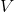
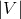
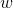
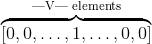

> 译者：[巩子惠](https://github.com/sight007)

词嵌入是一种由真实数字组成的稠密向量，每个向量都代表了单词表里的一个单词。 在自然语言处理中，总会遇到这样的情况：特征全是单词！但是，如何在电脑上表述一个单词呢？你在电脑上存储的单词的`ascii`码，但是它仅仅代表单词怎么拼写，没有说明单词的内在含义(你也许能够从词缀中了解它的词性，或者从大小写中得到一些属性，但仅此而已)。 更重要的是，你能把这些`ascii`码字符组合成什么含义？当代表词汇表、输入数据是维的情况下，我们往往想从神经网络中得到数据密集的结果，但是结果只有很少的几个维度（例如，预测的数据只有几个标签时）。我们如何从大的数据维度空间中得到稍小一点的维度空间？

放弃使用`ascii`码字符的形式表示单词，换用`one-hot encoding`会怎么样了？好吧，这个单词就能这样表示：

其中，1 表示的独有位置，其他位置全是0。其他的词都类似，在另外不一样的位置有一个1代表它，其他位置也都是0。
这种表达除了占用巨大的空间外，还有个很大的缺陷。 它只是简单的把词看做一个单独个体，认为它们之间毫无联系。 我们真正想要的是能够表达单词之间一些相似的含义。为什么要这样做呢？来看下面的例子：

假如我们正在搭建一个语言模型，训练数据有下面一些句子：

*   The mathematician ran to the store.
*   The physicist ran to the store.
*   The mathematician solved the open problem.

现在又得到一个没见过的新句子:

*   The physicist solved the open problem.

我们的模型可能在这个句子上表现的还不错，但是，如果利用了下面两个事实，模型会表现更佳：

*   我们发现数学家和物理学家在句子里有相同的作用，所以在某种程度上，他们有语义的联系。
*   当看见物理学家在新句子中的作用时，我们发现数学家也有起着相同的作用。

然后我们就推测，物理学家在上面的句子里也类似于数学家吗？ 这就是我们所指的相似性理念： 指的是语义相似，而不是简单的拼写相似。 这就是一种通过连接我们发现的和没发现的一些内容相似点、用于解决语言数据稀疏性的技术。 这个例子依赖于一个基本的语言假设： 那些在相似语句中出现的单词，在语义上也是相互关联的。 这就叫做 [distributional hypothesis（分布式假设）](https://en.wikipedia.org/wiki/Distributional_semantics)。

## Getting Dense Word Embeddings（密集词嵌入）

我们如何解决这个问题呢？也就是，怎么编码单词中的语义相似性？ 也许我们会想到一些语义属性。 举个例子，我们发现数学家和物理学家都能跑， 所以也许可以给含有“能跑”语义属性的单词打高分，考虑一下其他的属性，想象一下你可能会在这些属性上给普通的单词打什么分。

> [**阅读全文／改进本文**](https://github.com/apachecn/pytorch-doc-zh/blob/master/docs/1.0/nlp_word_embeddings_tutorial.md)