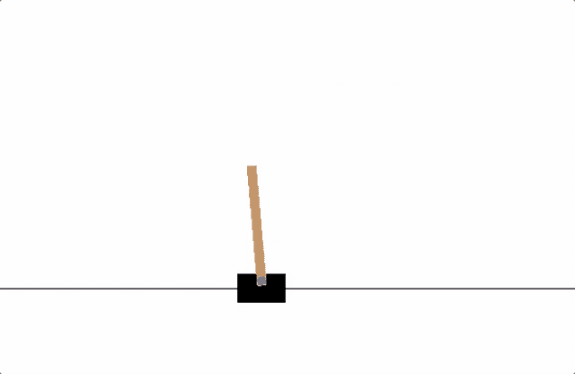

> 译者：[平淡的天](https://github.com/friedhelm739)

**作者**: [Adam Paszke](https://github.com/apaszke)

本教程将展示如何使用 PyTorch 在[OpenAI Gym](https://gym.openai.com/)的任务集上训练一个深度Q学习 (DQN) 智能点。

**任务**

智能点需要决定两种动作：向左或向右来使其上的杆保持直立。你可以在 [Gym website](https://gym.openai.com/envs/CartPole-v0) 找到一个有各种算法和可视化的官方排行榜。



当智能点观察环境的当前状态并选择动作时，环境将转换为新状态，并返回指示动作结果的奖励。在这项任务中，每增加一个时间步，奖励+1，如果杆子掉得太远或大车移动距离中心超过2.4个单位，环境就会终止。这意味着更好的执行场景将持续更长的时间，积累更大的回报。

Cartpole任务的设计为智能点输入代表环境状态（位置、速度等）的4个实际值。然而，神经网络完全可以通过观察场景来解决这个任务，所以我们将使用以车为中心的一块屏幕作为输入。因此，我们的结果无法直接与官方排行榜上的结果相比——我们的任务更艰巨。不幸的是，这会减慢训练速度，因为我们必须渲染所有帧。

严格地说，我们将以当前帧和前一个帧之间的差异来呈现状态。这将允许代理从一张图像中考虑杆子的速度。

**包**

首先你需要导入必须的包。我们需要 [gym](https://gym.openai.com/docs) 作为环境 (使用 `pip install gym` 安装). 我们也需要 PyTorch 的如下功能:

*   神经网络 (`torch.nn`)
*   优化 (`torch.optim`)
*   自动微分 (`torch.autograd`)
*   视觉任务 (`torchvision` - [a separate package](https://github.com/pytorch/vision)).

```
import gym
import math
import random
import numpy as np
import matplotlib
import matplotlib.pyplot as plt
from collections import namedtuple
from itertools import count 
```

> [**阅读全文／改进本文**](https://github.com/apachecn/pytorch-doc-zh/blob/master/docs/1.0/reinforcement_q_learning.md)