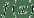
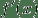
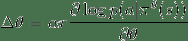
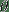
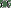
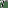
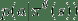
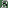
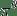

> 译者：[hijkzzz](https://github.com/hijkzzz)

`distributions` 包含可参数化的概率分布和采样函数. 这允许构造用于优化的随机计算图和随机梯度估计器. 这个包一般遵循 [TensorFlow Distributions](https://arxiv.org/abs/1711.10604) 包的设计.

通常, 不可能直接通过随机样本反向传播. 但是, 有两种主要方法可创建可以反向传播的代理函数. 即得分函数估计器/似然比估计器/REINFORCE和pathwise derivative估计器. REINFORCE通常被视为强化学习中策略梯度方法的基础, 并且pathwise derivative估计器常见于变分自动编码器中的重新参数化技巧. 得分函数仅需要样本的值 , pathwise derivative 需要导数 . 接下来的部分将在一个强化学习示例中讨论这两个问题. 有关详细信息, 请参阅 [Gradient Estimation Using Stochastic Computation Graphs](https://arxiv.org/abs/1506.05254) .

## 得分函数

当概率密度函数相对于其参数可微分时, 我们只需要`sample()`和`log_prob()`来实现REINFORCE:



 是参数,  是学习速率,  是奖励 并且  是在状态  以及给定策略 执行动作  的概率.

在实践中, 我们将从网络输出中采样一个动作, 将这个动作应用于一个环境中, 然后使用`log_prob`构造一个等效的损失函数. 请注意, 我们使用负数是因为优化器使用梯度下降, 而上面的规则假设梯度上升. 有了确定的策略, REINFORCE的实现代码如下:

```
probs = policy_network(state)
# Note that this is equivalent to what used to be called multinomial
m = Categorical(probs)
action = m.sample()
next_state, reward = env.step(action)
loss = -m.log_prob(action) * reward
loss.backward() 
```

## Pathwise derivative

实现这些随机/策略梯度的另一种方法是使用来自`rsample()`方法的重新参数化技巧, 其中参数化随机变量可以通过无参数随机变量的参数确定性函数构造. 因此, 重新参数化的样本变得可微分. 实现Pathwise derivative的代码如下:

> [**阅读全文／改进本文**](https://github.com/apachecn/pytorch-doc-zh/blob/master/docs/1.0/distributions.md)