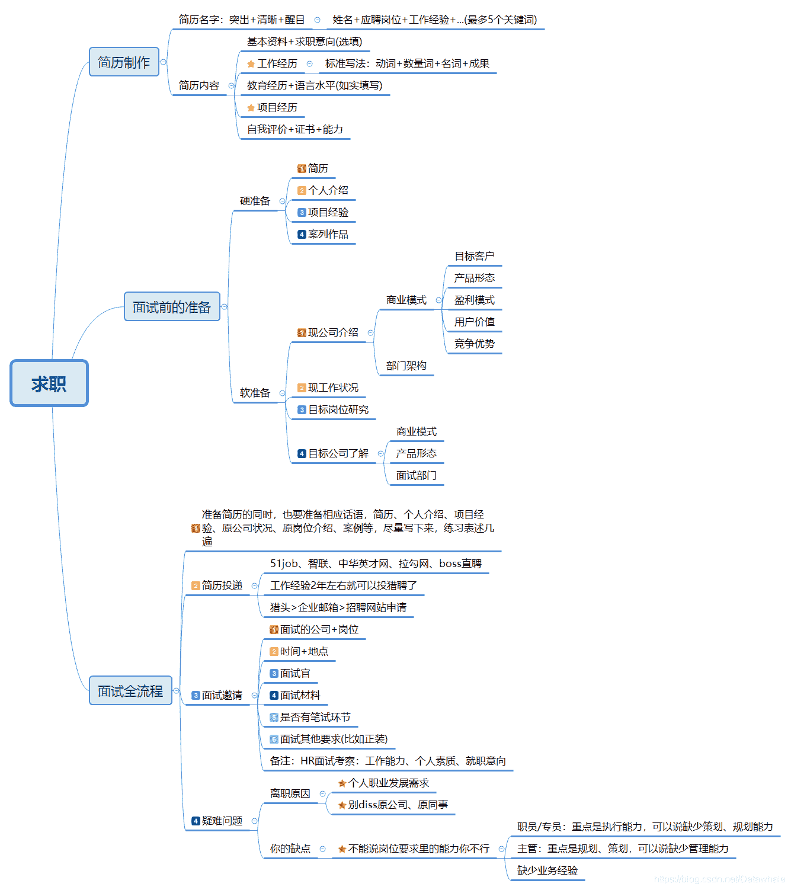

【每日一问】面试官比较看重简历中的哪些维度，有什么写简历的技巧、建议和总结？
Datawhale优秀回答者：千夜同学，陶志杰

第一 ，简历一定要工整 字体格式对奇 字体大小不一 格式错乱 文字乱码的 都懒得看 直接垃圾桶（千万别模版导出）
第二 ，一定要有"卖点" 就是所谓的项目经验 但是"课程表、图书管理系统"这种作业级别的项目少写，只会突出你没能力
第三 ，阅读的过程是从上而下的，蓝桥杯 xx杯这种经历往后放，好的项目经历往前放
第四 ，写github和博客链接的一定要有内容并且要知道自己写了什么（遇到过从github上挑段代码让面试者讲面试者讲不明白的）
第五 ，一般简历写什么面试就问什么，简历中提到的名词、项目，一定要事先弄清楚

参考：

*   START原则
*   GitHub上的简历模版
    [https://github.com/geekcompany/ResumeSample/blob/master/architect.md](https://github.com/geekcompany/ResumeSample/blob/master/architect.md)
*   思维导图

【每日一问】描述一下什么是决策树算法，是如何进行特征选择的？
Datawhale优秀回答者：图拉，叫我啊良

决策树是一种自顶向下，对样本数据进行树形分类的过程，有结点与有向边组成。结点分为内部结点（特征）和叶节点（类别），样本从根节点被分到不同的子节点中，子节点进行特征选择，直到所有样本都被分到某一类别中。
通过特征选择构造最优的决策树常用的启发函数为ID3,C4.5,CART。

*   ID3为最大信息增益，又叫互信息，度量数据集在知道特征之后不确定性减少的程度。
*   C4.5为最大信息增益比——互信息除以数据集关于该特征的取值熵。
*   CART是一颗二叉树，采用二元切割把特征取值切成两份，每一步选择基尼系数（数据不纯度）最小的特征及其对应的划分点进行分类。

ID3倾向于选择取值较多的特征，C4.5一定程度对取值多的特征进行惩罚，提高泛化。CART的二值化分适用于连续变量。一般工业上，优先采用CART，再采用C4.5，然后是ID3。

【每日一问】PCA和LDA有什么异同？
Datawhale优秀回答者：图拉

从过程来看，他们有着很大的相似性，最后其实都是求某一个矩阵的特征值，投影矩阵即为该特征值对应的特征向量。但是其原理的不同如下：

1.  PCA为非监督降维，LDA为有监督降维
2.  PCA希望投影后的数据方差尽可能的大（最大可分性），因为其假设方差越多，则所包含的信息越多；而LDA则希望投影后相同类别的组内方差小，而组间方差大。LDA能合理运用标签信息，使得投影后的维度具有判别性，不同类别的数据尽可能的分开。

比如在语音识别领域，如果单纯用PCA降维，则可能功能仅仅是过滤掉了噪声，还是无法很好的区别人声，但如果有标签识别，用LDA进行降维，则降维后的数据会使得每个人的声音都具有可分性，同样的原理也适用于脸部特征识别。所以，可以归纳总结为有标签就尽可能的利用标签的数据（LDA），而对于纯粹的非监督任务，则还是得用PCA进行数据降维。