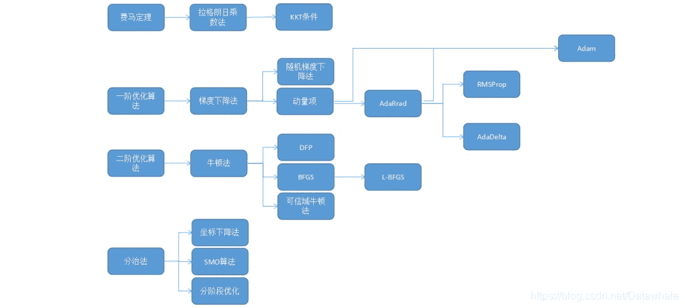

【每日一问】谈谈你对集成学习的见解与认识，描述一下它们的优势所在？
Datawhale优秀回答者：HipHopMan
集成方法有很多种，一种叫做bagging，bagging的思想是，我把我的数据做一点微小的调整，就得到了一个跟原来不一样的数据集，我就能多训练一个模型出来，模型的数量多了，解释力自然就增强了。比如说我原来有100个人的数据，其中有两个分别叫Tony和Lily，我把Tony这条数据删掉，用Lily的数据来替换，这样就得到了一个跟原来不一样的船新的数据集，这个过程叫做Bootstrap

每一个Bootstrap数据集都能用来训练一次模型，所以我们重复这个过程，比如重复1000次，一次是Tony替代Cici，一次是Ivy替代Yuki，这样每一次都是不一样的数据，也就可以训练1000次，得到了1000个决策树，我们把这1000个决策树打包到一起作为我们最终的模型，这个打包就叫做bagging

一般我们会把bagging跟随机森林一起叠加使用，在数据点的处理上，我们使用bagging来创造许多组（比如说1000组）bootstrap数据，对于每一组数据，我们使用随机森林来训练模型，最后再把所有模型的预测结果bagging起来

第二种集成的方法是boosting，boosting跟bagging一样都属于集成的思想，本质上都是训练很多模型，用数量堆积出质量。还是举1000个model，100个variable的例子，bagging是训练1000个等价的模型，比如说用随机森林，这些模型都是同样随机从100个里面选10个variable出来训练，每一个模型之间是同一级别的、互不干扰的

但boosting的思路和bagging不同，boosting里每一个模型都是基于上一个模型来进行优化，它的核心思想是训练1000个模型，每一个模型在上一个模型的基础上再好一点点

比如说第一个模型的RSS是10，这时候我们基于第一个模型定个小目标，先让RSS减到9，这就是我们的第二个模型，第三个模型的RSS减到8.5…如此往复，得到1000个model，再综合这1000个model得到最终的模型

第三种也是最后一种集成方法是stacking，stacking在字面上更好理解一点，就是堆积、堆砌。如果说bagging和boosting一般都是在决策树的范围内使用，stacking的运用范围会更广一点。例如对于同一个问题，假设还是预测一个人是不是柠檬精，我们首先用Logistic回归跑一遍，再用LDA跑一遍，再用SVM跑一遍，最后用决策树再跑一遍，然后我们用一种方法，比如说是majority polling或是权重加成把这些结果结合到一起，这就是一个stacking的过程

stacking的一个使用场景是我们有很多专家小组，每个小组都训练出了一个自己的模型，当这些模型难以取舍的时候，就干脆一口气打包带走，用stacking把这些模型结合起来，这样谁也不得罪，而且通常也能取得较好的效果。另外在参加各种建模比赛的时候，为了追求一点点精度，我们可以多训练几个模型然后结合起来，有时候也能得到很好的效果。

【每日一问】机器学习中常用的最优化方法有哪些？有什么区别
Datawhale优秀回答者：五花肉，郭佳林

常见的最优化方法有最速下降法（梯度下降法），牛顿法，共轭梯度法，拟牛顿法等等。目的都是求解某个函数的极小值。
1 最速下降法：使用条件是函数具有一阶连续偏导数。
步骤：首先通过求函数的一阶偏倒数得出函数的最速下降方向（负梯度方向），然后给任意一个点作为初始点进行迭代，令每次迭代后新的点坐标为上一个迭代点坐标减去上一个点处的梯度值乘步长（步长可以根据每个点的坐标值进行求解）。若迭代到某个点后，该点梯度值小于某个预设的很小的阈值，则说明不需要继续迭代。该点即为极小值点。
2 牛顿法：基本思想是用一个二次函数近似逼近目标函数，然后直接求解出二次函数的极小值点。首先令原函数在某点做二阶泰勒展开，进行变换后可以得到原函数在某邻域内的近似二次函数。为求该二次函数极小值，令其一阶偏导数为零，可以直接得到函数在该邻域的极小值（为原始点坐标减去该点的海森矩阵乘梯度）。
可以看出，最速下降法是通过一步步迭代，每次迭代都要计算梯度和步长，最终得到最优解；牛顿法是函数先在某个邻域内进行变形，再在这个邻域内直接一步求出最优解，不进行多轮迭代，所以对初始点的选择要求较高。
拟牛顿法和共轭梯度法在这两种迭代思想上继续加以改进。

【每日一问】什么是交叉验证，简述使用交叉验证的原因？
Datawhale优秀回答者：徐悦
在机器学习里，通常来说我们不能将全部用于数据训练模型，否则我们将没有数据集对该模型进行验证，从而评估我们的模型的预测效果。为了解决这一问题，最简单的方法是把整个数据集分成两部分，一部分用于训练，一部分用于验证，这也就是我们经常提到的训练集和测试集。这个方法存在一些问题：最终模型与参数的选取将极大程度依赖于对训练集和测试集的划分方法；另外，该方法只用了部分数据进行模型的训练。
基于这样的背景，有人就提出了交叉验证（cross-validation）的方法，可以在一定程度上减小过拟合，并从有限的数据中获取尽可能多的有效信息。
常见的交叉验证有两种形式，一种是留一验证（Leave-one-out cross-validation），另一种是K折交叉验证（K-fold Cross Validation）。

*   留一验证方法包含将数据集分为训练集和测试集这一步骤。但是不同的是，它只用一个数据作为测试集，其他的数据都作为训练集，并将此步骤重复N次（N为数据集的数据数量）。假设现在有n个数据组成的数据集，那么就是每次取出一个数据作为测试集的唯一元素，而其他n-1个数据都作为训练集用于训练模型和调参。结果就是最终训练了n个模型，每次都能得到一个MSE。而计算最终test MSE则就是将这n个MSE取平均。该方法不受测试集合训练集划分方法的影响，因为每一个数据都单独的做过测试集。同时，其用了n-1个数据训练模型，也几乎用到了所有的数据，保证了模型的偏差更小。不过留一验证法的缺点也很明显，那就是计算量过于大，是测试集方法耗时的 n-1倍。
*   K折交叉验证，和留一验证法不同在于，每次的测试集将不再只包含一个数据，而是多个，具体数目将根据K的选取决定。根据经验一般选择k=5或10。比如，如果K=5，那么我们利用五折交叉验证的步骤就是：
    1）将所有数据集分成5份；
    2）不重复地每次取其中一份做测试集，用其他四份做训练集训练模型，之后计算该模型在测试集上的MSE_i；
    3）将5次的MSE_i取平均得到最后的MSE。事实上留一验证和10折交叉验证对测试集 MSE的估计是很相似的，但是相比LOOCV，10-fold CV的计算成本却小了很多，耗时更少。