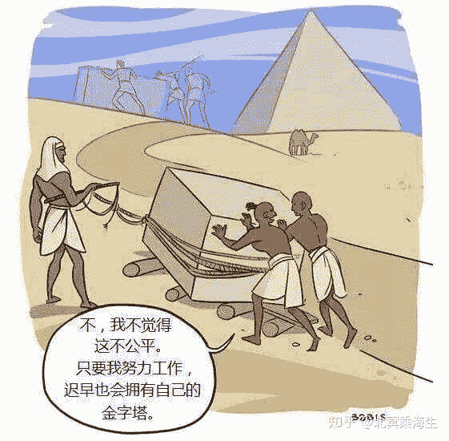
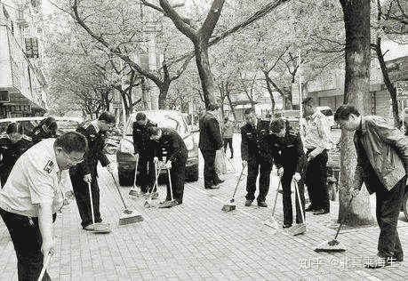

> 作者：北冥乘海生，公众号 & 知乎专栏：计算广告

996一词，是某巨头的一个中层提出来的，最初只是个忽悠老板的口号，哪知道如今应者云集，简直成了创业精神的代名词。007一词，则是我提出来的([《江湖丛谈》与互联网三不要](https://link.zhihu.com/?target=http%3A//mp.weixin.qq.com/s%3F__biz%3DMzIyOTAyOTEyNw%3D%3D%26mid%3D209458499%26idx%3D1%26sn%3De85f21b37358393ad0d47865c4dfcbda%26chksm%3D61c0512b56b7d83d4c0728349de196e68a42d0c130655a3528a9ea01c52a9301cd2589f6e523%26scene%3D21%23wechat_redirect))，虽说是直钩钓鱼，居然也有人信以为真，还打算试试。

注意，不要把这些词恶毒地解读为“加班”：除了睡觉都在工作，哪还有时间加班？

把码畜([大数据码畜生存指南（一）](https://link.zhihu.com/?target=http%3A//mp.weixin.qq.com/s%3F__biz%3DMzIyOTAyOTEyNw%3D%3D%26mid%3D209967878%26idx%3D1%26sn%3D25574f7577f67900562c52b27ef3e9df%26scene%3D21%23wechat_redirect))们像蝈蝈一样圈起来，三餐加零食饲养着，让他们在戒除健身、聚会和性生活三大恶习的状态下，以公司为家，以下班为耻，这样就能够让打工的开好车，老板们发大财么？其实，**在大公司里，先不说对不对，996这事真的没什么卵用。**

先声明，凡是拿*.布斯们一天睡几个小时来理论的，我都直接拉黑：合伙人们博的是无限未来，007都是天经地义；而打工仔们是按劳取酬，推一辈子石头也不会拥有自己的金字塔。

工作分两类：一类主要看执行力，一类主要看创造力。**如果是前沿研究、艺术创作之类的工作，显然要以激发创造力为主，要求工作时间不啻是南辕北辙。**设想下，假如比尔盖茨让麾下的科学家们都集中住宿，统一制服，每天早汇报晚总结，按代码行数和paper字数发奖金，这不是微软研究院，这是衡水研究院。

诚然，大多数公司不大需要创造力。他们得稳准狠地叼住几根骨头，先吃饱了才是王道，这需要的是野狗一样的执行力。

对于交付型项目，执行力还真就是靠睡得少：甲方爸爸啥时候临幸你，你就得啥时候舔上去，比鸡起得早，比鸡睡得晚，以迅雷不及掩耳盗铃之势把活干完。所以，2B项目紧的时候996是必要的，不过并不需要、也不能常态化。

为什么不能常态化？**从生理规律上看，脑力劳动者如果不以进ICU为目标，那么每天能够认真投入的时间，八小时也就到极限了。**人毕竟不是机器，老板又不是女友，怎么瞧都瞧不烦。长期996耗下去，只是浪费方便面和卫生纸而已。当然，如果你的工作只是客服那样的机械劳动，拉长时间肯定有效，可是别忘了，人家客服是按件计酬的。

不信您看看大洋彼岸，Google一年收一千亿刀，苹果利润就几百亿刀，还甭说996，加班的都没几个，隔三岔五还能在家办公。显然，以厂为家和商业成功、个人成就之间，并没有必然联系。

唯有中国2C的互联网公司们，个个都说自己是躺着挣钱的科技企业，可明知常态化996没意义，为什么还乐此不疲呢？面对如此深邃的哲学问题，我就着同事吐出的烟圈，思考了好几个不眠的中午，才发现，原来我国流行的996，有几种成因各异然并卵的情形。

## **神仙打架 凡人遭殃**

说得明白点儿，**你加的那些班，其实是公司政治斗争的牺牲品。**读过《[怎样在大公司混成中层干部？](https://link.zhihu.com/?target=http%3A//mp.weixin.qq.com/s%3F__biz%3DMzIyOTAyOTEyNw%3D%3D%26mid%3D2649632039%26idx%3D1%26sn%3D94a320505ddf46a2c68256a1851bbfa0%26chksm%3Df052694fc725e059ecdacbf45cc7a69cea262af4df09d2c944d08e78a0de0c5b120e025c053e%26scene%3D21%23wechat_redirect)》的都知道，中层干部最爱做的，就是拼命扩大团队。怎么扩大呢？简单说就是狗揽八泡屎，喝不喝老端着：兄弟部门做了个好产品，我改头换面也做一个；中台明明有基础服务，我就要嘴硬强调部门需求，自己重新造个轮子。

这种内部竞争，才是赤裸裸的仇恨。既然你夸了海口，就得抢在别的团队前面把轮子造出来，所以只好加班加点，搞起了996。996的结果，无非是成王败寇：要是你在一个明星团队，干掉内部对手，就可以拿到大把股票；可要在一个失败的团队，干了半天被PK掉了，只好黯然离场。

倘若你加入的是阿里巴巴，就算是项目失败，回报也不会太差，996可以算是你的福报；可是还有更多的其他码畜，加入了阿里二大爷、阿里小姨子，同样在暗无天日的996以后，连公司都黄了，只好收拾起青春岁月，付了二分尘土一分流水。对他们来说，996还是福报么？

把成功和失败的996er们拢在一块，**平均来看大家不过是吃了些行业红利。而996，只不过是囚徒困境带来的超额付出罢了。**如果你不幸是个失败的奋斗者，那么除了升高的尿酸和血脂，并不会留下什么无悔的青春。

## **表演作秀 骑虎难下**

大公司里，人员过剩是常态化的。人多就一定能出成绩么？显然不是！于是，**一个合格的leader，一定要向老板撒娇：我们没功劳也有苦劳，没苦劳还有疲劳呢！**怎么撒娇呢，干不干活老板不知道，晚上都在这儿耗着还能看不见么？

于是，老板四点去打高尔夫，副总就五点去健身，总监就六点去喝茶，经理就七点去吃饭，组长就八点叫外卖，员工就九点往外冲。长此以往，干脆形成了996的潜规则，以及打车报销、晚上管饭之类的“福利”。乃至有的老板，也沉迷于这种男耕女织的火热场景，把平均工作时间作为一项重要的考核指标，谁耗得长才能多招人。

有人说了，这样做至少有甄别作用，不接受996的人一定也是不肯努力的。这话没错，可是您想过没有，不肯努力的人，就算是996也还是出工不出力不是？

实际上，生活在996中的码畜们，大多是用空洞的会议填满整个白天，午饭晚饭后都安排漫长的行军式遛食，然后在华灯初上之时，才慵懒地开始一天的编码。我问过不同公司的几个码畜，他们告诉我：听说公司准备实行996，长长地松了一口气——这下可以心安理得地磨洋工了！

有时，公司也要作秀。只有多掏点电费，晚上把大楼点得灯火通明，或者时不时分享几个加班改变人生的正能量案例，你的公司才被认为没有丢失创业精神，才能在中国互联网立足。

什么？你敢说自己就是不喜欢加班？你敢说自己的团队生活工作平衡？在当今中国互联网的政治正确里，光那几个自媒体鸡汤号儿，就能把你喷得生活不能自理了。

## **一将无能 累死三军**

忘了是曾子还是贝索斯说过：对一个项目来说，两个披萨还喂不饱的团队就太大了。这里有个血淋淋的事实：**几乎没有一个明星产品，是靠堆人头做出来的。**

而天天996的团队，往往有这样一个老板：他随大王起事多年，靠拍马屁和无底线成了封疆大吏。有一天，像印度军队为了给尼赫鲁庆生向中国军队开火一样，他深情地向团队发问：“大老板如此英明神武，我们为何不做个“牛逼”号飞船，登上牛郎星去吹牛逼呢？”

干部们当然是赞成之声一片。一地鸡毛之后，留下一群懵逼的产品经理，没日没夜地设计“牛逼”号。煞有介事地论证一番之后，大家给出了结论：“您的思路太完美，无奈团队能力不足，还是先把火箭做出来吧！”

老板轻蔑地瞧着火箭工程师："这个火箭啊，我认为得烧煤，煤还得选蜂窝煤，水洗煤不好。"于是，在团队痛哭流涕地誓师之后，在“大干快上、早日升天”的标语下，五百人热火朝天地996了半年，终于造出了全球唯一的蜂窝煤动力火箭。上线那天，这玩意还真争气，嘭的一声就炸了！

这下，老板可急眼了：“就是你们这些人不拼命！从明天开始，给我改007！…” 遇上这样的老板，怎么能不996呢？就算是996了，又有个屁用呢？

总结起来，**如果摒弃了生产关系领域那些龌龊的杯葛，你的团队真能做到目标清晰、决心坚定、兵精将勇、赏罚分明，为了完成阶段性的产品业务目标，996是确实是有战术意义的。**不过，在千人以上的大公司里，这样的状态是可遇不可求的。而且，自驱力这么强的团队，还用得着把996当口号喊出来么？

天真的码畜码农们，别以为你的高工资是996换来的，那更多是行业红利。当互联网风光不再之时，你就算997也不过像今天的的哥那样维持温饱。如果不能从做事转入治人，那么经年的螺丝钉岁月，会让你既无暇提高自己，也无法积累资源，在锈迹斑斑以后被新的螺丝钉换掉。

天真的中层干部们，也不要以为996彰显了你的执行力，其实那只是暴露了你的内斗为纲和业务无能。如果不改变生产关系第一性的协作态度，不以尊重科学规律的方法组织研发，996也没什么卵用。那么什么才有用呢，当然是007啦！