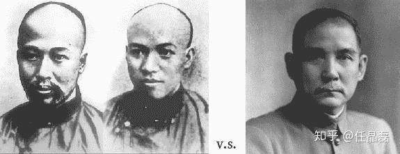
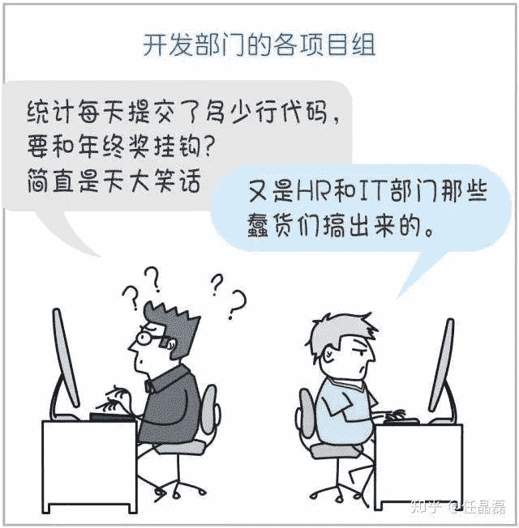
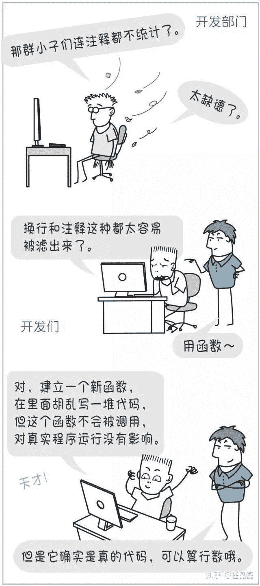
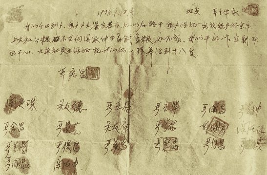

> 作者：[任晶磊](https://www.zhihu.com/question/317722302/answer/639054337)

有人说，此行为艺术仍然停留在抱怨的阶段。那么我们来看看出路在何方，所幸已有人在路上。注意，这里都是正在落地的干货。

*Disclaimer：我在表达观点时会引用自己的研究工作。如果认为此有夹带私货之嫌，就请略过拙答吧。*

996的根源，往小里说是落后的管理方式，往大里说是不公的生产关系。要说怎么办，就看列位程序员要改良，还是要革命了！

引用先烈们以表敬意

## 改良派初探

996用工作时长要求程序员、限制程序员，这种管理方式落后久矣……百年前，福特汽车的管理者早已发现，流水线上计件工人的产量，如果工作时间过长反而会下降，于是率先推行了8小时工作制。[这不全是靠罢工争来的](https://link.zhihu.com/?target=http%3A//news.ifeng.com/a/20180428/57959297_0.shtml)。

如今，虽然劳动法摆在那里，但如果企业的管理水平得不到普遍提升，程序员权益的落实依然会面临各种现实的阻力。是时候告诉管理者，还有更好的方法衡量和管理程序员的工作。

那么问题来了，如何衡量程序员们的生产力呢？不按工作时间，莫非要数代码行数？这让人不禁想起西乔著名漫画《神秘的程序员》中的一集：

……

……

[http://weixin.qq.com/r/YkhaQkHEkxzsrQUh9x1w](https://link.zhihu.com/?target=http%3A//weixin.qq.com/r/YkhaQkHEkxzsrQUh9x1w) (二维码自动识别)

最后，这场闹剧以公司上了静态分析技术为终结。这是个悲伤的故事，但悲伤在于工具的打开方式不对。这样的工具，本不该被滥用作KPI的替代物！

相反，评估程序员生产力的工具，可以成为一个有利的武器，帮助程序员打破堆砌工作时长的怪圈，用数据支持变革落后的管理方式；可以为那些内向的、不善于表现的程序员们发声，让不干事的浮出水面，让干得差的没有脸面，让干得好的登上台面！

那么，让我们来看一下数代码行数的正确方式。2016年代的Facebook，曾经由扎克伯格钦点把代码行数作为一个绩效指标。有些主管的bonus甚至有50%决定于团队在上季度提交的代码行数。这背后的逻辑是，虽然有无数的corner case，代码行数和开发团队的产出长期来看仍然是正相关的，而且交付更多代码的团队往往有更多的机会去学习、去试验、去探索。西乔漫画中各种代码充数的桥段是源于生活而高于生活的调侃，现实中会面对各种各样的制约，通过诸如代码审查等手段来规避。Facebook当年曾位列Glassdoor“最佳工作地点”排名之首，在工作生活平衡方面也表现不俗——至少距离996和ICU差着几十条长安街……

小扎跑过“世界人民大团结万岁”，但撵不上中国程序员996的步伐

## 更精细的改革派

当然，Facebook选择代码行数评判程序员产出实为无奈之举，你可知上一套西乔漫画里面的测评系统谈何容易。但是，永远不要低估“神秘的程序员”。

话说有一群来自微软亚洲研究院、加州大学伯克利分校（UC Berkeley）、清华大学和FreeBSD社区的小伙伴，真真做了一套基于静态程序分析并自带查重的测评系统出来。我们不仅实现了系统，还潜心研究了这个评估问题一年半，写了一篇短论文[Towards Quantifying the Development Value of Code Contributions](https://link.zhihu.com/?target=https%3A//per.pub/A1Pd7xaM.pdf)，发表在软件工程领域最顶级的国际学术会议FSE 2018上。

这篇论文的方法，一是model代码结构中的重用（reuse）关系——我们知道，重用乃是软件工程的第一要义，也是现代编程语言中大多数机制的出发点（如函数调用、继承、范型）；二是基于对Linux社区几十位顶尖程序员的调研，模拟他们评判代码提交价值的做法，对代码提交进行分类并赋予权重。对于后者，论文里描述的方法还停留在基于提交信息（commit message）做自然语言处理，最新的迭代已经发展到直接对抽象语法树进行机器学习。

有人可能会说，发篇不痛不痒的论文有p用啊？

没错，但我们是认真的！去年，我辞掉了微软亚洲研究院的工作，又把殷和政拉下了水——他从北京八中少年班到清华“姚班”再到伯克利的开挂学术之路，竟折在了2017年初我们共同受邀参加的一次同学的婚礼上。我把测评程序员贡献的想法介绍给他，他随后中止了在伯克利的博士进程……我真的不是故意的。

这个系统可以登录[https://meri.co/](https://link.zhihu.com/?target=https%3A//meri.co/)试用（对公司有私有部署支持），主要代码开源在[https://github.com/persper/code-analytics](https://link.zhihu.com/?target=https%3A//github.com/persper/code-analytics). 算法和工具都还不成熟，希望大家一起改进！

## 彻底的革命派

作为中国人，我们最能理解改变生产关系、释放生产力的深刻内涵。四十年前，小岗村十几户农民按手印签下的那份“大包干”合约，开启了波澜壮阔的改革开放的时代巨幕。没有那份改变历史的合约，恐怕今天都轮不到我们谈论996ICU．

1978年，安徽省凤阳县小岗村的18位农民在“包产到户”合约上按下手印。

今天我们生活在一个“资本主义”的世界。假如你有钱，可以买下一个公司的股份，不需要写任何一行代码，就能永远坐享公司发展的红利。

而如果你只是一个程序员，你996地为公司卖命，却只能换得一份普通的薪水。一朝离职，不论公司未来从你曾写的代码上赚多少钱，都与你再没有半毛钱的关系。

996ICU本质上是一种压迫，是对生产关系中处于弱势一方的压迫，是因为没有充分的工作自由而带来的压迫。为什么不能有“智本主义”？为什么程序员的付出不可以转化为“知识股权”（intellectual shareholding）？

我们不仅这样想了，而且正在努力地做。去年7月份，我们在哈佛大学和MIT给了两个talk，阐述我们的观点，主要内容总结在《[软件开发的下一个十年：程序员收复价值](https://zhuanlan.zhihu.com/p/45210244)》。简单来说，我们认为智力或知识投入不像金钱那么容易计数，而通过市场对个体每天细碎的开发活动计价也是不现实的。所以，就需要一套代替公司管理层级的程序员贡献测评方法——这就回到了我们上面介绍的论文和系统。它们不仅是企业改良的催化剂，更是广泛变革生产关系的基础。

我有一个梦想，在不远的将来，程序员们可以摆脱公司的桎梏，像今天参与开源项目一样贡献代码，并获得知识股权，而项目的收益将按股比反馈给所有贡献者。